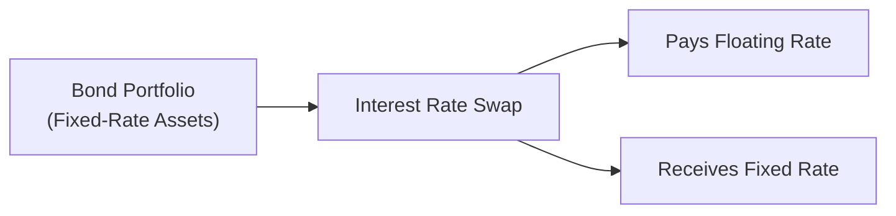

## Introduction

Interest rate risk management can feel like juggling on a balance beam. You have your bond portfolios on one side and the changing yield environment on the other. Personally, I remember early in my career watching a senior portfolio manager have a mild panic when rates unexpectedly jumped 100 basis points in a week—his carefully crafted bond portfolio took a beating in valuation. But, hey, that’s exactly why we have strategies to manage (and even profit from) interest rate movements!

This section unpacks the range of tools you can use to hedge or capitalize on shifting rates. We’ll walk through the essentials—like duration matching, immunization, and common derivative instruments (interest rate swaps, futures, swaptions, and forward contracts). You’ll see how yield curve positioning (like bullet, barbell, and ladder strategies) can be layered in. By the end, you should feel a whole lot more comfortable with how to navigate interest rate fluctuations. Let’s jump right in.

## Understanding the Nature of Interest Rate Risk

Interest rate risk reflects the sensitivity of a bond or bond portfolio’s value to changes in interest rates. When yields go up, bond prices generally go down (and vice versa). Pretty straightforward, right? But in reality, so many factors—like credit spreads, macroeconomic conditions, and yield curve shapes—converge to shape how your bond portfolio behaves. Managing this requires both defensive and opportunistic strategies:

• Defensive strategies look to reduce or neutralize interest rate exposure.  
• Opportunistic strategies aim to profit from anticipated rate moves or yield curve changes.

This distinction means interest rate risk management isn’t just about “running for cover.” Sometimes, we want to seek out rate changes if we think we can predict them more accurately than the market consensus.

## Defensive vs. Opportunistic Approaches

Defensive approaches primarily serve to shield an existing portfolio from unwanted volatility. You’ll often see these methods used by insurance companies, pension funds, or any institutions that really can’t afford a big mismatch in their assets and liabilities. Common defensive tactics include:

• Reducing portfolio duration (e.g., shifting into short-term bonds)  
• Entering interest rate swaps to convert fixed payments to floating, or vice versa  
• Using futures or forwards to lock in a future yield or price  

On the flip side, opportunistic strategies might take a stance on the direction (or shape) of yields. For instance, a barbell strategy invests heavily in short-term and long-term maturities while skipping the middle. If you expect a yield curve steepening, you may capitalize by combining a barbell with a swap position—potentially riding a wave of interest rate moves. 

## Duration Matching and Immunization

### Duration Matching

Duration has become a core concept in fixed income for measuring how a bond’s price might move if interest rates change. When we match the duration of our assets to the duration of our liabilities, we reduce the net impact of shifting rates on our portfolio’s surplus or deficit. This is particularly important for institutions:

- Pension funds match their bond assets’ duration to that of pension payouts.  
- Banks match the duration of loans to the duration of deposits (or replicate with derivatives).

Mathematically, Macaulay duration (D) is often presented as:


D = \frac{\sum_{t=1}^{T} t \times CF_t \times (1+y)^{-t}}{\sum_{t=1}^{T} CF_t \times (1+y)^{-t}}


Where:  
• \\( CF_t \\) is the cash flow (coupon + principal) at time t,  
• \\( y \\) is the yield per period,  
• \\( T \\) is the total number of periods.

If the asset duration equals liability duration, small parallel shifts in the yield curve have a more limited net effect on the institution’s solvency. Of course, real-world yield curves don’t just shift in a neat parallel manner, but it’s a solid starting point.

Here’s a short Python snippet showing how one might calculate Macaulay duration in a simplistic scenario:

```python
import numpy as np

cash_flows = [5, 5, 5, 5, 105]  # 4 annual coupons of 5, plus 100 principal at maturity
y = 0.05  # yield of 5%
durations = []
pv_total = 0

for t, cf in enumerate(cash_flows, start=1):
    pv = cf / ((1 + y)**t)
    durations.append(t * pv)
    pv_total += pv

mac_duration = sum(durations)/pv_total
print("Macaulay Duration:", mac_duration)
```

### Immunization

Immunization is like an advanced version of duration matching, often used by institutions looking to ensure a certain terminal value. By matching both the duration and sometimes the convexity of the asset portfolio to a specific liability horizon, the manager immunizes against moderate interest rate shifts. In other words, the gain (or loss) in bond prices is offset by the gain (or loss) in reinvestment rates, keeping the final portfolio value locked in.

In practice, immunization strategies may need frequent rebalancing. Like, you set up the immunized portfolio today, but a few months down the road, rates might have shifted and your portfolio’s duration might have changed. Or you spent some of your coupon payments on new purchases. Constant monitoring is key.

Of course, perfect immunization can be tough when there are big, unpredictable yield curve shifts or changes in credit spreads. But for a well-defined liability with a known date and amount—like a pension payout in five years—immunization can be a life-saver.

## Derivatives in Interest Rate Risk Management

Derivatives are the “Swiss Army Knife” of interest rate risk management. They let you hedge exposures or take speculative positions without having to buy or sell large amounts of physical bonds. Let’s look at the usual suspects:

### Interest Rate Futures

An interest rate future has an underlying instrument—commonly a Treasury note or Eurodollar deposit—designed to track short-term interest rates (like 3-month LIBOR or now SOFR). You can sell futures to hedge against a rise in rates or buy them if you expect rates to fall.

### Interest Rate Swaps

In a standard “plain vanilla” interest rate swap, one party pays a fixed rate while receiving a floating rate on a notional principal. The other party does the opposite. If you’re locked into long-term fixed-rate debt but you think rates are going down, you might want to convert some of that fixed exposure to floating. Or if you have variable-rate liabilities and you expect rates to go up, you convert some portion to fixed. The net effect is that you’re controlling how your cash flows respond to market rates.

Below is a simplified diagram of how an institution might use an interest rate swap in a portfolio:



### Swaptions

A swaption is simply an option on a swap. It grants the holder the right (but not the obligation) to enter into an interest rate swap in the future. So if you think rates might move in a certain direction, but you’re not entirely sure, a swaption could serve as a cost-effective way to retain the flexibility to jump into a swap later.

### Forward Rate Agreements (FRAs) and Bond Forward Contracts

FRAs allow you to lock in a future interest rate for borrowing or lending. A bond forward is similar but is tied to the future purchase or sale of a specific bond at a predetermined price. These instruments help plan your financing cost or bond investment cost, removing the guesswork about where rates will be in a few months.

## Yield Curve Positioning

The yield curve can steepen, flatten, twist, or shift in parallel. Sometimes it even inverts. How you position your portfolio can make a big difference:

- **Bullet Strategy:** You concentrate maturities around one point on the yield curve, typically the liability’s date (or a specific target date). If you anticipate yields dropping around that maturity, you can potentially capture price appreciation.  
- **Barbell Strategy:** You hold short-term and long-term bonds while avoiding the intermediate range. If you believe the middle part of the curve will shift more, or if you expect a flatter curve, a barbell can be advantageous.  
- **Ladder Strategy:** You hold bonds with staggered maturities—like a “ladder”—spreading out reinvestment risk and smoothing out cash flows.

Managers often combine yield curve positioning with derivatives for more finely tuned risk exposures. For instance, they may hold a barbell strategy but also use a small interest rate swap to hedge part of the long-end exposure if they suspect major central bank interventions.

## Combining Strategies in Practice

In reality, nobody uses just one technique. Managers blend approaches:

• **Immunization + Yield Curve Positioning**: Even if you’re immunizing your main liabilities, you might keep a separate “surplus portfolio” for active yield curve positions.  
• **Duration Matching + Interest Rate Swaps**: Your core assets might be matched to your liabilities, but you can narrow that duration mismatch further by carefully structuring plain vanilla swaps.  
• **Defensive Hedging + Opportunistic Overlays**: You might place a baseline hedge using futures to reduce the portfolio’s overall sensitivity, then place a swaptions overlay to profit (potentially) if your interest rate forecast proves correct.

## Real-World Experience

A friend of mine, a treasurer at a mid-sized financial institution, told me about a time she used interest rate swaps to lock in the cost of funds before a Federal Reserve meeting. She was worried about a big rate rise, so she swapped floating liabilities for a fixed rate, basically capping her interest expense. Sure enough, rates did jump (the Fed hiked rates more than the market expected), but her overall cost of funds was protected thanks to that swap position.

For a shorter horizon scenario, I once saw a hedge fund manager short Treasury futures to hedge the interest rate risk in a corporate bond portfolio. With spreads expected to tighten, he believed the corporate bonds would hold or gain value while Treasuries fell in price. It worked out well—he neutralized rates and effectively bet on corporate spread narrowing. That’s the essence of targeted interest rate risk management: you isolate the risk you want (credit spread, in this case) while offsetting the one you don’t (interest rate).

## Key Takeaways for the CFA Exam

• **Understand Duration and Convexity**: Know how to measure and interpret a bond’s duration and convexity. Also, be comfortable calculating or interpreting the Macaulay and modified durations.  
• **Immunization Concepts**: You should be able to do quick calculations on how an immunized portfolio’s ending value changes if rates move. Expect scenario-based questions.  
• **Derivatives**: Be prepared to show how an interest rate swap affects a balance sheet’s cash flow profile or how buying/selling futures can hedge a bond portfolio. Charts or simple day-count examples may appear on the exam.  
• **Yield Curve Strategies**: You may be asked to choose between bullet, barbell, or ladder positions given a hypothetical yield curve forecast.  
• **Exam Format**: Keep an eye out for item sets or vignettes describing an institutional investor’s situation—like a pension plan wanting stable returns. They might ask, “Which derivative best hedges the institution’s duration mismatch?” or “How do you structure an immunized portfolio for a 3-year liability?”

## References

• Choudhry, M. (2018). An Introduction to Banking: Liquidity Risk and Asset–Liability Management. Wiley.  
• CFA Program Curriculum (Level I), Readings on Risk Management Strategies for Fixed Income.  
• Black, F., & Scholes, M. (1973). “The Pricing of Options and Corporate Liabilities.” The Journal of Political Economy.  

## Test Your Knowledge: Mastering Interest Rate Risk Management Strategies



### Your client wants to reduce sensitivity to an expected rise in interest rates over the next six months. Which strategy is most appropriate?

- [ ] Increase portfolio duration.
- [ ] Implement a ladder strategy.
- [x] Sell interest rate futures.
- [ ] Buy swaptions to enter a floating-for-fixed swap.

> **Explanation:** Selling interest rate futures typically profits (or at least offsets losses) if rates rise and bond prices fall, thus reducing the portfolio’s overall rate risk.

### An investor has a bond portfolio with a slightly longer duration than desired. The manager wants a quick fix without selling the underlying bonds. Which is most commonly used?

- [ ] Swaption to receive fixed.
- [x] Interest rate swap paying fixed.
- [ ] Options on bond ETFs.
- [ ] Buying bond call options.

> **Explanation:** By entering a swap and paying fixed, the investor effectively reduces the portfolio’s duration (receiving floating), thus mitigating the portfolio’s interest rate risk.

### A barbell strategy primarily involves:

- [x] Holding short-term and long-term maturities.
- [ ] Holding bonds only around an intermediate maturity.
- [ ] Maintaining equal holdings in each annual maturity.
- [ ] Matching the duration of assets to liabilities.

> **Explanation:** A barbell concentrates on short- and long-term maturities, avoiding the intermediate portion.

### Immunization is best described as:

- [ ] Using derivatives to amplify interest rate movements.
- [ ] Matching yield curve positions to macro forecasts.
- [ ] A strategy to maximize returns during rising rates.
- [x] Matching the duration of assets to liabilities to minimize interest rate risk.

> **Explanation:** Immunization protects a portfolio’s final value from interest rate changes by aligning the duration of assets with liabilities.

### Which statement about swaptions is correct?

- [ ] They require both parties to swap interest payments at a future date.
- [x] They give the holder the right (but not obligation) to enter a swap.
- [ ] They have unlimited downside risk for the buyer.
- [ ] They must be settled in physical bond delivery.

> **Explanation:** A swaption is an option on a swap, so the holder can decide whether to enter the swap at or before the option’s expiration.

### A bullet strategy is typically used when:

- [x] Investors want to concentrate maturities around a particular date.
- [ ] Managers want to hold both short- and long-term bonds exclusively.
- [ ] The portfolio manager expects the yield curve to flatten significantly.
- [ ] There is a need to completely immunize the portfolio.

> **Explanation:** Bullet strategies focus maturities around one key point (often a liability date) to align closely with a targeted horizon.

### If a pension fund wants to hedge its existing long-term fixed-rate bond exposure, it could:

- [x] Enter a swap paying fixed and receiving floating.
- [ ] Buy call options on long-duration Treasury bonds.
- [x] Short appropriate bond futures.
- [ ] Move all holdings into equities.

> **Explanation:** Paying fixed in a swap lowers the fund’s duration. Shorting long bond futures also offsets rate risk. Shifting solely to equities doesn’t specifically hedge interest rate risk.  

### To lock in an interest rate for borrowing or lending a fixed amount of cash at a future date, one would likely use:

- [ ] Credit default swaps.
- [ ] Equity forwards.
- [ ] Commodity futures.
- [x] Forward Rate Agreements (FRAs).

> **Explanation:** FRAs are standard instruments for locking in a future interest rate for short-term borrowing or lending.

### A manager using interest rate futures to hedge might still face basis risk if:

- [x] The underlying bond of the futures doesn’t perfectly match the portfolio’s bonds.
- [ ] The manager closes the futures position.
- [ ] The interest rate environment remains stable.
- [ ] The manager enters into a plain vanilla interest rate swap.

> **Explanation:** Basis risk arises when the futures contract underlying isn’t a perfect match for the portfolio, causing hedge imperfections.

### A barbell strategy typically does not:

- [x] Focus on intermediate-term bonds.
- [ ] Invest heavily in short-term maturities.
- [ ] Invest heavily in long-term maturities.
- [ ] Aim to benefit from potential yield curve flattening or steepening scenarios.

> **Explanation:** Barbell avoids the middle of the curve and focuses on the extremes, so it doesn’t center on intermediate-term bonds.


