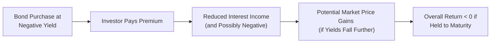

## Context and Background

It might feel a bit absurd at first—paying someone to hold your own money. Yet with negative interest rates, that’s exactly what can happen. Central banks sometimes adopt sub-zero rates to stimulate economic growth or stave off deflationary pressures, encouraging banks and other financial players to deploy capital rather than sit on it. Most of us studying fixed income have learned that interest rates are typically positive, reflecting the “time value of money.” But in this unusual world, you might find a bond with –0.2% yield. In other words, the investor actually receives less principal back if that bond is held to maturity and the rate remains negative.

I recall the first time I (rather skeptically) heard about negative yields on certain European government bonds. A fellow colleague in asset management confessed she never thought clients would voluntarily accept a sure loss, but fear or risk aversion can trump logic in uncertain times, especially when central bank policies strongly incentivize holding highly liquid debt. Let’s take a closer look at what happens in a negative rate environment, how it affects bond pricing, and what it all means for portfolio management.

## How Negative Rates Happen

When central banks want to spur lending and investment, they lower short-term policy rates, sometimes below zero. Another factor that pushes yields into negative territory is the strong flight-to-quality dynamic: if investors crowd heavily into “safe haven” assets (like top-rated government bonds), prices can skyrocket and thus drive yields below zero. In addition, large-scale asset purchase programs (QE) can reduce interest rates across the yield curve. The end result: sub-zero rates become commonplace, turning some textbook assumptions on their head.

## The Mechanics of Bond Valuation Under Negative Rates

Bond valuation typically relies on discounting future cash flows at a required yield. That yield is presumed to be non-negative in traditional finance theory—after all, you’d expect to earn something for deferring consumption and taking on credit risk. But if the discount rate is negative, the present value of future cash flows can climb far above par.

Below is a simplified example using a one-year bond with a face value of 1,000 and a coupon of 1%:

  
- Suppose the required yield is –0.5%.  
- The cash flow at the end of the year is the bond redemption of 1,000 plus the coupon of 1% × 1,000 = 10.  
- The present value (PV) of that cash flow is:


\text{PV} = \frac{1,010}{1 + (-0.005)} = \frac{1,010}{0.995} \approx 1,015.08


Notice that the bond’s value is higher than the sum of its coupon + principal redemption (1,010), which is the hallmark of a negative discount rate. So an investor is effectively paying about 1,015.08 now to receive 1,010 in one year. They’ll exit the investment with a net loss if held to maturity—yet in certain cases, the investor might still lock in this “loss” if they believe yields might go even more negative, hoping to sell the bond later at a higher price.

## Price Volatility and Convexity in a Sub-Zero World

One key insight is that as yields approach zero or go negative, even tiny changes in yield can dramatically swing the bond’s price. The interest rate sensitivity (duration) is very high. Because the typical linear approximation (Modified Duration × ΔYield) can be less accurate at negative yields, some portfolio managers prefer more sophisticated or non-linear measures (Effective Duration, Key Rate Durations). Convexity, which measures the curvature of the price–yield relationship, becomes more significant because bond prices increase at an accelerating rate as yields decline. 

## Real Rates vs. Nominal Rates

Negative nominal yields pose an interesting question: are real yields also negative? Quite possibly, yes. If inflation is extremely low or even negative (deflationary environment), real rates might not be as low as we think. Yet in some scenarios—like the Eurozone from 2014 onward—both nominal and real rates turned negative, indicating investors were paying for the privilege of holding “safe” assets in real purchasing power terms as well.

## Reinvestment Risk and Other Distortions

One lesser-discussed challenge is reinvestment risk. Coupon payments or maturing principal might be reinvested at negative yields. If you run a cash flow–matched portfolio, the reinvestment of inbound coupon payments could steadily erode returns. In some extreme cases, investors keep money in deposit accounts, even if those deposits earn slightly negative rates or face fees, simply because the net loss on an insured deposit might be smaller than a more negative yield on certain bonds.

From an institutional standpoint, financial firms may face margin compression or even negative net interest margins if certain liabilities or products maintain a non-negative floor. This can affect bank profitability, potentially reduce lending, and ironically hamper economic growth—the opposite of the central bank’s initial intent.

## Portfolio Shifts and Searching for Yield

Negative yield environments often encourage a shift up the risk spectrum, with many market participants going into higher-yield corporate debt, emerging market debt, or structured products to lock in at least some positive nominal return. But those moves can expose them to more credit risk and liquidity risk. The decision can feel a little like, “Do I take a small but certain loss (a negative yield) or chase uncertain, higher risks in pursuit of a better outcome?” Understanding these trade-offs, including correlations and volatility, becomes a vital part of portfolio construction.

## Considerations for Risk Management

Forecasting bond returns with negative rates can be tricky. Traditional yield-based methods, such as yield to maturity plus price appreciation, may not behave as expected. Because yield to maturity is negative, standard “bond splitting” or linear approximations of total return can lead to surprising results. Scenario analyses or more advanced interest rate modeling might be critical. For instance, practitioners often incorporate:

• Extended scenario testing: Evaluate outcomes across a wider range of possible yield changes.  
• Stress testing: Emphasize the tails, such as yields going deeper into negative territory.  
• Monitoring yield floors: In some markets, yields might not go far below zero because of deposit withdrawal or financial market constraints.

Below is a simple mermaid diagram illustrating the logic flow for an investor purchasing a bond at negative yield:



### A Quick Python Snippet

Feel free to experiment with how a negative rate affects present value calculations:

```python
face_value = 1000
negative_yield = -0.01
present_value = face_value / (1 + negative_yield)
print(f"Present Value = {present_value:.2f}")  # Compare to face_value
```

## “Cash is King?” The Role of Deposits and Fees

Some individuals or institutions might prefer literal cash holdings or deposit accounts if fees and logistic concerns (like security, insurance) add up to less of a loss than negative bond yields. However, large deposits may incur their own negative deposit rates or custodial fees. In the Eurozone, for instance, large corporations or institutional clients often faced negative deposit rates, prompting them to hold short-term government paper at similarly negative yields. 

This interplay between deposit costs, bond yields, and perceived credit risk can create peculiar market behavior. Investors might opt for slightly negative yields if they believe that liquidity in the bond market ensures a quicker exit or if they perceive some future capital gains from further downward moves in yields.

## Model Adaptations and Practical Tips

If you rely on standard formulae that assume non-negative rates, it’s important to adapt your approach. Here are some tips:

• Recalibrate or modify discounting models to accommodate negative yields.  
• Carefully map out stress testing and scenario analysis. Even a 0.05% shift in yields could be material when starting from –0.10%.  
• Revisit your old “yield plus risk premium” heuristics. Negative interest rates often distort these rules of thumb.  

Make sure to watch out for instruments with embedded floors (e.g., many floating-rate notes have an embedded 0% floor on the reference rate). They won’t necessarily replicate standard negative rate dynamics.

## Real-World Case Study: Eurozone Government Bonds

From 2014 onward, the European Central Bank (ECB) introduced negative deposit facility rates, prompting negative yields on various short-maturity government bonds across core Eurozone countries like Germany, France, and the Netherlands. Even some longer-term maturities dipped into negative territory. Despite the seemingly irrational notion of “paying to lend,” many institutional investors continued to hold these bonds, driven by regulatory requirements (like solvency margins for insurers), flight-to-quality objectives, and constraints on alternative investments.

This environment led to record-high bond prices and narrower yield spreads across global fixed income markets. Investors who purchased negative-yielding German Bunds sometimes profited from capital gains when yields pushed further below zero. Those who held to maturity essentially locked in a slightly negative return, effectively accepting the cost as a “safe haven premium.”

## Exam Relevance and Potential Pitfalls

• For exam-style questions, carefully distinguish nominal vs. real negative rates.  
• Watch out for short-answer or item-set questions that test your understanding of how standard bond pricing breaks down at negative yields.  
• You might encounter scenario-based prompts asking how a portfolio manager would adapt immunization strategies in a sub-zero yield context.  
• Evaluate the interplay between negative rates and central bank policies, or how deposit lines might be more attractive than a negative-yield bond.  

When you see negative rates in a case vignette, be ready to re-think duration, yield to maturity, and price volatility in a non-linear way. If your usual formula says the price is “nonsensical,” you might need a deeper, more precise approach.

## References and Further Reading

• Jobst, A. A., & Lin, H. (2016). “Negative Interest Rate Policy (NIRP): Implications for Monetary Transmission and Bank Profitability.” IMF Working Paper.  
• CFA Program Curriculum (Level I): Readings on Monetary Policy and Negative Rate Scenarios.  
• Bank for International Settlements (BIS). Publications on Low and Negative Interest Rate Environments.  
• For advanced insights, see academic papers on bond pricing anomalies in negative-yield environments.

## Test Your Knowledge: Negative Interest Rates in Depth



### Negative yields logically imply that bond prices:
- [ ] Cannot exceed par value.
- [x] Can exceed both par and redemption value.
- [ ] Are always inversely related to credit spreads.
- [ ] Are typically stable over time.

> **Explanation:** When yields are below zero, the discount factor becomes greater than 1 for near-term cash flows, causing bond prices to exceed both par and redemption amounts.

### In a negative interest rate environment, traditional yield-to-maturity formulas:
- [ ] Remain perfectly intact with no changes needed.
- [ ] Always result in positive total return forecasts.
- [x] May require reconsideration or recalibration for sub-zero discount rates.
- [ ] Never work at all for bond valuation.

> **Explanation:** Traditional yield-based methods assume non-negative rates. They may still function but often require adjustments for negative discounting.

### Real yields can be negative if:
- [x] Nominal yields are negative and inflation is near zero or slightly positive.
- [ ] Nominal yields are positive and inflation is negative.
- [ ] Nominal yields are zero, regardless of inflation.
- [ ] The central bank has no policies targeting inflation.

> **Explanation:** Real yield = Nominal yield – Inflation. Both numbers can be negative, making the real rate negative.

### One implication of negative yields on risk management is:
- [x] Greater price volatility for even minor changes in yield.
- [ ] Reduced need for scenario analysis.
- [ ] Guaranteed positive portfolio returns.
- [ ] Easing of reinvestment risk.

> **Explanation:** With yields already low or negative, small yield changes can produce large price swings, and reinvestment risk can worsen due to sub-zero reinvestment rates.

### In many negative rate environments, investors often shift:
- [x] Up the credit risk spectrum to find positive yields.
- [ ] Exclusively into very short-term money market instruments.
- [x] Into alternative assets, including equities or real assets.
- [ ] Entirely out of financial markets.

> **Explanation:** Sub-zero yields can push investors to seek higher returns in riskier credit or other asset classes.

### Securities with embedded floors (e.g., certain floating-rate notes):
- [x] May not perfectly track negative reference rates.
- [ ] Always replicate the exact performance of negative yields.
- [ ] Are never issued in negative-yield environments.
- [ ] Eliminate interest rate risk entirely.

> **Explanation:** Embedded floors prevent coupon rates from going below 0%, which can create a pricing deviation from instruments that can go negative.

### Why might some investors still purchase negative-yielding bonds?
- [x] They expect yields to become even more negative and plan to sell at a profit.
- [ ] They face no regulatory or mandate constraints.
- [x] They desire safe-haven assets, even at a cost.
- [ ] They are completely unaware of the sub-zero yield.

> **Explanation:** Investors might expect yields to drop further (producing price gains), or they value liquidity and safety over a small guaranteed loss.

### A practical approach to modeling bond returns under negative rates is:
- [x] Using scenario analyses with small yield shifts.
- [ ] Ignoring convexity and focusing on linear approximations only.
- [ ] Relying solely on yield to maturity from standard formulas.
- [ ] Disregarding potential central bank interventions.

> **Explanation:** Sub-zero rates demand more advanced modeling, especially because small yield changes can have disproportionate effects.

### The term “deflation” is:
- [x] A general decline in the price level (negative inflation).
- [ ] A short-term interest rate below zero.
- [ ] A growth in the money supply.
- [ ] A measure that excludes food and energy prices.

> **Explanation:** Deflation is the sustained decline in aggregate price levels over time, often coinciding with negative real interest rates.

### Negative yields typically imply that an investor will achieve a negative total return if held to maturity.  
- [x] True  
- [ ] False  

> **Explanation:** A negative nominal yield locks in a loss when the bond is held to maturity, barring any cushion from coupon payments that might offset the yield if it weren’t negative enough.  


