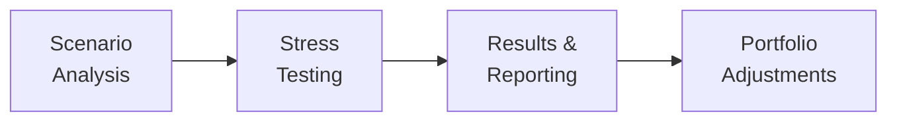

## Introduction

So, let me just say up front—if there’s one thing that makes me nervously tap my foot, it’s the thought of big, surprise jumps in interest rates. I remember back in 2008, chatting with a fellow analyst who said something like, “Rates can’t possibly move that fast.” Well, it turned out they really could, and then some. That’s exactly where scenario analysis and stress testing step in; they help us prepare for the unthinkable rate moves, hopefully before they strike.

When you hear “scenario analysis,” think of running your portfolio through different hypothetical (or historical) interest rate conditions—say, a +100bps parallel shift or a flattener that punishes longer durations. Stress testing is like scenario analysis on steroids, slamming your portfolio with extreme or “worst-case” rate changes to see if it can weather the storm. In a real sense, these tools can be a lifesaver for risk management, whether you’re at a global bank, a small insurance firm, or a portfolio management company trying to protect client capital.

## Understanding Scenario Analysis

Scenario analysis basically involves projecting bond or portfolio values (and sometimes other metrics such as yield, spread, or hedge ratio) under certain “what-if” interest rate environments. You can run any number of scenarios: from fairly modest shifts in the curve to epic meltdown episodes. The crucial takeaway is that scenarios let you test your portfolio’s vulnerabilities and potential gains under clearly defined interest rate conditions.

• Parallel shifts: Suppose the entire yield curve moves up or down by a fixed amount (e.g., +100bps or −100bps).  
• Twist scenarios: The short-end of the curve might rise while the long-end falls, or vice versa.  
• Historical replicates: Re-creating the 2008 financial crisis, the 1980s Fed tightening cycle, or that shaky environment of the early 2000s.  
• Unique macro events: Scenarios that replicate a sharp emerging market crisis, or a deflationary environment reminiscent of Japan in the 1990s.

### The Mechanics of a Scenario Analysis

In practice, to perform a scenario analysis, you might:

1. Specify the scenario: e.g., “A parallel shift of +200bps in the yield curve.”  
2. Create the new yield curve: Move every node on the existing curve by +200bps.  
3. Recalculate bond prices: For each bond or portfolio position, re-estimate its fair value using present value logic under the new yield structure.  
4. Summarize the results: Tally up the changes in bond values and see how much the portfolio gains or loses.  

That last step is often aided by duration and convexity calculations (see earlier sections in this Chapter), which approximate how a bond’s price reacts to small changes in interest rates. However, for big shifts, or for embedded-option bonds, a full revaluation can be more accurate. Duration and convexity are helpful approximations, but if you’re analyzing something with a call feature (like a callable corporate bond), you might get better results through a full-blown pricing model.

## Stress Testing as an Extension of Scenario Analysis

Stress testing simply takes scenario analysis to more extreme territory. Instead of a modest +100bps shift, stress tests might push rates by +400bps, or replicate an abrupt spike plus a liquidity crunch that doubles buy-sell spreads. The aim is to see whether the portfolio could survive a serious meltdown. Honestly, it’s kind of like imagining the worst possible scenario in your head, and then ensuring your finances won’t crumble if—or when—something that ugly hits.

Common examples of stress tests:

• Severe parallel shifts greater than any historically observed levels (for instance +300bps or even +500bps).  
• Dark swan events: A meltdown scenario with widespread credit downgrade, liquidity freeze, and interest rate volatility shooting through the roof.  
• Curve inversion shock: Rapid flattening that turns into a complete inversion, catching duration bets off-guard.  
• Combination of financial and macro shocks: Perhaps pairing inflation shocks with both corporate credit spread widenings and liquidity constraints.  

### Regulatory Requirements

Banks, insurance companies, and other large financial institutions are often required by regulators (think Basel Committee or local regulatory bodies) to run these analyses. Why? Because regulators want assurance that institutions have enough capital to remain solvent during market upheavals. If a systemic crisis occurs, the authorities don’t want the entire financial ecosystem to unravel.

### A Practical Way to Combine Approaches

In the real world, portfolio managers often blend different scenario approaches:

• Deterministic scenarios: “What if the Fed hikes rates by 150bps over the next year?”  
• Historical stress tests: “What if we copy the exact yield shifts from 1981–82 or from mid-2008?”  
• Hypothetical extreme scenario: “What if rates soar by 600bps in 12 months while unemployment skyrockets?”  

Each scenario yields different insights. Deterministic ones are straightforward, historical tests keep us grounded in what has actually happened before, and hypothetical extremes help us dream up (or dread) new frontiers.

## Duration and Convexity in Scenario Analysis

(Duration and convexity were discussed earlier in this chapter, but it’s helpful to recall how they matter for scenario analysis.)

If you’re pressed for time—and, let’s be honest, which analyst isn’t?—you may rely on estimates from duration and convexity to approximate how your bond prices change for rate shifts. But that’s only an approximation. The larger the rate move, the bigger the model error if you rely solely on linear or even second-order expansions. Once you start layering in bond features like embedded calls, floating coupons, or interest rate caps—well, that can quickly turn your approximate math sideways. A full revaluation with each scenario’s chosen yield curve (and volatility assumption, if needed) is often best.

## Real-World Anecdotes: Scenario Failures

Back in the 2008 crisis, a friend joked that his scenario analysis looked only at gentle rate shifts, because, “Well, 150bps is big enough, right?” Then, short-term rates basically collapsed and the interbank lending markets froze overnight. We ended up with dislocations beyond anything his template had: belly of the curve soared while the long end hardly moved for a bit. Lesson learned: we can’t be complacent about the domain we test.

## A Quick Look at a Scenario Diagram

Below is a simple flow that shows how scenario analysis and stress testing integrate into a portfolio management and optimization cycle:

1. “Scenario Analysis:” Evaluate normal and moderate rate changes.  
2. “Stress Testing:” Apply extreme or worst-case conditions.  
3. “Results & Reporting:” Summarize potential P&L, capital adequacy, and risk metrics.  
4. “Portfolio Adjustments:” Rebalance or consider hedges if exposure is too large.

## Liquidity Crunch Considerations

One scenario type that folks often forget (until it’s too late) is the liquidity crunch. This is the moment where trading in some segments of the bond market essentially hits a brick wall. Suddenly, the spread between bid and ask widens, and many traders get stuck with positions they can’t easily sell without taking a big price hit. Even if you had your interest rate moves modeled perfectly, a liquidity crunch can spark heavier losses than you ever expected, simply because there are no buyers at the fair price.

## Combining Scenario Analysis with Advanced Methods

In more advanced risk management frameworks, scenario analysis and stress testing are often integrated with Value at Risk (VaR) models, credit risk methods, or even integrated simulation frameworks. For example, you might run a Monte Carlo simulation that randomly draws from possible interest rate paths, but then overlay specific scenario states to see if they cause outsize losses. The question becomes: “What if a stress scenario event is realized—where do we stand?”

## Full Revaluation vs. Duration/Convexity Approaches

1. **Duration/Convexity Approximation**  
   Pros: Quick, easy to calculate, readily interpretable.  
   Cons: Less accurate for large shifts, bonds with embedded options, or path-dependent cash flows.  

2. **Full Revaluation**  
   Pros: Potentially captures details of embedded features, real forward yield curves, and variable discount factors.  
   Cons: Time-consuming, computationally heavy, especially for large portfolios.  

Managers typically have to find that comfortable balance between speed and accuracy. If you manage a small bond portfolio, you might do a full revaluation for each scenario. If you manage thousands of positions, you might rely on an approximation first, then do a more exact approach for your largest exposures.

## Implementation Challenges

• Data Requirements: You need accurate bond cash flows, current market yields, and spread data.  
• Model Complexity: Fancy yield curve models vs. simpler parallel shift logic.  
• Technology: Need strong computing power to handle real-time scenario analysis.  
• Behavioral Assumptions: Might be tough to incorporate how investors react under severe stress.  

## Key Takeaways for Portfolio Managers

• Scenario analysis and stress testing help identify whether the portfolio can handle adverse rate environments.  
• They reveal vulnerabilities—like heavy concentration in long-duration bonds or reliance on a stable yield curve slope.  
• Different scenarios yield different results, so it’s best to run a broad set.  
• Align scenario severity with both internal risk appetite and regulatory mandates.

## Best Practices and Common Pitfalls

Try to cover both moderate and extreme shifts, along with a few historically inspired market moments (e.g., “1980s style” or “2008 meltdown replicate”). Don’t assume the next crisis will look exactly like the last, but historical illusions can keep us humble. Another pitfall is ignoring the possibility of multiple simultaneous shocks—like rates going up while liquidity evaporates and credit spreads widen. Complexity stinks, but ignoring it doesn’t make it go away.

## Practical Exam Tips

• Expect a question about calculating a bond’s price under parallel shifts. They might give you the original yield curve and new yields, then ask for final portfolio value.  
• They might present a stress scenario with a large yield move plus a liquidity factor. You’ll likely be asked to note how that affects not just price projections but also your risk metric.  
• Keep in mind that the exam often tests your understanding of the difference between a “mild scenario” vs. “stress test.”  
• Be ready to interpret results of a scenario table, or explain how you’d adjust the portfolio once you see a big potential loss in certain yield movements.

## Glossary

Scenario Analysis: Evaluating a portfolio under plausible yield curve or economic conditions.  
Stress Testing: A more extreme scenario analysis focusing on worst-case, “outlier” events.  
Historical Scenario: Reconstructing past market episodes (e.g., 2008 meltdown, 1980s rapid rate hikes) to glean how a portfolio might perform under similar conditions.  
Hypothetical Scenario: Inventing plausible but not necessarily historically observed conditions, like a surge in inflation to 10% in under six months.  
Liquidity Crunch: A market phase where trading activity collapses, bid-ask spreads widen, and asset prices can gap downward due to lack of buyers.

## References and Further Reading

• Jorion, P. (2007). Value at Risk: The New Benchmark for Managing Financial Risk. McGraw-Hill.  
• Basel Committee on Banking Supervision. (2018). Guidelines on Stress Testing.  
• CFA Program Curriculum (Level I), Risk Management Readings on Scenario Analysis.  
• Fabozzi, F. J. (ed.). (2021). Bond Markets, Analysis, and Strategies. MIT Press.  

## Test Your Knowledge: Scenario Analysis and Stress Testing for Rate Risk



### Which of the following best describes stress testing for interest rate risk?

- [ ] A modeling technique used solely to evaluate moderate interest rate movements.  
- [x] A more extreme form of scenario analysis focusing on worst-case or severe rate changes.  
- [ ] A historical replication method that only uses past yield curve data.  
- [ ] An approach used only when interest rates are high.  

> **Explanation:** Stress tests stretch or push scenarios to the extreme, beyond ordinary or moderate yields.

### A portfolio manager simulates a +100bps parallel shift, a −100bps parallel shift, and a yield curve twist where the short end rises by 50bps and the long end falls by 25bps. This is an example of:

- [x] Scenario analysis.  
- [ ] Liquidity crunch modeling.  
- [ ] Full revaluation methodology.  
- [ ] Single-factor risk decomposition.  

> **Explanation:** The manager is creating multiple “what-if” rate environments. This practice is precisely scenario analysis.

### One major difference between a deterministic scenario and a historical scenario is that:

- [ ] Deterministic scenarios are always more severe.  
- [x] Historical scenarios replicate real market data from specific periods.  
- [ ] Historical scenarios rely on forward rate estimates, while deterministic ones do not.  
- [ ] Deterministic scenarios require no yield curve shifts.  

> **Explanation:** A historical scenario copies actual changes from a past market episode, while a deterministic one might apply an arbitrary shift, such as a +200bps shift.

### Under a severe bond market stress test, what factor could be included besides large yield changes?

- [x] A sharp reduction in liquidity that widens bid-ask spreads.  
- [ ] A guaranteed capital injection from regulators.  
- [ ] A random improvement in credit quality.  
- [ ] A parallel shift restricted to less than 50bps.  

> **Explanation:** Stress testing aims to measure extreme conditions, including big liquidity shocks.

### Which of the following is a key reason why a full revaluation might be preferred over a simple duration-convexity approach?

- [x] To capture the effect of embedded options in bonds under large yield movements.  
- [ ] Because it guarantees liquidity always remains constant.  
- [x] Because a simple duration-convexity approach only approximates price changes linearly and quadratically.  
- [ ] Because regulators prohibit the use of duration and convexity from a risk perspective.  

> **Explanation:** Duration/convexity approximations can be poor for large moves and for bonds with complex features. Full revaluation can capture these effects more accurately.

### A scenario analysis that replicates the interest rate shocks of 2008 would be classified as:

- [x] A historical scenario.  
- [ ] A hypothetical scenario.  
- [ ] A parallel shift scenario.  
- [ ] A stress scenario only used by regulators.  

> **Explanation:** Replicating the actual observed yield curve changes from 2008 is a historical scenario.

### What is the primary goal of adding stress scenarios on top of regular scenario analysis?

- [x] To evaluate portfolio performance under outlier or extreme market conditions.  
- [ ] To reduce the time required for computations.  
- [x] To guarantee a profit in all market situations.  
- [ ] To save on transaction costs.  

> **Explanation:** Stress scenarios are designed to explore worst-case outcomes, ensuring the portfolio’s resilience in dire conditions.

### Which of the following would be a plausible hypothetical scenario for stress testing a fixed-income portfolio?

- [x] Sudden hyperinflation where interest rates jump 600bps in three months.  
- [ ] Restricting yield changes to ±25bps.  
- [ ] Recreating precisely the yield environment from 2019.  
- [ ] Holding interest rates constant in all maturities.  

> **Explanation:** Hyperinflation with abrupt interest rate swings is a classic example of an extreme hypothetical scenario.

### Why might a bond manager combine deterministic and historical scenarios during analysis?

- [x] To obtain well-rounded insights and capture both hypothetical shifts and real-market data episodes.  
- [ ] To double the number of computations needed.  
- [ ] Because historical data alone always understates risk.  
- [ ] Because deterministic scenarios are not accepted by regulators.  

> **Explanation:** By combining both forms, the manager can address potential future shifts through deterministic analysis and also ground the analysis in what actually occurred historically.

### Stress testing is essential primarily because:

- [x] True  
- [ ] False  

> **Explanation:** It’s crucial for identifying worst-case outcomes and fulfilling regulatory requirements, which helps ensure stability in unpredictable markets.


