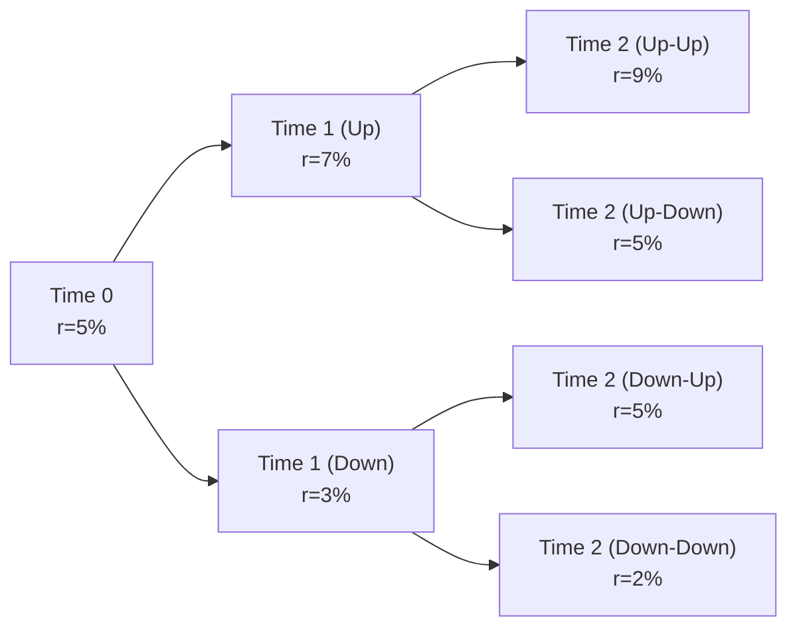

## Overview

Risk-neutral valuation might sound fancy at first, but let me tell you a quick anecdote: The first time I encountered this concept, I was baffled by the idea of “pretending everyone’s indifferent to risk.” I thought, “Uh, that can’t be real, can it?” Yet, risk-neutral valuation has turned out to be one of the most elegant frameworks for pricing fixed-income securities and derivatives. And although it looks a bit mystical, it’s actually a well-grounded mathematical approach that eliminates any possibility of free money (arbitrage). 

This section will clarify why risk-neutral valuation is so vital, how it’s used in interest rate models, and the different frameworks practitioners employ—everything from the short-rate approach (like Vasicek or Cox-Ingersoll-Ross) to forward-rate methods (like Heath-Jarrow-Morton). We’ll walk through some examples, share a few informal stories, and then break down the math step by step.

## Key Concepts in Risk-Neutral Valuation

### The Risk-Neutral World
Imagine you’re in a world where everyone’s happy accepting the risk-free rate of return, with no extra compensation for uncertainty. Sounds odd, right? This is the hypothetical environment called the “risk-neutral world.” Under this assumption, the expected return on every security is simply the risk-free rate (or the benchmark short rate). 

When we say “risk-neutral probability,” we’re referring to probabilities adjusted in such a way that, under this new measure, all assets grow on average at the risk-free rate. In actual markets, of course, risk aversion does exist, and different assets yield risk premiums. But for pricing and modeling, the risk-neutral measure gives us a mathematically consistent view of what fair value should be, so that no free lunch (arbitrage) is possible. 

### Arbitrage-Free Pricing
Risk-neutral valuation is intimately tied to the concept of arbitrage-free pricing. In a perfect market with no friction, if you can identify the fair value of one instrument (e.g., a zero-coupon bond), you can’t price a similar or related instrument inconsistently; otherwise, someone could step in, make offsetting trades, and lock in a profit with no risk. 

### Importance in Fixed Income
So where does this matter for fixed income? Well, if you need to price a bond with embedded options—like a callable or putable bond—or one that has some default risk (like high-yield debt), you can’t simply discount all future cash flows at the same yield. Instead, you want to model the uncertain cash flows under a “risk-neutral” framework, carefully tracking how interest rates might evolve and how the optionality (call or put) might be exercised. 

## Elements of Rates Modeling

### Short-Rate Models
Short-rate models focus on describing how the instantaneous rate (the short rate) evolves over time. In these models, the entire yield curve is derived from the behavior of a single state variable, the short rate r(t). Two popular ones are:

• Vasicek Model:  
  The Vasicek model is known for its mean-reverting nature. It assumes that the short rate follows a stochastic differential equation (SDE) of the form:

  (dr = a(b - r) dt + σ dW)

  where:  
  – a represents the speed of mean reversion (i.e., how quickly the short rate reverts to its long-run equilibrium level),  
  – b is the long-term average rate,  
  – σ is the volatility,  
  – dW is the increment of a Wiener process.

  In risk-neutral terms, the drift of r(t) changes slightly relative to the real-world measure. Yet the overall structure is reminiscent of the real-world process, except it’s been adjusted so that the expected return of any zero-coupon bond is risk-free (less any possible drift adjustments).

• Cox-Ingersoll-Ross (CIR) Model:  
  The CIR model is similar but ensures the short rate stays nonnegative. It has the form:

  (dr = a(b - r) dt + σ sqrt(r) dW)

  That “σ sqrt(r)” is the twist ensuring r(t) won’t accidentally go below zero. Like Vasicek, CIR is also mean-reverting and can be embedded into a risk-neutral framework.

From a practical standpoint, these short-rate models are easy to discuss but can be tricky to implement for complex contingent claims. Typically, we might build a binomial or trinomial tree or run Monte Carlo simulations of the short rate for more advanced pricing.

### Forward-Rate Models (Heath-Jarrow-Morton)
While short-rate models specify the dynamics of a single rate, forward-rate models (like Heath-Jarrow-Morton, or HJM) define the dynamics of the entire forward rate curve. That might sound daunting, but the main benefit is that it can more flexibly incorporate observed market prices of forward rates, swaptions, or caps/floors into the model. 

In an HJM framework, one directly models f(t,T)—the instantaneous forward rate at time t for maturity T. Then, the short rate at time t is effectively the limit as T → t. Risk-neutral valuation becomes a matter of ensuring that the drifting behavior of the forward curve is consistent with no-arbitrage. 

If you’re aiming for an advanced role in fixed income or derivatives, you’ll likely encounter HJM models since they’re widely used by banks for interest rate derivatives. However, for day-to-day bond portfolio management, simpler short-rate models can suffice.

### Binomial and Monte Carlo Trees
Let’s not forget the good old binomial interest rate model, often taught in introductory derivatives courses. You take discrete time steps (Δt) and assume the short rate can move “up” or “down” according to certain probabilities. Under a risk-neutral measure, the expected discounted payoff of a bond or derivative in each node equals its current price. This ensures no arbitrage is possible. 

When we scale up to more complex instruments, or we want more realistic distribution assumptions, we might shift from binomial trees to a Monte Carlo approach. In Monte Carlo, we simulate thousands (maybe millions) of paths for the short rate or forward curve. Each path generates a discounted payoff, and we take the average across all simulations to get the fair price under the risk-neutral measure. 

## Risk-Neutral Valuation in Practice

### Setting Up the Risk-Neutral Measure
Under the real-world measure (often denoted by P), the drift of the short rate or forward rate typically includes the market price of risk. Under the risk-neutral measure (denoted by Q), we tweak that drift so that expected returns on all securities are the risk-free rate. 

Mathematically, you might see statements like:

( dX_t = μ(X_t) dt + σ(X_t) dW_t^P )

become

( dX_t = [μ(X_t) - λ(X_t) σ(X_t)] dt + σ(X_t) dW_t^Q )

where λ(X_t) is the market price of risk. Under Q, it disappears from the drift so that the expected return is just the risk-free rate. 

### Discounting and Price Computation
Once you’re in the risk-neutral measure, the bond price is straightforward conceptually:

( P_0 = E^Q [ e^{-∫ r(s) ds} * CF_T ] )

That is, take the expected value (under Q) of the discounted cash flows CF_T, using the path-dependent integral of the short rate r(s) from time 0 to T. Next, you average over all possible scenarios. 

### Embedded Options and Multifaceted Risks
If the bond has a call option, you must consider scenarios where the issuer calls the bond (i.e., redeems it early) if interest rates drop sufficiently. Because we’re in a risk-neutral measure, we weight these scenarios by Q probabilities, discount them by the short rate path, and ensure that the final price is consistent with no-arbitrage. 

This can become computationally heavy, but it’s conceptually elegant: if your model is correct and your calibration to market data is accurate, you get an arbitrage-free valuation. 

## Practical Modeling Example

Let’s outline a short binomial example. Suppose you have a one-year bond (with face value = \$100) that pays a single coupon at maturity. We break the year into two six-month periods. The initial short rate is r(0,0) = 5% (expressed as 0.05 annually). Suppose in the first step the rate can go up to 7% or down to 3%. In the second step, from the up node, it can go up to 9% or down to 5%, and from the down node, it can go up to 5% or down to 2%. 

Under a risk-neutral framework, we adjust the probabilities p and (1-p) so that the expected bond return equals the risk-free rate (or short rate). The formula might look like:

( p = ( e^{r Δt} - d ) / ( u - d ) )

where u and d are the up/down factors, and Δt is the time step. Once we have these risk-neutral probabilities, we compute the bond value backward from each node.

Below is a simplified diagram of a binomial tree for the short rate:



At each final node (Time 2), the bond pays principal plus coupon. We discount that payoff back through the tree, applying the risk-neutral probabilities. This structure ensures we have an arbitrage-free price.

## Rates Modeling Approaches

### Mean Reversion and Volatility
One big question whenever you set up a short-rate or forward-rate model is: How quickly does the interest rate revert to its long-term mean, and how volatile is it? Some markets show strong mean reversion; others, not so much. If a model incorrectly assumes a quick reversion to a high average rate while the real world sees rates decline, you’ll end up mispricing interest-rate-sensitive assets. 

### The Impact of Negative Rates
What if rates go negative, as they have in some countries? Models like Vasicek can allow negative rates, while CIR cannot. In some real-world contexts, practitioners might prefer models that can handle negative rates gracefully. This can be done by shifting the process or by calibrating a suitable forward curve that accommodates negative yields.

### Calibrating Models to Market Data
If you’re building a model in practice (say, at a bank desk or for exam-based problem-solving), you usually calibrate it to observed market prices: swap rates, caps, swaptions, bond yields, etc. Through an iterative process, you pick parameters (like a, b, σ in Vasicek) that make your model’s theoretical prices match actual market quotes as closely as possible. 

## Example Computations (Python Snippet)

Below is a short Python snippet illustrating how you might run a mini Monte Carlo simulation of a simple short-rate model under the risk-neutral measure:

```python
import numpy as np

a = 0.3       # Mean reversion speed
b = 0.05      # Long-term mean
sigma = 0.02  # Volatility
r0 = 0.04     # Initial short rate
T = 1.0       # Maturity in years
steps = 100
dt = T/steps
num_sims = 10_000

rng = np.random.default_rng(seed=42)
rates = np.zeros((num_sims, steps+1))
rates[:, 0] = r0

for i in range(1, steps+1):
    dr = a * (b - rates[:, i-1]) * dt + sigma * np.sqrt(dt) * rng.standard_normal(num_sims)
    rates[:, i] = rates[:, i-1] + dr

discount_factors = np.exp(-np.sum(rates[:, 1:], axis=1) * dt)
price_estimate = np.mean(discount_factors)
print(f"Estimated ZCB Price: {price_estimate:.4f}")
```

Here, each simulated path evolves the short rate using the (risk-neutral) Vasicek formula. We then discount a hypothetical \$1 payoff at time T by integrating the short rate over each path. The average across all paths is the bond’s estimated fair value.

## Common Pitfalls and Best Practices

• Oversimplification: Relying on overly simplistic or miscalibrated models can yield erroneous valuations.  
• Ignoring Mean Reversion: If you skip mean reversion, your model might allow for unrealistically high or low rates over time.  
• Not Checking Arbitrage: Always verify that your pricing approach is consistent with no-arbitrage. If you see “free money,” your model might be flawed, or you’ve overlooked certain constraints.  
• Parameter Sensitivity: Some models can be very sensitive to inputs like volatility or mean reversion speed. Perform scenario analyses or stress tests.  
• Model Choice: A short-rate model may be too restrictive for exotic derivatives. Conversely, a full forward-rate model (HJM) might be unnecessarily complex for plain-vanilla bonds.

## Ties to Other Fixed-Income Topics
Risk-neutral valuation connects to many sections in this volume. For example, in “8.5 Option-Adjusted Spread (OAS) and Bonds with Embedded Options,” we rely on a risk-neutral valuation approach to separate interest rate risk from credit or option risk. And in “8.14 Performance Measures for Fixed-Income Hedge Funds,” advanced hedge-fund strategies often revolve around detecting tiny mispricings that risk-neutral frameworks help identify.

## Exam Tips

• Conceptual Understanding: Know how risk-neutral probabilities are derived and why they matter.  
• Basic Mathematics: You should be able to set up a simple binomial model, compute risk-neutral probabilities, and discount payoffs.  
• Key Differences Between Vasicek and CIR: Understand how each handles volatility, mean reversion, and potential negative rates.  
• Practice With Trees and Monte Carlo: You might see exam questions that test your ability to price a bond under different interest rate scenarios.  
• Tying It All Together: On the exam, risk-neutral valuation could pop up in integrated scenarios involving portfolio management or credit risk. Make sure you understand these connections—lots of “what if” questions can appear.  

## References

• Hull, J. (2018). Options, Futures, and Other Derivatives. Pearson.  
• Vasicek, O. (1977). “An Equilibrium Characterization of the Term Structure.” Journal of Financial Economics.  
• Heath, D., Jarrow, R., & Morton, A. (1992). “Bond Pricing and the Term Structure of Interest Rates: A New Methodology.” Econometrica.  
• CFA Program Curriculum (Level I), Readings on Arbitrage-Free Valuation of Interest Rate Products.

--------------------------------------------------------------------------------

## Test Your Knowledge: Risk-Neutral Valuation and Rates Modeling



### Which of the following best describes the concept of a risk-neutral measure in fixed-income pricing?

- [ ] Investors prefer risky assets to risk-free assets, given they earn a higher return.
- [x] Under the risk-neutral measure, all assets earn the risk-free rate on average.
- [ ] Bonds are assumed to carry no default risk.
- [ ] Bond prices never fluctuate under this approach.

> **Explanation:** Under the risk-neutral measure, we adjust probabilities so that the expected return on all assets equals the risk-free rate, ensuring no-arbitrage conditions.

### In a risk-neutral binomial model for a one-period interest rate tree, how are the “up” and “down” probabilities determined for the short rate?

- [ ] They are equal to 0.5 each.
- [ ] They are derived directly from historical frequency of rate increases or decreases.
- [x] They are computed so that the expected path yields the current forward rate, ensuring no arbitrage.
- [ ] They are set arbitrarily based on market consensus.

> **Explanation:** Under risk-neutral valuation, the probabilities are chosen (not necessarily 0.5 each) so that the expected return is the risk-free rate, thereby eliminating arbitrage opportunities.

### Which short-rate model is known for allowing negative interest rates?

- [x] Vasicek Model
- [ ] Heath-Jarrow-Morton Model
- [ ] Cox-Ingersoll-Ross (CIR) Model
- [ ] Black-Scholes Model

> **Explanation:** The Vasicek model can produce negative rates due to its normal diffusion specification. CIR, by contrast, ensures nonnegative rates.

### In a risk-neutral valuation setup, which of the following statements is accurate regarding the drift of interest rates?

- [x] The drift is adjusted to remove any market price of risk, matching the risk-free growth rate.
- [ ] The drift is increased to match investors’ required risk premiums.
- [ ] The drift is left unchanged from the real-world measure (P).
- [ ] The drift is irrelevant, as only volatility matters.

> **Explanation:** Under Q (the risk-neutral measure), the drift is modified to reflect only the risk-free rate, omitting all risk premiums.

### Which of the following is an advantage of forward-rate models like Heath-Jarrow-Morton over single-factor short-rate models?

- [x] They model the entire forward curve directly and can be calibrated to market data across maturities.
- [ ] They have fewer parameters and are simpler to implement for exotic derivatives.
- [ ] They do not require a risk-neutral framework.
- [ ] They are the only models preventing negative interest rates.

> **Explanation:** HJM-type models specify the dynamics of the entire forward rate curve, which can be matched more precisely to observed market instruments.

### Which of the following is a basic formula for pricing a cash flow CF under a risk-neutral measure Q?

- [x] P0 = E^Q[e^(-∫ r(s) ds) × CF]
- [ ] P0 = CF / (1 + r)
- [ ] P0 = CF × (1 + p - q)
- [ ] P0 = E^P[e^(- ∫ λ(s) ds) × CF ]

> **Explanation:** Under the risk-neutral measure, the present value involves taking the expectation of the discounted payoff, with the discounting process driven by the short rate over time.

### Under the Cox-Ingersoll-Ross model, what term ensures that the short rate remains above zero?

- [ ] A negative drift parameter.
- [x] The sqrt(r) in the diffusion term.
- [ ] A mean-reversion level set to one.
- [ ] The absence of any volatility term.

> **Explanation:** In CIR, the volatility term is σ√r. This structure makes it less likely that the short rate will cross below zero.

### Why might a practitioner choose a binomial tree approach for pricing a callable bond instead of using a continuous Monte Carlo approach?

- [x] The binomial tree approach can be more intuitive and straightforward for embedded option features.
- [ ] Binomial trees are always more accurate and faster to compute than Monte Carlo.
- [ ] Binomial trees ignore risk-neutral valuation altogether.
- [ ] Monte Carlo does not allow for multiple scenarios.

> **Explanation:** Binomial trees can clearly illustrate different rates and early-exercise features (like calls) with a simpler discrete framework, which is often more transparent than continuous simulations.

### In a short-rate model, how can we account for default risk under a risk-neutral valuation framework?

- [x] Incorporate a hazard rate or default intensity and adjust the bond’s cash flows accordingly.
- [ ] Reduce the drift term by a fixed amount.
- [ ] Scale the volatility by the credit rating.
- [ ] Shift the mean reversion to a lower rate environment.

> **Explanation:** Default risk can be modeled by including an intensity process in the risk-neutral measure. This modifies expected cash flows by the probability of surviving until each payment date.

### True or False: In the Heath-Jarrow-Morton framework, forward rates must follow strict deterministic paths to avoid arbitrage.

- [x] True
- [ ] False

> **Explanation:** HJM requires that the drift of forward rates be specified consistently with no-arbitrage conditions, meaning the forward rate processes aren’t arbitrary but aligned so that no free lunch is possible.


