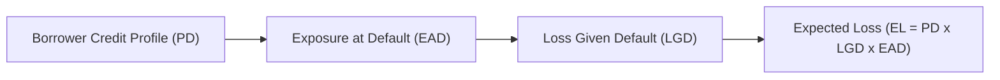

## Introduction

Credit risk might sound a bit daunting at first, but it’s really about one simple question: “Will the counterparty pay us back as promised?” Every bond investor, lender, or financial institution grapples with this. The reality is, people and corporations sometimes fail to fulfill their payment obligations (a situation we call “default”), and the consequences can be costly. While it might be impossible to eliminate the risk of default entirely, we can measure it, price it, and manage it. Here, we’ll break down two main components of credit risk—Default Probability (PD) and Loss Given Default (LGD)—and explain how they interact with the concept of Exposure at Default (EAD). With a balanced blend of theory and practical examples, we’ll see how these measures come together to shape credit analysis, regulatory capital requirements, and real-world investment decisions.  

## Understanding Default Probability (PD)

Default Probability, or PD, is precisely what it sounds like: the likelihood that a borrower will fail to meet its contractual obligations on time and in full. Now, imagine any borrower—whether it’s a municipality raising money for a new school or a corporation expanding into emerging markets. Each brings its own unique risk profile, shaped by:

• Quantitative factors: Financial ratios, macroeconomic indicators, industry cycle data.  
• Qualitative factors: Management expertise, product innovation, business model stability, and broader market sentiment.

Investors and analysts often rely on credit ratings to approximate PD. For instance, if a bond issuer is rated AAA, that implies a very small PD (though not literally zero). If a bond is rated B or CCC, the market perceives a significantly higher PD.

But these ratings aren’t the full story. In practice, PD can shift rapidly over time, especially if economic conditions sour or if something internal to the corporation changes (like a governance scandal or a key executive departure). During the 2008 crisis, for example, many borrowers that looked safe early on saw their PD shoot up quickly when liquidity dried up.  

### Determining PD in Practice

In many contexts, we use models to estimate PD. These models might be as simple as historical default rate analysis, or far more sophisticated, including structural models based on option pricing theory (like Merton’s model), or reduced-form models that incorporate market-based inputs such as credit default swap (CDS) spreads.  

In a bank setting, the internal ratings-based (IRB) approach under Basel guidelines requires lenders to assign each borrower a rating and produce a PD estimate that meets certain regulatory standards. IFRS 9 or CECL (Current Expected Credit Loss) rules further drive how financial institutions reflect PD in their accounting provisions.  

## Understanding Loss Given Default (LGD)

Even if a borrower defaults, there’s often a chance of recovering a portion of the exposure. The portion that is not recovered is the Loss Given Default, or LGD. Some people find it easier to think of its companion metric, the recovery rate: the fraction of the exposure that’s ultimately recovered, net of any costs.  

LGD is largely a function of:  
• Collateral type and quality (secured loans typically have lower LGD).  
• Seniority of the claim (senior debt is usually repaid before junior debt).  
• Legal, administrative, and market factors (bankruptcy laws, court efficiency, asset liquidity in the marketplace, etc.).

For instance, a senior secured loan collateralized by valuable real estate in a stable market may have an LGD of 20% or lower. A subordinate bond with no pledge of collateral might have an LGD of 70% or more. The wide range is telling: context absolutely matters.

### Fluctuations in LGD

LGD can also be time-varying. During a recession or industry downturn, assets securing the loan may drop in value, raising the realized LGD if default happens. On the bright side, in more stable markets with smoother reorganization processes, LGD might be more modest.  

In some real-life experiences, I remember reviewing a small business loan secured by specialized machinery. The machines were valued rather high in normal market conditions. Yet once the business defaulted and we tried to sell them post-bankruptcy, we discovered a glut of similar used machinery, driving the price down. Thus, the actual loss was higher than our original estimate.  

## Exposure at Default (EAD) and Its Interaction with PD and LGD

While PD and LGD are crucial, another critical concept in credit risk analysis is the Exposure at Default (EAD). If default occurs, we need to know how much is actually at stake at that moment. EAD represents the total amount an investor or lender could lose if the borrower fails to pay.

When combined into a single expression, the formula for Expected Loss (EL) is:


EL = PD \times LGD \times EAD


Intuitively:  
• PD is how likely default is.  
• LGD is how large the loss would be (net of recovery).  
• EAD is how big the total exposure is at the time of default.

A massive line of credit or large bond exposure can really amplify the risk if PD rises. Similarly, if EAD is small but the PD is high, you might still consider the position manageable due to the relatively small size of the potential loss.  

Below is a simplified flowchart illustrating how PD, LGD, and EAD combine in credit risk modeling:

## Factors Influencing These Three Risk Components

### Macro and Micro Drivers of PD

• Economic cycles: In economic downturns, PD typically increases across the board.  
• Industry competition: A swiftly changing or saturated industry raises PD for all participants.  
• Company-specific health: We look at leverage ratios, profitability, liquidity, growth prospects.  

### Collateral and Seniority for LGD

• Collateral quality: Tangible, marketable collateral typically means lower LGD.  
• Legal framework: Certain jurisdictions are more creditor-friendly, leading to quicker, more cost-effective recoveries.  

### Utilization and Commitment Structures for EAD

• Credit lines: If only partially used, actual EAD is less than the total line.  
• Contingent exposures: Guarantees or derivatives might increase EAD unexpectedly.  

## Stress Testing and Scenario Analysis

No discussion of PD and LGD would be complete without stress testing. Banks, institutional investors, and regulators commonly use scenario analysis to see how PD and LGD might react to severe market environments. For example, a 30% drop in housing prices would likely raise both PD and LGD in mortgage portfolios—more borrowers default, and the collateral fetches a lower price, so the realized loss is higher.  

On the regulatory front, the Basel Committee on Banking Supervision expects banks to conduct forward-looking stress tests, capturing extreme but plausible scenarios to ensure capital adequacy. By using scenario-based PD and LGD, lenders can estimate how severe the losses might become and plan their capital buffers accordingly.  

## Integration into Credit Ratings and Pricing

Ratings agencies evaluate both PD and potential recovery prospects (related to LGD) when assigning a credit rating. For example, a bond that has decent credit metrics (low PD) but is heavily subordinated (high LGD) might receive a lower rating than one with a slightly higher PD but strong collateral support.

In turn, investors use the combined insight from PD and LGD to price credit instruments, whether that’s corporate bonds, structured products, or credit default swaps. For a plain-vanilla corporate bond, the yield spread over a risk-free benchmark generally compensates investors for expected and unexpected losses—mirroring that PD and LGD dynamic.  

## Regulatory Landscape and the Basel Frameworks

Under Basel II, III, and potentially subsequent refinements, banks must hold capital in proportion to their credit risk exposures. Firms using the Internal Ratings-Based (IRB) approach estimate PD, LGD, and EAD for their loan portfolios consistent with certain regulatory rules. The capital requirement is then a function of the potential unexpected loss above and beyond the expected loss.  

Basel guidelines also relate to how institutions account for defaults, measure losses, and manage the differences between downturn and “through-the-cycle” estimates. The interplay between regulatory capital and internal risk management has grown more complex over time, but the root remains the same: measure PD, estimate LGD, and identify EAD accurately to protect system stability.  

## Sample Real-World Illustration

Let’s try a basic numeric example, ignoring complexities like discounting or workout costs:

• PD = 5% (the company has a medium risk of default).  
• LGD = 40% (the debt is unsecured, but the firm has moderate asset coverage).  
• EAD = \$10 million (that’s the outstanding face value of the bond the investor holds).

Expected Loss (EL) = 5% × 40% × \$10 million = \$20,000.

In a normal year, the investor might expect a loss of \$20,000 from this bond. Of course, if times get rough and PD jumps to 10% and LGD edges up to 50% (maybe because collateral values or the firm’s underlying assets deteriorate), the expected loss rockets to \$50,000. That’s a big shift for a single security in the portfolio, prompting the investor to consider risk limits, diversification, or, in some cases, hedging strategies.

## Common Pitfalls and Best Practices

• Overreliance on historical data: Past trends don’t always predict future defaults (think about the subprime mortgage meltdown).  
• Ignoring correlated risks: If PD spikes for one borrower, it might spike for others in the same industry.  
• Overly simplistic LGD assumptions: Actual recovery can vary drastically, especially under stressed market conditions.  
• Underestimating the effect of off-balance-sheet or contingent exposures on EAD.  
• Failing to refresh credit models regularly: Credit risk models need continual updates with new macro and issuer-specific data.

To mitigate these pitfalls, professionals often:  
• Diversify credit portfolios to limit concentration risk.  
• Perform periodic stress tests to gauge potential worst-case scenarios.  
• Engage in robust covenant negotiations and maintain vigilance on triggers.  
• Keep track of changes in regulatory requirements, ensuring compliance with Basel or other frameworks like IFRS 9 or US GAAP expected loss provisioning.

## A Quick Personal Reflection

I recall analyzing a municipal bond for a small township that had never defaulted in over 50 years. We were quite comfortable with the PD estimate. Then, a budget crisis loomed after new public infrastructure costs ballooned. Unexpected tax issues led to a sudden rating downgrade, and the once-remote PD soared almost overnight. The lesson learned? Don’t fall into the trap of complacency just because historical defaults were zero.  

## Strategies for Managing Credit Risk

• Diversification: Don’t put all your eggs in one basket across industries/geographic areas.  
• Collateralization: Secure the exposure; charge higher spreads for lower-priority claims.  
• Covenants: Include conditions in loan contracts that limit risky borrower behavior.  
• Credit Derivatives: Credit default swaps and other derivatives can help hedge or transfer some credit risk.  
• Ongoing Monitoring: PD and LGD are not “set it and forget it” metrics but require continuous review.

## Final Exam Tips

• In exam scenarios, be ready to parse questions about PD, LGD, and EAD. Think about how they converge to determine expected loss.  
• Don’t ignore qualitative signals—management changes, brand reputation, or lawsuits can boost PD quickly.  
• Practice stress-testing logic: given a big macro shock, which direction will PD and LGD move, and why?  
• Remember that real-world credit analysis is rarely static. Exam land may simplify numbers, but the principles remain the same.  
• If faced with a question about how to lower credit risk, consider multiple angles: position sizing, security (collateral), legal enhancements, or credit hedges.

## References and Suggested Readings

• Saunders, A., & Cornett, M. (2019). Financial Institutions Management. McGraw-Hill.  
• Basel Committee on Banking Supervision – https://www.bis.org/bcbs/  
• Schroeck, G. (2002). Risk Management and Value Creation in Financial Institutions. Wiley.  
• IFRS 9 and CECL documentation for accounting standards.  

## Test Your Knowledge: Components of Credit Risk Quiz



### A question on basic definitions: Which statement best describes Default Probability (PD)?

- [ ] It is the estimated fraction of the exposure recovered post-default.  
- [x] It is the estimated likelihood of a borrower’s failure to meet contractual obligations.  
- [ ] It is the fraction of principal owed but not recovered in the event of default.  
- [ ] It is the total size of the financial claim if default occurs.  

> **Explanation:** Default Probability (PD) focuses on the chance that the borrower will default, not the anticipated loss after default or the recovery rate.

### Understanding LGD: Which factor commonly lowers Loss Given Default (LGD)?

- [x] Seniority and strong collateral backing.  
- [ ] Weak legal frameworks in the borrower’s jurisdiction.  
- [ ] Highly volatile market conditions.  
- [ ] Absence of any contractual security.  

> **Explanation:** When a debt claim is more senior and collateral is strong, the LGD is typically lower because recoveries tend to be higher.

### Relationship Question: Which formula correctly captures the concept of Expected Loss?

- [ ] Expected Loss = PD + LGD × EAD  
- [x] Expected Loss = PD × LGD × EAD  
- [ ] Expected Loss = (PD × EAD) – LGD  
- [ ] Expected Loss = PD × (1 – LGD) × EAD  

> **Explanation:** The standard relationship for Expected Loss is PD multiplied by LGD multiplied by EAD.

### Scenario Analysis: If a financial institution is performing a stress test, which metric(s) are most likely to increase during an economic downturn?

- [x] Both PD and LGD  
- [ ] Exposure at Default only  
- [ ] Loss Given Default only  
- [ ] None of the above  

> **Explanation:** In a downturn, borrowers are more likely to default (higher PD), and collateral values may be depressed (leading to higher LGD).

### Sizing Up Risk: Which of following best describes Exposure at Default (EAD)?

- [ ] The measure of how much of the principal is expected to be recovered after default.  
- [ ] The ratio of the outstanding principal to the total debt.  
- [x] The total amount that could be lost if a borrower defaults at a given moment.  
- [ ] The fraction of the total interest payments not received due to early default.  

> **Explanation:** EAD represents the total value at risk if the borrower defaults, essentially capturing how large the exposure is.

### Regulatory Focus: Under Basel frameworks, which approach involves internal estimation of PD, LGD, and EAD?

- [ ] Standardized Approach  
- [x] Internal Ratings-Based (IRB) Approach  
- [ ] Settlement Approach  
- [ ] Collateral-Based Approach  

> **Explanation:** The IRB approach allows banks to use their internal models to estimate PD, LGD, and EAD, subject to regulatory oversight.

### Pitfall Alert: Which practice can lead to underestimating credit risk?

- [x] Basing PD estimates solely on historical default rates without considering economic changes.  
- [ ] Incorporating forward-looking indicators into PD estimates.  
- [ ] Conducting regular stress testing.  
- [ ] Implementing robust covenants to reduce risk-taking by the borrower.  

> **Explanation:** Historical data alone doesn’t always account for future shifts in economic or industry conditions, leading to potential underestimation of PD.

### Secured vs. Unsecured: If a lender holds strong collateral, how does that impact LGD?

- [x] LGD will typically be lower.  
- [ ] LGD will typically be higher.  
- [ ] Collateral is irrelevant to LGD.  
- [ ] Collateral only impacts PD, not LGD.  

> **Explanation:** One of the biggest drivers of LGD is the presence and quality of collateral, which often reduces the lender’s ultimate loss.

### Case Study Angle: After an unexpected lawsuit tarnishes a company’s reputation, which of the following best describes the immediate likely effect?

- [x] PD might increase because of reputational damage and uncertainty.  
- [ ] LGD instantly drops because the brand is more recognized.  
- [ ] EAD is fixed once the bond is issued, so no effect on it.  
- [ ] PD does not change since it is only influenced by economic indicators.  

> **Explanation:** Negative publicity or legal troubles can directly undermine investor confidence in the firm’s repayment abilities, raising the probability of default.

### True/False: In a stress test, a bank might hold PD at its current level but increase LGD to capture lower collateral recoveries in a recession scenario.

- [x] True  
- [ ] False  

> **Explanation:** Stress scenarios can include adjusting LGD upward due to depressed collateral values; PD can also be adjusted upward, but each component can be stressed uniquely.


