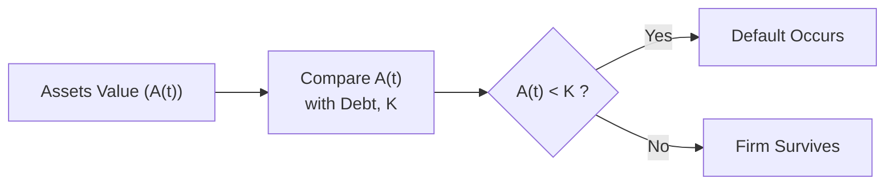
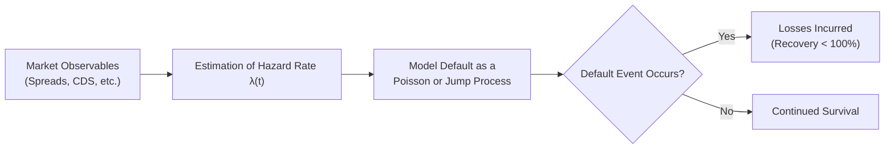

## Introduction
Credit risk models enable investors, risk managers, and policymakers to quantify and manage the likelihood of default on debt instruments. These models also help price bonds, credit default swaps (CDS), and other instruments exposed to default risk. Broadly, credit risk modeling methods break down into two main categories: structural models and reduced-form models. Structural models (often associated with the Merton approach) rely on firm-level fundamentals—specifically, asset values and capital structure. Reduced-form models, by contrast, take a more market-driven approach, treating default as a stochastic process whose intensity can be inferred from market prices (such as bond yields or CDS spreads).

If you’ve ever scratched your head thinking, “Should I base my default probability forecasts on raw fundamentals or market data?” you’re in the right place. This discussion will dive deeply into both methods, exploring how each works, the assumptions behind them, and their relative pros and cons. We’ll also look at how practitioners (including large asset managers, banks, and insurance companies) often blend these models to better manage credit risk across diverse portfolios.

## Structural Credit Risk Models
Structural models rest on the idea that a firm’s equity can be viewed as a call option on its assets. The most famous structural model is the Merton Model, introduced by Robert Merton in 1974. The key insight is that default happens if, at a specific point in time (often the debt’s maturity), the firm’s asset value is insufficient to cover its debt obligations.

### The Merton Model Basics
In the Merton framework, the firm is assumed to have only two types of securities in its capital structure: a single class of debt and common equity. If we denote:

• V₀ as the current value of the firm’s assets.  
• K as the face (par) value of the firm’s debt, due at time T.  
• E₀ as the current value of the firm’s equity.  
• r as the risk-free rate.  

The Merton Model treats equity like a European call option on the assets of the firm with a strike price equal to K and maturity T. If, at time T, the assets (V_T) exceed the debt (K), equity holders “exercise” and retain the leftover value (V_T − K). If assets fall below K, the firm defaults and equity holders receive nothing.

Under classical Black–Scholes–Merton assumptions (constant volatility, zero dividends, frictionless markets, and so forth), the value of equity can be modeled as:


E_0 = V_0 \Phi(d_1) - K e^{-rT} \Phi(d_2),


where


d_1 = \frac{\ln\left(\frac{V_0}{K}\right) + \left(r + \tfrac{1}{2}\sigma^2\right)T}{\sigma \sqrt{T}}, 
\quad
d_2 = d_1 - \sigma \sqrt{T},


and  
• \\(\sigma\\) is the volatility of the firm’s assets.  
• \\(\Phi(\cdot)\\) is the cumulative distribution function of the standard Normal distribution.

#### Default Interpretation
Default—within this model—occurs if \\( V_T < K \\). By continuously tracking the evolution of \\( V_t \\) over time, one can gauge how close the firm is to the default boundary (often referred to as the “default barrier”). The probability of default by maturity T can be approximated by \\( 1 - \Phi(d_2) \\).

### Intuitive Appeal
Structural models provide a clear link between capital structure, equity/debt valuations, and credit risk. This can be particularly appealing if you like fundamental analysis: you look at the firm’s assets, liabilities, potential corporate actions, and see how these factors might affect the probability of default.

1. Firms with strong asset positions relative to their liabilities are considered lower default risk if their underlying asset value is far above the debt’s face amount.  
2. Firms on shaky ground, with asset values hovering close to the debt amounts, present a higher probability of default.  

### Common Assumptions
Despite its intuitive nature, the Merton Model typically involves simplifying assumptions:

• Asset Value Follows a Lognormal Process: Real-world asset returns may deviate from a simple lognormal distribution, especially during stressed market conditions.  
• No Early Default: Merton’s model focuses on default at maturity. In real life, firms can default at any time if they fail to meet near-term obligations.  
• Zero Frictions in Capital Market: Trading friction, taxes, or other market involvement can distort asset prices.  
• Single Debt Class: Simplicity is assumed in the capital structure, whereas actual firms often have multiple debt layers with different maturities and priority levels.

### Extensions
Many have built on Merton’s framework to relax assumptions, allowing for more dynamic defaults (e.g., Black–Cox models) or multiple classes of debt. While valuable, these extensions can become mathematically complex. In practice, large financial institutions often use these more advanced structural approaches for internal risk management.

Below is a simple conceptual flow diagram of the structural approach to credit risk:

## Reduced-Form Credit Risk Models
Reduced-form models take a rather different tack. Instead of explicitly modeling a firm’s asset value, they treat default as a “surprise” (or partially predictable) random event. Mathematically, default is often modeled through a stochastic process with an associated “intensity” or “hazard rate.” Investors then calibrate the hazard rate using observed market data such as corporate bond prices or CDS spreads.

### Hazard Rate (Default Intensity)
Reduced-form models specify a hazard rate \\(\lambda(t)\\), representing the instantaneous likelihood of default over a small time interval \\(\Delta t\\). For example, if the hazard rate at time t is 0.02, that suggests approximately a 2% chance of default per year at that instant, conditional on no prior default.

The bond or CDS pricing formulas under a reduced-form framework incorporate this hazard rate to discount expected cash flows. Crucially, the hazard rate can shift based on changes in market conditions or the firm’s perceived creditworthiness—whatever signals the market is observing.

### Market Data Calibration
One big advantage of reduced-form models is that they can be quickly calibrated to reflect changes in bond yields or CDS spreads. So, if you see a sudden spike in a company’s 5-year CDS spread, you can plug that into your reduced-form model, recalculate the hazard rate, and get an updated default probability. This speed and agility can be invaluable for traders and portfolio managers who rely on real-time market signals.

### Separation from Fundamentals
Reduced-form approaches do not delve into the actual assets or liabilities on a firm’s balance sheet. That’s a plus if you’re in a hurry and markets are providing presumably efficient signals. However, it can be a drawback if you want insight into how major changes in the firm’s capital structure or macroeconomic stress might alter default risk. You’re leaning heavily on the assumption that market prices already incorporate all relevant information. If markets are inefficient, or if liquidity is poor, the hazard rate might not capture the true risk.

### Key Strengths and Weaknesses
• Strengths:  
  – Rapid calibration to market data.  
  – Straightforward to implement for large portfolios.  
  – Flexible in capturing time-varying default intensities.  

• Weaknesses:  
  – No direct link to the firm’s underlying fundamentals.  
  – Potentially unstable estimates during market turmoil or illiquidity.  
  – Requires a well-behaved term structure of credit spreads (which might not always be the case).

Below is a simplified look at how reduced-form models might conceptualize default:

## Combining Structural and Reduced-Form Perspectives
In practice, many institutions blend both approaches. For example, consider a bank that uses:

• A structural model (like Merton) for a long-term view of each borrower’s solvency. This helps gauge fundamental resilience—particularly under stress scenarios where market prices might be temporarily dislocated.  
• A reduced-form approach to adjust short-term probabilities of default, reflecting real-time market data (e.g., sudden changes in credit spreads, jump in implied volatility, or new macroeconomic announcements).

When you fuse the two, you might revolve your day-to-day pricing tasks around hazard rates gleaned from market signals, but refine or anchor them with structural insights. If structural analysis shows that a firm’s fundamentals are deteriorating much faster than the market suggests, you might adjust your hazard rate upward before the rest of the market catches on.

## Practical Examples and Case Studies
### Example 1: Corporate Bond Valuation
Suppose you’re valuing a corporate bond with a par value of $100 million and a maturity of five years. A reduced-form model could be calibrated from secondary market spreads, leading to an implied hazard rate of 1.5% annually. Meanwhile, a structural analysis (Merton approach) might suggest that the firm’s assets have high volatility and are leveraged enough that the “true” default risk is more like 2.0% annually. An integrated approach might weigh both signals, especially if you suspect markets are “sleeping” on this firm’s risk.

### Example 2: Financial Crisis Stresses
During 2008–2009, many structural models indicated that the underlying asset values (particularly for banks) were crumbling. In some instances, though, market prices had difficulty incorporating new information quickly or simply froze due to illiquidity. Reduced-form hazard rates were swinging wildly. Practitioners who relied solely on one approach often found that they either underreacted or overreacted: an institution that used a hybrid—and that had more nuance about underlying fundamentals—was arguably better positioned.

## Model Calibration and Estimation
Regardless of the approach, calibration is crucial. Structural models often require estimates or calibrations of asset volatility, risk-free rate, and asset values. Reduced-form models need time-series data on credit spreads, interest rates, and assumptions about recovery rates.

### Structural Model Calibration
• Estimate asset value and volatility from equity market data, using an iterative approach.  
• Solve for implied asset value and volatility that match observed equity prices.  
• Compare model bond prices or implied spreads with actual market data.  

### Reduced-Form Model Calibration
• Start with observed spreads (e.g., from corporate bonds or CDS).  
• Assume a recovery rate (or calibrate it if the data is sufficient).  
• Back out the hazard rate \\(\lambda(t)\\) that fits the observed spread curve.

## Major Considerations in Practice
1. Data Quality: If a firm’s bonds are illiquid, calibrating a reduced-form model becomes tricky. Similarly, for structural models, we need accurate estimates of the firm’s total asset value.  
2. Model Risk: Both approaches rest on assumptions. During extreme market disruptions, model-driven forecasts can fail.  
3. Regulatory Environment: Regulators may require specific stress tests or capital charges. In some jurisdictions, banks must demonstrate how they incorporate cycles and stress events in credit models.  
4. Changing Capital Structures: Firms raise new capital, issue new classes of debt, or buy back securities. These changes can quickly distort older structural calibrations.  

## Conclusion
At the end of the day, structural and reduced-form credit risk models are complementary tools, each delivering a unique lens on default probability. Structural models allow you to think about a firm’s balance sheet and fundamental risk more thoroughly, albeit at the expense of heavier assumptions and potential complexity. Reduced-form models can be quicker to calibrate and closer to real-time market sentiment, yet they can fall short when trying to capture big shifts in a firm’s fundamentals.

From a CFA exam perspective, expect to see questions regarding the conceptual framework of Merton’s model (including the call option interpretation of equity), how hazard rates drive bond/CDS pricing, and the trade-offs between both approaches. While the exam typically doesn’t require you to perform a full-blown calibration, you should be ready to explain the logic behind each method, the standard formula assumptions, and how to interpret model outputs in portfolio risk management.

## Final Exam Tips
• Know the Merton Model Essentials: Understand the connection between equity as a call option, the default boundary, and how that boundary is set by the firm’s debt obligations.  
• Hazard Rate Interpretation: Be comfortable with the concept of default intensity in the reduced-form framework and how it translates to credit spreads.  
• Pros and Cons of Each Approach: You may see an exam question that asks you to compare structural vs. reduced-form methods. Focus on which scenario each method is best suited for.  
• Scenario Analysis: If you see a question on how to adapt to new market information (e.g., a sudden jump in CDS spreads), the reduced-form approach is typically more nimble. Structural is more fundamental, so it’s better at capturing capital structure changes or big macro/firm-level shifts.  
• Integration is Common: Real-world practitioners often blend the approaches. Be prepared to discuss how they might do this and why.

## References
• Merton, R. (1974). “On the Pricing of Corporate Debt: The Risk Structure of Interest Rates.” Journal of Finance.  
• Jarrow, R., & Turnbull, S. (1995). “Pricing Derivatives on Financial Securities Subject to Credit Risk.” Journal of Finance.  
• Tsuji, C. (2006). “Merton’s Model, Reduced-Form Models and Basel Capital Requirements.”

--------------------------------------------------------------------------------

## Test Your Knowledge: Structural vs. Reduced-Form Credit Risk Models



### Which statement best describes a key difference between structural models and reduced-form models of credit risk?

- [x] Structural models directly link default to the firm’s asset value, whereas reduced-form models treat default as a stochastic event inferred from market prices.
- [ ] Reduced-form models require more in-depth knowledge of the firm’s balance sheet than structural models.
- [ ] Reduced-form models are typically used only for evaluating sovereign bonds.
- [ ] Structural models use hazard rates derived from market spreads to model default events.

> **Explanation:** Structural models (e.g., the Merton approach) treat equity as a call option on the firm’s assets, so default is a direct function of asset values falling below liabilities. Reduced-form models do not necessarily rely on a firm’s asset value but instead use default intensities estimated from market data.

### In Merton’s model, which event determines when default occurs?

- [x] When the firm’s asset value falls below the face value of its debt at maturity.
- [ ] When the firm’s bond yield rises above its equity cost of capital.
- [ ] When the firm’s hazard rate exceeds a preset threshold.
- [ ] Whenever its credit rating changes significantly.

> **Explanation:** By construction, Merton’s model posits that default arises if the terminal asset value is insufficient to pay the promised debt.

### Which of the following is a common disadvantage of purely structural models in practice?

- [x] They can be difficult to calibrate if the assumptions about asset value dynamics are not realistic.
- [ ] They cannot incorporate the firm’s capital structure into the model.
- [ ] They are too quick to respond to changing market conditions.
- [ ] They rely exclusively on CDS spreads for calibration.

> **Explanation:** Structural models can become less accurate if the assumptions about asset price behavior (like lognormal dynamics) do not hold, or if the firm’s capital structure is more complex than the simple single-debt-class scenario.

### In a reduced-form credit risk model, what is the “hazard rate”?

- [x] The conditional probability of default in a small time interval, given survival up to that point.
- [ ] The speed at which the underlying asset value changes over time.
- [ ] A measure of the tax rate the firm must pay on interest.
- [ ] An interest rate measure used only in sovereign bond analysis.

> **Explanation:** In reduced-form models, the hazard rate (or intensity) captures the likelihood of default per unit time, conditional on no default having occurred previously.

### How are reduced-form models typically calibrated?

- [x] By using observable market prices (e.g., bond yields, CDS spreads) to estimate default intensity.
- [ ] By projecting future cash flows using only publicly disclosed balance sheet statements.
- [x] By assuming a recovery rate and matching market spreads to model output.
- [ ] By using the lognormal asset value assumption and comparing it with equity’s option value.

> **Explanation:** Reduced-form models rely on market data like bond prices or CDS spreads to back out the hazard rate. You also need a recovery rate to relate default to the expected loss.

### What scenario might push a practitioner to favor a reduced-form approach over a structural approach?

- [x] Fast-changing market conditions where continuous recalibration to spreads is necessary.
- [ ] A situation focusing primarily on the firm’s long-term capital structure viability.
- [ ] A scenario in which fundamental analysis of assets and liabilities is paramount.
- [ ] A stable environment where no differences exist between market perception and fundamentals.

> **Explanation:** Reduced-form models shine in market-driven contexts where the hazard rate must be quickly recalculated to keep up with changes in market sentiment. Structural models are more fundamental-driven.

### Why might practitioners combine structural and reduced-form models?

- [x] To capture fundamental balance sheet information as well as real-time market signals.
- [ ] Because neither model can produce any pricing or risk metric on its own.
- [x] To achieve more robust forecasting, benefiting from both fundamental and spread-based insights.
- [ ] To automatically eliminate illiquidity in bond markets.

> **Explanation:** In practice, a hybrid approach is often used: structural methods capture the underlying economic reality of the firm, while reduced-form accounts for shifting market perceptions.

### Which of these is a valid critique of relying solely on reduced-form models?

- [x] They may miss key capital structure changes if market spreads are slow to adjust.
- [ ] They assume the firm’s equity is a put option on its assets.
- [ ] They provide a perfect assessment of default risk in all market conditions.
- [ ] They only apply to government bonds.

> **Explanation:** Reduced-form models heavily depend on the accuracy of market data to indicate default risk. If the market is illiquid or mispriced, the hazard rate may not reflect the company’s real default probability.

### If market spreads are extremely volatile but the firm’s fundamentals remain stable, which outcome might occur?

- [x] A reduced-form model may produce overly volatile default probabilities, while a structural model remains relatively stable.
- [ ] Both structural and reduced-form models will produce identical default probabilities.
- [ ] The Merton model’s default boundary will shift daily according to the CDS spread.
- [ ] A hazard rate approach will remain constant without changing.

> **Explanation:** Reduced-form models tend to react strongly to market fluctuations. By contrast, structural models drive default risk estimates from stable fundamentals like the ratio of asset value to debt.

### Structural models assume that equity can be considered:

- [x] A call option on the firm’s assets.
- [ ] A put option on the firm’s assets.
- [ ] A forward contract for credit risk.
- [ ] Similar to a partial claim on the firm’s next coupon payment.

> **Explanation:** The core principle of the Merton-style structural framework is that equity is akin to a European call option on the firm’s assets with a strike equal to the faced value of debt.


