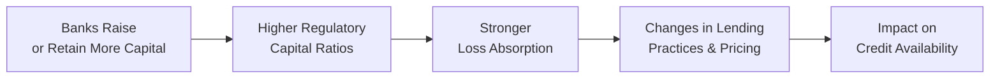

## Introduction
Sometimes I think back to a friend who used to work at a mid-sized bank during the stressful days of the global financial crisis. He’d mention how the bank struggled to keep up with capital requirements outlined by regulators—this was all about meeting new rules and ensuring that if another storm came, the bank would have enough shock absorbers. That conversation always reminds me how pivotal regulatory capital requirements are and how deeply they affect lending activities. Indeed, these requirements matter, not just for your local or regional bank, but for the credit markets and the broader economy as well.

In this section, we’ll tackle key concepts like the Basel Accords (Basel I, II, and III), risk-weighted assets, capital buffers, and leverage ratios, explaining how they shape banks’ behavior, the availability of credit across different sectors, and ultimately the cost of borrowing. Although it might seem a bit, well, arcane at first, regulatory capital is actually a simple idea at heart: regulators want banks to have a thick enough cushion so they don’t topple over when times get tough. Let’s walk through the main elements you should know.

## Basel Accords in a Nutshell
The Basel Accords—developed by the Basel Committee on Banking Supervision (BCBS) at the Bank for International Settlements (BIS)—are standards that determine the minimum amount of capital banks must hold in relation to the riskiness of their assets. Over the years, we’ve seen multiple iterations:

• Basel I (1988): Focused largely on credit risk and introduced the idea of risk weighting for different asset classes.  
• Basel II (2004): Expanded on Basel I with more refined risk-weighted asset (RWA) calculations and introduced operational risk standards.  
• Basel III (post-2008 crisis): Enhanced the quality and level of core capital, introduced liquidity coverage ratios, and introduced a leverage ratio requirement to check excessive leverage.

Under all these frameworks, the ratio of capital to risk-weighted assets (RWA) is the bedrock measure of a bank’s capital strength. You can think of RWA as a more precise way to measure how likely (or unlikely) a given asset is to default. For instance, a government security from a highly rated sovereign typically carries a lower weight than a risky corporate loan.

### Tier 1 vs. Tier 2 Capital
These frameworks categorize capital in layers (Tier 1, Tier 2, etc.). Tier 1 capital is considered the most reliable form of capital—things like common equity and retained earnings. Tier 2 capital includes instruments like subordinated debt, which still provide some cushion but are of lesser quality relative to Tier 1. Basel III also introduced more refinement into Tier 1 by distinguishing “Common Equity Tier 1” (CET1), focusing on the purest form of equity capital.

## Risk-Weighted Assets and Sector Differentiation
Risk-weighted assets (RWA) are a key concept linking capital requirements to different types of loans and exposures. If a bank’s assets involve corporate loans, they might have higher risk weights than, say, government debt (particularly from an investment-grade sovereign). Similarly, mortgage risk weights can vary based on factors such as loan-to-value ratios, regional loan performance, and historical default rates. By adjusting risk weights, regulators can effectively encourage or discourage certain types of lending. For instance, if mortgages get favorable treatment, banks might decide, “Well, let’s increase our mortgage portfolio, because the capital consumption is lower.” They can do this while still staying within their regulatory capital ratio limits.

Banks also have the option to use standardized approaches provided by regulators (like a set table of risk weights) or internal ratings-based (IRB) approaches if they meet certain modeling requirements. The IRB approach can get extremely sophisticated, with banks building advanced models to estimate their Probability of Default (PD), Loss Given Default (LGD), and Exposure at Default (EAD).

## The Drive for Capital Buffers
One big lesson from the 2008 crisis was that banks might have sufficient capital for normal times but not necessarily for crisis times. Basel III introduced additional capital buffers:

• Capital Conservation Buffer: Requires banks to hold extra capital above the minimum requirement; if banks dip into this buffer, they face distribution constraints (like limiting dividend payments).  
• Countercyclical Buffer: This is activated during periods of excessive credit growth in a particular jurisdiction. The idea is to build surplus capital when times are good (and credit is flowing), so that banks can draw down those reserves when times get rough.

In effect, these buffers help banks avoid a pro-cyclical spiral where they have to reduce lending at the exact moment everyone else is under pressure. It’s like telling a friend, “Save some of that excitement for a rainy day,” except in a more systematic, institution-wide sense.

## Leverage Ratio Requirements
Even though the risk-weighted approach improves capital efficiency, the crisis taught us that simply weighting assets by risk might hide big vulnerabilities. Some banks took on massive leverage, particularly using off-balance-sheet vehicles, making their capital cushion not quite as sturdy as it looked under purely risk-weighted methods.

Basel III introduced a “Leverage Ratio” to limit a bank’s total exposures (both on- and off-balance-sheet) relative to Tier 1 capital. This ratio is calculated as:
  
( Tier 1 Capital ) / (Total Exposures)  

Regulations typically specify a minimum ratio—say 3% (though jurisdictions often impose higher levels if they consider it necessary). It sounds small, but it’s a blunt, backstop measure ensuring that a bank isn’t allowed to lever up indiscriminately, even if it’s gaming risk weights in creative ways.

## Impact on Credit Markets
### Lending Behavior Shifts
When capital requirements go up, banks might have to hold more equity or reduce the size of their balance sheets. It’s a bit like me deciding: “Gosh, my monthly expenses are too high. Maybe I should spend less or earn more.” Similarly, banks adjust how they lend to maintain these new ratios:

• They might restrict lending in higher-risk sectors, shifting more toward safer (low-risk weight) exposures.  
• They could raise interest rates on certain categories of loans to preserve profitability under new capital constraints.  
• They might need to raise new equity or debt if they have room on the Tier 2 side. This can be costly, so sometimes it’s easier to cut back on riskier lending.  

### Procyclicality
Capital requirements have, historically, been criticized for amplifying or reinforcing credit cycles. During booms, low default rates can reduce risk-weighted assets, making banks appear well-capitalized. This often encourages them to extend more credit. Then, as soon as a downturn hits and credit risk rises, banks see that their risk weights (or internal ratings) jump up, pushing them to rein in lending. This is known as procyclicality—banks lend more during expansions and tighten up during recessions, compounding the business cycle. Regulations (like the countercyclical buffer) aim to address this by forcing banks to build a rainy-day fund when times are good.

### A Quick Example
Let’s imagine a bank has $100 million in assets: $40 million in corporate loans with a 100% risk weight, $60 million in residential mortgages with a 50% average risk weight. The total risk-weighted assets would be:

(40 million × 1.0) + (60 million × 0.5) = $40 million + $30 million = $70 million in RWA.

If the Basel III requirement is an 8% Tier 1 capital ratio, the bank needs to hold:
0.08 × $70 million = $5.6 million in Tier 1 capital.

Now, if that corporate loan portfolio’s risk weight is raised to 120% because of a recession outlook (or because regulators tighten rules), RWA might jump to $76 million (calculation not shown in detail here, but you see the effect). The bank suddenly needs $6.08 million in Tier 1 capital. That extra $0.48 million might prompt the bank to reduce its corporate lending or perhaps raise new capital. Even a small shift can dramatically influence a bank’s decision-making regarding which sectors get more credit.

## Real-World Case Studies
• Post-2008 Credit Crunch: After the U.S. housing bubble burst, regulators worldwide toughened capital and liquidity rules. Many banks responded by scaling down lending to small businesses. This effect was particularly pronounced in Europe, which was already reeling under elevated sovereign risks around 2010–2012.  
• COVID-19 Shock: With heightened uncertainty in early 2020, some banks rapidly increased their loan loss provisions under IFRS 9 or US GAAP (CECL standard). Although loan provisioning is distinct from regulatory capital, both dynamics can combine to constrain lending. Regulators in some countries eased capital buffer requirements to keep credit flowing into the real economy.

## Potential Challenges and Best Practices
• Model Complexity: Internal ratings-based (IRB) models can get so intricate that even bank management struggles to interpret them. Simplified, robust models that pass regulatory muster can reduce the risk of big “model risk.”  
• Over-Reliance on Rating Agencies: Both standard and IRB approaches can rely on external credit ratings that sometimes fail to forecast real risk (think of AAA-rated subprime mortgage tranches prior to 2008).  
• Interaction with Accounting Standards: Under IFRS 9 or US GAAP’s “Current Expected Credit Loss (CECL)” model, banks might need to provision for expected losses earlier. Not synonymous with regulatory capital, but the interplay can cause banks to become more cautious in extending credit.  
• Cross-Border Variations: Implementation can differ across jurisdictions, leading to regulatory arbitrage. A bank in one country might hold less capital for the same type of exposure than a bank in another, spurring uneven credit conditions globally.

## Visualizing the Regulatory Capital Link to Credit Markets

The diagram above offers a simplified snapshot of how higher regulatory capital requirements can filter through from a bank’s balance sheet decisions into credit flows across the market.

## Exam Tips and Conclusion
One key exam-day strategy is to remember the relationship between capital charges and banks’ lending choices: an increase in risk weights or regulatory capital minimums often results in more expensive or less available credit to borrowers. Also keep in mind that capital buffers like the countercyclical buffer exist precisely to handle booms and busts. If you’re presented with a scenario question about how new capital rules affect bank lending—maybe it’s an item set describing a hypothetical bank’s portfolio—be prepared to walk through how the capital ratio changes and how that might influence the bank’s appetite for risk.

Overall, regulatory capital requirements are crucial for financial stability, but they come with trade-offs for lending, economic growth, and credit market liquidity. Understanding these trade-offs is vital when evaluating bonds or other fixed-income investments because bank lending heavily influences credit spreads and credit availability in the marketplace.

## References
• Bank for International Settlements (BIS). Retrieved from: https://www.bis.org  
• Hull, J. (2018). Risk Management and Financial Institutions. Wiley.  
• CFA Institute (Official Curriculum Readings, 2025 Edition)

## Test Your Knowledge: Regulatory Capital Requirements and Credit Markets



### A bank’s risk-weighted assets increase following a rating downgrade on its corporate loans. What would be the most likely consequence?
- [ ] The bank can lend freely without changing its capital levels.
- [ ] The bank is automatically exempt from minimum capital ratios.
- [x] The bank may need to raise additional capital to meet minimum ratio requirements.
- [ ] The bank’s Tier 2 capital automatically increases.

> **Explanation:** A rating downgrade typically increases the risk weights applying to corporate loans, thus increasing the bank’s RWAs. If the bank’s capital ratio dips below regulatory minima, it might have to raise fresh capital or cut back lending.

### Which of the following is NOT a primary component introduced by Basel III?  
- [ ] Higher quality Tier 1 capital requirements.  
- [ ] Introduction of global liquidity standards such as the LCR.  
- [x] Removal of all capital buffers to reduce complexity.  
- [ ] Implementation of a leverage ratio requirement.

> **Explanation:** Basel III introduced higher capital standards, liquidity coverage ratio requirements (LCR), and a leverage ratio. It did not remove capital buffers; in fact, it added new ones (capital conservation and countercyclical buffers).

### If a bank has total assets of USD 500 million, off-balance-sheet exposures of USD 50 million, and Tier 1 capital of USD 20 million, what is its leverage ratio under Basel III?  
- [ ] 2.5%  
- [x] 3.6%  
- [ ] 5.0%  
- [ ] 6.7%

> **Explanation:** Basel’s leverage ratio takes into account both on-balance-sheet and off-balance-sheet exposures. Total exposures = USD 550 million (500 + 50). The leverage ratio = Tier 1 capital / total exposures = 20 / 550 = approx. 3.64%.

### How might risk-weighted capital requirements encourage broad allocations of credit toward lower-risk assets?  
- [x] Those assets consume less capital relative to their size.  
- [ ] Regulators require banks to invest only in government securities.  
- [ ] Banks are prohibited from lending to non-investment-grade borrowers.  
- [ ] Shareholders demand more risk.

> **Explanation:** Under the risk-weighted framework, safer assets have lower capital charges, so banks have an incentive to hold them for efficiency reasons.

### One purpose of a countercyclical capital buffer is:  
- [ ] To reduce capital requirements in periods of excessive credit growth.  
- [x] To build up extra capital in good times that can be released during downturns.  
- [ ] To shield banks from foreign currency risks.  
- [ ] To remove the importance of Tier 1 capital.

> **Explanation:** Countercyclical buffers are designed to be activated during credit booms, so that when credit conditions worsen, banks have a capital cushion to fall back on.

### Which of the following best describes the “procyclicality” problem in regulatory capital?
- [ ] Bank capital goes up and down, but fails to affect lending.  
- [ ] Banks continue to loosen lending standards during recessions.  
- [ ] Higher capital requirements encourage risk-taking.  
- [x] Regulations amplify credit cycles when banks scale back lending in bad times.

> **Explanation:** Procyclicality refers to regulations that inadvertently amplify booms and busts. In downturns, capital ratios become binding, prompting banks to reduce lending when the economy is already stressed.

### Which of the following is a Tier 1 capital instrument under Basel III?  
- [x] Common equity shares.  
- [ ] Commodity-linked notes.  
- [x] Retained earnings.  
- [ ] Non-subordinated corporate bonds.

> **Explanation:** Tier 1 primarily comprises common equity, certain reserves (like retained earnings), and specific approved instruments that can absorb losses. Commodity-linked notes and corporate bonds are not typical Tier 1 instruments.

### A bank subject to standardized risk weights invests in AAA-rated government bonds assigned a 0% risk weight. How does this generally affect the bank’s capital ratio compared to investing in higher-risk corporate bonds?
- [x] It improves the bank’s capital ratio.  
- [ ] It has no effect on the capital ratio.  
- [ ] It reduces the amount of Tier 1 capital.  
- [ ] It forces the bank to abandon corporate lending.

> **Explanation:** Zero-percent risk weight means the asset does not add to RWAs, so the bank’s ratio of capital to RWAs automatically stays higher compared to investing in higher-risk corporate bonds.

### Under Basel guidelines, which statement is correct about “leverage ratio”?  
- [x] It is a non-risk-based measure intended as a backstop to risk-weighted capital requirements.  
- [ ] It replaces risk-weighted capital requirements entirely.  
- [ ] It sets a 50% minimum Tier 1 capital requirement for banks.  
- [ ] It applies only to off-balance-sheet exposures.

> **Explanation:** The leverage ratio is meant as a simple, non-risk-based measure that sits alongside risk-weighted requirements, not replacing them. It covers both on- and off-balance-sheet exposures.

### True or False: A higher capital requirement can reduce a bank’s supply of loans, potentially increasing borrowing costs for consumers.  
- [x] True  
- [ ] False  

> **Explanation:** Higher regulatory capital requirements can cause banks to lend less or at higher interest rates to maintain profitability, leading to tighter credit availability and possibly higher borrowing costs.


