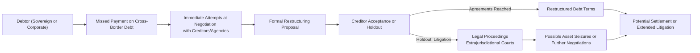
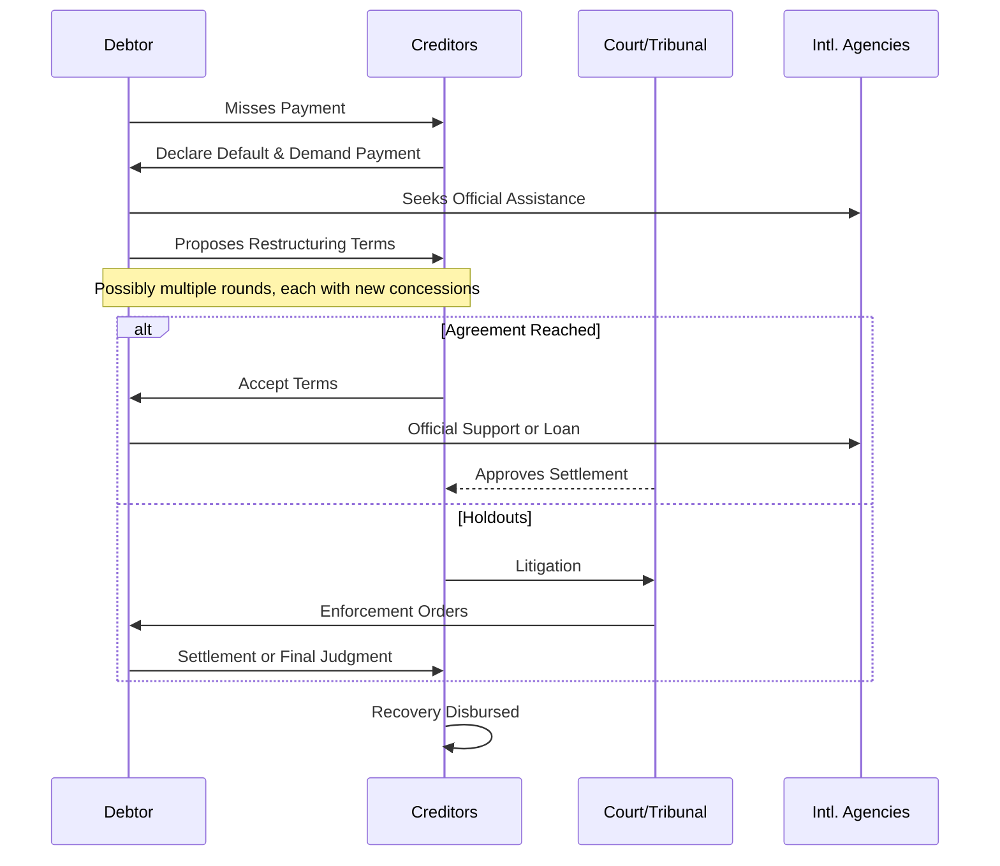

## Introduction

Cross-border defaults can feel like navigating a labyrinth—there are so many twists and turns, especially when you consider multiple jurisdictions, varying legal codes, and currency mismatches. If a borrower in one country fails to meet its obligations to creditors in another, the usual default complexities are magnified by capital controls, potential political power struggles, and even national pride. You might have heard about sovereign defaults, such as Argentina, or private sector defaults by large multinational firms. In both cases, recoveries often hinge on negotiations with international agencies (like the IMF and the World Bank) and powerful groups of public and private creditors.

This section will explore high-profile cross-border defaults to see why they can become so complicated—yet also point out patterns that might guide investors, policymakers, and potential lenders dealing with credit risk on a multinational scale.

## Cross-Border Default: Key Considerations

Before diving into the real-world examples, let’s clarify some unique issues in cross-border defaults:

• Legal Differences: Each country may have distinct bankruptcy laws, regulatory frameworks, and dispute resolution processes. A typical scenario involves assets or trading activities in one country but bondholders or loan providers scattered around the globe.  
• Currency Mismatch: Sovereign or corporate entities issuing debt in foreign currency may struggle to service obligations if their local currency weakens or if they can’t freely convert funds due to capital controls.  
• International Negotiations: Sovereign defaults often involve the “Paris Club” (official or government creditors), the “London Club” (private bank creditors), or ad hoc bondholder committees. Negotiations can become quite political, requiring complex interactions among governments, global financial institutions, and investors.  
• Capital Controls and Repatriation Risks: Governments can impose restrictions on currency flows to protect their domestic economies, especially in a crisis. This scenario places foreign creditors at risk, as repatriating investments or interest payments becomes more challenging.  
• Legal Remedies: “Holdout creditors” might pursue litigation in courts with extraterritorial reach—often in the U.S. or U.K.—to seize offshore assets or intercept payments from the debtor.

## Diagram: Cross-Border Default Process

Let’s visualize the major players and the key steps in a cross-border default scenario. Here is a simplified Mermaid diagram tracking the progression from default to potential resolution:

## Sovereign Default Case Studies

### Argentina’s Sovereign Debt Restructurings

I still remember when Argentina’s massive default in 2001 sent shock waves through global markets. At the time, some international investors I knew were stuck in the middle of negotiations that dragged on for over a decade. Argentina’s default came amid a brutal recession, rising unemployment, and a failed currency peg to the U.S. dollar. Eventually, the country unilaterally restructured its debt in 2005 and 2010, offering bondholders a significant haircut.

• Holdout Creditors: A critical sticking point was the group of holdout creditors—these were investors who refused Argentina’s restructuring terms. They went to U.S. courts (and other jurisdictions) to seek full repayment. After a long legal struggle, holdouts won significant judgments. Argentina eventually settled by paying them a higher recovery than the original terms offered to participating bondholders.  
• Collective Action Clauses (CACs): At issuance, most of Argentina’s bonds did not contain effective CACs that bind all bondholders to a restructuring if a majority agrees. This absence allowed some investors to hold out and demand better terms.  
• Legal Precedents: The Argentine case set important legal precedents, particularly regarding extraterritorial enforcement of sovereign debt claims. Some investors seized Argentine naval vessels in foreign ports, hoping to force the government’s hand.

The net effect? Well, for the majority of participating creditors, the final recovery rates varied but were generally lower than the original face value. Meanwhile, holdouts eventually got paid, albeit after a long, costly battle. This dynamic fueled debate on how to improve sovereign debt market functioning, culminating in greater use of CACs in subsequent sovereign issuances.

### Greece’s Eurozone Crisis and Restructuring

Greece was at the epicenter of the Eurozone crisis around 2011–2012. Although it wasn’t exactly a “traditional” cross-border default in the sense of dealing with multiple currencies—Greece used the euro—its debt was held by a geographically dispersed group of investors.

• Role of the EU and IMF: Greece’s crisis was managed by the “Troika”—the European Commission, the European Central Bank (ECB), and the International Monetary Fund (IMF). Greece eventually accepted a bailout package with strict austerity measures and major structural reforms.  
• CAC Implementation: Greece retroactively inserted collective action clauses into local-law bonds. With these clauses in place, a supermajority of bondholders could legally impose restructuring terms on any dissenters. In practice, that forced all investors to accept the haircut.  
• Recovery Rates: Depending on how one calculates, the average haircut for bondholders was around 53.5%, but the net present value loss was likely even higher. The strategic use of CACs prevented many holdouts from blocking the deal.  
• Political Tensions: Even though the legal approach was unorthodox (the retroactive insertion of CACs under Greek law raised eyebrows), the Eurozone community argued that this step was necessary to stave off worse turmoil. Contagion was a huge fear at the time, with concerns that Spain, Portugal, or Italy might follow.

Greece’s approach—particularly the forced participation via CACs—helped the country implement a relatively swift restructuring. The bigger losers, arguably, were private creditors who didn’t have the strong backing that official institutions typically enjoy.

## The Private Sector Angle: Multinational Corporate Defaults

Sovereign defaults often grab the headlines, but corporate defaults can be just as intricate. Large multinational corporations might have operating subsidiaries in multiple countries, each subject to different bankruptcy codes. Let’s outline some distinctive challenges:

• Multijurisdictional Claims: Assets in one country might be claimed by creditors in another, leading to parallel lawsuits.  
• Different Collateral Rules: Secured creditors in one jurisdiction might have stronger claims than unsecured creditors in another. Getting a consistent, consolidated resolution can be messy.  
• Currency and Payment Priorities: A corporate group might have U.S. dollar bonds, euro-denominated loans, and local currency debt, each subject to separate covenants and different sets of creditors.  
• Regulatory and Political Influence: In some cases, governments can prioritize local employment or strategic industries at the expense of foreign creditors.

Consider an illustrative example: A global shipping company based in Europe that finances ships with syndicated loans from Asia and issues bonds in the U.S. If global shipping rates collapse, leading to insolvency, the legal resolution might require parallel bankruptcy proceedings in the shipping company’s home country and in the jurisdictions where their vessels or key assets are located. You can imagine the potential for conflicting court orders, delays, and widely varying recovery outcomes across creditor classes.

## Recovery Outcomes and the Role of Negotiation

Now, you might be thinking: “How in the world do creditors figure out how much they’ll actually get back?” Well, the short answer is that it depends on whether you have a seat at the negotiating table, what the legal framework allows, and how large and coordinated your creditor bloc is. Generally, cross-border default recovery involves:

• Initial Moratorium or Standstill: Debtors might announce they cannot service their debts and ask for short-term relief.  
• Restructuring Proposals: The debtor (a sovereign or a corporate management team) designs terms with key creditors or advisors—such as re-profiling principal, extending maturities, or reducing coupons.  
• Creditor Classes and Voting: Under a cohesive restructuring framework, creditors vote to accept or reject the proposal. If CACs exist in sovereign debt or if there is a U.S. Chapter 11 approach for corporates, dissenters can be overruled by a supermajority.  
• Potential Litigation: If negotiations fail to bring everyone on board, holdouts might end up in extended legal battles, seeking to enforce their claims in powerful jurisdictions.  
• Settlement or Court-Ordered Distribution: Ultimately, the settlement or court outcome determines how much each creditor recovers and how quickly they see any money.

## Example Timeline

A typical cross-border default might proceed as follows—though real-world cases can go slower or faster depending on legal, economic, and political factors:

## Lessons Learned

1. Collective Action Clauses: CACs have become a key tool for preventing “holdout” dilemmas in sovereign bonds, streamlining restructurings.  
2. Jurisdictional Arbitrage: Both debtors and creditors often seek courts in jurisdictions known to favor either the enforcement of claims or the protection of distressed issuers.  
3. Political and Economic Pressures: Official agencies (IMF, World Bank) sometimes push for restructuring that ensures debt sustainability, promoting financial stability even if it means losses for certain creditors.  
4. Importance of Timing: The swifter the restructuring, the lower the overall costs—both in terms of wasted resources and the negative reputational impact.  
5. Adaptability: Unexpected events (capital controls, currency collapses) can happen quickly. Skilled financial advisors often structure cross-border debt with contingency provisions.

## Case in Point: Privately Negotiated Restructuring

A private example worth noting is when a large emerging-market conglomerate—let’s call it “GlobalTradeCo”—faced default in multiple countries where it operated shipping terminals. Instead of forcing each subsidiary into localized bankruptcy, the parent company tried to facilitate a consolidated out-of-court settlement:

• They formed a steering committee with major lenders and bondholders across various jurisdictions.  
• They reached a global settlement that included a partial asset sale, extended maturities, and an injection of new capital from a private equity fund.  
• Although some minority creditors complained, the majority recouped enough to avoid lengthy legal battles, and the company retained enough operational capacity to continue.  

Recoveries varied by creditor type, but the overall speed and final result were better than a full-blown, multi-court meltdown. This highlights how a well-coordinated global resolution can preserve value.

## Best Practices and Common Pitfalls

• Best Practices  
  – Use standardized bond indentures that include CACs.  
  – Engage legal counsel or advisors experienced in international insolvency.  
  – Build broad creditor coalitions to enhance bargaining power.  
  – Maintain transparency in financial disclosures.  

• Common Pitfalls  
  – Ignoring local legal intricacies and potential capital controls.  
  – Underestimating the speed at which a currency or economic crisis can worsen.  
  – Failing to plan for holdout behavior.  
  – Over-reliance on short-term bridging solutions that ultimately delay necessary restructurings.

## Brief Glossary

• Cross-Border Default: A default involving borrowers and creditors in different jurisdictions.  
• Holdout Creditors: Investors who refuse to agree on restructuring terms and seek full repayment, often through litigation.  
• Collective Action Clause (CAC): A contractual provision in bond documentation allowing a supermajority of bondholders to impose restructuring terms on all bondholders.  
• Capital Controls: Policies that limit currency flow in or out of a country, affecting debt repayment and investment repatriation.  

## Conclusion and Exam Tips

Cross-border defaults will likely remain a fact of life in global finance. And hey, the more interconnected our capital markets become, the trickier (and maybe more frequent) these defaults could get. One key takeaway is that recovery isn’t just determined by the debtor’s ability—or willingness—to pay. It’s also shaped by legal frameworks, political dynamics, collective action clauses, and each creditor’s willingness to engage in or resist negotiations.

For exam purposes, remember to:

• Assess how CACs might reduce holdout risk in sovereign bond restructurings.  
• Nudge your mind to recall the interplay between currency risk and capital controls.  
• Remember how official lenders like the IMF influence the negotiation process.  
• Connect real-world cases (like Argentina and Greece) to the broader theoretical frameworks of credit risk.  

It’s also a good idea to know the difference between sovereign workouts (Paris Club, London Club) and corporate bankruptcies (Chapter 11 in the U.S., administration in the U.K., etc.). Time management is crucial in exam settings; a question on cross-border defaults might contain multiple parts, from analyzing legal complexities to calculating hypothetical recovery rates.

## References, Suggested Readings, and Links

• Sturzenegger, F., & Zettelmeyer, J. (2007). Debt Defaults and Lessons from a Decade of Crises. MIT Press.  
• International Monetary Fund, official website for debt restructuring case studies and policy papers:  
  – https://www.imf.org  

• Refer to earlier chapters in this volume for discussions on yield spreads, credit analysis, and the influence of macroeconomic factors in fixed-income markets.  

## Test Your Knowledge: Cross-Border Default Recovery Concepts



### Which of the following statements best describes cross-border defaults?

- [ ] They only involve legal processes within a single jurisdiction.  
- [ ] They do not require negotiations with international entities.  
- [x] They are defaults where the borrower and creditor operate in different jurisdictions, often complicating enforcement and legal proceedings.  
- [ ] They rarely involve currency mismatches or capital controls.  

> **Explanation:** Cross-border defaults transcend one jurisdiction, often involving multiple legal frameworks, possible currency mismatches, and negotiations with international creditors or agencies.

### In Argentina’s case, what was a key factor that allowed a group of bondholders to hold out on accepting restructuring terms?

- [ ] The existence of robust Collective Action Clauses (CACs) in the majority of the bonds.  
- [x] The lack of effective CACs in many Argentine bond issues at the time.  
- [ ] IMF-imposed capital controls preventing creditor negotiation.  
- [ ] A global economy in recession.  

> **Explanation:** Argentina originally issued bonds without properly functioning CACs, which enabled some investors to reject the proposed restructuring and seek better terms in court.

### When Greece restructured its debt during the Eurozone crisis, which mechanism prevented large-scale holdout behavior?

- [ ] IMF direct guarantees.  
- [ ] Exchange rate devaluation.  
- [x] The retroactive introduction of Collective Action Clauses (CACs) into Greek law bonds.  
- [ ] Legal rulings in U.S. courts that forced creditors to accept terms.  

> **Explanation:** Greece inserted CACs retroactively, binding dissenting creditors once a supermajority agreed to restructuring terms.

### A “holdout creditor” in a cross-border default context is one who:

- [x] Refuses to accept restructuring terms and seeks full repayment through litigation or other means.  
- [ ] Considers paying off the debtor in full.  
- [ ] Accepts partial debt forgiveness to expedite the restructuring.  
- [ ] Automatically sells the debt in the secondary market.  

> **Explanation:** Holdout creditors do not agree to the majority-approved restructuring terms and generally resort to legal channels to enforce claims.

### Which of the following factors is most commonly associated with complicating cross-border private sector defaults?

- [x] Multijurisdictional bankruptcy and varying creditor rights.  
- [ ] Extremely high sovereign credit ratings.  
- [x] Conflicting collateral claims in different jurisdictions.  
- [ ] The complete absence of negotiation among creditors.  

> **Explanation:** Multinational corporations often have operations and assets spread across countries, creating conflicting claims and parallel legal proceedings. Collateral rights also differ widely by jurisdiction.

### Which entity primarily represents official (government-to-government) creditors in a sovereign restructuring process?

- [x] The Paris Club.  
- [ ] The London Club.  
- [ ] The ECB.  
- [ ] The World Bank.  

> **Explanation:** The Paris Club is an informal group of official creditors who coordinate negotiations with countries facing payment difficulties.

### In cross-border defaults, “capital controls” primarily affect:

- [ ] The credibility of local rating agencies.  
- [x] The ability to repatriate funds or convert local currency into foreign currency for debt service.  
- [ ] The redemption features of domestic bonds.  
- [x] The process of bringing local law claims.  

> **Explanation:** Capital controls are government-imposed restrictions that limit the flow of money in and out of the country, complicating payouts to foreign creditors.

### The main purpose of Collective Action Clauses (CACs) in sovereign bond contracts is to:

- [ ] Force all creditors to accept any proposal by the debtor.  
- [ ] Ensure that no bond restructuring ever occurs.  
- [x] Allow a supermajority of bondholders to agree on restructuring terms that then bind all bondholders.  
- [ ] Eliminate the possibility of default altogether.  

> **Explanation:** CACs are designed to facilitate an orderly restructuring by preventing a small group of bondholders from disrupting a deal accepted by the majority.

### In the context of a large multinational corporate default, which of the following strategies can help streamline restructuring?

- [x] Establishing a single steering committee for all major creditors.  
- [ ] Relying on government bailouts only.  
- [ ] Issuing new equity to only one creditor group.  
- [ ] Immediately liquidating all local subsidiaries.  

> **Explanation:** A unified steering committee with major creditors can help reach a consensus, avoid conflicting claims in different jurisdictions, and speed up negotiations.

### True or False: The International Monetary Fund (IMF) generally has no role in cross-border sovereign defaults.

- [ ] True  
- [x] False  

> **Explanation:** The IMF often plays a significant role in sovereign debt restructurings, offering financial assistance and policy guidance to countries in distress, which shapes both negotiation processes and outcomes.


