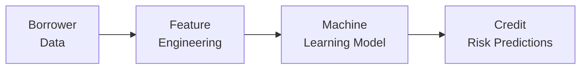

## Introduction

AI-driven credit risk modeling is quickly transforming how lenders evaluate potential borrowers and manage risk in their fixed-income portfolios. In traditional credit assessments, analysts rely heavily on historical financials, credit scores, and underwriting standards that have been around for decades. These older approaches often exclude individuals or businesses without established credit histories, which can stifle financial inclusion. Machine learning (ML), combined with fresh streams of alternative data—like social media sentiment, transactional activity, and even satellite imagery—offers avenues to address some of these limitations.

This enhanced data-driven process has created new possibilities: greater precision in detecting early warning signals, faster response times, and a more holistic view of the borrower’s capacity to repay. However, it also raises essential issues around data privacy, fairness, and interpretability. “Sure, it’s all shiny and new,” as one of my colleagues likes to say, “but how do we ensure these models don’t inadvertently discriminate or crash the moment there’s a market upheaval?” 

Let’s explore how ML models are built and maintained, how alternative data is reshaping credit assessments, and how risk managers can keep up with rapidly changing conditions.

## Machine Learning Foundations for Credit Risk

Machine Learning (ML): Algorithms that identify patterns and predict outcomes from data without being explicitly programmed to follow traditional rule-based logic. In the credit risk context, ML can quickly process massive quantities of both structured (like financial statements) and unstructured data (like social media sentiment).

Some widely used ML algorithms include:

• Logistic Regression (with advanced regularization).  
• Random Forests and Gradient Boosting Machines.  
• Neural Networks (deep learning).  

These models learn from historical credit outcomes—such as who defaulted or who paid on time—and then use these “lessons” to predict future defaults. The continuous self-learning feature helps maintain a model’s relevance, but it also means we have to keep an eye on shifting market conditions (this is often called model drift). 

## Alternative Data: Expanding the Horizons

Alternative Data: Non-traditional sources of information (e.g., social media usage, online payments, utility bills) that help lenders fill gaps in a borrower’s credit profile.

Because of the growth of e-commerce, digital banking, and social media, enormous datasets about consumer behavior are more accessible than ever. Take a small business owner I met last year: she had a great revenue stream, but almost no credit trail because she operated primarily through online marketplaces. Traditional underwriting might have rejected her. Yet, new data—like her sales volume on e-commerce platforms, shipping data, and even local market indicators—helped reveal she was actually a reliable debtor, leading to a successful loan approval.

• Transaction Data: Mobile banking or online payment transactions can show how frequently a borrower makes payments or handles cash inflows vs. outflows.  
• Social Media: Unstructured text or sentiment analysis can uncover red flags or measure general financial stability, although it can also create privacy and compliance concerns.  
• Satellite Imagery: Especially relevant for agricultural loans, satellite data can help estimate crop yields or track environmental risks.  

While alternative data can expand credit access to the underbanked population, it also raises ethical and regulatory questions regarding how these data points are collected, stored, and used.

## Feature Engineering and Model Construction

Feature Engineering: Transforming raw data into meaningful inputs for ML models. In credit risk modeling, this might include combining a time series of a borrower’s deposit balances into rolling averages or extracting sentiment scores from online reviews.

If you’ve ever taken a big pile of raw data—like thousands of daily transaction logs—and tried to feed them directly into an ML model, you probably discovered that the model performed poorly or took forever to compute. That’s why feature engineering is critical. We reframe raw data into variables (features) that capture essential patterns, trends, and relationships.

For example:

• Payment History Features: Ratio of on-time payments vs. total payments in the past 12 months.  
• Sentiment Scores: Positive vs. negative commentary from social media sources.  
• Temporal Variables: Spikes or dips in deposit activity around certain dates or market events.  
 
However, using these features must be consistent with fair lending laws, ensuring we don’t embed protected information (e.g., gender, race, religion) or inadvertently create proxies that lead to discriminatory outcomes.

## Interpretability and Fairness

It’s one thing to build a deep neural network that accurately predicts default rates. It’s another to explain how the model arrived at a particular decision. Interpretability is vital in credit: regulators, borrowers, and risk managers all want to understand why an application was approved or declined.

Tools such as SHAP (SHapley Additive exPlanations) or LIME (Local Interpretable Model-Agnostic Explanations) are commonly used to interpret model output, highlight the most influential features, and ensure no hidden biases are creeping in. There’s a fine balance: too much complexity can hamper interpretability, while simpler models may sacrifice accuracy. 

Let’s say you discover that your AI model strongly influences decisions based on a particular zip code. Are you inadvertently discriminating based on neighborhoods historically associated with specific demographic groups? The need to root out these biases cannot be overstated.

## Continuous Monitoring and Model Drift

Model Drift: A decline in model performance as relationships within the data shift over time (e.g., changes in consumer habits or broader economic conditions).

Even the best-trained ML model from last year may become unreliable if macroeconomic factors take a dramatic turn or if consumer behaviors shift. A perfect example is how consumer spending changed so quickly during the onset of a global pandemic, when entire sectors shut down practically overnight.

Continuous monitoring means actively tracking how your model is performing in real-world applications. We watch default rates, compare predicted versus actual outcomes, and look for an uptick in false positives or false negatives. Lenders may then retrain their models on newer data, or even pivot to new features that capture changing behaviors more accurately.

## Diagram: Simplified Credit Modeling Flow

Below is a Mermaid diagram illustrating the general process flow when building and releasing an AI-driven credit risk model based on alternative data:



1. Borrower Data: Gather data from traditional (financial statements, credit bureaus) and alternative sources (mobile banking, social networks).  
2. Feature Engineering: Process raw data into structured features.  
3. ML Model Training: Use a range of ML algorithms (e.g., random forests, neural networks).  
4. Credit Risk Predictions: Monitor performance, adapt the model as data shifts.

## Regulatory and Ethical Considerations

When it comes to credit analysis, compliance with various regulations is non-negotiable. We have to be aware of data privacy rules (e.g., GDPR in the EU), consumer protection laws (e.g., Fair Credit Reporting Act in the US), and other regulations that might forbid using specific personal data. 

• Privacy: Lenders must ensure they have permission to use a borrower’s personal data and that the data are adequately protected. Using unscraped or purchased data from questionable sources can create reputational risks.  
• Bias and Discrimination: If certain features in your dataset correlate with protected characteristics such as race or gender, your model might inadvertently discriminate. Periodic fairness audits, removing sensitive attributes, and explainability tools can help mitigate these risks.  
• Data Quality: Given the large variety and complexity of alternative data, ensuring data accuracy and reliability remains an ongoing challenge.  

## Practical Example: A Python Snippet

Below is a simplified code snippet illustrating how an analyst might use Python’s scikit-learn to build a credit risk model. In practice, you’d likely have more data cleaning steps, advanced feature engineering, and hyperparameter tuning.

```python
import pandas as pd
from sklearn.model_selection import train_test_split
from sklearn.ensemble import RandomForestClassifier
from sklearn.metrics import roc_auc_score, classification_report

X = df.drop(columns=['default'])
y = df['default']

X_train, X_test, y_train, y_test = train_test_split(
    X, y, test_size=0.2, random_state=42
)

model = RandomForestClassifier(n_estimators=100, random_state=42)
model.fit(X_train, y_train)

preds = model.predict(X_test)
probs = model.predict_proba(X_test)[:,1]

auc_score = roc_auc_score(y_test, probs)
print("AUC:", auc_score)
print(classification_report(y_test, preds))
```

In a real-world environment, you’d go deeper into feature selection, cross-validation, and possibly interpretability modules like SHAP. Additionally, you’d want to track data drifts over time and retrain your model regularly, particularly if new forms of alternative data are introduced.

## Real-World Challenges and Best Practices

• Data Silos: Often, different parts of a lending institution keep data in separate systems. Merging these datasets consistently is no small feat.  
• Explainability vs. Accuracy Trade-off: More complex models can yield higher predictive power but become black boxes.  
• Model Governance: Institutions must define who is accountable for model outcomes. Regular review committees, robust documentation, and compliance checks are essential.  
• Stress Testing: Because credit cycles can be volatile, run scenario analyses (e.g., recessions, interest rate spikes) to test how robust the ML model is under adverse conditions.  

We also should highlight a personal experience: once, I collaborated on a credit scoring project for a microfinance initiative in a developing market. We utilized mobile phone data—like top-up frequency and call duration. Initially, the model was terrific at identifying promising borrowers. But a year later, usage patterns changed massively because a new telecom competitor entered the market. The model’s performance dropped abruptly, forcing us to retrain it with fresh data that accurately reflected the new competitive environment.

## The Synergy with Fixed Income Investments

In a broader fixed-income context, accurate AI-driven credit risk models enable better pricing of corporate bonds, structured products (like mortgage-backed securities), and even government debt in emerging markets. Investors who understand these AI approaches can:

• Spot early warning signals in corporate solvency or sovereign risk.  
• Allocate capital more efficiently, capturing extra spread where the market’s risk perception is outdated.  
• Align investment strategies with real-time credit developments, especially in a volatile environment.  

From an exam perspective, especially at the CFA Level I stage, keep in mind that AI-driven modeling might not replace fundamental bond analysis—such as assessing covenants or analyzing macro conditions—but it certainly complements and refines the credit assessment process.

## Strategies to Mitigate Common Pitfalls

1. Start Small and Scale: Experiment with smaller, well-structured projects to gain confidence and refine best practices in data cleaning and model validation.  
2. Regular Retraining: Implement automated processes to detect performance shifts and schedule model updates.  
3. Conduct Fairness Audits: Periodically assess whether certain groups are systematically facing higher rejection rates not justified by financial realities.  
4. Collaboration with Regulators: Maintain open lines of communication with regulators to ensure compliance and to stay informed about evolving guidelines on AI and big data use.  

## Conclusion

AI-driven credit risk modeling and alternative data analysis represent a step change in how the financial industry assesses borrower viability. More granular insights, real-time updates, and the inclusion of previously marginalized borrowers are just a few of the benefits. Of course, it comes with a heavy burden to maintain ethical, fair, and transparent practices. After all, we’re not just dealing with numbers on a spreadsheet—we’re dealing with people’s futures and livelihoods.

Staying informed, embracing best practices in model governance, and remaining flexible to new technologies will help both lenders and investors harness these evolving tools effectively and responsibly.

## References and Further Reading

• Busch, C., & Milovic, N. (2020). The Rise of AI in Credit Scoring. Journal of Risk Analytics.  
• Innovation in Retail Banking: World Bank reports on digital credit. https://www.worldbank.org  
• SHAP Explainer Documentation: https://github.com/slundberg/shap  
• LIME Documentation: https://github.com/marcotcr/lime  

---

## Test Your Knowledge: AI-Driven Credit Risk and Alternative Data Quiz



### Prediction Accuracy and Model Drift

- [ ] Models do not degrade over time if trained on sufficiently large data.  
- [x] Continuous monitoring and periodic retraining help diminish the effects of model drift.  
- [ ] Model drift is a problem only for neural networks.  
- [ ] Random Forest models are immune to data shifts.  

> **Explanation:** Regardless of model type, changes in data distribution can degrade performance. Continuous monitoring and periodic retraining mitigate this issue.

### Use of Alternative Data in Credit Scoring

- [ ] Alternative data is typically more regulated than traditional data.  
- [x] Alternative data can help underbanked populations access credit.  
- [ ] Only public institutions can use alternative data; private lenders cannot.  
- [ ] Alternative data is inherently unbiased.  

> **Explanation:** Alternative data often helps borrowers without traditional credit history. However, it raises regulatory and ethical issues, and it can be biased if not used carefully.

### Feature Engineering Concepts

- [x] Feature engineering transforms raw data into meaningful model inputs.  
- [x] Pay frequency, payment history, and sentiment scores can be features.  
- [ ] Feature engineering is unnecessary if the dataset is large.  
- [ ] Feature engineering violates IFRS standards.  

> **Explanation:** Feature engineering is a key step in building accurate models. It is not prohibited by accounting standards; it is simply the act of refining input variables for predictive modeling.

### Interpretability Tools

- [x] SHAP and LIME are used to explain black-box model predictions.  
- [ ] Interpretability is irrelevant in consumer credit decisions.  
- [ ] Tools like SHAP hide bias.  
- [ ] The main use of LIME is to reduce data volume.  

> **Explanation:** SHAP and LIME help stakeholders understand prediction reasoning, which is vital in credit decisions where fairness and transparency matter.

### Bias in Credit Risk Models

- [x] Models can inadvertently learn from biased historical data.  
- [ ] Bias is eliminated if the model uses random forest.  
- [x] Regular fairness audits help identify and mitigate discrimination.  
- [ ] Using protected attributes improves model fairness.  

> **Explanation:** Bias can creep into any ML algorithm if the underlying data reflect historical disparities. Removing protected attributes and auditing models can help mitigate discrimination.

### Model Governance

- [x] Defined accountabilities and regular review committees are essential.  
- [ ] Governance refers solely to user interface design.  
- [ ] Model governance is optional for AI-based models.  
- [ ] Only the IT department is responsible for governance.  

> **Explanation:** Effective model governance includes accountability, compliance reviews, and cross-functional oversight beyond just information technology.

### AI and Fixed Income Analysis

- [x] AI-driven credit modeling helps refine corporate bond pricing.  
- [ ] AI is only suitable for equity analysis.  
- [x] Early warning signals inform bond portfolio strategies.  
- [ ] Fixed-income investors never use alternative data.  

> **Explanation:** In fixed-income portfolios, accurate credit assessments help investors detect early warning signs and appropriately price risk, thereby enhancing returns and mitigating defaults.

### Ethical Considerations

- [x] Data privacy and discrimination are significant concerns in AI-driven credit analysis.  
- [ ] Ethical compliance is optional for microfinance institutions.  
- [ ] Using personal social media data is universally permitted without consent.  
- [ ] Regulatory bodies have no stance on credit fairness.  

> **Explanation:** Regulators and institutions emphasize consumer protection, requiring adherence to data privacy, fair lending, and other ethical guidelines.

### Retaining Model Transparency

- [x] Institutions may use simpler models or post-hoc explainability techniques.  
- [ ] Transparency is completely incompatible with AI.  
- [ ] Regulators have banned neural networks in credit scoring.  
- [ ] Only unsupervised learning models can be transparent.  

> **Explanation:** Firms can use model-agnostic explainability methods or simpler algorithms to ensure they understand how credit decisions are made.

### True or False: Stress Testing in AI-Driven Models

- [x] True  
- [ ] False  

> **Explanation:** Scenario analyses and stress tests remain critical for AI-driven models, ensuring that they maintain robust performance under extreme market conditions.


