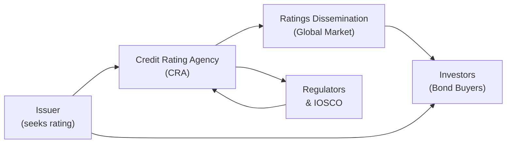

## Introduction and Context

Have you ever been in one of those group projects where two of your teammates are totally on board with each other, but a third one marches to a completely different beat? Maybe it was fine when deadlines were lax and the stakes weren’t too high, but when things got stressful—final exams, for instance—everyone realized that disjointed approaches made everything feel more chaotic. Well, rating agencies in a global crisis can be a bit like that. Each agency might have its own methodology and approach, but everyone else in the market—investors, issuers, and regulators—feels the impact when they’re all out of sync.

Credit rating agencies (CRAs) are essential gatekeepers in the fixed-income markets, particularly during times of economic turbulence. Their ratings can shape the cost of borrowing for issuers and the risk premium demanded by investors. But, ironically, the very times when clarity matters most—say, a global financial crisis—are also when agencies can exhibit significant differences in the timing and application of rating downgrades or outlook adjustments.

When the world collectively grapples with a crisis (think back to the Global Financial Crisis of 2008 or the sovereign debt distress in Europe in the early 2010s), inconsistent rating actions can exacerbate volatility in bond markets. Investors often second-guess credit quality, regulators worry about contagion risk, and issuers might exploit “ratings shopping” to secure more favorable terms. In this section, we’ll discuss how some agencies try to harmonize their rating actions (or at least coordinate them better) and the challenges that remain in forging consensus among organizations that also happen to be each other’s competitors.

## Historical Perspective on Rating Agency Coordination

Before we dive too deep, let’s look back. During the financial crisis of 2007–2008, major credit rating agencies such as Moody’s, Standard & Poor’s (S&P), and Fitch came under fire for their slow response to deteriorating conditions in structured products (like subprime mortgage-backed securities). There was a moment, as many market participants recall, when one agency significantly downgraded a tranche of a mortgage pool, and the other agencies held off a bit longer. Investors panicked, uncertain which agency to trust, and that contributed to a domino effect of fear—well, that’s how it felt to many of us in the markets at the time.

It wasn’t so much that agencies intentionally contradicted each other (at least not usually), but they had different models, metrics, and risk appetites. Also, any time a rating was dramatically downgraded, it could have triggered forced selling by institutional investors who were contractually bound to hold only “investment-grade” securities. So, agencies faced pressure to avoid sudden or abrupt changes. This tension didn’t play out in a vacuum—markets, governments, and global regulatory bodies paid attention. Ultimately, it led to calls for better alignment, or at least a higher level of transparency, across agencies.

## Why Inconsistent Ratings Harm Markets

To appreciate the gravity of the coordination problem, let’s outline the tangible repercussions of inconsistent ratings:

• Elevated Market Uncertainty: Conflicting views among rating agencies can generate confusion. When Agency A says an issuer is a near-default risk while Agency B believes it’s still stable, bond yield spreads can widen dramatically.  
• Increased Cost of Capital: Uncertainty that arises from unclear or divergent ratings can drive up the cost of capital for issuers, especially if multiple agencies are adopting a “wait and see” approach. This can be the nail in the coffin for overly leveraged borrowers.  
• Regulatory Complications: Many regulatory frameworks, such as bank capital requirements or mutual fund investment guidelines, hinge on credit ratings. Inconsistent ratings create a mismatch in how these regulations are applied.  
• Rating Shopping Incentives: Issuers might be tempted to solicit ratings only from agencies that they believe will give them the “best” rating. This undermines the entire premise of objective credit analysis.  

## Role of IOSCO in Encouraging Harmonization

When you have multiple players rushing around, sometimes you need a referee. For the credit rating industry, the International Organization of Securities Commissions (IOSCO) plays that role to an extent. IOSCO isn’t a regulator in the same sense as the SEC (in the United States) or ESMA (in Europe), but it does set global standards for securities markets. Its principles for credit rating agencies aim to:

• Maximize transparency in how ratings are determined.  
• Avoid conflicts of interest (for instance, the agency is paid by the same issuer it rates, a well-known structural issue).  
• Promote a level of consistency in the rating process without imposing a “one-size-fits-all” model.  

If you check out IOSCO’s website, you’ll see guidelines for how CRAs should disclose their methodologies, especially in times of heightened stress or crisis. The idea is not to hamper agencies’ independence (competition is good, right?) but to mitigate the confusion that arises from drastically different rating criteria.

Let’s visualize the relationships among issuers, rating agencies, and regulators in a simplified flow diagram.



In the figure above, the issuer obtains a rating from the agency, which is then published to the market. Investors make decisions based on that rating, while regulators and IOSCO monitor rating agency performance and methodology. Notice how lines run both ways between rating agencies and regulators/IOSCO—indicating ongoing feedback, guidelines, and oversight.

## Stress Test Assumptions and Crisis Methodologies

One area that causes headaches for many market participants during a crisis is the variation in how rating agencies incorporate stress test assumptions. Picture a scenario where Agency A modifies its forecast for GDP growth in a crisis from +2% to -3%, while Agency B modifies it only to 0%. If the rest of the rating methodology remains stable, the difference in macroeconomic assumptions can send their final credit ratings in starkly different directions.

Some regulators have pushed for greater transparency in these assumptions. The rationale is that if each agency is up-front about the macroeconomic scenarios it’s plugging into its rating models, then at least investors can see the “why” behind any divergences. It doesn’t necessarily lead to a single uniform rating, but it does help to calm the markets by showing them the logic behind the agencies’ stress case forecasting.

## Competition vs. Coordination

Now, you might be thinking, “Isn’t it contradictory to have agencies coordinate when they’re supposed to compete?” Absolutely. Each agency has carefully developed (and often proprietary) risk models, brand identity, and areas of perceived expertise. They do not want to reduce themselves to clones of one another. If every CRA had exactly the same rating scale, methodology, and triggers for upgrades or downgrades, that could limit competition—or so the argument goes.

But the push for coordination is more about making sure agencies provide consistent, transparent, and standardized disclosures on how they form their ratings, particularly under severe conditions. It aims to reduce opportunities for rating shopping or undue rating arbitrage. Agencies can—you might say—compete on their ability to interpret data and provide thoughtful analysis, but they should do so on a level playing field with consistent baseline disclosures.

## Rating Shopping and Conflicts of Interest

“Rating shopping” is a phenomenon that gained notoriety during the run-up to the Global Financial Crisis. Issuers would pay for ratings from, say, three agencies—but only publicly use the one that gave them the highest rating. This practice undermines investor confidence, because it suggests that some ratings are being “ignored” if they don’t paint a favorable picture.

Agencies, for their part, faced pressure to maintain or attract business. Back in the subprime mortgage heyday, some rating agencies worried that if they were too conservative (i.e., awarding fewer AAA designations), issuers might just go to a competitor. This dynamic gave the impression that ratings could be “gamed,” which is precisely the type of environment regulators want to avoid.

There have been attempts to fix this problem by requiring issuers to disclose all preliminary ratings, or by having third-party bodies assign agencies to rate new issues. However, these approaches are patchy across different regions. Coordination under IOSCO guidelines has helped a bit, but it remains an ongoing challenge. After all, agencies are private enterprises. They don’t operate purely out of altruism.

## Example: Sovereign Debt Crises and Agency Actions

To see how these dynamics play out in real life, consider the early 2010s European sovereign debt crisis. Some countries (like Greece or Portugal) experienced a cascade of downgrades at different times by different agencies. One agency might have updated its sovereign rating model to heavily weight fiscal deficit ratios, while another might have favored external debt metrics. The result? A difference of multiple notches in ratings, which had major implications for bond yields and the ability of those countries to roll over debt. Investors were left guessing which agency was “right” or “first.”  

The European Securities and Markets Authority (ESMA) later stepped in with stronger guidelines on sovereign rating disclosures, requiring agencies to follow stricter timetables and transparency about methodology changes. Did it solve everything overnight? Not exactly. But at least markets saw more alignment (or clarity) in the triggers that would lead to a downgrade, and that helped reduce some painful uncertainty.

## Best Practices and Ongoing Harmonization Efforts

There is no universal solution that’s going to magically make all rating agencies see eye-to-eye under crisis conditions. But here are a few best practices that have emerged:

• Transparent Stress Scenarios: Agencies publish detailed scenarios that show the macroeconomic stress levels used in their models, so the internal logic for rating changes is out in the open.  
• Regular Methodology Reviews: Agencies commit to periodic reviews of their models, possibly facilitated by external oversight. This ensures that each agency can’t simply deviate from common market assumptions without some level of scrutiny.  
• Disclosure of Rating Sensitivities: When giving a rating, agencies highlight which metrics (GDP growth, commodity prices, fiscal deficits, etc.) have the biggest impact on rating changes.  
• Coordinated Crisis Calls: In some instances, agencies hold (or are invited to hold) joint calls with regulators or government bodies to clarify how a crisis might affect sovereign or corporate ratings. They don’t necessarily unify their final rating outcomes, but at least they clarify assumptions.  

## Example Python Snippet: Basic Correlation Analysis

Sometimes, portfolio managers want to see how rating changes by different agencies correlate over time. Here’s a simple (and quite contrived) Python snippet that might be used to show correlation among rating actions from three agencies, just to illustrate how one might approach the data analytics side of this:

```python
import pandas as pd

# Let's say +1 means upgrade, -1 means downgrade, 0 means no change
data = {
    'Moody_s': [0, -1, -1, 1, 0, -1, 1],
    'S_P':     [0, -1, 0,  1, 0, -1, 1],
    'Fitch':   [0,  0,  -1, 1, 0, -1, 1]
}

df_ratings = pd.DataFrame(data)

correlation_matrix = df_ratings.corr()
print(correlation_matrix)
```

In practice, actual rating data is more complex: agencies might move from A to A- or B+ to B, and you’d want a numerical mapping. Still, the snippet highlights how one might quickly check if rating agency actions are moving in tandem or diverging significantly.

## Challenges Ahead

• Independence vs. Coordination: Balancing the independence of rating agencies with the need for a more unified front in crises remains a delicate endeavor.  
• Regulatory Divergences: Different countries have their own reporting and disclosure rules. Harmonization on a global scale is tricky.  
• Proprietary Models: Deep inside each agency’s “black box” are sensitive parameters that they may be reluctant to make fully transparent.  
• Continuous Market Evolution: With new asset classes like green bonds and sustainability-linked instruments, agencies constantly refine their approaches, creating more potential for differences in rating outcomes.  

## Practical Exam Tips for CFA Candidates

From a CFA Level III (capstone) perspective, it’s useful to remember that credit rating changes can directly affect bond pricing, portfolio risk profiles, and regulatory capital requirements. This is important both for portfolio managers and risk managers:

• Be prepared to evaluate the constraints that arise when rating downgrades force liquidations in a portfolio with contractual mandates.  
• Understand how to interpret divergences in rating signals and perform your own credit analysis, rather than relying solely on any one agency.  
• Recognize the broader long-term strategy: Are you immunizing your portfolio against a possible “rating cliff”? Or are you seeking incremental yield that might come with a higher risk of downgrade in a crisis?  
• In exam scenarios, you might be asked to comment on how conflicting ratings affect your recommended strategy for, say, a fixed-income portfolio. Demonstrate awareness of how rating agencies operate, while highlighting your own due diligence steps to mitigate risk.  

## Conclusion

Global crises test everyone’s patience—investors, issuers, and rating agencies alike. The question remains: how can we ensure these credit rating agencies provide consistent, transparent insights without stifling healthy competition or ignoring the natural differences in their analytical models? IOSCO guidelines provide a partial path toward harmonization, but there’s certainly more work to be done. Competition among agencies is here to stay, so we probably won’t see a monolithic “master rating” system soon. But pushing for clarity in stress test assumptions, methodology changes, and rating triggers can help investors navigate chaotic markets without the added confusion of contradictory signals.

With that said, let’s remember that credit ratings are only one piece of the puzzle. A prudent investor or portfolio manager will combine credit rating insights with fundamental analysis, market sentiment, and other risk measures. That multi-layer perspective becomes especially crucial during unprecedented crises. After all, when the stakes are high, you really don’t want to be the person in the group project who shows up with a totally different plan at the last minute—particularly if everyone’s final grade is on the line.

## References and Suggested Readings

• IOSCO Principles Regarding the Activities of Credit Rating Agencies. Retrieved from:  
  – https://www.iosco.org  
• White, L. (2013). The Credit Rating Agencies. Annual Review of Financial Economics.  
• European Securities and Markets Authority (ESMA) guidelines on credit rating agencies.  
• CFA Institute Resources on Credit Risk and Analysis.

## Test Your Knowledge: Coordination Among Rating Agencies in Global Crises



### Which of the following best describes why inconsistent ratings among agencies can exacerbate market volatility?

- [ ] They encourage the use of more sophisticated fundamental analysis.
- [x] They generate confusion among investors, potentially widening yield spreads.
- [ ] They reduce rating shopping by making it harder for issuers to find the best rating.
- [ ] They primarily affect equity markets rather than fixed-income markets.

> **Explanation:** Conflicting opinions among rating agencies can create uncertainty, thereby raising risk premiums and affecting bond yield spreads.

### One key risk of inconsistent ratings is “rating shopping.” Which statement best captures the definition of rating shopping?

- [ ] It refers to agencies sharing their assumptions with regulators under crisis conditions.
- [ ] It describes investors systematically comparing ratings from different agencies before investing.
- [x] It is an issuer’s practice of soliciting ratings from multiple agencies and choosing the most favorable.
- [ ] It is the process of searching for lower-cost short-term debt facilities.

> **Explanation:** Rating shopping occurs when issuers pick and publicize the most favorable ratings among several rating agencies, undermining the overall reliability of the rating system.

### How do IOSCO guidelines aim to address concerns about rating agencies during global crises?

- [ ] By mandating a single standardized rating scale for all agencies.
- [ ] By requiring rating agencies to only adhere to government-imposed metrics.
- [x] By setting principles that enhance transparency and disclose methodology in rating processes.
- [ ] By assigning a single global rating agency to issue all sovereign debt ratings.

> **Explanation:** IOSCO’s role is to establish consistent principles and guidelines to encourage better transparency and reduce conflicts of interest, not to enforce uniform rating scales.

### During a crisis, agencies often use a “stressed methodology.” Which of the following is most accurate about this model?

- [x] It incorporates severe economic assumptions (e.g., negative GDP growth) to test resilience.
- [ ] It focuses only on historical default data and ignores current macroeconomic conditions.
- [ ] It is used solely for investment-grade issuers to maintain consistent ratings.
- [ ] It involves collaboration with the European Securities and Markets Authority (ESMA) exclusively.

> **Explanation:** Stressed methodology applies harsh economic scenarios to see how an issuer’s fundamentals hold up under adverse conditions, helping estimate default risk or rating migration.

### Which of the following is a main driver behind regulators pushing for more transparency in rating agencies’ stress test assumptions during crises?

- [x] To help markets better understand the rationale behind different rating outcomes.
- [ ] To maximize rating dispersion and foster fierce competition among agencies.
- [ ] To eliminate the need for investors to conduct independent credit analyses.
- [ ] To simplify rating transitions and avoid downgrades altogether.

> **Explanation:** Regulators want agencies to disclose their macroeconomic stress settings so that investors can see precisely why agencies might arrive at different rating decisions.

### In the context of crisis coordination among rating agencies, what does “coordination” typically mean?

- [ ] Requiring agencies to publish identical final ratings for each issuer.
- [x] Improving clarity around each agency’s methodology, not necessarily harmonizing final ratings.
- [ ] Eliminating competition by merging all rating agencies into one body.
- [ ] Allowing regulatory authorities to set the maximum rating an issuer can receive.

> **Explanation:** Coordination typically refers to standardizing disclosures, methodology transparency, and crisis response timelines, while still allowing agencies to maintain independent opinions.

### Which statement best describes the “black box” concern regarding agency methodologies?

- [x] Each agency’s internal rating model might be proprietary and nontransparent, leading to uncertainty among investors.
- [ ] Agencies outsource their ratings to third-party consultancies, rendering the original data unreliable.
- [ ] It refers to agencies using open-source software, making rating methods vulnerable to hacking.
- [ ] It describes the requirement to publicly disclose big data algorithms for rating calculations.

> **Explanation:** Many rating agencies have proprietary models with limited public disclosure, creating potential confusion and mistrust.

### What is a potential benefit of having multiple rating agencies, even if their ratings sometimes diverge?

- [ ] It assures uniform rating outcomes across all fixed-income securities.
- [x] It fosters competitive analysis and alternative viewpoints on issuer credit quality.
- [ ] It requires issuers to pay double or triple fees, reducing moral hazard.
- [ ] It forces investors to disregard the agencies, relying solely on fundamental analysis.

> **Explanation:** Multiple agencies bring different perspectives and methods, which can keep the analysis competitive and robust, providing the market with a breadth of viewpoints.

### According to the article, how do some regulators and market participants view “joint calls” or “coordinated releases” during crises?

- [ ] They see them as unnecessary because each rating agency is fully transparent already.
- [x] They find them useful for clarifying broad assumptions without stripping agencies of independence.
- [ ] They believe they eliminate the need for rating agencies altogether.
- [ ] They only support them if they result in uniform rating actions.

> **Explanation:** Joint calls can help agencies explain their assumptions to regulators and the public, offering clarity while preserving each agency’s proprietary approach.

### True or False: IOSCO mandates that all credit rating agencies assign exactly the same sovereign rating during crisis periods.

- [ ] True
- [x] False

> **Explanation:** IOSCO provides high-level principles and guidelines for transparency and conflict-of-interest mitigation but does not command identical rating outcomes.


