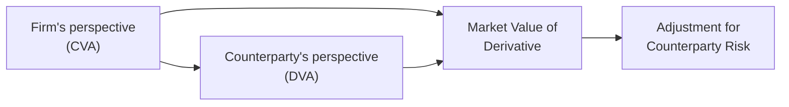

## Introduction

Let’s say you’re hanging out with a friend who works at a trading desk, and they drop this casual line: “We had to book a CVA charge that wiped out half our gains this quarter.” Um, excuse me? If you’ve ever found yourself nodding along politely, wondering what on earth a CVA (Credit Valuation Adjustment) actually is and why it matters, you’re not alone. This topic can feel super technical, but we can break it down step by step.

Credit Valuation Adjustment (CVA) and Debit Valuation Adjustment (DVA) are essential concepts in modern derivative valuation. They often come into play because no counterparty is risk-free—even a strong institution could fail under stress. So, how do we incorporate this possibility of default into the fair value of our derivative positions? That’s precisely where CVA and DVA step in.

In the sections that follow, we’ll explore:
• How CVA captures the counterparty’s default risk.  
• How DVA reflects your own default risk (and, weirdly, can increase your reported profits if your creditworthiness deteriorates).  
• Key standards from IFRS 13 and ASC 820 about fair value measurement.  
• Implementation challenges, best practices, and real-world scenarios.  

By the end, you’ll see how CVA and DVA are more than just abstract accounting terms—they’re vital for painting a realistic picture of derivative risk and exposure. Let’s dive in.

## Understanding CVA

Credit Valuation Adjustment (CVA) is essentially the discount applied to the risk-free valuation of a derivative to account for the possibility that the counterparty might default on its obligations. Imagine you have a forward contract on a commodity with Counterparty A. If Counterparty A goes belly-up, how much is your position really worth? The expected amount you lose if Counterparty A defaults is your CVA. Practically, CVA is often computed as:

(1)  
CVA ≈ Σ [ (Exposure at default) × (Probability of default) × (Loss given default) × (Discount factor) ]

• Exposure at default (EAD): The portion of the derivative’s value at a future date that is at risk.  
• Probability of default (PD): The likelihood that the counterparty defaults in that future period.  
• Loss given default (LGD): Typically 1 − Recovery rate; i.e., the fraction of exposure that goes unrecovered in a default.  
• Discount factor: Present value adjustment for the relevant time horizon.  

Of course, in real-life calculations, we have to get fancy with multi-period exposures, netting agreements, and collateral. But the heart of the matter is: if you’re expecting, say, a $2 million loss from a potential default, you reduce the clean (risk-free) derivative value by that $2 million. That’s your CVA.

### Why CVA Matters

• It’s a reflection of real credit risk. Without CVA, you’re running with blinders on, pretending the counterparty is guaranteed to pay.  
• It affects daily P&L. Firms update their valuations—thus their profits or losses—based on changes in the counterparty’s credit quality.  
• It’s required by major accounting frameworks (IFRS 13, ASC 820) to ensure fair value measurement is realistic.  

## Understanding DVA

Debit Valuation Adjustment (DVA) is like a mirror image of CVA. Instead of focusing on the counterparty’s possibility of default, DVA considers the firm’s own potential default. A bond issuer might incorporate DVA to reflect a credit spread that changes the market value of its liabilities. In the world of derivatives, DVA is the adjustment applied to the fair value of the firm’s own derivative liabilities to reflect the chance that the firm itself might not make good on those positions.

### The Slight Oddity of “Profiting” from Deterioration

One of the most intriguing (and occasionally controversial) aspects of DVA is that if your firm’s creditworthiness declines—meaning your default risk is up—there’s a corresponding increase in DVA. This can show up as a gain on your income statement (because your liabilities are now seen to be “less expensive” to settle). On one hand, it’s purely an accounting convention matching market pricing logic; on the other hand, it can create some head-scratching moments when your earnings jump precisely because your credit risk soared.

## Bilateral CVA

In many real-world derivative contracts, each side has some chance of defaulting. Bilateral CVA is the integrated measure that simultaneously reflects both your counterparty’s credit risk (CVA) and your own credit risk (DVA). This can get complicated quickly:

• Netting Sets: Most derivatives are traded under master netting agreements. You can net multiple derivative exposures to reduce credit risk, which lowers CVA.  
• Collateral Agreements (CSA): Collateral postings significantly reduce credit risk—and the associated credit valuation adjustments.  
• Changes over Time: The fair prices for CVA and DVA evolve with the credit spreads of each party and the underlying exposures.

Bilateral CVA can be expressed roughly as:

(2)  
Bilateral_CVA = CVA - DVA

However, the exact calculation involves dynamic modeling of each side’s exposure and default probabilities.  

Below is a simple visual reminder that CVA and DVA effectively converge when both parties consider each other’s risk:

Here, the CVA lowers the derivative’s value to reflect the risk that the counterparty fails, while the DVA (from the perspective of the counterparty) lowers their liability as your default risk is considered.

## Key Accounting Standards

Both IFRS 13 (Fair Value Measurement) and ASC 820 (Fair Value Measurement under US GAAP) require that fair value incorporates risk factors, including credit risk. The idea is: an asset’s or liability’s fair value in an orderly transaction between market participants should consider the possibility that one or both parties might not perform fully.

### IFRS 13

Under IFRS 13, entities must measure the fair value of assets or liabilities using market participant assumptions. This includes factoring in:

• Counterparty risk for asset positions.  
• Own credit risk for liability positions.  
• Net exposures if a legally enforceable right to offset exists.  

IFRS 13 emphasizes “exit price” notion, so the discount for credit risk should match what a market participant would demand.

### ASC 820

ASC 820 in US GAAP follows very similar principles. Both IFRS 13 and ASC 820 highlight that credit risk is not something that can be simply ignored or treated separately—it’s integrated into the fair value.

### Reporting Volatility

Because credit spreads can swing widely in turbulent markets, CVA and DVA adjustments can introduce maddening volatility into reported earnings. Some firms opt to record these changes in Other Comprehensive Income (OCI) (subject to accounting rules) to reduce P&L volatility, but the bigger picture is that both IFRS and US GAAP emphasize the transparency of including these adjustments front-and-center in valuation.

## Real-World Examples

Consider how major banks navigated CVA back in the Global Financial Crisis (2008–2009). Collateral agreements were often insufficient or loosely enforced, so the potential exposure to a big default became a major worry. Suddenly, spectrums of huge CVA charges started popping up on income statements, and some banks even recognized DVA gains when their own credit spreads widened.

In more recent times, strong collateralization practices under ISDA Master Agreements have reduced net CVA amounts. But big market dislocations, such as the Eurozone debt crisis or sudden collapses of certain financial institutions, can cause credit spreads to blow out, spiking CVA charges almost overnight.

## Best Practices and Pitfalls

Even if the formal definitions make sense, the real test is how you implement CVA/DVA in practice. Here are some best practices (and pitfalls to dodge):

• Robust Counterparty Monitoring: Track credit spreads of counterparties daily. A sudden downgrade can dramatically increase CVA if your open derivatives have large positive exposure.  
• Consistent Model Approaches: Use the same underlying assumptions and interest rate curves for CVA that you use for the base valuation. Discrepancies produce weird mismatches in P&L.  
• Collateral Agreements: If you’re not updating your collateral calls regularly, you might be missing out on offsetting big chunks of CVA.  
• Watch for “Jump-to-Default” Risk: In stress scenarios, the probability of default can suddenly spike from near-zero to imminent. Scenario analysis and stress testing help you see the tail outcomes.  
• Accounting Classification: Under IFRS or US GAAP, ensure that changes in CVA/DVA are accounted for either through the income statement or OCI in a consistent manner.  

## Conclusion: Integrating CVA and DVA in Risk Management

Let’s face it: ignoring credit risk is like ignoring a leaky roof. Sure, it might not be raining now, but eventually that creeping water damage could cause a disaster. CVA and DVA help you see the real value of your derivatives, factoring in the risk that either you or your counterparty can fail to deliver. Yes, it can feel a little bizarre that an accounting gain can arise from your own credit risk going up (via DVA), but that’s the logic of market-based pricing.

Ultimately, these concepts push everyone to manage credit risk more actively—through collateral, netting, careful modeling, and robust monitoring. That’s a good thing for the stability of financial markets overall.

## Final Exam Tips

• Integrate conceptual knowledge with data-driven situations. A typical exam question might give you the notional value of a swap, the credit spreads of you and your counterparty, and ask you to quantify or explain CVA or DVA impacts.  
• Understand netting sets. Recognize how netting changes the overall exposure, as well as how it affects CVA.  
• Distinguish the effect of IFRS 13 vs. ASC 820. Their fundamental principles are similar, but watch for nuances in how valuations flow through the income statement vs. other comprehensive income.  
• Keep the bigger picture in mind. CVA, DVA, and other XVA adjustments (like FVA: Funding Valuation Adjustment) can drastically change measured derivative exposures and your firm’s risk, especially during stress events.  
• Practice stress testing. If the exam scenario hints at a potential credit downgrade for a counterparty, consider how that translates into your CVA figure.  

Staying updated on best practices, nuances in accounting standards, and reallife examples is the best way to master these topics and excel in exam questions that incorporate CVA, DVA, and fair value measurement.

## References

• Gregory, J. (2015). The xVA Challenge: Counterparty Credit Risk, Funding, Collateral, and Capital. Wiley.  
• IFRS 13 Fair Value Measurement. Retrieved from https://www.ifrs.org  
• ASC 820 Fair Value Measurement. Retrieved from https://www.fasb.org  

---

## Test Your Knowledge: CVA, DVA, and Derivative Credit Valuation Adjustments



### A trader is calculating a Credit Valuation Adjustment (CVA) for a forward contract. Which of the following factors is NOT typically part of the CVA calculation?

- [ ] Probability of default  
- [ ] Loss given default  
- [ ] Exposure at default  
- [x] Equity risk premium  

> **Explanation:** CVA primarily focuses on counterparty default risk inputs (PD, LGD, EAD), and the time value of money. Equity risk premium is not directly part of a CVA calculation unless you are specifically integrating equity exposures in the default modeling, which is rare for a basic CVA.

### What does an increase in Debit Valuation Adjustment (DVA) indicate about a firm’s own credit risk?

- [x] The firm’s own default risk is rising.  
- [ ] The firm’s own default risk is falling.  
- [ ] The firm’s credit rating has improved.  
- [ ] There is no relationship between DVA and a firm’s credit risk.  

> **Explanation:** DVA reflects the market’s view toward the firm’s own credit risk. An increase in DVA means the market perceives a higher chance that the firm might fail to meet its obligations, so the value of its liability effectively declines from an accounting standpoint.

### Which of the following accounting standards specifically mandates the consideration of counterparty credit risk in fair value measurement?

- [x] IFRS 13 and ASC 820  
- [ ] IAS 39 and FAS 157  
- [ ] Basel II and Basel III  
- [ ] IFRS 9 and ASC 606  

> **Explanation:** IFRS 13 (Fair Value Measurement) and ASC 820 (Fair Value Measurement under US GAAP) require the incorporation of credit risk into valuations. IAS 39 is a previous standard for financial instruments, and Basel II/III are regulatory requirements, not specifically fair value standards.

### In a bilateral CVA framework, which two components are considered?

- [ ] CVA and collateral haircuts  
- [ ] Collateral calls and net stable funding ratio  
- [x] CVA and DVA  
- [ ] Potential future exposure and net present value  

> **Explanation:** Bilateral CVA considers both the counterparty’s default risk (CVA) and the firm’s own default risk (DVA). Although potential future exposure is relevant to CVA, that alone doesn’t capture the bilateral dimension.

### If a firm’s credit spread widens significantly, which of the following outcomes would be the most direct effect on the firm’s reported derivative liability?

- [x] Increase in DVA, reducing the liability on the books  
- [ ] Decrease in CVA, increasing the liability on the books  
- [ ] Stagnant CVA, no impact on liability  
- [ ] Elimination of any netting benefit  

> **Explanation:** A widening credit spread (the firm looks riskier) increases the DVA. This higher DVA reduces the measured liability from the firm’s perspective. It can produce an accounting gain, even though the firm’s financial health has actually deteriorated.

### Why do collateral agreements generally reduce CVA exposure?

- [x] Collateral posted offsets the derivative exposure, lowering the potential loss  
- [ ] Collateral posting accelerates default probabilities  
- [ ] Collateral is irrelevant to CVA calculations  
- [ ] Collateral increases the risk of a jump-to-default  

> **Explanation:** When counterparties post collateral, the amount of potential loss (EAD) if default occurs is much lower. A smaller exposure directly reduces CVA.

### Which statement best describes how CVA and DVA typically affect a firm’s P&L?

- [x] Fluctuations in CVA or DVA can create volatility in earnings  
- [ ] CVA and DVA are amortized linearly over the derivative’s life  
- [x] DVA rises when the firm’s own creditworthiness falls  
- [ ] CVA is recorded only at the inception of a derivative  

> **Explanation:** Both CVA and DVA are re-measured periodically based on market conditions, so changes can lead to earnings volatility. DVA does indeed go up if the firm’s credit quality worsens.

### An entity calculates CVA using a multi-period approach with forward-looking exposure. Why might this be more accurate than a single-period approach?

- [x] It captures how exposure changes and defaults can occur at multiple future points  
- [ ] It avoids the time value of money  
- [ ] It disregards long-term trends in credit spreads  
- [ ] It eliminates the need for discounting cash flows  

> **Explanation:** Multi-period models account for how the derivative’s exposure evolves over time. Default can happen in any future period, so capturing the changing exposure and discounting each period can yield better accuracy.

### Under IFRS 13, which concept underpins the inclusion of credit risk in fair value measurement?

- [x] Exit price notion  
- [ ] Synthetic securitization  
- [ ] Cash flow hedge accounting  
- [ ] Historical cost principle  

> **Explanation:** IFRS 13 is based on the exit price notion, where the fair value should reflect the price at which an asset or liability could be exchanged between market participants at the measurement date, including credit risk.

### True or False: DVA can lead to accounting gains when a firm’s credit quality deteriorates.

- [x] True  
- [ ] False  

> **Explanation:** This is indeed true. Though it often seems counterintuitive, if the firm’s default risk rises, the market value of its liabilities (including derivative liabilities) goes down, which can appear as a gain from an accounting perspective.


