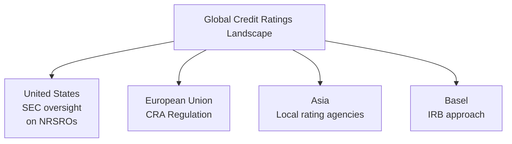

## Introduction

If you’ve ever watched international sports, you’ve probably noticed that each country has its own style of play, its own fanbase culture, and its own rules for homegrown leagues—and yet, ultimately, it’s all still soccer or basketball. This same sense of coherence yet difference exists when it comes to global regulatory regimes for credit ratings. The rules that shape how ratings are used vary widely across continents, even though the concept—assessing creditworthiness—remains essentially the same. 

We’re going to look at what drives these divergent regulations, how they shape the usage of credit ratings across major markets (e.g., the US, Europe, and Asia), and why the Basel capital requirements introduced an internal-ratings approach. We’ll see how issuers and investors navigate these differences, and learn when a single rating scale might be insufficient to capture region-specific exposures. This discussion ties into broader credit risk topics (from default probability to loss given default), so if you recall earlier sections on credit analysis (see Sections 9.1 through 9.5), you’ll recognize how rating differences can have profound practical implications on portfolio construction, capital requirements, and day-to-day risk management.

Let’s dive in.

## The Evolving Regulatory Landscape

Global capital markets grew rapidly in the last few decades, prompting regulators worldwide to implement legislation concerning how credit ratings are assigned, used, and validated. At a high level, each jurisdiction has two broad goals:

• To protect investors from overreliance on potentially flawed or biased external ratings.  
• To ensure that ratings are transparent, credible, and free from major conflicts of interest.  

However, the specific rules and approaches differ across jurisdictions. Some regulators require local rating agencies to follow strict guidelines, while others prefer to rely on market competition and let transparency requirements do the heavy lifting. Meanwhile, large, cross-border issuances can be subject to multiple sets of rules—potentially creating compliance complications.

To visualize how these major regulatory frameworks connect (or diverge), consider this flow chart:

## Europe’s CRA Regulation

In the European Union, the “CRA Regulation” (Credit Rating Agencies Regulation) was introduced to address perceived shortcomings in the rating industry after the 2008 global financial crisis. Key features include:

• Registration and Surveillance: Credit rating agencies (CRAs) must register with the European Securities and Markets Authority (ESMA) and comply with ongoing disclosure and monitoring requirements.  
• Conflict of Interest Measures: Agencies are required to have organizational structures that separate rating activities from consulting or advisory services.  
• Reduction of Mechanistic Reliance: European institutional investors are encouraged to avoid relying solely on external credit ratings when making investment decisions—this is sometimes referred to as the “no mechanistic reliance” principle.  

In my experience chatting with a friend who works at a small, regionally focused rating agency, they mentioned that ESMA’s oversight significantly boosted their credibility with European clients. However, convincing non-European investors to rely on their ratings remains an uphill battle. They often still turn to “the big three” global agencies in cross-border deals. That’s the tension: local knowledge vs. global brand recognition, shaped by regulation.

## The US Regulatory Framework and the SEC

In the United States, credit ratings are heavily influenced by rules adopted by the Securities and Exchange Commission (SEC). The SEC recognizes certain agencies as “Nationally Recognized Statistical Rating Organizations” (NRSROs)—such as Moody’s, S&P Global Ratings, and Fitch—who meet specific criteria on governance and operational practices. Key features you'd see here:

• Designation of NRSROs: Agencies can apply, and if granted, their ratings are eligible to be used for regulatory purposes (e.g., net capital requirements for broker-dealers).  
• Disclosure and Transparency: The SEC requires reports on the methodologies, revenue models, and potential conflicts of interest, including whether an agency receives fees from issuers.  
• Civil Liabilities and Legal Risks: NRSROs can face enforcement actions for misrepresentations or failing to follow stated methodologies.  

Some US regulators used to anchor bank capital requirements directly to external ratings. But in response to the global financial crisis, there has been a push—similar to Europe—to reduce “mechanistic reliance.” That’s why you’ll see more references to internal ratings-based (IRB) approaches in larger banks across the US as well.

## Asia’s Local Rating Agencies

Asia is home to several domestic credit rating agencies (e.g., China Chengxin, Dagong Global in China; Japan Credit Rating Agency in Japan; etc.). Each focuses on understanding local markets, local corporate structures, and region-specific regulations. However, these agencies often face two challenges:

• Global Acceptance: Many global investors prefer big-name rating agencies for cross-border transactions, thus overshadowing local agencies in terms of brand recognition.  
• Differences in Rating Scales: “AA” in one country might reflect a different risk profile than “AA” in another. In many Asian markets, a sovereign ceiling principle strongly influences corporate ratings, and local agencies sometimes assign a narrower range of ratings at the top end because of that local environment.  

A contact at a Singapore-based asset manager told me, “We do consult local rating agencies for color on a company’s local operations—but if we put that in an international prospectus, folks still want to see at least one rating from a recognized global brand.” This underscores a tension: local agencies add valuable insight, but they may not carry the same weight for foreign investors unless recognized by a major international regulatory framework.

## The Basel IRB Approach and the Push Against Mechanistic Reliance

Enter the Basel Committee on Banking Supervision. Basel III capital requirements introduced the Internal Ratings-Based (IRB) Approach, which allows (and sometimes requires) large banks to develop their own internal credit risk models. This approach aims to reduce the overreliance on external credit ratings by letting banks:

• Estimate Probability of Default (PD), Loss Given Default (LGD), and Exposure at Default (EAD) in-house.  
• Receive regulatory approval or “model validation” to ensure these internal models are robust.  

Why is this important? Because one of the big lessons from the crisis was that financial institutions with robust internal risk-management systems were better positioned to detect anomalies than those relying purely on credit rating agencies. The Basel Committee wants banks to do their own homework, so to speak.

Now, in practice, many banks use a hybrid approach—relying on external ratings for benchmark comparisons and on internally produced ratings for day-to-day risk management and capital calculations. And they might have to adapt or maintain multiple models to comply with each supervisory authority operating in jurisdictions where they do business.

## Compliance Complexities for Global Issuers

Imagine you’re a CFO at a multinational corporation seeking to raise debt in the US, Europe, and Asia simultaneously. You’ll need:

• An NRSRO rating in the US.  
• A registered CRA rating in Europe under ESMA’s rules.  
• Possibly a local rating in each Asian jurisdiction for local investor demand or regulatory requirements.  

That’s a lot of overhead—especially if the rating agencies might demand different data or use slightly different methodologies. On top of that, each jurisdiction has distinct disclosure requirements or ways of dealing with structured products. A single cross-border issuance could require aligning multiple sets of documentation, marketing dashboards, and investor-relations materials.

Also be mindful that in some contexts (e.g., Asia, Latin America), local rating agencies might apply a sovereign ceiling. If your country’s sovereign rating is, say, BBB+, your entity might find it impossible to secure a local rating above that level without explicit regulatory or market acceptance of an exception. But the big global agency might still give you a rating above your country’s rating if your entity is sufficiently hedged or ring-fenced from local political risk. This mismatch can confuse some investors who see different rating levels for the “same credit.”

## Single Rating Scale vs. Region-Specific Nuances

You might ask, “Why not unify the rating scales so a single ‘A’ means the same across the globe?” Well, different economies, legal architectures, and default rates for similar rating categories can vary. For instance:

• Recovery Rates: A “BBB” rating for a corporate bond in one jurisdiction might reflect a 60–70% expected recovery rate in a default scenario, while in another jurisdiction with weaker creditor protections, it might reflect a 30–40% recovery rate.  
• Legal Infrastructure: Some countries have swift, creditor-friendly bankruptcy processes; others have labyrinthine legal systems where recoveries take years.  
• Political Risk and Regulatory Environment: Ratings in emerging or frontier markets may incorporate macro-level uncertainties (e.g., currency stability, political shifts) not as pronounced in developed markets.  

Relying on one single scale can overlook these nuances, making it tricky for sophisticated investors and regulators alike. 

## Overreliance Pitfall and Integrated Analysis

A recurring theme in regulatory discourse is overreliance. “Mechanistic reliance” is basically a fancy phrase for “accepting external ratings at face value with minimal scrutiny.” Regulators are pushing institutional investors—especially banks, insurers, and pension funds—to do their own risk analysis. Here are some best practices to avoid that pitfall:

• Use Multiple Ratings: Cross-check a local rating agency’s assessment with that of a global agency.  
• Internal Credit Models: Develop robust internal models that incorporate an entity’s financials, macro factors, and scenario analyses (some of these approaches were discussed in earlier chapters, such as 9.10 on structural vs. reduced-form models).  
• Management Qualitative Assessments: Combine quant models with a thorough look at management quality, governance structures, and strategic positioning.  

I vividly recall a story from a risk officer at a mid-sized bank who said, “We got caught in 2008 trusting the AAA tranches of structured products. Now, we triple-check our internal models against external ratings. If something doesn’t match, we investigate why.” That story is a perfect illustration of how organizations have learned it’s better to treat external ratings as a helpful input, not a sole determinant.

## The Sovereign Ceiling Debate

The “sovereign ceiling” is a principle that typically states no private entity in a country can boast a higher rating than the sovereign rating of that country, unless there are exceptional factors like global operations, ring-fenced foreign assets, or explicit external guarantees. While this might sound logical (the idea being that if the government defaults, it can hamper local corporates), it can also be an oversimplification. Companies with robust international revenue streams might remain creditworthy, even if the home government faces fiscal pressure. 

Within Europe, it’s become common to see large multinational corporations rated above their national governments if they have significant operations in other regions. Meanwhile, in certain emerging markets, local rating agencies will almost never rate corporates above the sovereign without explicit conditional structures. 

## Continuous Regulatory Monitoring

If you’re dealing with global fixed-income markets, you learn pretty quickly that regulations do not stand still. The EU’s CRA Regulation can be updated by ESMA guidelines, the SEC in the US can bring forth new disclosure requirements or enforcement policies, and countries within Asia can intensify local rating requirements or open up their markets further. 

Best practices for staying ahead:

• Maintain a Regulatory Radar: Larger institutions usually have teams dedicated to monitoring regulatory proposals and changes.  
• Participate in Consultations: Global agencies like the Basel Committee often release consultative papers. Providing feedback can shape final rules in your favor.  
• Swift Implementation: Ensure that once the changes are introduced, your internal control environment can be adapted quickly—particularly if you’re a bank under both European and US oversight.  

## Case Study: A Multinational Corporate Issuer

Consider a multinational with headquarters in France, manufacturing subsidiaries in China, and major export relationships in the US. They plan a $1 billion bond issuance that will be syndicated across Europe, the US, and parts of Asia. What rating approach do they take?

1. They engage one of Europe’s big rating agencies recognized by ESMA for the European investor base.  
2. They also seek an NRSRO rating for US investors.  
3. For the Asian portion, they might consider a local rating in China to attract domestic investors familiar with local credit agencies.  
4. On top of these, their lead bank uses an internal rating system (Basel IRB) for risk weighting.  

In marketing the bond, they have to coordinate disclaimers, rating definitions, and risk factors to ensure no confusion about whether the “A” in one rating scale is meant to align with an “A” from another scale. They also must check classification differences in IFRS vs. local GAAP for their financial statements, which can shift reported leverage and coverage ratios—further influencing how rating agencies (and investors) might appraise them. 

## Practical Tips and Pitfalls

• Keep Regulatory Documents Handy: There’s no substitute for reading official regulatory guidance (e.g., ESMA guidelines, SEC bulletins).  
• Don’t Blindly Trust “AAA”: Look at the underlying methodology and see if assumptions are realistic (especially with structured products or emerging-market issues).  
• Use Internal Frameworks: In line with Basel IRB approaches, many advanced institutions have their own rating models to cross-verify.  
• Watch Out for Legal or Structural Subordination: Sometimes a corporate debt issue is structurally subordinated to other outstanding debts, which might not be fully captured in a single external rating.  
• Engage in Ongoing Education: Regulations can shift quickly (Basel IV or updates from ESMA). It’s crucial to keep training staff on new rules.  

## Summary

Global regulatory divergences in credit rating usage aren’t just bureaucratic red tape—they reveal how different markets view credit risk, investor protection, and reliance on external agencies. Whether you’re a bond issuer, an analyst, or a portfolio manager, understanding these nuances is critical for making well-informed decisions, anticipating capital requirements, and maintaining compliance in multiple jurisdictions.

By combining external ratings with internal models, carefully monitoring changes in regulation, and recognizing region-specific constraints such as the sovereign ceiling, you can build more robust credit risk strategies. Ultimately, credit ratings are just one input to your analysis. Smart due diligence—whether mandated by regulators or undertaken voluntarily—will always be your best ally.

## Glossary

• Mechanistic Reliance: Automatically tying regulatory capital or investment mandates to external ratings without further independent analysis.  
• IRB (Internal Ratings-Based) Approach: A Basel framework allowing banks to develop and use in-house credit risk models, subject to regulatory validation, to determine capital requirements.  
• CRA Regulation (EU): European Union regulatory framework that imposes registration, oversight, and conflict-of-interest management requirements for credit rating agencies.  
• Sovereign Ceiling: A principle stating that no private entity’s rating can exceed the sovereign rating of its home country unless exceptional mitigating factors apply.

## References and Suggested Readings

• European Securities and Markets Authority (ESMA):  
  – Official site: https://www.esma.europa.eu  
  – Updates: Check “Credit Rating Agencies” section for the latest guidelines.  

• Securities and Exchange Commission (SEC):  
  – “NRSRO” references: https://www.sec.gov  
  – Enforcement actions and interpretive releases.  

• Basel Committee on Banking Supervision:  
  – Framework documents on the IRB Approach, credit risk, and capital charges: https://www.bis.org/bcbs  

• Additional Resources:  
  – CFA Institute’s publication on credit rating use in portfolio management.  
  – IMF Working Papers on local rating agencies and sovereign ceilings.

## Exam Tips for CFA Candidates

• When dealing with essay questions, be sure to outline the main regulatory frameworks (EU, US, Asia) and cite key acronyms (CRA Regulation, NRSRO, IRB).  
• For item set questions focusing on rating divergences, pay attention to the economic context and whether a local rating agency might differ due to sovereign risk.  
• In scenario-based prompts, highlight the principle of “mechanistic reliance” and how a firm might mitigate it with internal models or multi-agency checks.  
• If asked to do a quick calculation (e.g., applying a rating transition matrix), be alert to any mention of local vs. global rating scale differences.  

Below is a quiz to practice your understanding of these concepts and how they might appear in CFA exam scenarios.

## Test Your Knowledge: Global Regulatory Divergences in Credit Rating Usage



### Which of the following primary goals do global regulators generally share regarding credit ratings?
- [x] Guarding against overreliance on external rating agencies and ensuring transparency
- [ ] Standardizing a single rating scale worldwide
- [ ] Introducing uniform accounting standards in every country
- [ ] Eliminating local rating agencies in favor of global agencies

> **Explanation:** Regulators focus largely on protecting investors and ensuring agencies operate with transparent methodologies, not on standardizing rating scales globally; they also recognize local agencies often provide regional insights.

### According to the Basel IRB approach, what is a key reason regulators encourage banks to develop internal credit risk models?
- [x] To reduce mechanistic reliance on external credit ratings
- [ ] To completely replace external credit ratings across all jurisdictions
- [ ] To lower compliance costs for multinational issuers
- [ ] To simplify how credit risk is calculated by all market participants

> **Explanation:** The IRB approach promotes banks’ own modeling so that they aren’t entirely dependent on external ratings when calculating capital requirements.

### Which of the following best describes the “sovereign ceiling” concept?
- [ ] Denying foreign investors the opportunity to invest in local government bonds
- [ ] A rule that prohibits non-sovereign bonds from ever scoring an “investment grade” rating
- [x] A principle stating that no private entity’s rating can exceed the sovereign rating unless extraordinary conditions are met
- [ ] A cap on the maximum yield that can be offered by privately issued bonds

> **Explanation:** The “sovereign ceiling” is the idea that a country’s sovereign rating typically sets the upper limit for domestic entity ratings, unless exceptional conditions or credit enhancements exist.

### In Europe, the CRA Regulation primarily focuses on:
- [ ] Eliminating local agencies in favor of a single unified agency
- [ ] Prohibiting credit ratings for structured products
- [x] Regulating and overseeing credit rating agencies, including conflicts of interest and transparency
- [ ] Working with the SEC to adopt a universal rating scale

> **Explanation:** The CRA Regulation aims to register and monitor CRAs, reduce conflicts of interest, and enhance transparency, not to create a single agency or scale.

### What is a major challenge for a multinational issuer seeking credit ratings in multiple jurisdictions?
- [x] Aligning various documentation and meeting different regulatory requirements
- [ ] Finding enough rating agencies willing to publish conflicting opinions
- [x] Reconciling potential differences in rating methodology and disclosure across regions
- [ ] Fully replacing local rating agencies by global ones

> **Explanation:** Global issuers must work with multiple rating agencies in different jurisdictions, each with unique requirements and approaches, creating compliance and marketing complexities.

### Why might overreliance on a single rating scale be problematic in emerging markets?
- [x] It can fail to capture unique local risk factors, such as political instability or varied recovery rates
- [ ] It guarantees a higher rating than issuers would receive from local agencies
- [ ] It provides more accurate views of recovery rates
- [ ] It automatically meets Basel III requirements on local risk modeling

> **Explanation:** Overreliance on one rating methodology can mask crucial region-specific risks like less predictable legal structures or macroeconomic stability issues.

### What is the main purpose of the “no mechanistic reliance” principle?
- [ ] To ensure banks always ignore external ratings
- [ ] To make external ratings mandatory for every debt issuance
- [ ] To allow the sovereign ceiling to apply in all scenarios
- [x] To encourage investors to conduct their own credit assessments rather than blindly follow rating agencies

> **Explanation:** Regulators are emphasizing that external ratings should be just one reference among many, not an absolute determinant.

### Which of the following is a major benefit of the IRB approach for a global bank?
- [x] The ability to use proprietary models reflecting region-specific risks
- [ ] Zero oversight from regulators in their home jurisdiction
- [ ] Guaranteed uniform capital requirements across all branches globally
- [ ] Complete exemption from disclosing credit risk factors to investors

> **Explanation:** IRB allows a sophisticated bank to tailor its capital computations to the nuanced risk factors in its portfolios, subject to regulatory validation.

### What is the primary role of the European Securities and Markets Authority (ESMA) under the CRA Regulation?
- [x] Register and supervise credit rating agencies operating in the EU
- [ ] Act as the only body allowed to issue credit ratings in Europe
- [ ] Replace bank internal models with standardized external ratings
- [ ] Promote mechanistic reliance on external ratings inside the EU

> **Explanation:** ESMA enforces registration, disclosure, and conflict-of-interest rules, ensuring CRAs adhere to EU regulations.

### True or False: The term “mechanistic reliance” refers to an investor’s thorough, independent analysis of credit risk.
- [ ] True
- [x] False

> **Explanation:** Mechanistic reliance is the opposite; it means automatically relying on external ratings without conducting one’s own additional analysis.


