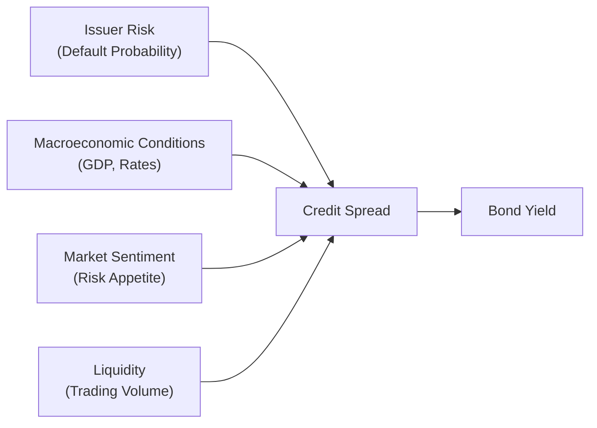

Key Concepts in Yield Spreads  
Let’s be honest: talking about yield spreads might sound intimidating at first, especially if you’re new to the world of bond markets. But it’s actually super important for anyone studying fixed income—and it’s a lot more intuitive than it seems. At its core, a yield spread tells you the difference in yields between two bonds. Typically, we compare a “credit-risky” bond to a risk-free or benchmark bond (like a U.S. Treasury or an equivalent high-quality government bond in another country). This difference, or “spread,” represents the extra compensation (“risk premium”) investors demand for taking on additional credit risk (i.e., the risk of default).  

In practical terms, if you see a corporate bond with a yield of 5.5% and the benchmark government bond yield is 3.0%, the yield spread is 2.5 percentage points, or 250 basis points. That’s the straightforward part. What’s more interesting is figuring out all the reasons why that 2.5% spread might suddenly jump to 3.5%, or collapse to 1.5%.  

Mathematically, you can express the basics of yield spreads as:

$$
\text{Spread} = y_{\text{bond}} - y_{\text{benchmark}}
$$

where \\(y_{\text{bond}}\\) is the yield of the credit-risky bond, and \\(y_{\text{benchmark}}\\) is the yield of (hopefully) a risk-free or nearly risk-free bond.  

Factors That Drive Credit Spreads  
Credit spreads aren’t random. They respond—sometimes dramatically—to various forces in the markets. You might see them narrow during times of exuberant optimism and widen whenever investors start fretting about a potential recession or a company’s shaky outlook. Let’s break down the main drivers:

• Issuer-Specific Credit Risk: If a company’s fundamentals weaken—like a sudden decrease in revenue or an unforeseen spike in debt levels—investors will demand a higher spread to compensate for an increased probability of default.  
• Macroeconomic Conditions: Ever notice how credit spreads tend to move in tandem with economic sentiment? When GDP is growing fast, unemployment is low, and corporate earnings look solid, spreads often tighten because default risk appears lower. In contrast, bleak economic forecasts, rising expected default rates, or concerns about a global slowdown often drive spreads wider.  
• Market Sentiment: This is a more subjective factor, but it’s undeniably powerful. During periods of market euphoria, investors are more willing to push into lower-rated bonds to chase higher yields, thereby compressing credit spreads. If fear sets in—like during severe downturns or after major geopolitical events—investors retreat to safer assets, and spreads widen.  
• Liquidity: Imagine you’re trying to buy or sell a bond that doesn’t trade frequently. You’d likely want an extra yield pickup (or discount in price) to compensate for the difficulty of offloading it quickly if you needed cash. This is called the liquidity premium, and it’s a vital contributor to credit spreads, especially in times of market stress.  
• Bond Features: Maturity, coupon structure, embedded options, and seniority in debt structure all play a role. Longer maturities generally carry higher spreads to account for the uncertainty over more extended periods. Subordinated bonds, lacking the seniority of other debt classes, typically require a higher spread to compensate for their lower priority in a default scenario.  

These factors interact in complex ways, making spread analysis an art as much as a science. But once you start recognizing their patterns, you’ll see that credit spreads are basically the market’s way of pricing in all these risks—plus a little bit (or sometimes a lot) of fear or greed.  

A Quick Personal Story about Credit Spreads  
I remember digging into a high-yield bond of a retail company a while back. The company was rolling out a whole new concept that was supposed to revolutionize its business model. Investors got pretty excited, and the spread on the bond tightened from around 500 basis points (bps) over Treasuries to around 350 bps in just a couple of months—an unusually swift move. Then the new concept flopped. Suddenly there was talk of huge inventory write-downs, and the spread shot up to over 700 bps in about a week. Talk about a rollercoaster. That happened because the company’s credit fundamentals drastically changed, igniting fear among bondholders.  

Spread Widening vs. Spread Tightening  
When we say a spread “widens,” it means the yield on the credit-risky bond has increased relative to the benchmark. This typically happens when the market perceives an increased probability of default or heightened uncertainty about the issuer or the economy. Widening spreads also reflect a higher premium for liquidity (if trading conditions worsen) or simply a broader flight to safer assets.  

When a spread “tightens,” it suggests declining risk premiums—usually good news for issuers, because at a narrower spread, it’ll be cheaper for them to raise debt. It’s also an encouraging sign that investor sentiment is improving, at least for that issuer or sector. Frequent communication from management, a track record of meeting projections, or even a new injection of equity capital can all push spreads tighter.  

Visualizing the Determinants  

Below is a simple Mermaid.js flowchart to illustrate how different factors converge to shape credit spreads:

From the diagram, we see that each factor—issuer-specific risk, macro conditions, market sentiment, and liquidity—feeds into the credit spread, which in turn influences the bond’s yield.  

Liquidity and Its Impact on Spreads  
Liquidity is a giant topic on its own, but here’s the gist: if you’re dealing with a corporate bond that trades by appointment only—meaning it’s rarely changing hands—you’re exposed to something called liquidity risk. You might have to accept a price discount if you need to sell fast. As a result, an investor who buys that bond from you will want a bit of extra yield pickup for taking on that illiquidity.  

In stressed markets—like, say, during the financial crisis or the early weeks of the COVID-19 pandemic—liquidity can evaporate practically overnight. When that happens, even strong companies can see their bonds’ spreads blow out because nobody wants to buy, or bids are extremely wide (meaning the price you can sell at is much lower than the current “quoted” price).  

Sector-Specific Spread Dynamics  
Not all bonds are created equal. Investment-grade bonds (those rated BBB-/Baa3 and above by rating agencies) typically carry lower credit spreads because investors expect a lower default risk. High-yield, or “junk,” bonds have higher default risk—and historically, they’ve offered correspondingly higher spreads. Meanwhile, emerging market debt can have unique drivers, like political risk and currency fluctuations, which add an extra layer of complexity.  

Investment-Grade Spreads:  
• Generally narrower.  
• Subject to interest rate fluctuations and broad economic conditions.  
• Occasionally experience big leaps during systemic crises (e.g., 2008-2009).  

High-Yield Spreads:  
• Quite volatile—can widen substantially when risk aversion spikes or when global funding conditions tighten.  
• Correlated to equity market conditions, as they’re seen as riskier instruments in the capital structure.  

Emerging Market Debt Spreads:  
• Sensitive to global risk appetite and capital flows.  
• Exposed to local currency stability and political factors.  
• Can offer attractive risk/reward but with potentially higher volatility.  

Relative Value Strategies and Fair Value Spread Analysis  
We rarely look at spreads in isolation. Instead, we compare them across similar bonds to identify which ones look “cheap” or “rich.” This process, known as relative value analysis, helps us figure out if a bond’s current spread accurately reflects its fundamentals and technicals, or if it’s mispriced.  

One approach:  
1. Evaluate a group of bonds with the same credit rating, maturity, and sector.  
2. Estimate a “fair value spread” for the group, perhaps using fundamental factors (like leverage, coverage ratios, or industry outlook) plus some technical data (like recent trades).  
3. Identify outliers—bonds trading at significantly higher or lower spreads than the group average.  

If you detect a bond with a spread that’s anomalously wide, you might suspect it’s undervalued—unless, of course, there’s a hidden reason for that wide spread (such as poor liquidity or deteriorating credit metrics that aren’t obvious in the rating). On the flip side, a bond with a super-tight spread might be overvalued, or it might just reflect the market’s confidence in that issuer’s superior financial stability.  

A Short Numeric Illustration  
Let’s say you compare two BBB-rated 5-year financial sector bonds:  

• Bond A: Offers a yield of 6.0%  
• Bond B: Offers a yield of 6.8%  

Assume the risk-free 5-year yield is 3.0%. Then:  

• Spread A = 6.0% − 3.0% = 3.0% (300 bps)  
• Spread B = 6.8% − 3.0% = 3.8% (380 bps)  

If both bonds have nearly identical credit metrics, you might question why Bond B’s spread is 80 bps higher. Perhaps Bond B trades less frequently (lower liquidity) or is from a slightly weaker issuer within the same rating. Or maybe it’s simply mispriced—and thus more attractive as a potential investment.  

Role of Market Cycles  
One of the big takeaways for portfolio managers is recognizing that spreads move in cycles corresponding to the broader economy and credit conditions. In a recessionary or tightening phase—where corporate earnings are under pressure—spreads typically widen. When the cycle turns and earnings recover, spreads usually tighten.  

This cyclical behavior is why timing matters. If a portfolio manager can identify an economic turning point early, they can position the portfolio to benefit either from expected spread widening (by underweighting credit risk or going short) or from a likely spread tightening (by overweighting credit risk).  

Technical Factors and Investor Flows  
Unlike fundamental drivers (like leverage ratios and revenue growth), technical factors can be more about the supply and demand dynamics in the market. For instance, when corporations flood the market with new bonds, it can temporarily depress prices and push spreads wider unless investor demand is strong enough to absorb the new supply. Conversely, if there’s a big wave of cash coming into bond funds, that extra demand can push spreads tighter across the board.  

Alternative Spread Measures  
Although the most common measure of spread is the “simple” difference in yields between a corporate bond and a benchmark, there are more nuanced measures:  

• Z-Spread (Zero-Volatility Spread): The constant spread that, when added to each spot rate on the Treasury curve, discounts a bond’s cash flows back to its price.  
• OAS (Option-Adjusted Spread): For bonds with embedded options (calls, puts, or convertibles), the OAS excludes the value of any embedded options, approximating the “pure” credit spread.  

These measures are especially meaningful for more complex bonds where it’s not enough to compare just a single yield number.  

Practical Example of Spread Widening in a Stress Environment  
During the 2008 financial crisis, even top-rated corporate bonds saw spreads skyrocket, partly because investors worried that more defaults would occur than historically observed. Liquidity dried up, risk appetite vanished, and huge amounts of money fled to “safe havens” like government bonds and gold. This meant that even fundamentally strong bonds had to offer higher yields to coax reluctant investors into buying. In effect, the entire set of yield spreads shifted higher, not just for weaker credits but across the entire spectrum.  

Strategic Implications  
For portfolio managers, credit spread monitoring and analysis can help identify tactical opportunities and potential pitfalls. They might choose to:  

• Overweight or underweight a specific sector or rating category depending on the economic outlook.  
• Take advantage of temporary mispricings revealed by relative value analysis.  
• Hedge broader market risk using derivatives when they expect a major shift in spread levels.  

Risk Management and Stress Testing  
Because credit spreads are so sensitive to market sentiment, it’s prudent to conduct scenario analyses or stress tests—especially in a portfolio loaded with credit-risky bonds. For instance, a manager could ask, “What happens to my portfolio if credit spreads widen by 100 bps across the board?” or “What if a recession hits and default rates rise?” This forward-looking approach helps managers gauge potential losses and cut or hedge exposures as needed.  

Anyway, stress testing might seem like a pain, but it’s absolutely crucial. You don’t want to be caught flat-footed if a relatively small credit event triggers a domino effect of spread widening.  

Exam Tips for Credit Spread Analysis  
When you see yield-spread questions on an exam or in real-life scenarios, keep in mind:  
• Identify the baseline: Which benchmark are they comparing the yield against?  
• Distinguish your spread measure: Are you dealing with a simple yield spread, a Z-spread, or an OAS?  
• Link fundamentals to technicals: Don’t forget about liquidity, market sentiment, or macro conditions.  
• Time horizon matters: The same issuer might show different spread dynamics for 1-year bonds vs. 10-year bonds.  

References, Readings, and Links  
• Fabozzi, F. J. (2012). Bond Markets, Analysis, and Strategies. Pearson.  
• CFA Institute Research Foundation (https://www.cfainstitute.org/en/research)  
• O’Kane, D. (2008). Modeling Single-Name and Multi-Name Credit Derivatives. Wiley.  

Below are a couple more suggestions if you’re craving additional reading:  
• Bloomberg’s “Guide to Credit Risk Modeling” (online articles).  
• The official CFA Institute curriculum on Fixed Income. They’ve got plenty of examples and end-of-chapter reviews.  

Test Your Knowledge: Yield Spreads and Credit Analysis



### Which of the following best describes a “yield spread”?

- [ ] The ratio of a bond’s coupon to the benchmark rate
- [x] The difference in yield between a credit-risky bond and a benchmark
- [ ] The difference between a bond’s coupon and coupon frequency
- [ ] The difference between two benchmark yields

> **Explanation:** A yield spread is the difference between the yield on a credit-risky bond and a risk-free or benchmark yield.  

### Which factor often leads to a higher credit spread?

- [ ] Low default risk
- [x] Limited liquidity
- [ ] Tight monetary policy
- [ ] Strong corporate earnings

> **Explanation:** A bond that’s hard to trade (i.e., has poor liquidity) typically offers a higher yield, thus widening its spread.  

### A widening credit spread usually indicates:

- [x] Perception of higher default risk
- [ ] Lower default risk
- [ ] Stable market sentiment
- [ ] Reduced risk premium demanded by investors

> **Explanation:** Spreads widen when the market perceives higher risk or demands increased compensation for uncertainty.  

### When a bond’s spread “tightens,” it suggests:

- [ ] Increased liquidity premium
- [ ] Rising default risk
- [x] Investors are more confident about its credit outlook
- [ ] A decline in the bond’s price

> **Explanation:** Spread tightening indicates that investors perceive less risk and demand a lower premium.  

### Which measure accounts for the value of embedded options in a bond?

- [ ] Nominal spread
- [x] Option-Adjusted Spread (OAS)
- [ ] Z-spread
- [ ] Discount factor

> **Explanation:** The OAS adjusts for the bond’s embedded options, aiming to isolate the pure credit component of the spread.  

### In fundamental relative value strategies, analysts typically:

- [x] Compare bonds with similar maturities, rating, and sector to identify mispricing
- [ ] Ignore macro trends and focus solely on micro data
- [ ] Always prefer the bond with the shortest maturity
- [ ] Use only historical default rates to gauge fair value

> **Explanation:** Relative value strategies involve comparing similar bonds to spot discrepancies in yield spreads.  

### A bond’s spread can remain wide if:

- [x] The issuer has questionable credit quality or poor liquidity
- [ ] The issuer repurchases outstanding bonds, reducing supply
- [x] Demand for the bond is strong and market sentiment is positive
- [ ] Ratings agencies confirm stable credit metrics

> **Explanation:** Even if demand is strong, a bond typically maintains a wide spread if it has fundamental credit concerns or trades illiquidly.  

### If new corporate bond issuance surges while investor demand is constant:

- [x] Spreads may widen due to increased supply
- [ ] Spreads remain unaffected by supply
- [ ] Prices are forced higher by the supply
- [ ] Yields on government bonds typically rise

> **Explanation:** Higher supply with the same demand can drive bond prices lower, pushing yields (and spreads) higher.  

### During a severe recession, credit spreads for most bonds:

- [x] Tend to widen as default risk perceptions increase
- [ ] Typically tighten as investors seek higher yields
- [ ] Remain constant due to stable rating agencies
- [ ] Are unaffected by economic cycles

> **Explanation:** In a recession, market participants are more concerned about defaults, driving spreads wider.  

### The liquidity premium in credit spreads is:

- [x] True
- [ ] False

> **Explanation:** The liquidity premium is a real component of credit spreads. Less liquid bonds require additional yield to compensate investors for higher transaction costs and difficulty exiting positions.  




