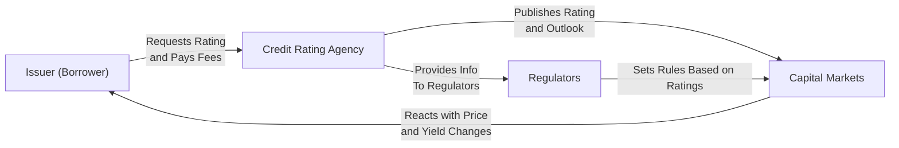

## Introduction

Credit ratings are like those quick restaurant reviews you see online—except, instead of telling you how yummy the pasta is, they suggest how likely a borrower (be it a government, corporation, or structured finance vehicle) will repay debt. Credit rating agencies (CRAs) such as Moody’s, S&P Global Ratings, and Fitch provide these insights in the form of familiar letter grades (AAA, BB, CCC, etc.). In theory, these grades summarize months (sometimes years) of painstaking investigation of the borrower’s balance sheet, strategic positioning, industry outlook, and a bunch of other factors. But ratings aren’t perfect or even absolute—they’re more like ordinal ranks telling us which borrower is likely to default before someone else, rather than a precise measure of the exact probability of default (PD).

You might have heard of rating downgrades in the news—like when a big automotive company’s rating slipped after a sales slump, or an entire country’s rating changed in response to political turmoil. These rating changes can have immediate knock-on effects on bond yields, investor sentiment, and even the cost of capital for a company or government. Let’s explore just how rating agencies come up with these grades, what data they rely on, and some of the criticisms aimed at CRAs, along with more practical considerations for day-to-day investment decisions and portfolio management.

## How Credit Rating Agencies Operate

Although each credit rating agency has its own proprietary methodology, most share a framework that combines both qualitative and quantitative analyses. “Qualitative” can mean an assessment of the borrower’s management quality, competitive position, governance structure, or even intangible factors such as brand power. “Quantitative” mostly focuses on a firm’s historical and projected financial metrics (e.g., leverage ratios, operating margins, and cash-flow coverage).

It’s somewhat like evaluating a potential roommate. You might consider their credit report (quantitative) and also chat with their previous landlord (qualitative) to see if they’ve caused chaos in the past. CRAs weigh all these hints to draw a final conclusion: the rating that you and I see as a letter. This letter rating filters into various sub-levels (e.g., “AA+” or “Aa2”), forming a finely graduated scale.

### Agency Structures and the Issuer-Pays Model

One interesting quirk of credit rating agencies is that they frequently get paid by the issuers they rate—this is known as the “issuer-pays” model. So, you can imagine, in a slightly simplified sense, a company might say to an agency, “Please rate our new bond issue,” and the agency is compensated by that same company. There’s an inherent conflict of interest there, or so the critics argue. The agencies maintain that safeguards exist to preserve analytical independence—like internal firewalls or robust governance policies. Yet the inherent tension remains a longstanding concern in both academic literature and regulatory circles.

## Qualitative vs. Quantitative Approaches

A rating committee typically dives into both qualitative and quantitative factors:

• Qualitative factors often include governance (e.g., board independence, executive oversight), the issuer’s strategic plans, industry trends, brand perception, and the stability of leadership.  
• Quantitative data get into the nitty-gritty—like debt-to-EBITDA ratios, interest coverage, free cash flows, liquidity, and trends in profit margins.

### Governance and Competitive Position

From a purely qualitative angle, CRAs might look at the firm’s leadership track record, how quickly it responds to opportunities or threats, or what new product lines it’s exploring. They also examine the competitive landscape. For instance, if you’re rating a large technology giant with a near-monopolistic position, that likely earns a favorable tilt in the rating. But if you’re rating a company fighting in a fiercely competitive commodity business with razor-thin margins, that might drag the rating down.

### Financial Ratios and Cash Flow Analysis

On the quantitative side, rating agencies love ratio analysis. They examine coverage ratios such as EBITDA/Interest Expense to see how comfortably the company can meet interest payments. They look at leverage metrics like Debt/EBITDA or Debt/Equity to understand the capital structure. Also, the agencies are keen to figure out how “free” the cash flow is—meaning what’s left after capital expenditures that can actually be used to pay down debt or cover coupon payments. The idea is to ensure that the borrower has enough financial breathing room to handle obligations, even under stress scenarios.

## Rating Symbolism: Ordinal Scales and Notching

When rating agencies talk about AAA vs. CCC, many of us interpret it as “AAA is a sure bet, whereas CCC looks shaky.” Well, yes and no. These letters indicate relative creditworthiness but not the exact probability of default. An “A” rating generally signals something like “low default risk,” while a “CCC” rating basically shouts “this might be in serious trouble.” The agencies also use “notching” to reflect differences in seniority among various debt instruments of the same issuer. For example, a company’s secured bonds might be rated a notch higher than its unsecured bonds, given the higher recoveries expected in case of default.

## Through-The-Cycle vs. Point-in-Time Ratings

Rating agencies often emphasize they rate “through the cycle,” meaning they try to factor out short-term fluctuations. A classic example might be a cyclical firm that looks terrific at the top of its cycle. If the rating were purely point-in-time, that issuer might appear squeaky clean and earn a higher rating. But a through-the-cycle approach looks at average or expected performance over an entire business cycle, potentially yielding a lower, more stable rating that avoids frequent whiplash from cyclical ups and downs. Critics, however, argue that through-the-cycle ratings are sometimes slow to catch on to sudden negative developments—like a meltdown in commodity prices or a scandal that slashes the firm’s prospects overnight.

## Criticisms and Limitations of Rating Agencies

Credit rating agencies have faced their share of fire, especially following major financial crises where certain downgrades seemed late or insufficiently proactive. Some of the main criticisms:

• Conflict of Interest: The issuer-pays model inherently poses a conflict. Even though agencies claim independence, it can create subtle pressures, especially if an agency’s revenue depends on the issuer returning for future ratings.  
• Slow Reaction Time: Through-the-cycle methods can keep ratings stable for too long, sometimes failing to reflect abrupt changes in an issuer’s credit fundamentals.  
• Model Risk: Over-reliance on historical data and rating models can lead to blind spots—especially if unprecedented events occur (e.g., global pandemic, new regulatory environment).  
• Rating Shopping: Issuers might shop around to see which CRA will assign a more favorable rating. This dynamic can erode the consistency of ratings across agencies.

I recall chatting with a friend who worked in structured finance back in 2007. He said it used to be almost a game for bankers to figure out which CRA was the easiest grader for a particular structured product. Of course, the environment has evolved with tighter regulations post-crisis, but the fundamental tension still lingers.

## Impact of Rating Changes

A rating downgrade can cause bond prices to plummet and yields to spike—lenders will want more yields if the perceived risk of default is higher. Issuers may find themselves paying more to borrow. Worse, some institutional investors are restricted by mandates (like a pension fund that can only hold investment-grade paper), so if a bond falls below BBB-, forced selling can occur, further depressing the bond’s price. 

On the flip side, an upgrade can lead to narrower spreads and a lower cost of capital—great news for the issuer and current bondholders. This is why rating agencies’ opinions hold so much clout in the market. It’s not just an academic exercise; it’s literally influencing money flows.

## Solicited vs. Unsolicited Ratings

Some ratings are done at the request (and payment) of the issuer (solicited), while others are done at the initiative of the rating agency (unsolicited). Unsolicited ratings aim to fill gaps where public interest demands an opinion, but the issuer isn’t paying. They rely on public data. Critics argue that such ratings might be less accurate if the agency doesn’t have the issuer’s non-public, in-depth financial info. Others question the motivation behind unsolicited ratings, suggesting agencies might issue them to pressure issuers into purchasing paid ratings. Like many aspects in finance, you can see the tensions swirling.

## Alternative Market-Based Signals: CDS Spreads

Market-based measures such as Credit Default Swap (CDS) spreads serve as a quasi-real-time barometer of an issuer’s credit risk. When the market grows more worried about the issuer, the CDS spread widens, often well before the rating agencies announce a downgrade. This is partially due to the agencies’ preference for stability; they tend not to swing the rating from high to low on a whim but instead weigh the evidence in committees.

There’s a well-known dynamic among analysts: “If you want a heads-up about trouble, look at the CDS spread or bond yield, not just the published rating.” That said, rating agencies can still offer valuable context and data interpretation that pure market sentiment might miss.

## Regulatory Reliance on Ratings

Financial regulations globally often incorporate or allow reliance on credit ratings. For example, the Basel accords for banks weigh capital requirements in part on the credit risk of assets, sometimes referencing external ratings. Likewise, certain insurance regulators, pension guidelines, or investment charters limit how much junk (or below investment-grade) debt those institutions can hold. This intertwining of regulation and ratings magnifies the influence of CRAs. However, it also subjects them to heavier scrutiny—policymakers want to ensure rating agencies perform their roles ethically and competently, given the systemic importance of their opinions.

## Rating Outlooks and Watchlists

Beyond the letter grade, many agencies provide an “outlook” (positive, stable, or negative) or assign a credit to a “watchlist.” These signals function as early warnings that a rating might shift soon. Typically, a negative outlook might say, “We see some storm clouds on the horizon, but not enough to downgrade yet.” A watchlist suggests an even stronger chance of a near-term upgrade or downgrade. For an investor, these additional signals can be crucial. Keeping tabs on them can help you anticipate changes before they become official rating actions.

## Practical Case Study: Downgrade of a Large Energy Firm

Let’s imagine a large global energy firm that has historically been investment-grade—say “BBB+.” The company faces a regulatory investigation for potential environmental violations, plus a sharp decline in oil prices hurting revenue. The rating agency might first flag the company’s rating outlook as negative, hinting that if the environment doesn’t improve or if the investigation’s cost is huge, a downgrade is likely. Over time, if finances deteriorate, the rating might fall to “BBB-,” inching closer to junk territory. That shift then triggers certain lenders to step back, or forces some funds to sell. The bond’s price declines, and yields rise. Meanwhile, the company is stuck paying higher interest rates for new debt, compounding the problem.

## A Quick Visual: Key Stakeholders in the Rating Process

Below is a simplified Mermaid diagram illustrating how various stakeholders interact in the rating process:

In this cycle, issuers approach CRAs to obtain a rating, the rating influences market perceptions, regulators integrate these ratings into rules, and the issuer’s cost of capital shifts accordingly.

## Conclusion and Best Practices

Credit ratings provide a quick read on credit risk, but remember: they’re relative opinions, not absolute truths. If you manage a portfolio or are analyzing a bond for your personal investments, consider layering multiple sources of information. Look at CDS spreads, read the rating agency rationale, examine the outlooks, and do your own stress tests. Don’t be lulled into a sense of complacency just because a bond has an “A” slapped on it—it might still have hidden vulnerabilities.

From an exam standpoint, focus on the mechanics of how ratings are derived, the limitations of using ratings exclusively for risk assessments, and how rating changes might have immediate impacts on bond prices and yields. Understanding the differences between through-the-cycle and point-in-time approaches, as well as the conflicts inherent in the issuer-pays model, is particularly relevant if you’re working through real-world credit evaluation or tackling exam questions that revolve around risk management and portfolio construction.

## Glossary

Credit Rating Agency (CRA):  
Organization that assesses a borrower’s ability to repay debt obligations.

Ordinal Scale:  
A rating scale that ranks credit quality without precisely quantifying default probability.

Through-the-Cycle Rating:  
A rating approach that attempts to smooth out temporary economic or issuer-specific fluctuations over a business or economic cycle.

Point-in-Time Rating:  
An approach that reflects the most immediate credit risk conditions, with fewer smoothing adjustments for cyclical factors.

Issuer-Pays Model:  
The compensation framework where the issuer of debt pays the rating agency for evaluating and rating its securities; can lead to conflict-of-interest concerns.

Notching:  
The practice of assigning different ratings for various debt tranches of one issuer, based on seniority or recovery prospects.

Credit Watch:  
A public notice that a rating may be changed in the near term (either upgraded or downgraded).

## References and Suggested Readings

• White, L. (2010). “Markets: The Credit Rating Agencies.” Journal of Economic Perspectives.  
• S&P Global. (https://www.standardandpoors.com)  
• Moody’s Investor Service. (https://www.moodys.com)  
• Fitch Ratings. (https://www.fitchratings.com)

## Final Exam Tips

• Understand the difference between a rating agency’s ordinal scale versus a precise measure of default probability.  
• Remember that the issuer-pays model may induce conflicts of interest.  
• Keep track of how rating changes can trigger forced selling or buying in regulated institutions.  
• Be familiar with how “through-the-cycle” and “point-in-time” ratings can produce different outcomes.  
• Watch for rating outlooks and watchlists—these often precede actual rating changes and can be critical in shaping your investment decision.

## Test Your Knowledge: Credit Rating Agency Methods and Limitations



### In a typical issuer-pays model, which of the following is a primary concern?

- [ ] Rating agencies may not get paid on time.
- [ ] Rating agencies have no access to the issuer’s financials.
- [ ] Investors refuse to purchase bonds from the issuer.
- [x] The model features potential conflict of interest for rating agencies.

> **Explanation:** One major criticism is that the issuer-pays model can incentivize inflated ratings or biased outcomes, because the issuer (who needs a favorable rating) is the one paying the CRA.

### Which statement best describes “through-the-cycle” ratings?

- [x] They aim to smooth out short-term fluctuations and consider trends over an entire business cycle.
- [ ] They reflect immediate or near-term credit conditions for an issuer.
- [ ] They rely only on subjective measures of credit quality.
- [ ] They are published exclusively by government agencies.

> **Explanation:** A through-the-cycle approach tries to maintain consistent ratings by looking at a firm’s performance across cyclical ups and downs, thus minimizing frequent rating changes.

### What is the primary difference between “solicited” and “unsolicited” ratings?

- [ ] Solicited ratings use public data only; unsolicited ratings use private data.
- [ ] Unsolicited ratings cost more for the issuer.
- [x] Solicited ratings require issuer cooperation and payment, while unsolicited ratings are published without the issuer’s request or fee.
- [ ] There is no real difference; they are just different terms for the same rating process.

> **Explanation:** Solicited ratings are paid for by the issuer, while unsolicited ratings may be published by CRAs independently, often without full inside information.

### Why are credit default swap (CDS) spreads considered a complementary source of credit risk information?

- [ ] They are published by rating agencies directly.
- [x] They provide a real-time market perspective on default risk that can change faster than official ratings.
- [ ] They are officially regulated measures of credit risk mandated by all central banks.
- [ ] They strictly reflect historical default data, unlike ratings.

> **Explanation:** CDS spreads react quickly to new information and can signal varying degrees of market-perceived credit risk, sometimes ahead of rating agency announcements.

### When an issuer is placed on a negative watchlist, it generally implies:

- [x] The issuer’s rating may be downgraded in the near term.
- [ ] The issuer’s rating will certainly be upgraded.
- [x] Analysts should monitor the situation closely for potential changes.
- [ ] The rating has no risk of changing for at least one year.

> **Explanation:** A negative watchlist indicates an increased likelihood of a downgrade, spurring analysts and investors to pay close attention to any fundamental changes.

### Which of the following is true of “rating shopping”?

- [x] Issuers may approach multiple agencies to secure the highest possible rating.
- [ ] Agencies select which issuers they’d like to rate, with no issuer input.
- [ ] Only governments can engage in rating shopping.
- [ ] Rating shopping is illegal in most global markets.

> **Explanation:** Rating shopping refers to the practice where issuers seek out the most favorable rating, which can undermine the objectivity of some ratings.

### How can regulatory reliance on credit ratings affect institutional investors?

- [x] It may force institutions to sell bonds that get downgraded below investment grade.
- [ ] It allows institutions to freely ignore their internal credit assessment processes.
- [x] It ensures that all bonds have the same default risk classification.
- [ ] It leads to uniform yields across all rating categories.

> **Explanation:** Banks, pension funds, and insurance companies often must dispose of securities that do not meet set regulatory or internal guidelines, which can be triggered by a downgrade.

### Which of the following best captures a limitation of through-the-cycle ratings?

- [ ] They’re updated too frequently, leading to excessive volatility in measured credit risk.
- [ ] They use only historical data and never consider forward-looking indicators.
- [x] They can be slow to reflect sudden credit deterioration in the short term.
- [ ] They apply only to structured financial instruments.

> **Explanation:** While through-the-cycle ratings reduce frequent rating changes, they may lag behind fast-moving credit events or news that significantly changes an issuer’s risk profile.

### What does “notching” refer to in credit rating methodology?

- [ ] Adjusting the rating every time the market yield moves.
- [x] Assigning different ratings for senior vs. subordinate debt of the same issuer.
- [ ] Granting partial credit for interest paid before default.
- [ ] Maintaining the same rating across all debt instruments for consistency.

> **Explanation:** Rating agencies usually notch up or down for different tranches of debt, factoring in recovery prospects if default occurs.

### An “ordinal scale” used by credit rating agencies indicates:

- [x] Ratings convey relative ranking of default risk rather than absolute probability of default.
- [ ] The ratings numerically quantify the probability of default.
- [ ] The ratings are randomly assigned based on issuer behavior.
- [ ] The ratings reflect only the regulatory capital requirements.

> **Explanation:** Credit ratings are generally considered ordinal rankings, distinguishing issuers by relative default risk rather than precisely quantifying that risk.


