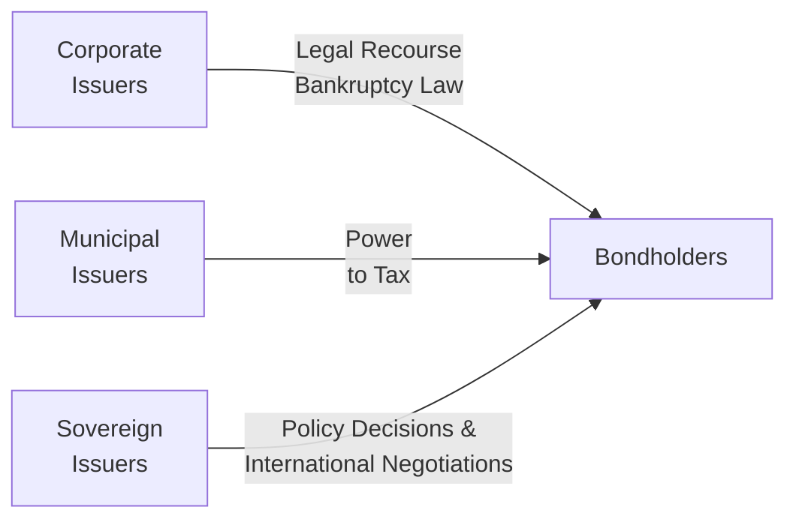

## Introduction 
Credit analysis aims to answer one big, scary question: “Will I get my money back if I lend it out?” And honestly, when I was a junior credit analyst (way back in the day), that question sometimes kept me up at night. In this section, we’re going to dive into three major areas that shape the credit world: corporate, municipal, and sovereign credit analysis. Each sector has its own set of rules, its own unique risk factors, and—if I can add a personal note—its own smartphone-buzzing headlines that can either make your day or ruin it.

The reason we look at these three areas together is that they form the foundation of fixed-income credit markets worldwide. From large multinational corporations to small local governments to entire countries, each borrower type will have distinctive drivers of creditworthiness. So, let’s explore them in detail. And hopefully, you’ll walk away with a solid understanding of how to approach each group’s credit quality in a methodical yet practical way.

## Corporate Credit Analysis 
Corporate bonds represent a vast chunk of the fixed-income universe. When analyzing corporate issuers, you’re essentially looking at the financial strength of specific companies, understanding their capacity to generate cash flows, and evaluating their strategies for long-term viability.

### Key Financial Metrics
• Operating Performance: Analysts typically start with revenue growth, operating margins, and EBITDA margins. These metrics show whether a firm has pricing power, cost controls, and stable demand for its products.  
• Leverage Ratios (e.g., Debt/EBITDA): This statistic provides a quick check on how many years of existing earnings it would take to pay off the company’s total debt. A firm with a high leverage ratio might skate on thin ice if market conditions deteriorate (think cyclical sectors like airlines or steel).  
• Coverage Ratios (e.g., EBITDA/Interest Expense): This ratio assesses a firm’s ability to meet its interest obligations from ongoing operations. It’s basically the bread-and-butter question—can the company pay its interest on time?  

### Qualitative Factors
• Industry Outlook: Are we talking about a stable industry like consumer staples or a more volatile sector such as oil exploration? We consider supply-demand dynamics, competitive pressures, and regulatory changes.  
• Management Quality: Some folks underestimate management. But from experience, a smart and ethical leadership team can be the difference between a decent credit and a default waiting to happen.  
• Covenant Analysis: Analyzing the bond indenture is crucial. These legal documents contain both affirmative and negative covenants (like limitations on additional debt or asset sales). Indicators such as restricted payments or leveraged buyout protection can tell you how much wiggle room management has.

### Example Walk-Through  
Let’s say you’re evaluating a large manufacturing company. You notice it has a Debt/EBITDA of 4.0x—a bit high compared to its industry peers who average around 2.5x. That’s a red flag. Next, you see the coverage ratio is 3.0x, meaning they earn three times their interest expense in EBITDA. That’s probably borderline acceptable, depending on the industry (for cyclical names, you might want to see at least 4.0x). Finally, you check the covenants and find a limit on additional secured debt issuance. That suggests the bondholders have some structural protection. Ultimately, you’d weigh all these factors—numerical and qualitative alike—to decide if it’s a buy, sell, or hold from a credit perspective.

## Municipal Credit Analysis  
Municipal bonds are issued by states, local governments, or other public entities to fund projects like public schools, highways, or water treatment facilities. They can be a steady investment, but analyzing them has its own quirks.  

### Sources of Repayment  
• General Obligation (GO) Bonds: Backed by the full taxing power of the issuing entity. Essentially, they can raise taxes (within legal limits) to pay bondholders.  
• Revenue Bonds: Secured by cash flows from a specific project or source, such as tolls from a bridge or ticket fees at an airport. Revenue bonds need a healthy user base or commercial activity to remain safe.  

### Municipal Metrics and Considerations  
• Tax Base and Demographics: Let’s say a small town has a strong, growing population and a diversified mix of employers—great news for its tax revenue stability. Conversely, a shrinking population base (with a single large employer that might leave) spells trouble.  
• Legal Frameworks: Certain jurisdictions have stringent laws requiring balanced budgets, which can be beneficial for bondholders. Other places, not so much. So, legal recourse and the enforceability of any pledges are crucial.  
• Political Environment: If the local government stands on shaky political ground, you might see disruptions in the willingness to repay.  

### Example Walk-Through  
Imagine you’re reviewing a revenue bond issued for a public university’s dormitory construction. The key source of repayment? Students paying room and board. If university enrollment is rising, that’s a good sign. A coverage ratio—calculated by dividing net pledged revenues by debt service obligations—of about 1.2x might be acceptable in some contexts, but if enrollment is near capacity and the university can’t expand, you’d worry about future revenue growth.

## Sovereign Credit Analysis  
Sovereign bonds are issued by national governments. Fascinatingly, a sovereign can technically “default by choice,” though that’s often a worst-case scenario because it ruins future borrowing prospects and can tank a country’s economy. Still, it happens. Let’s look at the main analysis angles here.

### Macroeconomic Indicators  
• Economic Growth: A strong, diversified economy (with moderate or high GDP growth) can support rising tax revenues that help the government service its debt.  
• Fiscal Discipline: Check if the government runs a chronic fiscal deficit, or if it maintains a healthy primary surplus. A large and persistent deficit can lead to ballooning debt.  
• External Debt Burden: How reliant is the country on foreign investors? And in what currency is the debt denominated? If a significant portion of the debt is in a foreign currency that the sovereign can’t print, that raises default risk.  

### Political Stability and Willingness to Pay  
• Political Landscape: Changes in leadership, abrupt policy shifts, or social unrest can hamper a government’s ability (or desire) to honor debt obligations.  
• Monetary Policy Flexibility: Countries with their own currencies—especially those regarded as reserve currencies—enjoy more leeway in terms of potentially monetizing their debt. That said, printing money to repay debt can stoke inflation or force currency devaluation.  
• Reserve Adequacy: Central bank foreign exchange reserves play a major role, especially where external liabilities are significant. If reserves are low and capital outflows spike, that can trigger a balance of payments crisis.

### Example Walk-Through
Brazil is a hypothetical case. Suppose you’re checking its debt stock as a percentage of GDP—it’s on the high end, but not yet alarmingly so for an emerging market. They run a modest primary deficit, and inflation’s been creeping up. However, their central bank has decent foreign reserves. The real question: Is the government’s policy consistent and credible enough to attract foreign investment? If the market believes they’ll maintain conservative fiscal management, credit risk is moderate. If there’s political turmoil, rating agencies might step in with a downgrade.

## Distinctions Across Sectors  
Although corporate, municipal, and sovereign debt analysis all involve evaluating default risk, each category brings its own structural, economic, and legal complexities:

• Power to Tax: Municipalities and sovereigns generally have the authority to levy taxes, yet that doesn’t guarantee repayment. Still, it’s a distinct mechanism that corporates don’t have.  
• Restructuring Dynamics: Sovereign restructurings can involve international negotiations, while municipal bankruptcies (like Chapter 9 in the U.S.) are governed by specific legal frameworks. Corporate restructurings tend to follow corporate bankruptcy laws and can be more “predictable,” at least in theory.  
• Macroeconomic Correlation: Sovereigns are heavily influenced by global economic trends (commodity markets, foreign exchange rates, international capital flows). Corporates typically revolve around industry-specific cycles. Municipalities sit somewhat in between, often reliant on local or regional economic conditions.

Here’s a simple diagram to highlight these distinctions:

In this diagram, each issuer type faces bondholder scrutiny but with different powers, constraints, and legal frameworks.

## Practical Considerations, Pitfalls, and Best Practices  
1. Don’t rely solely on credit ratings. Ratings from agencies like Moody’s or S&P are useful, but they’re not carved in stone. Perform your own due diligence.  
2. Watch out for cyclical trends. A corporate with strong fundamentals might be in a declining industry. Similarly, a municipality that looks good in a boom might struggle when taxpayers leave or revenues fall.  
3. Political shifts can change the game almost overnight for sovereigns and certain municipalities.  
4. Stay flexible. Credit analysis is dynamic. Financial metrics can degrade quickly if a company’s main product line becomes obsolete. Over the years, I’ve seen stable credits turn shaky in just a few quarters.

## Spotlight on Covenants  
Covenants in corporate debt can protect bondholders from increased risk or aggressive shareholder-friendly moves (like large special dividends). For municipal bonds, legal covenants may include requirements to maintain a minimum coverage ratio for revenue bonds. Sovereigns, of course, have no formal external enforcement mechanism, though global capital markets and institutions (such as the International Monetary Fund) impose a sort of discipline.

## Exam Relevance: Common Pitfalls and Strategies  
From a CFA exam standpoint—Level I, Level II, or Level III—credit analysis questions often focus on ratio interpretation, identifying red flags, or analyzing short numeric illustrations. Sometimes, they’ll toss in a tricky detail about a covenant that restricts dividends, or they might test your knowledge of how a municipality prioritizes debt payments under state law. A common pitfall students face is mixing up how general obligation bonds differ from revenue bonds (particularly in terms of security). Another pitfall is failing to appreciate how political risk can overshadow pure financial metrics in sovereign analysis.

A good exam strategy is to remain grounded in core principles:

• Corporate credit = financial statements + covenants + industry outlook.  
• Municipal credit = taxing power + revenue stability + local economic trends.  
• Sovereign credit = macroeconomics + politics + external debt dynamics.

## Glossary  
• General Obligation Bonds: Municipal bonds backed by the issuer’s full taxing power.  
• Revenue Bonds: Municipal bonds backed by the cash flows of a specific project or source.  
• Primary Surplus/Deficit: Government revenue minus expenditures (excluding interest payments).  
• Fiscal Deficit: Amount by which a government’s total expenditures exceed revenues.  
• Leverage Ratio: A corporate metric (e.g., Debt/EBITDA) that gauges a firm’s level of indebtedness.  
• Coverage Ratio: A financial ratio (e.g., EBITDA/Interest Expense) measuring an issuer’s ability to service debt.

## References and Suggested Readings  
• [IMF World Economic Outlook](https://www.imf.org/en/Publications/WEO) – Essential for sovereign debt watchers.  
• Moody’s, S&P, Fitch rating reports on municipalities and sovereigns – Great for real-world examples and rating rationale.  
• Fabozzi, F. J. (Ed.). (2008). Handbook of Municipal Bonds. – A comprehensive guide on all things muni.  

## Closing Thoughts  
Corporate, municipal, and sovereign credit analysis isn’t just about crunching numbers. It’s about capturing the subtleties of human behavior—management decisions in corporates, political motivations in sovereigns, and community dynamics in municipalities. If I can offer just one last pointer: keep an eye on the big picture even as you dig into the details. You might be sipping your morning coffee while reading a footnote in a corporate 10-K, but you should also be aware of the broader questions—like whether the economy is shifting in a way that fundamentally changes the risk profile of your bond. Once you get into the habit of blending the micro and the macro, credit analysis starts making a lot more sense.

---

## 10 Practice Questions to Hone Your Credit Analysis Skills



### Which of the following is the most critical consideration when analyzing corporate bonds?
- [ ] The yield spread relative to government bonds
- [x] The company’s ability to generate sufficient cash flow to service debt
- [ ] The trading volume in secondary markets
- [ ] The next expected rate hike by the central bank

> **Explanation:** While spreads and market conditions matter, the fundamental question is whether the issuer can meet its debt obligations through consistent cash flow.

---

### A Revenue Bond issued by a municipality is primarily backed by:
- [ ] The issuing government’s full taxing power
- [ ] The state where the municipality is located
- [x] Specific project cash flows (e.g., tolls, user fees)
- [ ] Federal government guarantees

> **Explanation:** Revenue bonds rely on a distinct revenue stream associated with a project or service, unlike General Obligation bonds.

---

### Which factor is most likely to differentiate municipal credit analysis from corporate credit analysis?
- [ ] The analysis of operating margins
- [ ] Evaluating management capabilities
- [x] Reviewing tax base and legal frameworks for repayment
- [ ] Projecting foreign currency exchange rates

> **Explanation:** Municipal bonds focus more on the local economy, demographics, and legal frameworks for raising revenue, whereas corporate bonds focus on company-level operating metrics and management practices.

---

### What distinguishes sovereign debt from most other types of debt?
- [ ] Sovereigns have a finite supply of tax revenue
- [x] Sovereigns can choose to default or restructure debt with limited legal recourse for bondholders
- [ ] Sovereigns are not subject to foreign exchange risk
- [ ] Sovereigns must always balance their budgets

> **Explanation:** Sovereigns are unique because they typically have no external enforcement mechanism preventing default, though reputational and economic repercussions can be significant.

---

### Debt/EBITDA and EBITDA/Interest Expense are examples of:
- [ ] Government funding ratios
- [ ] Municipal covenants
- [ ] Sovereign default triggers
- [x] Corporate credit metrics

> **Explanation:** These ratios are standard corporate credit tools to gauge leverage and coverage.

---

### If a sovereign nation's debt is primarily denominated in a foreign currency:
- [x] The sovereign faces heightened default risk if its currency depreciates
- [ ] The sovereign can print money to repay the foreign currency debt
- [ ] The sovereign is automatically hedged against currency fluctuations
- [ ] The country’s political risks are minimized

> **Explanation:** When debt is denominated in a foreign currency, the borrower does not control money supply in that currency and faces added risk of currency depreciation and foreign exchange shortages.

---

### In evaluating a local government’s General Obligation bond, an analyst should pay special attention to:
- [x] Demographic trends and property tax bases
- [ ] Company-level EBIT margins
- [ ] Monetary policy decisions by the central bank
- [ ] Corporate governance codes

> **Explanation:** General Obligation bonds are repaid from the municipality’s tax revenues, so local economic conditions, demographics, and property values are key.

---

### Which of the following best describes a “primary deficit” for a sovereign?
- [x] Government revenues minus expenditures, excluding interest payments
- [ ] The total shortfall when interest payments are accounted for
- [ ] The sum of all governmental liabilities
- [ ] The ratio of public debt to GDP

> **Explanation:** A primary deficit (or surplus) focuses on a government’s balance before considering interest costs on its existing debt.

---

### Covenants in corporate bond indentures:
- [ ] Apply only to municipalities
- [ ] Are optional and rarely used in high-yield markets
- [ ] Have no legal standing in most countries
- [x] Can restrict actions such as additional debt issuance or dividend payments

> **Explanation:** Covenants are legally binding clauses in bond indentures that protect bondholders by limiting the actions management can take to increase risk.

---

### True or False: In sovereign credit analysis, political stability can supersede economic fundamentals.
- [x] True
- [ ] False

> **Explanation:** A politically unstable country can spook creditors and external investors far more quickly than even weak economic data alone. Political risk can undermine investor confidence, leading to higher default risk.


