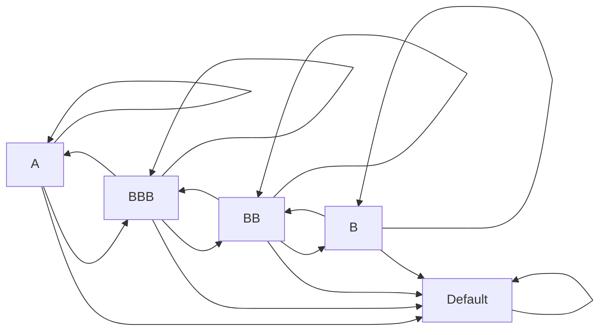

## Overview

Have you ever found yourself scratching your head when a bond you hold just gets downgraded seemingly out of the blue? Or maybe you’ve had that pleasant surprise when a less-than-stellar credit rating was upgraded, giving your portfolio a nice bump in market price. In both cases, you’re dealing with credit migration. Credit migration and transition models help us forecast how bond issuers’ credit ratings can shift over time—and why it might matter a lot more than you think.

In this section, we’ll consider how these rating shifts are systematically captured using transition matrices, why incorporating economic cycles is essential, and how portfolio managers leverage these tools to stress-test and manage potential risk. We’ll also sprinkle in some personal reflections—in case you prefer stories to pure math—and present the classic Markov chain approach to rating transitions. By the end of this reading, you should feel comfortable analyzing how and why credit ratings move from, say, “A” to “BBB,” or “BBB” to default. Let’s dive in.

## The Nature of Credit Migration

Credit migration refers to how an issuer’s credit rating can either degrade (downgrade) or improve (upgrade) over a certain time horizon. For instance, if a telecom company with a BBB rating runs into stiff competition and sees its profit margins collapse, rating agencies might cut its rating to BB. Conversely, if the firm recovers, an upgrade could occur. 

From experience, these rating moves can feel like “no big deal,” but in reality, they can have huge ripple effects in your bond portfolio—especially if the downgraded security was widely held or if multiple credits get hit at once. Downgrades usually mean wider credit spreads, lower bond prices, and an uptick in yield, changing the overall risk profile. If you track how often such events happen, you’ll see patterns. That’s what transition matrices are for.

## Transition Matrices: A Roadmap for Potential Rating Paths

A transition matrix is a powerful tool used to summarize the probabilities of moving from one rating “state” to another over a specific timeframe, typically one year. Each cell of the matrix represents the probability of shifting from Rating i to Rating j (or staying at Rating i). 

Let’s peek at a simplified example of a transition matrix for a single year. Suppose we have four rating categories—A, BBB, BB, B—and a “Default” state. A possible transition matrix P might look like this:

|       From \ To       |    A    |   BBB   |   BB    |    B    | Default |
|:----------------------:|:------:|:------:|:------:|:------:|:-------:|
| **A**                  |  0.90  |  0.07  |  0.02  |  0.00  |  0.01   |
| **BBB**               |  0.05  |  0.85  |  0.05  |  0.03  |  0.02   |
| **BB**                |  0.01  |  0.07  |  0.82  |  0.06  |  0.04   |
| **B**                 |  0.00  |  0.02  |  0.08  |  0.85  |  0.05   |
| **Default**           |  0.00  |  0.00  |  0.00  |  0.00  |  1.00   |

This table reads as follows: if you are currently rated A, there is a 90% chance you will remain rated A at the end of the period, a 7% chance you move down to BBB, a 2% chance you move to BB, and so on. The “Default” row is all zeros except for a 1.00 in the Default column, meaning once you default, you stay there—kind of a “Hotel California” situation.

### Markov Chain Foundation

Transition matrices in credit risk often rely on Markov chain assumptions: the probability of moving to the next state (next rating) depends only on your current state, not the path you took to get there. Intuitively, if your company is rated BBB now, we assume the odds of your next rating are fully determined by your being BBB at present, ignoring whether you might have been AAA in the more distant past.

In mathematical terms, if p(sᵢₜ) is the probability distribution across rating states i at time t, the distribution at time t+1 is given by:


p(s_{i, t+1}) = p(s_{i, t}) \times P


where P is the transition matrix, and sᵢ indicates the various credit rating states (A, BBB, and so forth).

## Rating Drift, Momentum, and Procyclicality

Now, credit migrations are not just random events in a vacuum. They tend to be influenced by broader economic trends. When the economy is booming, rating agencies might be more lenient, and defaults are less frequent. During recessions, you’ll see multiple downgrades clumped together—this is often referred to as rating drift or momentum in a down cycle.

- **Rating Momentum** can be observed in data that shows a higher likelihood of multiple-notch downgrades once an issuer starts slipping. The idea is that once conditions begin to deteriorate, rating agencies often “catch up” by cutting more aggressively if poor fundamentals persist. 
- **Procyclicality** points to the tendency for these rating changes to move in lockstep with the economic cycle, amplifying the ups and downs.

In other words, these migration patterns that appear stable during normal times can burst into dramatic sequences of downgrades during a crisis—just think of the 2008 financial meltdown as a prime example.

### Incorporating Economic Cycles

To handle this cyclical nature, some practitioners will use “economy-conditioned” transition matrices. Instead of having one single transition matrix, they might design:

• A “good-times” matrix reflecting lower default probability and higher upgrade probability.  
• A “stressed” matrix to reflect a recessionary environment, with more pronounced downgrades and defaults.  
• A “base-case” matrix that might be an average or typical scenario.

Then, using probability weights of each economic scenario, you can blend these matrices to get a more dynamic picture of rating migration. Markov chain modeling can still be applied; you simply switch among different transition matrices depending on the economic environment or the indicators you’re tracking.

## Applying Credit Migration Analysis in Portfolios

### Estimated Gains and Losses

Credit migration matters for bond portfolio managers since a rating downgrade typically results in higher yield spreads, leading to price declines. Conversely, upgrades might tighten spreads, raising bond prices. Over a given horizon, the portfolio manager can weigh the expected outcomes by applying the matrix probabilities. 

For example, if you hold a BBB bond with a 10% probability of moving to A, a 30% probability of staying BBB, 50% probability of moving to BB, and a 10% probability of default, you can approximate potential gains or losses by mapping each rating to an expected spread shift (or default loss).

### Stress Testing

Many financial institutions simulate severe economic downturns where rating downgrades might be more frequent than historical averages. The manager can scale the transition matrix to reflect higher probabilities of downgrade transitions. By running a “what-if” scenario:

- Bonds initially rated BBB might have three times the historical probability of dropping to BB.  
- The probabilities of default for lower-quality credits might similarly heighten. 

This approach estimates whether capital reserves are sufficient to absorb the potential losses. If the stress test shows big shortfalls, the firm might need to de-risk its portfolio or raise more capital. 

Such stress-testing is particularly crucial for risk-sensitive environments like insurance, banks, and pension funds, where large credit losses can undermine solvency.

## Common Modeling Approaches and Pitfalls

### Pitfalls of the Basic Markov Chain Assumption

While Markov chain models provide a neat, mathematically tractable structure, they can sometimes understate or misstate credit migration risk, especially if:

1. **History Matters.** If a bond was downgraded multiple times already, the probability of another downgrade could be higher than a single-step Markov chain might suggest.  
2. **Transitions are “Sticky.”** Rating agencies might revise ratings less frequently than actual changes in company fundamentals would suggest, potentially causing abrupt multiple-notch moves.  
3. **Non-Stationary Periods.** Historical transition data might not be representative of future conditions (especially during major credit cycles).

### Non-Markov Approaches

Some practitioners might employ machine learning or advanced statistical methods that incorporate issuer-specific fundamentals, macro data, or rating hysteresis. Others might use “cohort-based” approaches, where they track an entire group of, say, BBB issuers in January and see how many remain BBB or migrate by December, refining the approach with time-varying factors (like GDP growth or corporate leverage).

## Visualizing Credit Migrations

To illustrate the concept of credit migration paths more dynamically, imagine a schematic flow of rating states. Below is a Mermaid diagram that demonstrates a simplified view of transitions among different rating categories:

While this simplified chart only shows direct paths, real-world rating systems are more granular (e.g., AAA, AA+, AA, AA-, A+, A, A-, and so on). In addition, the probability associated with each arrow can vary based on economic conditions, rating momentum, or issuer-specific factors.

## Best Practices in Credit Migration Modeling

• **Collect Rich Historical Data**: More data points over multiple credit cycles produce more robust transition estimates.  
• **Segment by Sector**: Rating transitions can vary by industry. For instance, commodity-linked industries might see more volatility in rating transitions than stable sectors like regulated utilities.  
• **Incorporate Macroeconomic Indicators**: GDP growth, unemployment rates, or even consumer sentiment can play a significant role in driving corporate performance—and therefore rating transitions.  
• **Perform Regular Stress Tests**: Blind reliance on historical averages may be misleading. Always assume cyclicality and stress for tail events.  
• **Combine Quantitative and Qualitative Analysis**: Qualitative credit analysis—management strategy, corporate governance, potential large lawsuits—still matters.

## Practical Example

Let’s imagine you’re managing a portfolio of 50 corporate bonds, each with an average rating of BBB. You suspect an economic downturn on the horizon. You consult historical data and see that in recession years, about 20% of BBB issuers slip to BB or lower, with a small fraction defaulting. You decide to construct a “recession-weighted” transition matrix that skews heavily towards downgrades. Running a scenario analysis, you find a potential drop of 5–7% in portfolio value under these assumptions. In response, you might reduce your exposure to the most vulnerable BBB credits, or hedge with credit derivatives to keep your risk within acceptable limits.

## Final Thoughts for Exam Preparation

Credit migration might sound like a fancy term, but when you connect it back to real portfolio outcomes—bond price changes, yield spread movements, and risk-based capital adequacy—it becomes quite tangible. For the exam, you should be comfortable:

• Interpreting transition matrices and their implications for expected losses.  
• Understanding how procyclicality can create or amplify systematic risk in a bond portfolio.  
• Explaining how stress tests can be constructed by adjusting transition probabilities.

When you see a rating migration question, remember to consider both the short-term, Markov chain logic and the broader cyclical frameworks. Also, keep an eye on rating momentum, as that can trigger outsized gains or losses when many issuers get reassessed in the same direction.

## References and Suggested Readings

- J.P. Morgan CreditMetrics Manual (A classic resource for understanding transition matrices in depth)  
- Lando, D. (2004). Credit Risk Modeling: Theory and Applications. Princeton University Press.  
- CFA Institute (Most recent curriculum volumes related to credit risk and fixed-income)  
- Basel Committee on Banking Supervision Papers on Stress Testing and Credit Risk Modeling

-----

## Test Your Knowledge: Credit Migration & Transition Model Essentials



### Which concept best describes the probability of moving from one credit rating to another during a specific period?

- [ ] Markov chain
- [x] Transition matrix
- [ ] Rating momentum
- [ ] Procyclicality

> **Explanation:** A transition matrix displays the probabilities of an issuer moving from one credit rating to another over a certain time horizon. Markov chains feed into transition matrices, but the transition matrix itself is the table of probabilities.

### When using a Markov chain for credit rating transitions, which of the following best characterizes the primary assumption?

- [x] The probability of the next rating depends only on the current rating.
- [ ] Future rating transitions are influenced by the entire history of rating changes.
- [ ] Transition probabilities are constant across economic cycles.
- [ ] Downgrade events are more probable than upgrade events.

> **Explanation:** A Markov chain assumes the next state (in credit rating terms) depends only on the current state, not the historical path taken.

### During an economic boom, improving credit fundamentals typically:

- [x] Reduce the probability of downgrades and increase the probability of upgrades.
- [ ] Have no impact on default risk.
- [ ] Increase rating volatility without changing the direction of rating transitions.
- [ ] Are overshadowed by rating “stickiness.”

> **Explanation:** In a strong economy, issuers’ likelihood of default decreases, and the chance of upgrades typically rises, reflecting better overall financial health.

### Which term best describes the tendency for multiple downgrades to occur in rapid succession when a rating starts to slip?

- [ ] Markov chain
- [ ] Transition matrix
- [x] Rating momentum
- [ ] Procyclicality

> **Explanation:** Rating momentum refers to the empirical observation that once a downgrade occurs, additional downgrades often become more likely in short order.

### Why might portfolio managers create different transition matrices for “good times” and “stressed” scenarios?

- [x] To capture cyclical variations in credit risk.
- [ ] To randomly vary rating transitions.
- [ ] To solely align with regulatory capital requirements.
- [ ] To make Markov chains more memory-dependent.

> **Explanation:** Different transition matrices reflect how credit risk can shift under varying economic and market conditions, addressing cyclical differences.

### Which scenario is most characteristic of procyclicality in credit ratings?

- [x] Ratings are broadly upgraded in economic expansions and downgraded in recessions.
- [ ] Ratings remain stable regardless of broad economic factors.
- [ ] Ratings improve in recessions due to crisis-fueled innovation.
- [ ] Forked credit rating transitions that diverge regardless of economic cycles.

> **Explanation:** Procyclicality means ratings move in tandem with the general economic trend, amplifying the ups and downs of credit quality.

### A portfolio manager uses a transition matrix to estimate expected losses. Which factor is the manager most likely to consider in addition to the raw transition probabilities?

- [x] Spread changes associated with each potential rating move.
- [ ] Corporate board composition.
- [ ] Historical daily price movement frequencies.
- [ ] Ex-dividend dates of equities in the market.

> **Explanation:** Spread changes (and potential default loss severities) translate a rating move into realized gain or loss for the bond’s market price.

### If a bond is currently rated BBB and experiences “rating drift,” what is the most likely outcome?

- [x] If it starts getting downgraded, it may experience multiple notches downward.
- [ ] It will upgrade immediately to an investment-grade rating of A or higher.
- [ ] It will toggle back and forth between BBB and BB.
- [ ] It won’t move at all until a new economic cycle starts.

> **Explanation:** Rating drift often points to multiple or continued downgrades once the rating begins to move in a negative direction.

### In a stressed scenario, a manager expects more downgrades for lower-quality credits. How might the transition matrix be modified?

- [x] Increase the probabilities of downward moves and defaults for riskier credits.
- [ ] Decrease the probability of all states to less than 1.0.
- [ ] Randomly assign higher probabilities to AAA states.
- [ ] Keep the matrix as it is and rely on Markov chain assumptions.

> **Explanation:** To reflect a harsher economic environment, the transition probabilities for poorer credits should shift more aggressively toward downgrades and potential defaults.

### True or False: A rating once in “Default” can transition back to “BBB” within a standard one-year transition matrix framework.

- [ ] True
- [x] False

> **Explanation:** Typically, once an issuer is in default in a standard transition matrix, it remains in that state for at least the measured period (i.e., “Default” is absorbing).


