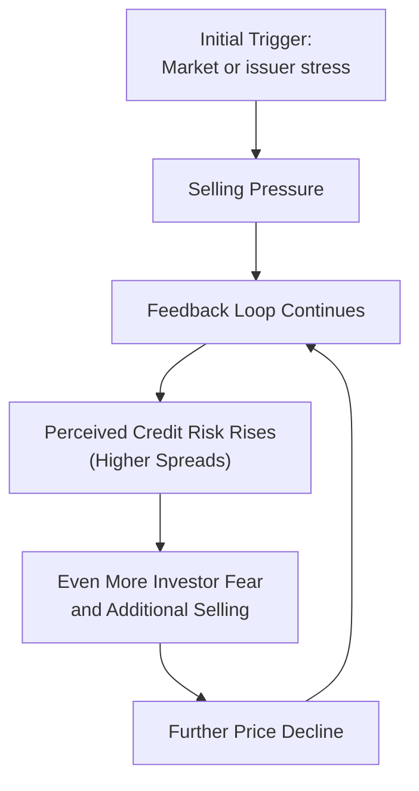

## Overview

Liquidity risk and credit risk often appear as two separate forces in fixed-income investing—until market conditions tighten and these risks collide. In calmer times, if investors believe an issuer has solid financials and a robust backing, the bond’s credit spreads remain tight and, typically, the bond’s liquidity is decent enough for large trades. But you know those moments in the market when things get rocky and everyone starts to question everything? In those conditions, even a solid-credit issuer might find itself with wider yield spreads just because the entire market’s liquidity dried up.

The interplay between liquidity risk and credit risk is one of the most important—and occasionally most underestimated—aspects of bond market analysis. When trades get tougher to execute or lenders become more selective, liquidity can evaporate, fueling panic and making it harder for everyone to roll over short-term obligations. This phenomenon can intensify credit concerns. In turn, higher perceived credit risk can worsen liquidity conditions, creating a downward spiral.

Below, we’ll explore how exactly these two risks interact, how forced selling can amplify both hazards, and what it all means for investors trying to predict bond recovery value in distressed scenarios. We will also differentiate between “market liquidity risk” (the risk that you can’t trade at a fair price) and “funding liquidity risk” (the risk that the issuer can’t roll over obligations), because each one can have its own distinct effect on credit spreads. Let’s walk through the main issues, give some real-world examples, and offer some best practices for navigating these turbulent waters.

## Defining Liquidity Risk and Credit Risk

Before we dig into how these two often form a volatile duo, let’s make sure the definition of each is crystal-clear.

• Market Liquidity Risk: This arises from an inability to sell (or buy) a security quickly at a price that’s reasonably close to its “fair” or “intrinsic” value. When market liquidity is shallow or dislocated, transaction costs rise, and spreads between bids and offers widen. In times of severe stress, you might only be able to transact at heavily discounted “fire sale” prices.

• Funding Liquidity Risk: This is the issuer’s risk of not being able to meet its short-term or near-term payment obligations—like rolling over debt as it matures—often because new credit lines are unavailable or prohibitively expensive. Even if an issuer is fundamentally strong, if the market seizes up and no one wants to refinance, that issuer can find itself unable to raise cash.

• Credit Risk: Refers to the chance that an issuer will fail to make timely principal or interest payments. Things like the issuer’s leverage, revenue sources, and broader economic environment all affect its perceived creditworthiness. If the market starts believing an issuer’s likelihood of default is rising, that’s an increase in credit risk.

It almost goes without saying, but these three definitions are intimately linked in real-world markets. Still, it helps to keep them separate as we analyze their interactions.

## When liquidity risk and credit risk feed on each other

Imagine you hold a corporate bond issued by a mid-tier energy firm. If the firm’s credit fundamentals remain stable, you might plan a normal hold-to-maturity strategy and not fret over day-to-day liquidity. However, let’s consider two scenarios:

1. Perception of Higher Credit Risk → Reduced Liquidity: Suppose the issuer’s credit metrics deteriorate, or commodity prices tank, raising doubts about future cash flows. Suddenly, the bond’s credit risk goes up in the eyes of the market. Investors demand higher yields as compensation, widening the bond’s spread. Some holders decide to exit the security, but because more buyers want to steer clear of this credit, liquidity plunges. This illiquidity can push market prices down further, fueling more anxiety about the issuer’s creditworthiness. Now it’s not just credit risk that’s going up; liquidity conditions are also deteriorating.

2. General Market Illiquidity → Perception of Higher Credit Risk: Alternatively, let’s say the entire market experiences a liquidity crunch, such as in a systemic flight to safety (remember 2008? Those days when everything ground to a halt?). Even the energy firm’s bonds, which might have had perfectly fine fundamentals, start trading at discounted prices simply because investors want to hoard cash. In turn, the lower market price for the bond can spook new investors into thinking the firm’s credit quality might be worse than it really is. This perceived change in credit risk can further raise funding costs for the issuer, thus making actual default risk creep up.

Both scenarios happen in real life. The 2007–2009 financial crisis is the canonical example: even strong banks lost immediate access to funding, and bond spreads soared, not necessarily because an issuer’s intrinsic credit risk had changed overnight, but because the market’s willingness to provide liquidity at normal prices disappeared.

## Differentiating Market Liquidity Risk and Funding Liquidity Risk

It’s also important to separate “market liquidity risk” from “funding liquidity risk.” Although both revolve around liquidity, they affect different entities in the financial system.

• Market Liquidity Risk is primarily the risk faced by bondholders or traders trying to buy or sell positions. When market liquidity risk is high, it’s challenging or expensive to adjust portfolios. For instance, an asset manager wanting to reduce exposure to a sector might find that the bid-ask spreads are extremely wide, or that bids do not exist at all. The result is slippage in the sale price (e.g., selling well below the previously observed “market” level).

• Funding Liquidity Risk is a threat borne by the issuer, who needs to roll over short-term debt or refinance upcoming maturities. If an issuer can’t convince lenders, the issuer might have to pay huge new-issue premiums or might fail to secure funding at any cost. Even a strong-credit issuer can stumble if short-term markets freeze, causing a technical default on near-term obligations. 

Anyway, I remember chatting with a colleague during the financial crisis—both of us were trying to figure out how to price certain corporate bonds. Officials from the issuing firms were practically yelling from the rooftops that their fundamentals were “just fine,” yet their yield spreads screamed crisis. Why? Because no one in the market wanted to buy. That’s a classic example of market liquidity risk overshadowing fundamental credit analysis, at least in the short term.

## Fire Sales and Downward Price Spirals

When a bond becomes illiquid or is perceived as higher credit risk, forced sales (a major sign of stress) can produce a downward price spiral. The dynamic looks like this:

• A small set of investors must sell to meet margin calls or other obligations.  
• Because the market is thin, the selling pressure drives down the bond’s price significantly.  
• Other investors see the price drop and cut their fair value assumptions or become nervous about the issuer’s credit.  
• Additional selling emerges, further pushing the price down.  
• The issuer, now facing a depressed bond price, might see lenders react by tightening credit lines or raising short-term financing costs, further increasing the actual risk of default.

This vicious cycle can feed on itself until a new market equilibrium is found, often at heavily distressed levels. While it’s easy to say, “I’ll just hold until maturity,” in practice, forced selling might come from other market participants—such as leveraged funds or dealers that have to reduce risk—and that action sets low benchmark prices for everyone else.

Below is a Mermaid diagram to illustrate the dynamic interplay between liquidity risk and credit risk during a fire sale scenario:

## The Liquidity Premium in Credit Spreads

When everything is stable, part of a bond’s yield spread over a risk-free benchmark can be attributed to a so-called “liquidity premium.” This premium compensates investors for the possibility that selling the bond quickly might be difficult or costly. The fascinating part is that liquidity premiums can suddenly balloon if credit conditions or market conditions deteriorate. Even if the issuer’s fundamental credit metrics haven’t changed, the portion of the bond’s spread attributable to liquidity can become huge. 

For example, in normal times, you might see a bond from a healthy issuer trade at a modest spread that includes a small “liquidity add-on.” But when the market experiences systemic stress—like the onset of a financial crisis or a shock that reduces bond dealers’ capacity to hold inventory—investors demand a drastically higher premium for providing liquidity. Voila: the bond’s yield spread jumps, which can be misconstrued as a reflection of credit concerns, when in many cases it’s just the bond market’s liquidity drying up.

## Implications for Recovery Rates

Many credit analysis models attempt to forecast not just the probability of default (PD) but also the loss given default (LGD). Recovery rates can be significantly impacted by liquidity in the market. Why? Because if a default occurs in a depressed or illiquid market, assets might have to be liquidated at far below their “fair” values. That means realized recoveries for bondholders end up much lower than model estimates that assume orderly dispositions of collateral.

During a forced liquidation, many potential buyers might just sit on the sidelines, anticipating further price drops. This dynamic is especially painful for bonds that rely on specific pledged collateral—for instance, certain commercial real estate properties—for recovery. If the property must be sold in an illiquid environment at a discount, that directly reduces the bondholders’ recovery. 

Hence, liquidity risk isn’t just about an investor’s ability to trade during normal times; it also factors into the final “hammer price” if everything goes south. And that’s an important consideration for rating agencies, distressed debt investors, and regulators who want to understand potential systemic vulnerabilities.

## Real-World Examples and Case Studies

Let’s talk about a couple of real examples:

• 2007–2009 Credit Crisis: Big banks typically used short-term funding markets, like asset-backed commercial paper and repo transactions, for daily financing needs. When those markets froze (funding liquidity risk soared), even banks that had adequate longer-term credit fundamentals faced acute liquidity shortfalls. Investors perceived that these banks were at higher risk of default—even if, on paper, the fundamental credit metrics weren’t drastically different from six months earlier. In parallel, bond markets turned illiquid, so anyone holding non-government bonds faced huge price declines, partly due to the “flee to quality” phenomenon.

• 2015–2016 Energy Market Turmoil: When oil prices tumbled, many energy companies took a double hit. Their credit risk soared because revenues were dwindling. Market liquidity for these bonds also dried up since many dealers pulled back commitments to hold risky-energy inventory. I can still recall how some of those high-yield energy issuers had extremely volatile daily price swings, not only reflecting credit concerns but also reflecting the lack of willingness among investors to provide liquidity at narrower spreads.

## Interactions with Regulatory Constraints

Recent regulatory changes, especially after the financial crisis, have altered how banks and broker-dealers provide liquidity in bond markets. Since capital requirements for holding inventory are stricter, dealers can’t or won’t warehouse as many risky bonds. In a credit crunch, dealer balance sheets fill up quickly, so they can’t step in to stabilize the market. This phenomenon can exacerbate liquidity risk, driving credit spreads wider. 

There’s also the dimension of “funding liquidity” for these financial intermediaries. If dealers themselves face higher funding costs, they may be less inclined to offer tight bid-ask spreads. The outcome: an adverse feedback loop, where liquidity risk in markets intensifies, and perceived credit risk for even decent issuers goes up.

## Managing Liquidity and Credit Risk

From an investor’s point of view, managing the interplay of liquidity risk and credit risk is critical. Here are a few strategies worth noting:

• Stress Testing and Scenario Analysis: Model how a portfolio might behave under various liquidity stress scenarios. This includes analyzing the potential for forced sales and the effect on realized bond prices.

• Acceptable Liquidity Buckets: Maintain different “liquidity sleeves” in a portfolio, ensuring you hold an adequate portion of highly liquid assets (e.g., T-bills or short-term government bonds) if you need to meet redemptions or margin calls.

• Considering Secondary Market Liquidity in Pricing: When you do credit spread analysis, don’t forget to incorporate a liquidity premium, especially for issuers with limited secondary-market followings or those likely to be impacted by broader market volatility (e.g., high-yield issuers, less transparent emerging-market borrowers).

• Funding and Liability Management: Issuers should smooth out maturity profiles and avoid overreliance on short-term funding. If you’re analyzing an issuer, pay attention to the proportion of short-term debt in their capital structure.

• Diversification of Funding Sources: Issuers can reduce funding liquidity risk by diversifying across commercial paper, bank loans, bond markets, and other channels. Investors, on the other side, look favorably on issuers with multiple financing options.

## Practical Example: Simple Funding Liquidity Calculation

While not super fancy, let’s consider a quick illustration to show how an issuer’s short-term funding liquidity might impact perceived risk. Suppose an issuer, Firm ABC, has a current ratio of 0.95, meaning its short-term assets are slightly less than its short-term liabilities. If credit markets remain open and healthy, ABC can roll over short-term debt easily. Credit risk is moderate—maybe stable, investment-grade. 

But now imagine a market shock that doubles short-term funding costs from 2% to 4%. Because ABC has a significant portion of its liabilities in short-term debt, its interest expense jumps rapidly. Rating agencies, uncertain whether ABC can pass along these costs, might downgrade the firm. Investors, seeing the downgrade, demand even higher spreads. This higher spread means any new issuance is more expensive, fueling a sense of potential default risk. As a result, ABC’s bond prices drop, making them less liquid. It’s a perfect illustration of how funding liquidity can morph into higher credit risk and hamper secondary market liquidity.

## Potential Pitfalls and Best Practices

• Underestimating Liquidity Premiums: Many standard bond valuation models (like a simple yield-to-maturity approach) assume moderate liquidity conditions. During crises, these assumptions break down, and if you don’t explicitly factor in liquidity risk, you might undervalue how big credit spreads can widen. 
• Overlooking Correlation of Risks: Liquidity and credit risk can become highly correlated in a crisis. A naive approach that treats them as independent can lead to big forecasting errors. 
• Reliance on Historical Recovery Rates: Past recovery rates might not hold up in a severe liquidity crunch where forced sales occur. It’s wise to build in more conservative assumptions for the next meltdown scenario.

## Conclusion

Liquidity risk and credit risk can operate independently in calm markets, but once stress factors escalate, they tend to reinforce each other and magnify overall bond market volatility. Funding liquidity risk on the issuer side can combine with market liquidity risk on the trading side to erode confidence in what might initially look like a stable credit. And we shouldn’t forget that forced sales in illiquid conditions can produce price spirals, further changing perceptions of credit quality.

From a portfolio management viewpoint, understanding how liquidity conditions can influence—and even overshadow—fundamental credit metrics is essential. Realistic recovery assessments must factor in the possibility that bonds may only be sold at fire-sale prices when liquidity vanishes. By keeping a close eye on the interplay between these risks, investors can better calibrate their exposure, manage potential drawdowns, and avoid nasty surprises when the next wave of panic sets in.

## Diagrams Recap

Just to remind you: We included a Mermaid diagram in the “Fire Sales and Downward Price Spirals” section. It visually captures how rapid selling, depressed prices, and fear of rising credit risk can feed into each other. This cyclical process helps illustrate the complexities you generally can’t capture with simple, static models.

## References and Further Reading

• Brunnermeier, M. (2008). “Deciphering the Liquidity and Credit Crunch 2007–2008.” Journal of Economic Perspectives.  
• Adrian, T., & Shin, H. S. (2010). “Liquidity and Leverage.” Journal of Financial Intermediation.  
• CFA Institute, Official Curriculum (Various Years) – for further reading on credit analysis frameworks, bond pricing, and stress-testing approaches in fixed income.  
• International Monetary Fund Working Papers and Global Financial Stability Reports – for macro-level perspectives on liquidity, funding markets, and systemic risk.

-----

## Test Your Knowledge: Liquidity Risk vs. Credit Risk



### Which of the following statements best captures how credit risk can lead to deteriorating liquidity in the bond market?

- [ ] When a bond issuer's credit improves, market liquidity for that bond falls significantly.  
- [x] When a bond issuer's credit deteriorates, fewer investors are willing to buy, causing liquidity to dry up.  
- [ ] When bond yields decline sharply, investors are more likely to sell, improving market liquidity.  
- [ ] When bond dealers increase inventory limits, credit risk also automatically increases.  

> **Explanation:** A drop in an issuer’s perceived credit quality discourages investors from providing bids, diminishing bond market liquidity.  

### Which of the following best describes the difference between market liquidity risk and funding liquidity risk in this context?

- [ ] Both refer to the risk that the bond price will not fluctuate significantly over time.  
- [ ] Market liquidity risk applies exclusively to governments, while funding liquidity risk applies to corporate issuers.  
- [x] Market liquidity risk is mainly about a trader’s ability to quickly sell a bond at a fair price; funding liquidity risk focuses on an issuer’s ability to roll over debt.  
- [ ] They are essentially the same concept, used interchangeably.  

> **Explanation:** Market liquidity risk applies to the trading environment (bid-ask spreads, ease of transaction), whereas funding liquidity risk refers to an issuer’s near-term debt obligations and ability to secure financing.  

### In times of systemic stress, why might even a strong-credit issuer experience a spike in its yield spreads?

- [x] Lack of market liquidity can raise the cost of trading, prompting investors to demand higher spreads.  
- [ ] The issuer’s default probability instantly multiplies.  
- [ ] The government usually intervenes to increase required spreads.  
- [ ] Institutional investors typically prefer to buy more bonds from riskier issuers.  

> **Explanation:** During market turmoil, investors may demand higher yields on all but the safest securities because of the increased cost and difficulty of trading, even if the issuer’s credit metrics remain solid.  

### What is a primary reason forced selling can exacerbate both liquidity risk and credit risk?

- [ ] Forced selling usually leads to an increase in supply of government bonds.  
- [x] Forced selling can push bond prices sharply lower, raising perceived credit strains and triggering more selling.  
- [ ] Forced selling activates automatic rating upgrades from agencies.  
- [ ] Forced selling only happens when bond prices are rising.  

> **Explanation:** When investors must sell in an illiquid environment, the sharp drop in prices spooks other investors, which widens credit spreads further.  

### Which best describes how liquidity risk influences recovery rates in a default scenario?

- [ ] Liquidity risk has no influence; recovery rates depend solely on the firm’s financial health.  
- [x] Illiquid markets can force asset sales at significantly discounted “fire sale” prices, reducing recovery rates.  
- [ ] Illiquid markets are irrelevant because liquidation occurs only in well-managed auctions.  
- [ ] Recovery rates usually increase in illiquid markets because bondholders are compensated for holding to maturity.  

> **Explanation:** Illiquid markets can force the sale of collateral or other assets at distressed prices, lowering the ultimate recovery for creditors.  

### Which of the following is the most direct measure an issuer might take to reduce its funding liquidity risk?

- [ ] Aggressively expand short-term borrowing.  
- [ ] Offer higher coupons to investors in new issues.  
- [ ] Increase share buybacks to reduce equity on the balance sheet.  
- [x] Extend debt maturities to avoid near-term rollover requirements.  

> **Explanation:** Spreading out debt maturities and reducing reliance on short-term borrowing is a common tactic to mitigate funding liquidity risk.  

### If a potential investor is worried about market liquidity risk, which approach might they incorporate into their bond valuation?

- [x] Add a liquidity premium to the discount rate to compensate for transaction uncertainty.  
- [ ] Reduce the maturity to get a lower coupon.  
- [ ] Focus solely on the bond’s coupon frequency.  
- [ ] Eliminate risk by only investing in structured products.  

> **Explanation:** Investors include a liquidity premium in the yield spread to account for potential difficulties in buying or selling at a fair price.  

### During a crisis, why do dealer inventories matter for bond market liquidity?

- [ ] Larger dealer inventories reduce competition among different market makers.  
- [ ] Dealer inventories are only used to store defaulted bonds.  
- [x] If dealers limit their inventory due to capital regulations, they offer fewer bids, reducing market liquidity.  
- [ ] Dealer inventories become irrelevant because all trading happens directly between investors.  

> **Explanation:** Post-crisis regulatory constraints on dealer balance sheets often lead to lower inventories and less willingness to “warehouse” bonds, which diminishes liquidity.  

### Why might bond spreads widen even for assets with minimal shift in their fundamental credit metrics?

- [x] The market is demanding higher compensation for liquidity concerns.  
- [ ] Rating agencies automatically upgrade the bond.  
- [ ] The issuer’s coupon resets to a lower level.  
- [ ] Investors prefer illiquid assets in times of stress.  

> **Explanation:** Sometimes the entire market environment becomes more risk-averse, forcing even strong credits to add a higher liquidity premium to their spreads.  

### True or False: The liquidity premium embedded in a bond’s yield spread can increase substantially during market turbulence, even if the issuer’s fundamental credit quality remains unchanged.

- [x] True  
- [ ] False  

> **Explanation:** In a crisis, investors demand extra compensation for illiquidity, thereby increasing the liquidity premium component of bond yields regardless of credit fundamentals.  


