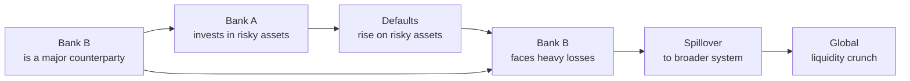

## Introduction
Systemic credit shocks are a bit like a domino effect in financial markets. One piece topples—maybe it’s a big bank getting hammered by losses on subprime mortgages or a sudden corporate default—and the shockwave spreads across other institutions, industries, or even entire countries. Under normal conditions, you’d see some institutions suffer but not necessarily drag everyone else down. However, when credit structures are deeply interconnected (think about big banks that hold each other’s debt, or major investors who rely on short-term funding), a single default event can trigger chain reactions. Before you know it, you have a full-blown crisis on your hands, like the global financial meltdown of 2008–2009.  

In this section, we’ll dig into how these systemic credit shocks happen, why they spread so fast (the dreaded contagion), and what measures global regulators, policymakers, and investors rely on to keep the financial system from spiraling into chaos.

## Understanding Systemic Risk and Contagion
Systemic risk, in plain English, is the threat that problems in one corner of the financial world will reverberate throughout the entire system. It’s a “too big to fail” situation—but on steroids. It’s not just one institution that could fail; it’s that if that player does fail, the aftershocks might bring down several others due to various credit exposures, leverage, and plain old investor panic.

Contagion, as the name suggests, is the mechanism by which that “infection” travels. One bank’s failure to repay overnight loans can make lenders too scared to provide funds to others. Then, if those other institutions can’t fund themselves, they cut back lending to corporations, who in turn slash investment or can’t roll over debt. Suddenly, you have a seismic shift in credit availability.  

## The Interconnectedness of Financial Institutions
A key factor driving systemic risk is the tangled web of financial linkages among banks, institutional investors, non-bank financial intermediaries (often referred to as “shadow banks”), and central counterparties. At times, I remember hearing about how one major bank might have derivatives positions with a hundred others, each offset by some cross-collateral arrangement. That alone is complicated. But then add in cross-holdings of debt and equity, plus the same handful of large money market funds that might be funding half the short-term obligations in the system. In short, it becomes a real house of cards.

### Channels of Transmission
1. Interbank Lending: Banks frequently borrow from each other to fulfill short-term liquidity needs. Distress at one major borrower can cause lenders to raise rates or freeze credit lines to peers. 
2. Cross-Holdings of Debt: When institutions hold each other’s bonds or commercial paper, a bankruptcy in one entity can cause direct losses for others.  
3. Derivatives Exposures: Banks and funds use credit default swaps (CDS) and interest rate swaps, sometimes with massive notional sizes. If a counterparty can’t post collateral, this ripples through any positions referencing that underlying credit.  
4. Market Sentiment and Herd Behavior: Sometimes it’s pure psychology. If one bank is in trouble, markets start worrying about everyone else with similar risk profiles—even if those others aren’t truly insolvent.  

## Real-World Example: The 2008 Crisis
I can still recall how, during the 2008 financial crisis, the collapse of a few big institutions (like Bear Stearns, followed by Lehman Brothers) led to a freeze in the interbank lending market. Lenders were spooked that virtually any borrower might be hiding toxic subprime mortgages or complex structured products. In no time, LIBOR (the London Interbank Offered Rate) soared, reflecting the skyrocketing risk premium banks demanded to lend to each other. Liquidity dried up. Suddenly, even creditworthy corporations found it dreadfully hard to raise financing. The mortgage meltdown spilled into the broader corporate sector, job markets, and eventually impacted economies around the globe.  

## Diagram: How a Shock Spreads

In this hypothetical chain of events:
• Bank A invests in high-yield but high-risk mortgages or corporate bonds.  
• Defaults rise, wiping out the value of those securities.  
• Bank B, which has massive derivative transactions or loan exposures with Bank A, bears the brunt of the fallout.  
• Market suspicion spreads, triggering funding constraints and margin calls.  
• Before long, liquidity shrinks system-wide, causing a contagion effect that can spread across global markets.

## Contagion Effects in a Funding Crisis
A hallmark of systemic stress is a funding crisis: lenders won’t lend unless they’re absolutely certain of repayment, and that certainty can be elusive in a crisis. Wholesale funding markets—particularly commercial paper and repo markets—can seize up within hours if confidence disappears. Even financially strong institutions may suffer if they rely heavily on short-term funding.  

When liquidity providers become tight-fisted, they invoke higher haircuts on collateral, reduce lending lines, or impose punitive lending rates. This erodes balance sheets in a negative feedback loop: forced asset sales drive prices down, capital shrinks, confidence weakens, and it all gets worse.

## Macroprudential Policies and Regulatory Tools
Modern regulators have learned a few lessons from past crises. They use a suite of macroprudential measures—fancy talk for policies that aim to protect the financial system as a whole. These policies include:  

• Countercyclical Capital Buffers: Banks must build up extra capital during boom times so that when credit conditions deteriorate, they have a cushion to absorb losses.  

• Stress Testing: Authorities run scenario analyses that assume severe adverse conditions (e.g., deep recession, big housing price crash, or a spike in interest rates). If an institution fails the stress test, it may be required to raise capital or reduce reckless exposures.  

• Limitations on Interbank Exposures: Rules restrict how much one bank can lend to another, so a default doesn’t paralyze an entire network.  

• Regulation of Systemically Important Financial Institutions (SIFIs): Certain firms are designated as SIFIs and face stricter capital and liquidity requirements.  

• Resolution Planning (Living Wills): Large banks must craft a “living will” that details how they would be wound down in an orderly fashion if they became insolvent.  

### Example: Libor-OIS Spread
One widely followed barometer of systemic stress in the funding market is the LIBOR-OIS spread. Traditionally, a sudden spike in this spread signals that financial institutions perceive elevated counterparty risk, making them hesitant to lend on an unsecured basis. If you see a pronounced widening, it usually means trust in the interbank market is waning—a classic sign of building contagion risk.

## Detecting and Monitoring Systemic Shocks
Financial authorities track credit default swap (CDS) indices, such as CDX in North America and iTraxx in Europe, for real-time insight into market perceptions of credit risk. When these indices spike, participants are effectively betting that default probabilities are increasing across a range of issuers. Another metric is the yield spread of corporate bonds or emerging market sovereign bonds over safe-haven government benchmarks. Widening spreads can reflect intensifying market fear and the possibility of correlated defaults.

Moreover, global institutions like the IMF publish regular reports (e.g., the Global Financial Stability Report) to highlight vulnerabilities—such as excess leverage, unsustainable credit growth, or deteriorating corporate earnings.  

## Ties to Portfolio Management
From a portfolio manager’s vantage, systemic credit shocks can wreak havoc on returns and liquidity. Even if a manager’s holdings are fundamentally sound, severe market sentiment can compress or blow out credit spreads across all sectors. You might face margin calls on leveraged positions, and illiquidity could force you to sell assets at fire-sale prices.  

In anticipating systemic risk, managers might:  
1. Limit overall leverage, especially in volatile credit markets.  
2. Diversify exposures across multiple counterparties.  
3. Employ scenario-based stress testing to see how portfolio assets would perform in a market wide selloff.  
4. Maintain adequate liquidity via cash or highly liquid government bonds.  

## Potential Pitfalls
• Over-Reliance on Historical Data: Past correlations might fail to capture future correlations in a crisis; “unrelated assets” can become correlated when panic sets in.  
• Complacency in Good Times: Low volatility environments can lull managers and regulators into ignoring mounting systemic risk.  
• Underestimating Interbank Exposures: Indirect or second-level exposures (e.g., your counterparty’s counterparty) can transmit losses you didn’t predict.  

## Personal Reflections
Honestly, one of the biggest takeaways from any discussion of systemic credit shocks is humility. Way back when I was starting out, I thought robust risk models could catch everything. Then I watched the 2008 meltdown unfold, and it was humbling to see how quickly big names stumbled. Institutions with intricate quantitative risk models were still caught off-guard.  

Of course, that doesn’t mean we throw out our models—they have essential roles. But it does mean we must keep an open mind that our neat spreadsheets won’t always capture the messy and very human nature of finance under stress.

## Best Practices to Mitigate Systemic Credit Shocks
• Proactive Regulation: Keep watch on leverage ceilings, capital requirements, and liquidity levels, especially in large interconnected firms.  
• Transparent Reporting: Boost transparency about who holds what. Complex off-balance-sheet vehicles hamper risk identification.  
• Collaboration Among Authorities: Central banks, securities regulators, and other authorities share info to detect cross-border risks early.  
• Crisis Management Protocols: From providing emergency liquidity to implementing deposit guarantees, there are multiple policy levers that can slow or halt contagion.  

## Practical Example for the CFA Exam
On an exam question, you might be given a scenario in which credit spreads spike following the downgrade of a large financial institution. You’d be asked to identify how a portfolio manager should respond and how regulators might intervene. You’d likely discuss:  
• The potential liquidity constraints hitting money markets.  
• The possibility of correlated defaults in related industries.  
• The increased probability that participants might sell their risky assets, pushing yields higher.  
• The tools (like stress tests) that regulators use to contain fallout.

CFA Level III, in particular, might push you to articulate a multi-asset scenario—where equity markets, foreign exchange markets, and credit markets are all reacting. The ability to explain how you’d hedge or reposition for that environment is key to your success on the exam.

## Conclusion and Exam Tips
• Read real-world case studies of systemic collapses, including 2008 and the Eurozone crisis, to witness how contagion can unfold in practice.  
• Map out the chain reactions that lead from a single default to a systemic meltdown.  
• Be sure you understand how different policy tools (like capital buffers and stress testing) attempt to limit the spread of such crises.  
• In exam answers, use structured logic: define any unusual terms, describe how the shock starts, show how contagion might spread, and conclude with plausible remedies or mitigations.  
• Always consider the interplay between market psychology and rational risk assessment. Once panic sets in, it can amplify losses in ways pure math models can’t predict.

## References and Suggested Readings
• Financial Crisis Inquiry Commission Report (2011).  
• Duffie, D. (2011). How Big Banks Fail and What to Do About It. Princeton University Press.  
• IMF Global Financial Stability Report (https://www.imf.org/external/pubs/ft/gfsr/)

## Test Your Knowledge: Systemic Credit Shocks and Contagion Concepts



### A systemic credit shock refers to:
- [ ] The default of a single, isolated corporate issuer without wider market implications.
- [x] A credit event that triggers widespread stress and potential failure across multiple institutions.
- [ ] Any downgrade in credit ratings according to recognized agencies.
- [ ] Minor liquidity constraints among small, localized financial firms.

> **Explanation:** A systemic credit shock signifies broad-based financial instability, affecting multiple institutions and often resulting in large-scale liquidity shortages.

### Which of the following is most likely to accelerate contagion in interbank lending markets?
- [x] Uncertainty about counterparties’ solvency and asset quality.
- [ ] Well-capitalized institutions holding excess liquidity.
- [ ] Central banks providing ample liquidity via open market operations.
- [ ] Portfolio diversification into uncorrelated assets.  

> **Explanation:** If banks are unsure whether their counterparties are solvent, they rapidly withdraw loans and freeze credit lines, exacerbating liquidity problems and spreading financial stress.

### Which of the following best describes a key characteristic of macroprudential policy?
- [ ] It focuses solely on preventing high-frequency trading.
- [ ] It exclusively targets consumer protection against predatory lending.
- [x] It addresses risks to the entire financial system rather than individual entities.
- [ ] It is a post-crisis regulatory framework limited to advanced economies.

> **Explanation:** Macroprudential policy aims to safeguard the stability of the entire financial system and ensure that no single entity’s failure threatens systemic collapse.

### In times of systemic crisis, the LIBOR-OIS spread is often monitored because:
- [ ] It measures only equity market risk.
- [ ] It tracks the difference between retail and institutional bond yields.
- [x] It reveals the extent of counterparty risk and perceived bank solvency issues.
- [ ] It gauges consumer loan interest rates in real estate markets.

> **Explanation:** A higher LIBOR-OIS spread indicates heightened interbank lending risk and diminished confidence in the financial system’s overall health.

### Which scenario most accurately demonstrates contagion effects in credit markets?
- [x] The failure of a major bank results in funding freezes, causing other banks to suffer liquidity crises.
- [ ] A manufacturing firm’s bankruptcy leads to a slight dip in commodity prices.
- [x] A sharp drop in emerging market bond prices prompts global investors to sell North American corporate bonds too.
- [ ] A government’s unexpected repurchase of its debt reduces market volatility.

> **Explanation:** Contagion occurs when problems within one segment or institution spread to seemingly unrelated segments—e.g., bank failures leading to funding freezes or investor panic in different bond markets.

### One reason correlated trading strategies can spread shocks is that:
- [x] Multiple institutions may be forced to sell similar assets simultaneously, further depressing prices.
- [ ] These strategies function best when everyone invests in risk-free Treasury bills.
- [ ] Portfolio managers rely on them to reduce volatility during crises.
- [ ] They exclusively use short selling of government bonds.

> **Explanation:** When everyone rushes for the exit at once, market liquidity can vanish, prices fall precipitously, and losses accelerate across numerous portfolios.

### Regulators might require “living wills” from large financial institutions because:
- [x] They want to ensure there’s an orderly resolution process if the institution fails.
- [ ] They involve codicils to personal estate planning for executives.
- [x] They allow governments to quickly liquidate small businesses.
- [ ] They reduce the need for banks to hold any capital reserves.

> **Explanation:** A “living will” outlines how a large institution can be wound down without wreaking havoc on the financial system, thereby mitigating contagion risk.

### A practical way for a portfolio manager to hedge against systemic credit risk is:
- [x] Holding a liquidity reserve in highly liquid securities (e.g., government bonds).
- [ ] Doubling leverage in high-yield corporate bonds in anticipation of spread contractions.
- [ ] Ignoring stress tests because they are hypothetical and unrealistic.
- [ ] Marketing the fund aggressively to new investors during a crisis to raise capital.

> **Explanation:** Maintaining liquidity in high-quality assets helps the manager meet margin calls or cover redemptions without being forced to sell illiquid or distressed assets at a severe loss.

### When stress testing a corporate bond portfolio, analysts:
- [x] Consider worst-case scenarios, including a significant widening of credit spreads and higher default rates.
- [ ] Rely solely on historical default data without forward-looking scenarios.
- [ ] Typically ignore changes in leverage or funding conditions.
- [ ] Focus only on potential equity market drawdowns.

> **Explanation:** Effective stress tests examine adverse conditions and combine them with potential defaults and sharp sell-offs, helping identify vulnerabilities.

### A negative feedback loop in financial markets often occurs when:
- [x] Falling asset prices force leveraged investors to liquidate positions, driving prices even lower.
- [ ] Heightened investor confidence leads to undervaluation of safe-haven assets.
- [ ] Central banks reduce reserve requirements to stimulate lending.
- [ ] Credit rating agencies suddenly upgrade multiple institutions.

> **Explanation:** In a negative feedback loop, price declines and forced liquidations reinforce each other, amplifying losses and liquidity stresses for all market participants.


