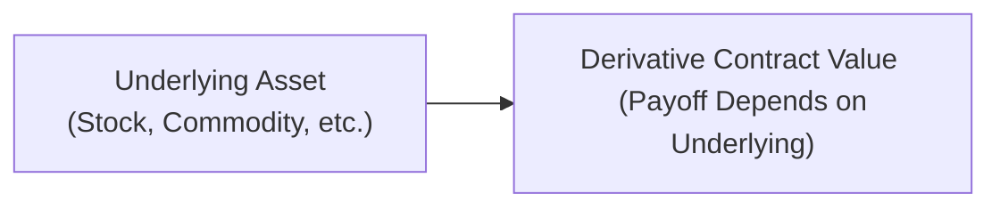
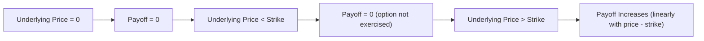

## Overview and Context

Derivatives can sometimes sound intimidating. You know, the first time I heard the term “derivative,” I imagined something overly complex—like rocket science for financial markets. But once I realized that derivatives are simply financial instruments whose value depends on (or is “derived” from) some underlying asset, it completely changed my perspective. This opening section aims to demystify the basics of derivatives, ensuring you feel comfortable with their key characteristics and how they fit into the broader world of finance.

Derivatives are used in numerous ways by hedgers, speculators, and arbitrageurs. They can mitigate risk, capitalize on expected market moves, or exploit pricing inefficiencies. While these instruments can be powerful, they also come with their own set of considerations regarding leverage, counterparty risk, and regulatory environments. So let’s dig into the nuts and bolts of derivatives.

## Fundamental Concepts

### Relation to Underlying Assets

The defining feature of any derivative is that its payoff depends on the performance or price of something else, known as the underlying asset. That “something else” can be almost anything of economic value—equities, interest rates, commodity prices, foreign exchange rates, and even emerging concepts like carbon emissions or cryptocurrency indexes. If the underlying variable moves, the derivative’s value will typically follow suit in a predictable manner (given the contract’s payoff formula).

For example, if you have an option contract on a stock, the option’s payoff depends on the stock’s price at expiration—or possibly before, if it’s an American-style option. This dependency can be represented mathematically or illustrated using payoff diagrams. But all derivative transactions share the basic theme: the “driver” (or the source of returns and losses) is something external to the contract itself.

Below is a simple diagram illustrating how a derivative’s value is tied to an underlying asset. The arrow indicates that changes in the underlying asset price feed into changes in the derivative contract’s value:

### Notional Amount

When you deal with derivatives, you’ll often see references to a notional amount. It can feel a bit abstract if you’re new to finance. The notional amount is basically the “face value” on which contract calculations are based. For example, in an interest rate swap, you may have a notional principal of $1 million. The actual exchange of principal might never occur, but the periodic interest payments are calculated based on that $1 million.

The best way to think of the notional amount is as a reference figure that drives how large your gains or losses can be. It’s part of the reason derivatives can produce outsized returns—or losses—with only a small initial capital outlay. Despite the notional principal typically not changing hands at initiation (and sometimes not ever), it’s crucial to remember it can heavily amplify the final payouts.

### Leverage

Derivatives often involve leverage, meaning even a small movement in the underlying’s price might generate large gains or losses relative to your initial investment. If you’re speculating in the futures market, for instance, your margin requirement (upfront collateral) might be just a small fraction of the total contract value. So a 1% move up or down in the underlying can translate to a much bigger percentage change in your profit or loss. This is precisely why derivatives can be risk management tools (hedging) or instruments of pure speculation. Leverage can be your best friend or your worst enemy, depending on market movements and your ability to manage risk.

From an accounting standpoint, financial reporting standards—such as IFRS (IFRS 9) or US GAAP (Topic 815)—require that derivatives be recognized on the balance sheet at fair value. Firms must disclose the nature and extent of derivative activities because leveraged positions can have significant implications for risk and future cash flows.

## Roles of Derivatives in Finance

### Hedging

Sometimes, you might hear a friend say, “Oh, I’m hedging my bets.” In finance, “hedging” has a very specific connotation. It means you’re offsetting the risk you might have from an existing or anticipated exposure in the market. If you run a manufacturing company that uses corn, you might buy corn futures to lock in future prices—thus reducing the uncertainty about your future costs. Similarly, bond investors might use interest rate swaps to manage their exposure to interest rate fluctuations.

Imagine you’re a coffee shop owner. Coffee bean prices can swing wildly from season to season depending on crop yields, weather, and global supply chain disruptions. To manage such uncertain costs, you hedge by purchasing coffee futures contracts that fix the price you’ll pay for your coffee beans down the line. By doing so, you protect yourself from sudden price increases. Of course, if coffee prices tank, you won’t benefit from lower prices on the open market—your futures contract has effectively locked you in. But at least you avoided the risk of prices going through the roof, letting you plan your expenses with some degree of certainty.

### Speculation

Speculating with derivatives can be exciting, but it’s also risky. There is no underlying physical or offsetting exposure to protect. Instead, speculators trade purely to profit from anticipated price movements. If you’re betting that soybean prices will rise, you might go long soybean futures. If you’re expecting a specific stock to drop, you might buy put options. The prospect of generating a large profit from a relatively small initial outlay can entice speculators. But keep in mind, the same leverage that can magnify gains can just as quickly magnify losses, sometimes far beyond the initial margin deposit.

### Arbitrage

Arbitrage refers to profiting from price discrepancies across different markets or related instruments—basically, buying low and selling high simultaneously in different forms. Let’s say you find a forward price on gold that is momentarily misaligned with the spot price (adjusted for storage costs, interest rates, and other factors). You could, in theory, lock in a riskless profit by taking offsetting positions in the spot and forward markets. Although pure arbitrage might seem like free money, in practice, it’s rare and fleeting, and transaction costs can erode potential gains. Nonetheless, arbitrage opportunities help bring markets back into alignment over time.

## Varieties of Derivative Instruments

Derivative markets are vast, and most products can be grouped into four main categories: forwards, futures, options, and swaps. Each category is structured differently, though they all hinge on an underlying reference price and involve notional amounts.

### Forwards

A forward contract is a private agreement between two parties to buy or sell an asset at a specified future date and price. The terms aren’t standardized—you can tailor them to your needs. Let’s say you’re a wheat farmer and you want to lock in a price for your summer harvest. You could enter a forward contract with a buyer today, agreeing on the price, settlement date, and quantity. Because forwards are traded over the counter (OTC), you have flexibility in setting all contract specifics. However, with that flexibility comes exposure to counterparty risk—the risk that your counterparty defaults.

### Futures

Futures are essentially standardized forward contracts traded on an exchange. Because of this standardization (quantity, quality, settlement), these instruments often enjoy higher liquidity than forwards, and the clearinghouse steps in as the counterparty to both sides of the trade. This arrangement significantly reduces default risk for individual participants. Futures also involve daily marking to market, which means gains or losses are settled each day, and margin (collateral) is adjusted accordingly. We’ll dive deeper into this in subsequent sections, but for now, just realize that futures are exchange-traded, standardized, and substantially reduce counterparty default worries.

### Options

Options grant the holder the right, but not the obligation, to buy (call option) or sell (put option) an underlying asset at a specified strike price before or at expiration. You’ll pay a premium upfront for this privilege. If the underlying price moves favorably, you can exercise your option or sell it for a profit. If not, you can let it expire worthless. Options are popular for hedging (protecting downside risk) and for directional bets because they offer a well-defined maximum loss (the premium).

### Swaps

Swaps are agreements to exchange a series of cash flows over time. The most common are interest rate swaps, where one party pays a fixed rate and receives a floating rate (or vice versa) on a notional amount. Currency swaps, equity swaps, and commodity swaps also exist, each with its own set of uses in corporate finance, risk management, and investing. Through netting arrangements, often only the net difference of the cash flows is exchanged, which can reduce credit risk and operational costs.

## Counterparty Risk and Mitigation

### OTC vs. Exchange-Traded

One fundamental difference in derivative markets is whether contracts are traded over-the-counter or on an exchange:

• OTC Derivatives: Negotiated privately between two parties, allowing customization around quantity, quality, expiration, and settlement conditions. While this flexibility is beneficial, counterparty risk is a concern.  
• Exchange-Traded Derivatives: Standardized contracts with the exchange’s clearinghouse guaranteeing financial performance. Counterparty risk is largely mitigated through margin accounts, daily settlement, and capital requirements imposed on clearing members.

### Clearinghouses and Collateral

Clearinghouses stand between buyers and sellers to guarantee trades. If one party defaults, the clearinghouse ensures that the other side of the transaction remains intact. This functions similarly to an insurance mechanism, backed by margin deposits and default funds from member firms. Even OTC derivatives now frequently go through central clearing under many global regulatory regimes, reflecting post-financial-crisis reforms like Dodd-Frank in the United States and EMIR (European Market Infrastructure Regulation) in the European Union.

Collateralization—where parties post collateral (e.g., cash or highly-rated securities)—serves as another key way to mitigate counterparty risk. As market values fluctuate, margin calls may require one party to top up their collateral to maintain the agreed coverage ratio.

## Essential Contract Specifications

When analyzing or trading derivatives, you really need to pay attention to the contract details. These not only affect the risk profile but also how the contract will behave as it approaches its final settlement. Typical specifications might include:

• Expiration date or maturity  
• Underlying asset or reference index  
• Contract size (or notional amount)  
• Delivery terms (physical vs. cash settlement)  
• Price or premium terms (e.g., strike price for an option)  
• Settlement procedures (daily settlement for futures, single settlement for forwards)  

Ignoring a detail as minor as the exact final settlement price (sometimes called the “official closing price” rather than the “last traded price”) can lead to confusion and potential financial loss. So, always read the fine print.

## Practical Anecdote: Learning the Hard Way

I remember early on in my career, I bought soybean futures as a speculative bet. I was absolutely convinced that supply shortages would push prices up. Well, it turned out the harvest was far more abundant than expected. Prices dropped, the futures market quickly marked down my positions, and I had to meet margin calls that were quite painful. Soon after, I learned the difference between notional contract value and my actual available capital—a rough but extremely helpful lesson. That’s the essence of leverage for you.

## Small Conceptual Example: Hedging Currency Risk

Let’s do a simple demonstration of how a forward contract might work for hedging:

1. You are a US-based importer buying $500,000 worth of goods from Europe, payable in euros in three months.  
2. To hedge against an unfavorable rise in the EUR/USD exchange rate, you enter a three-month forward contract to buy euros at a predetermined exchange rate—say 1.10 USD per EUR.  
3. Three months later, suppose the spot exchange rate is 1.14 USD per EUR. Had you not hedged, you’d pay significantly more dollars for the same shipment. But thanks to your forward contract, you can buy euros at the agreed-upon rate of 1.10. That saves your company from a cost surprise due to currency fluctuations.  

Sure, if the exchange rate had gone down to 1.06, you would have been better off without the hedge, but the real point of hedging is to lock in costs and reduce risk, not to gamble on favorable moves.

## Diagram of a Typical Option Payoff

For many exam questions, you’ll be expected to draw or interpret payoff diagrams. Below is a payoff diagram for a European call option at maturity. It’s a classic upward-sloping payoff once the underlying asset price moves above the strike price.

## Common Pitfalls and Risk Considerations

• Overuse of Leverage: Borrowing or using margin to take large derivative positions can lead to crippling losses if the market goes the wrong way.  
• Misaligned Hedges: If the contract used for hedging isn’t closely correlated with the exposure, you can still face substantial basis risk, meaning your hedge won’t fully offset losses.  
• Liquidity Risk: Some derivatives might not trade frequently, or the bid-ask spreads might be wide. This can translate into difficulties unwinding positions.  
• Operational and Legal Risks: Back-office processes, confirmations, collateral management, and documentation can introduce operational risk. Always confirm that the contract’s legal terms are aligned with your objectives.  
• Regulatory Changes: After the 2008 financial crisis, the regulatory landscape for derivatives changed significantly. Keeping abreast of new rules on margin, disclosure, and central clearing is critical, especially for large or complex portfolios.

## Exam Relevance and Tips

• Pay special attention to how changes in the underlying asset’s price affect the derivative’s payoff.  
• Be prepared to calculate or interpret gains and losses from forward or option contracts.  
• Understand margin mechanics for futures contracts—how daily settlements and margin calls work.  
• Read carefully about how IFRS and US GAAP treat derivatives on the balance sheet and in the notes to the financial statements.  
• Derivatives questions can appear both in item sets and multi-part constructed-response questions. Clarify exactly what’s being asked: Are you being asked to compute the payoff at expiration, or to show how to hedge a position?

## Conclusion

Derivatives are an essential pillar of the modern financial system, enabling us to transfer and manage different forms of risk. They’re like powerful tools in a toolbox—with the right skill and knowledge, they can help you solve complex financial problems, but if you use them carelessly, the results can be disastrous. Always keep an eye on contract specifications, underlying uncertainties, and your own risk tolerance.

In the chapters ahead, we’ll explore the mechanics and valuation of the major derivative classes (forwards, futures, swaps, and options), along with advanced applications, risk management strategies, and regulatory considerations. Understanding these basics will build a sturdy foundation as you progress through more complex topics. Keep your curiosity alive, utilize practice questions, and you’ll master the fundamentals in no time.

## References

• Hull, John C. “Options, Futures, and Other Derivatives.” 10th ed., Pearson, 2021.  
• CFA Institute. “Derivatives and Risk Management.” CFA Program Curriculum.  
• IFRS 9, Financial Instruments.  
• US GAAP, Accounting Standards Codification (ASC) 815, Derivatives and Hedging.

---

## Test Your Knowledge: Derivative Characteristics and Fundamentals



### Which of the following best describes a derivative?

- [ ] A financial instrument that always generates steady returns regardless of market conditions.
- [x] A financial instrument whose value depends on the performance of an underlying asset, index, or reference rate.
- [ ] Any tangible asset that appreciates over time.
- [ ] An exclusive contract limited to commodity markets only.

> **Explanation:** A derivative’s value is derived from an underlying asset, index, or rate. It doesn’t guarantee steady returns, nor is it limited to commodities.

### What is one key benefit of using exchange-traded derivatives instead of over-the-counter (OTC) derivatives?

- [x] Lower counterparty risk due to the presence of a clearinghouse.
- [ ] Complete elimination of all financial risk for both parties.
- [ ] Unlimited customization of contract terms.
- [ ] Higher transaction costs with no offsetting benefits.

> **Explanation:** Exchange-traded derivatives are standardized and guaranteed by a clearinghouse. This reduces counterparty risk significantly, which is a major benefit over OTC contracts.

### Which of the following statements about the notional amount in a derivative contract is most accurate?

- [ ] It must be exchanged in full at contract initiation.
- [ ] It is irrelevant to the contract’s payoff.
- [ ] It represents the upfront capital each counterparty commits to the transaction.
- [x] It is used as a basis to calculate contract cash flows or settlements but usually does not change hands.

> **Explanation:** The notional amount is the reference amount for calculating payments. It typically does not exchange hands, except possibly in some currency swaps.

### How does leverage impact a derivative position?

- [ ] Leverage guarantees profit in market downturns.
- [ ] Leverage eliminates margin requirements.
- [x] Small price moves in the underlying asset can lead to large percentage gains or losses.
- [ ] Leverage only applies to purely speculative positions, not hedges.

> **Explanation:** Leverage magnifies returns and losses. You can suffer significant losses or enjoy large gains from relatively small movements in the underlying’s price.

### Which of the following scenarios best illustrates a hedging use case for derivatives?

- [x] A coffee shop buying coffee bean futures to lock in future bean prices.
- [ ] A retail investor day-trading options to profit from short-term swings.
- [x] A farmer selling soybean futures to fix a future selling price for the crop.
- [ ] An investor building a cash-only portfolio with no synthetic positions.

> **Explanation:** Hedging typically involves locking in future costs or revenues (e.g., a coffee shop or a soybean farmer). The objective is to reduce risk, not to speculate or hold only cash positions.

### If two counterparties trade a forward contract without a clearinghouse involvement, they are:

- [ ] Fully protected from default risk.
- [ ] Immune to price fluctuations in the underlying asset.
- [ ] Required to settle gains and losses daily.
- [x] Exposed to counterparty default risk.

> **Explanation:** In OTC (forward) markets, there is no clearinghouse, so each party is exposed to the other’s credit or default risk.

### When an individual speculates using derivatives, the primary goal is to:

- [x] Profit from anticipated price movements in the underlying asset.
- [ ] Always fully hedge a position.
- [x] Temporarily freeze interest rates for future financing.
- [ ] Dominate the physical commodity supply chain.

> **Explanation:** Speculators aim to profit from price movements. Hedgers aim to reduce existing risk. Freezing interest rates is typically a hedging or corporate finance tool, and physical commodity operations are separate from speculation.

### Why might an arbitrage opportunity in derivatives markets disappear quickly?

- [ ] Regulators intervene to ensure prices never fluctuate.
- [ ] Market participants have no interest in mispriced assets.
- [ ] Exchanges do not allow arbitrage transactions.
- [x] Other traders quickly capitalize on the mispricing, driving prices back into alignment.

> **Explanation:** Arbitrage opportunities typically close rapidly as participants exploit them. This pushes prices back into equilibrium.

### Suppose you hold a European call option on a stock. Which statement best describes your rights?

- [x] You have the right, but not the obligation, to buy the underlying stock at the strike price before or at maturity.
- [ ] You are obligated to purchase the stock at the strike price at any time.
- [ ] You must sell the underlying asset on the expiration date.
- [ ] You can exercise the option after maturity if the price is favorable.

> **Explanation:** A European call grants the right (no obligation) to buy the asset at or before expiration. Once it expires, any unexercised right is lost.

### True or False: The value of a derivative is completely independent of the underlying asset’s price movements.

- [ ] True
- [x] False

> **Explanation:** By definition, a derivative’s value is tied to changes in the underlying asset. One cannot exist independently of the other.


