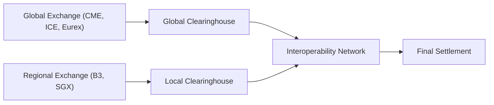

## Overview and Context

Imagine stepping onto a bustling trading floor—screens blinking in every corner, phone lines buzzing, and traders shouting orders in multiple languages. That was me, the first time I visited the Chicago Mercantile Exchange (CME) many years ago. I remember thinking, “Wow, the world gravitates here.” But guess what? That same sense of global connectivity and adrenaline can be found at regional exchanges, from Brazil’s B3 to the Singapore Exchange (SGX). In this section, we’ll explore why derivatives trade everywhere—and how these different markets connect to shape the global financial environment.

Derivatives, as introduced in earlier sections of this chapter, are financial instruments whose value depends on some underlying asset—like an equity index, a commodity, or an interest rate. However, the details can get surprisingly different when you move from one region to another. Some markets operate nearly 24 hours a day to meet global investor demand, whereas others are strongly tethered to local business hours and economic policies. Understanding these subtle—and sometimes not-so-subtle—differences can be critical if you want to hedge cross-border exposures, speculate in distant commodity markets, or just get a sense of how macro events in one region ripple throughout the world.

## Global Derivative Markets: The Big Picture

Global derivative exchanges typically attract international participants and claim center stage in shaping standardized contracts for commodities, equity indexes, currency pairs, and all sorts of interest rate benchmarks. Large exchanges like the CME, ICE (Intercontinental Exchange), and Eurex (based in Germany) each list a wide array of contracts. We’re talking everything from soybean futures, to WTI crude options, to Eurodollar futures, to equity index futures on major benchmarks like the S&P 500 or the Euro STOXX 50.

• CME (Chicago, U.S.): Known for interest rate futures (Eurodollar, SOFR-based contracts), equity index futures (like the E-mini S&P 500), FX futures, and a huge range of commodity futures.  
• ICE (U.S. & Europe): Home to the Brent crude oil contract, a globally recognized oil benchmark, along with energy, soft commodities, and financial derivatives in both the United States and Europe.  
• Eurex (Germany): A leading futures and options marketplace in Europe, especially strong in Euro-denominated interest rate derivatives (e.g., Bund, Bobl, Schatz) and European equity index derivatives (such as the EURO STOXX 50).  

An interesting feature of these global exchanges is that many of their products trade nearly around the clock across different time zones. For instance, the E-mini S&P 500 future can provide you with continuous market signals about U.S. equity sentiment, even if you’re physically located in Singapore or London, sipping coffee in the wee hours. This nonstop nature means macroeconomic data releases or political events in Asia or South America might instantly shift sentiment in contracts that primarily reference U.S. markets, and vice versa.

### Cross-Listing and Accessibility

Globalization has also spurred some popular contracts to become cross-listed on multiple exchanges. This cross-listing can improve accessibility for investors who, for example, want to trade a U.S. equity index future but prefer to settle in a local time zone. Cross-listing might also narrow bid–ask spreads by encouraging competition between exchanges. Nevertheless, slight differences in contract specifications—like tick sizes, margin requirements, or settlement procedures—can exist, so it’s important to check the fine print if you plan to arbitrage between listings.

### Macroeconomic Spillovers

One of the hallmark features of global derivative markets is how events in one region can quickly reverberate through markets around the world. A central bank’s surprise interest rate cut in emerging Asia might boost local equity indexes and create a rally in their futures—but that influence could spill over into global currency markets, which then shapes the direction of U.S. equity index futures in overnight trading. By the time the New York Stock Exchange opens, traders in Chicago and London will have already repriced those assets based on what happened in Asia while Americans were sleeping.

All of this interconnectivity magnifies the importance of risk management and currency hedging. As a global investor, you might hold derivative positions in multiple currencies—some denominated in U.S. dollars, others in euros, yen, or Brazilian reals—so you need to be on your toes about exchange rate risk. If your margin account is funded in a currency that suddenly shifts in value, you could face unexpected margin calls or capital shortfalls.

## Regional Derivative Markets: Local Flavors and Specializations

While global derivatives markets capture the spotlight, plenty of regional exchanges cater to local trading hours, currencies, and specific domestic assets. For example:

• B3 (Brazil): A key hub for equity index futures (like the Ibovespa), interest rate products tied to Brazil’s benchmark rates (often used to manage exposure to local interest rates), and a variety of commodity derivatives reflecting Brazil’s agricultural powerhouse status.  
• SGX (Singapore): A major gateway to Asian markets, SGX lists equity index futures such as the MSCI Singapore Index and, more famously, futures on the Nifty 50 (India’s major equity index), along with commodities relevant to the region.  
• ASX (Australia): Offers a set of interest rate futures tied to Australian government bonds, plus equity index futures reflecting the S&P/ASX 200.  
• JSE (Johannesburg, South Africa): Specializes in derivatives that track South African interest rates, local equities, and commodities integral to the nation’s economy (e.g., precious metals).  

Regional exchanges often shape products around local investor needs, time-zone constraints, and unique commodity production patterns. Let’s say you’re a coffee exporter in Brazil. You might hedge at B3 in local currency terms. Or if you’re a portfolio manager in Singapore who wants cost-effective hedges on Indian equity risk, you might use SGX’s Nifty 50 futures. These specialized contracts can be more convenient and cost-effective compared to trading globally recognized but perhaps less regionally tailored contracts.

### Time-Zone Differences and Overnight Markets

One thing that always amazed me about derivatives is how the sun never sets on key product trading. Markets shift from Chicago to London to Singapore to Tokyo and back again, in an endless rotation. If you’re a trader in New York but want to trade Brazilian interest rate futures on B3, you might face a mismatch in local business hours—and that can introduce unique liquidity dynamics.

Overnight markets or extended trading hours help soften the blow of these time-zone challenges. Take currency derivatives for instance: major FX pairs typically trade 24 hours a day (with short weekend downtimes), so you can manage exposure in real time, even as your local daylight fades.

However, not every regional contract is open around the clock. Some remain locked to local hours, which might limit your ability to react to breaking global news in real time if you only use that regional instrument. This interplay between local trading hours and global markets can sometimes present arbitrage opportunities, but it also comes with higher operational complexities—like coordinating settlement instructions among multiple regions.

## Differences in Regulatory Oversight

Regulatory frameworks differ drastically among jurisdictions. You’ll see and read a lot more about the regulatory environment in sections 1.5 (“Role of Clearinghouses and Regulatory Environment”) and 1.20 (“Cross-Border Regulatory Harmonization”). In some regions, cheering or lamenting might arise from stricter margin requirements and transaction taxes, while other markets might be more liberal and only require minimal collateral. As a participant, you must adapt your strategy to fit local rules—particularly around leverage limits, reporting obligations, and permissible counterparties.

If you’re drawn to an emerging market, be cautious about potential regulatory shifts. Interest rate caps or capital controls can abruptly change the risk profile of derivatives traded in that market. Some countries limit short-selling or impose restrictions on foreign investors—impacting liquidity and your ability to take or offset positions quickly.

## Operational Considerations: Clearing and Interoperability

Let’s talk about the nuts and bolts of how these transactions actually settle. We delved into clearinghouses and the significance of margin in section 1.5, but it’s worth restating here: clearinghouses reduce counterparty risk by guaranteeing trades. Yet not all clearinghouses are connected globally. Some global exchanges have robust interoperability with each other, allowing participants to clear trades from multiple venues through one clearinghouse or a network of clearinghouses.

In many regional markets, the clearing infrastructure may be specialized or even controlled by the local exchange. If you’re a cross-border trader, you need to figure out how to route margins and collateral effectively. Keep in mind that daily settlement timelines (i.e., the time by which you must meet margin calls) vary across time zones, which can lead to urgent actions at odd hours if you’re not prepared.

Below is a simple diagram that illustrates the concept of global and regional exchanges funneling trades into different clearinghouses:

In this hypothetical model:  
• Global exchanges funnel trades to a global clearinghouse.  
• Regional exchanges utilize their own local clearinghouses.  
• Both clearinghouses are interconnected via an interoperability network, providing operational efficiency for international participants.  
• Final settlement occurs once trades and margins have been processed across both networks.

## Currency Hedging: A Must for Global Investors

If you’re dealing in multiple derivative markets spanning multiple currencies, currency hedging becomes essential—almost mandatory, really. Exchange rate volatility can either amplify or erode returns, independent of the underlying position’s performance. For instance, you might hold a profitable euro-denominated equity futures position, but if the euro depreciates against your home currency, you could see your overall net returns shrink when you convert your profits back home.

Common hedging tools include FX forwards, currency futures, or options. You’ll often see advanced strategies that combine interest rate derivatives with currency overlays to manage cross-currency interest rate differentials—sometimes called a “carry trade” if you’re specifically seeking to profit from those differences. We’ll examine these strategies in more detail in Chapter 2 (Forward and Futures Contracts) and Chapter 4 (Options and Contingent Claims).

## Data Feeds, Technology, and Liquidity

Trading globally requires robust technological setups that unify data from multiple time zones and multiple regulatory regimes. A single, consolidated order book rarely exists across the derivatives world, so you might rely on aggregator platforms that combine feeds from multiple exchanges. Syncing these feeds in real time can be trickier than it sounds. If your system lags in receiving price updates from SGX or B3, you might fail to respond timely to significant price moves.

Liquidity—always a central theme in derivative markets—varies across both global and regional markets. Global exchanges often see deeper liquidity, meaning narrower bid–ask spreads and higher turnover. Regional markets can have pockets of impressive liquidity (e.g., the Ibovespa futures on B3 are quite liquid), but other local contracts might see thin volumes, leading to bigger spreads and greater price impact for large trades.

## Practical Example: Hedging Commodity Exposures

Suppose you’re a commodity trader in the U.S., but you have exposure to soybean production in Brazil. You could hedge your position on the CME soybean contract, which is referenced in U.S. dollars. However, because your production costs in Brazil are in local currency, you also need to manage the USD/BRL exchange rate. Alternatively, you might prefer the soybean contract listed on B3, which directly ties to local supply and demand and is denominated in Brazilian real. Yet the liquidity might be lower than CME, so you weigh the pros and cons:

• CME soybean futures: Deep liquidity, global acceptance, but you’ll bear separate USD/BRL currency risk.  
• B3 soybean futures: More direct local economic exposure, reduced currency mismatch but possibly thinner liquidity and some local regulatory nuances.  

In real life, large agribusinesses often hedge partly through their local market and partly through the more liquid global exchange. That choice depends on risk tolerance, contract specifications, currency exposure, and trading hours.

## Best Practices for Global Derivatives Traders

• Understand the Contract Specs: Not all “similar” contracts share the same tick size, expiration cycle, or settlement options.  
• Monitor Regulatory Shifts: Keep an eye on changes in transaction taxes, position limits, or capital controls.  
• Maintain Adequate Margins: You might face multiple margin deadlines and varied haircut rules across different clearinghouses.  
• Hedge Currency Risk: Use forwards, futures, or options to manage exchange rate risk if trading in multiple currencies.  
• Time-Zone Coverage: Have a strategy for responding to margin calls or price moves that occur overnight in your home time zone.  
• Leverage Technology Wisely: Unified data feeds and advanced order management systems can reduce operational risk, especially if you’re active in multiple markets simultaneously.

## Additional Observations and Pitfalls

• Overlapping Holiday Calendars: Different regional markets have different public holidays—watch out so you don’t assume a market is open when it’s closed or vice versa.  
• Political Risk in Emerging Markets: Changes to leadership, new tariffs, or social unrest can rapidly alter the attractiveness of local contracts.  
• Cleared vs. OTC Structures: Some local derivatives might still trade in over-the-counter frameworks rather than centrally cleared channels, impacting credit risk and regulatory compliance.  
• Interoperability Issues: Even if two exchanges say they have interoperability, the process for registering your trades or transferring margin can still be slow or complicated.

## Exam Tips and Real-World Applications

For your CFA exams, pay close attention to how currency hedging interacts with cross-border derivative exposures. You might see item-set questions that present a scenario where a portfolio manager uses a mixture of global futures and local forwards to hedge interest rate or commodity risk. You’ll be asked to calculate effective hedge ratios under different currency regimes, or to evaluate the impact of local interest rate shifts on a globally traded contract.

Also, don’t overlook basic definitions, like “cross-listing” or “interoperability,” as these can appear in multiple-choice questions. You might need to identify the primary benefit or the main operational challenge that arises when trades clear across different clearinghouses. Keep practicing scenario-based questions to consolidate your understanding of how local and global derivative markets interconnect.

## References

• World Federation of Exchanges: https://www.world-exchanges.org/  
• BIS (Bank for International Settlements). “Triennial Central Bank Survey: Foreign Exchange and Over-the-counter (OTC) Derivatives Markets.”  
• CME Group, ICE, Eurex official websites for product specifications and market updates.  
• B3, SGX official websites for local contract details.  

--------------------------------------------------------------------------------

## Practice Questions: Global vs. Regional Derivative Markets



### Which of the following is a characteristic generally associated with global derivative exchanges like CME or Eurex?

- [ ] They operate strictly within normal daylight business hours in a single time zone.  
- [x] They often offer extended or nearly 24-hour trading sessions.  
- [ ] They exclusively trade physically settled contracts.  
- [ ] They are subject to a single global regulatory authority.  

> **Explanation:** Global exchanges typically operate nearly 24 hours a day to cater to participants across different regions. There is no single global regulator, and many of their products are cash-settled.

### A portfolio manager in Singapore needs to hedge her U.S. equity exposure. Which approach best illustrates cross-listing?

- [ ] Opening a position in the S&P 500 futures on a London-based exchange.  
- [x] Trading an S&P 500 futures contract that is listed both in Chicago (CME) and Singapore (SGX).  
- [ ] Conducting an over-the-counter forward contract with a local bank.  
- [ ] Using an FX swap to convert U.S. dollars to Singapore dollars.  

> **Explanation:** Cross-listing refers to offering the same or very similar derivative contracts on more than one exchange, making them more accessible for investors in different time zones or regions.

### A Brazilian coffee exporter wants to lock in the price of coffee in local currency terms. Which exchange is most aligned with this goal?

- [ ] CME (U.S.)  
- [ ] ICE (U.S./Europe)  
- [x] B3 (Brazil)  
- [ ] Eurex (Germany)  

> **Explanation:** B3 caters to local currencies and commodities relevant to Brazil. Although the CME or ICE might have coffee contracts, these are typically quoted in U.S. dollars, thus adding additional currency risk.

### Time-zone differences in global derivative markets primarily affect traders in what way?

- [ ] They eliminate arbitrage opportunities.  
- [x] They can create overnight risk and margin-call challenges for cross-border traders.  
- [ ] They ensure that markets all open and close at the same hour globally.  
- [ ] They prevent futures on the same underlying from being traded outside the local region.  

> **Explanation:** The biggest operational effect of time-zone gaps is the potential for price movements and margin calls that occur outside a trader’s local business hours, creating added risk and administrative complexity.

### When an exchange in Asia cross-lists a popular U.S. equity index contract, which of the following benefits often arises?

- [x] Increased accessibility for Asian traders who wish to hedge U.S. market exposures during their local hours.  
- [ ] Full consolidation of clearing processes between the Asian exchange and the U.S. regulator.  
- [ ] Elimination of all basis risk.  
- [ ] A decline in global liquidity for that index.  

> **Explanation:** Cross-listing generally improves accessibility and potentially increases liquidity, allowing traders to manage exposures in their local time zone. It does not necessarily merge clearing or eliminate basis risk.

### A trader in Germany uses Eurex equity index futures and simultaneously hedges risk with an OTC swap referencing a Brazilian index. Which key risk factor is the trader most likely exposed to (apart from market risk)?

- [x] Currency risk.  
- [ ] Guaranteed liquidity.  
- [ ] Negative time-zone alignment benefit.  
- [ ] No transaction taxes.  

> **Explanation:** Whenever dealing with multiple currencies (e.g., euro-denominated futures and a swap potentially denominated in Brazilian real), currency risk arises unless it’s explicitly hedged.

### Which regulatory factor can significantly impact the liquidity of a regional derivative contract?

- [x] Position limits or capital controls imposed on foreign investors.  
- [ ] The presence of summer daylight saving time.  
- [ ] The total number of stocks listed on the local exchange.  
- [ ] The specific daily settlement time in Chicago.  

> **Explanation:** Regulations like capital controls, transaction taxes, or position limits can deter international participation, thus affecting the liquidity of a regional derivative contract.

### An investor places hedges on multiple exchanges to take advantage of time-zone coverage, but needs a single clearing arrangement. This is an example of:

- [ ] Cross-listing.  
- [ ] Arbitrage.  
- [ ] Multi-market speculation.  
- [x] Interoperability.  

> **Explanation:** Interoperability allows trades executed on multiple platforms or exchanges to be cleared through a single or interconnected clearing arrangement, simplifying collateral and margin requirements.

### Why might an investor choose to trade soybean futures on B3 rather than on the CME?

- [ ] B3 contracts are only available to domestic Brazilian investors.  
- [x] B3 soybean futures reflect local supply/demand and are denominated in Brazilian real.  
- [ ] The CME does not list soybean futures.  
- [ ] The B3 contract has no liquidity risk.  

> **Explanation:** B3’s soybean futures offer a localized approach, denominated in BRL and reflective of domestic market fundamentals. By contrast, the CME contract is dollar-denominated and references a more global benchmark.

### True or False: Global derivative markets are regulated by a single, unified global authority that standardizes practices across all exchanges.

- [x] True  
- [ ] False  

> **Explanation:** This is a trick question. There is no single global authority regulating all derivative markets. Different regulators (e.g., CFTC in the U.S., ESMA in Europe, MAS in Singapore) oversee their own jurisdictions. Hence, the statement as written is false. (If you selected “True,” watch out for these sorts of exam pitfalls!)


