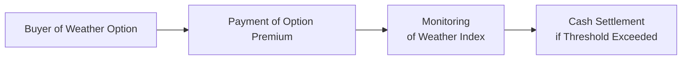

## Introduction

Derivatives don’t just exist for equity indexes, interest rates, or commodities like gold and oil. In today’s ever-evolving markets, they also cover environmental and climate-related exposures—where the underlying factors might be rainfall levels, average temperatures, or carbon emissions. It’s actually pretty fascinating. I remember chatting with a friend who once jokingly asked, “So, can I actually hedge the risk that it rains on my wedding day?” And while wedding weather might be a stretch, major corporations do hedge temperature and precipitation risk. Essentially, that’s how the market for weather derivatives got started. Let’s walk through each of these derivative categories—weather, energy, and carbon emissions—and see how they help individuals and organizations manage some pretty tricky risks.

## Weather Derivatives

Weather derivatives are unique instruments that hinge on measurable weather-related data, such as temperature, snowfall, or rainfall. You’ll find references back in section “1.3 Derivative Markets and Participants,” where we talk about which types of players typically use these derivatives—hedgers, speculators, or arbitrageurs. 

But anyway, from a practical standpoint, imagine you run an amusement park. Naturally, you worry about rainy days killing your ticket revenues. The basic idea behind a weather derivative is that if rainfall (or some other weather index) goes past a particular threshold, you receive a payout. Does that ring a bell from other derivative payoffs? Sort of, but the “underlying” isn’t a standard asset price; it’s something intangible like the tenth consecutive day above 30°C. 

• Primary Users. Typical hedgers include energy firms (e.g., gas and electric utilities), agricultural companies, retail chains, and event organizers. A ski resort might enter a snowfall swap to hedge a poor snow season. A beverage company might hedge extremely cool summer weather that could reduce cold drink consumption.

• Indexes and Payoffs. These derivatives often settle on “degree days.” A Cooling Degree Day (CDD) index might measure how much daily temperatures exceed a base temperature (say 65°F), aggregated over a month or season. The payoff formula for a weather derivative might look like:

(1)  
Payout = Notional × max(0, (Index − Strike))

…where Index is the measured value for total degree days (or precipitation) over a defined period, and Strike is the contract threshold. If the Index stays below the Strike, there’s no payout. If the Index surpasses the Strike, you get a payoff scaled by the difference.

• Contract Types. Weather derivatives commonly take the form of swaps, options, or collars on the relevant index. For instance, a “temperature swap” exchanges fixed payments for floating proceeds based on actual measured degree days across a season.

• Settlement. Most weather derivative contracts are cash-settled because, let’s be real, you can’t physically deliver “50 fewer millimeters of rain.” Typically, an independent weather data provider (like a government meteorological agency) publishes official stats used for settlement.

Below is a simple depiction of the flow for a weather option, where a buyer pays a premium and receives a payout if the weather index meets or exceeds (or fails to meet) the contract threshold.

### Example: Cooling Degree Day Option

Suppose an electric utility wants to hedge a very hot summer in July. They purchase a call option on an index defined as total CDD for July. Let’s say each CDD above 200 triggers a $500 payout, with a $25,000 maximum. If the official July CDD ends up at 210, the payoff is (210 – 200) × $500 = $5,000. The utility essentially offsets extra energy purchase expenses from higher demand. 

### Pricing Complications

Weather derivatives can be tricky to price because temperature and rainfall aren’t traded on an exchange in the same sense as oil or stocks. You rely on historical meteorological data, statistical models, and sometimes advanced forecasting. Also, as climate patterns shift unpredictably, the historical data might not always mirror future conditions.

## Energy Derivatives

Energy derivatives have been around a while—futures, forwards, and swaps on oil, natural gas, and electricity frequently trade on both exchanges and over-the-counter (OTC) markets. These contracts help companies—like producers or utilities—hedge the roller-coaster price swings that often characterize energy markets. In “1.4 Exchange-Traded vs. Over-the-Counter Derivatives,” you’ll find more detail on each trading venue’s advantages and drawbacks.

### Types of Energy Derivatives

• Oil Derivatives. Crude oil is among the most heavily traded commodities in the world. Producers lock in future selling prices via oil futures and swaps. Airlines might hedge their jet fuel costs (strongly correlated with crude oil) to manage operating expenses.

• Natural Gas Derivatives. Natural gas prices can spike during harsh winters. Utilities use natural gas futures to secure stable purchase prices. Marking to market daily (discussed in “2.2 Futures Contracts: Marking to Market and Margins”) means you need good liquidity management, but it also helps keep credit risk in check.

• Electricity Derivatives. Electrical power is regionally priced, so electricity futures can look like dozens of distinct local markets (e.g., PJM in the U.S., Nord Pool in Europe, etc.). The difference is that electricity can’t be easily stored—making the shape of forward curves and basis risk unique. You may recall from “2.6 Commodity, Interest Rate, and Equity Futures” that electricity is a commodity with potentially significant storage constraints. In electricity’s case, storage is basically nonexistent for large-scale provisioning, so short-term supply-demand imbalances can produce episodes of extreme volatility.  

### Geopolitical Volatility and Seasonality

Energy prices aren’t just about supply and demand in the neat sense. They can jump if there’s a pipeline disruption, a geopolitical event that limits oil production, or extreme seasonal shifts. Even political announcements—like new environmental rules—can send prices on a tear. Spot this in your exam scenarios: they often provide context about potential shocks to test how you’d hedge or speculate.

### Risk Management Approaches

Traders and corporate treasury teams frequently apply robust strategies to mitigate exposures:

• Hedging with Futures/Forwards. A utility might short natural gas futures before the winter to lock in lower purchase costs, effectively paying the gains on the hedge if natural gas prices go down, or collecting on the hedge if prices spike.  
• Using Options for Upside Retention. Airlines might buy call options on oil to limit the maximum cost of fuel while still preserving some benefits if prices happen to dip.  
• Spread Trading. Market participants also trade the spread between different energy products (e.g., crack spreads between crude oil and refined products like gasoline).

Remember: from “1.7 Distinguishing Hedgers, Speculators, and Arbitrageurs,” not everyone in the energy derivatives market is a pure hedger. Many speculators enter to profit on short-term price movements, and arbitrageurs will exploit any price misalignments.

## Carbon Emissions Derivatives

Now, carbon emissions derivatives are particularly interesting. They first gained traction with regulations such as Europe’s Emissions Trading System (EU ETS). Accepting the reality of climate change means many companies face regulatory limits on how much carbon dioxide (CO₂) they can emit. If they exceed their limit, they must purchase carbon allowances or offsets on the market. If they emit less, they can sell their surplus allowances.

### The Basics

• Carbon Emission Allowances/Permits. In a “cap-and-trade” system, regulators (like the EU) set an overall emissions cap. Firms receive or purchase allowances that permit them to emit a certain amount of CO₂ or other greenhouse gases. 
• Carbon Emissions Derivatives. Firms and financial players trade futures, forwards, and options on those allowances. This helps them hedge or speculate on changes to carbon prices. 
• Offsets. Some systems also allow “offsets,” typically greenhouse gas reduction projects (like reforestation) that generate tradable credits.

### Example: EU ETS Futures

Consider a European utility that expects to produce 300,000 tons of CO₂ next year. The current regulatory environment requires them to hold one allowance per ton of CO₂. If they only have 200,000 allowances on hand, they need an extra 100,000. To manage the price risk, the utility might purchase carbon allowance futures at the current price of, say, €90 per allowance. If by next year, carbon allowance prices climb to €110, having locked in at €90 means the utility avoids paying the higher spot price.

### Trading Venues and Regulations

Most carbon allowance derivative trading in the EU occurs either via regulated exchanges (like ICE) or OTC. Under “1.5 Role of Clearinghouses and Regulatory Environment,” we discuss that regulated exchanges reduce credit risk by interposing a clearinghouse. Meanwhile, compliance with IFRS or US GAAP means these derivatives—like other financial instruments—are recognized at fair value on the balance sheet (subject to hedge accounting rules if the firm elects them, see “6.12 Hedge Accounting Considerations”).

### Growth of Global Carbon Markets

Beyond Europe, there are carbon markets in California, Quebec, parts of Asia, and other regions. Each has slightly different offsets and allocation systems. Market participants who expect stronger emissions regulations in the future may buy carbon credits early, hoping to resell them at higher prices.

## Challenges in Pricing and Risk Management

When it comes to weather, energy, and carbon derivatives, modeling can get complicated. While standard no-arbitrage arguments (see “7.1 Principles of No-Arbitrage and the Law of One Price”) and cost-of-carry frameworks (see “7.3 Cost of Carry Model for Pricing”) apply to some extent for energy products, you face significant extra complexities:

1. Weather Uncertainty. Weather events are borderline random. We rely heavily on historical data and sophisticated climate models, but conditions can diverge from statistical norms.  
2. Extreme Events. Energy markets can see large price jumps due to natural disasters, geopolitical tensions, or seasonal demand spikes. Standard volatility assumptions might not suffice.  
3. Regulatory Shifts. For carbon emissions, if stricter rules come in, the price of allowances might jump. Changes to the supply of allowances can disrupt typical market equilibrium.  
4. Data Availability. For weather derivatives, accurate and consistent meteorological data is crucial, but historical data might be incomplete, or measurement stations can relocate over time. Not to mention the potential shifts from climate change patterns.

## Practical Example: A Utility Hedging Both Weather and Carbon

Let’s combine two types of derivatives in a single scenario:  
• A European power utility that burns natural gas to produce electricity might face:  
  – Warmer-than-expected summer that reduces electricity load.  
  – Fluctuations in carbon allowance prices if emissions caps become stricter.

They decide to purchase a weather put option (paying out if temperature falls below a certain threshold, meaning electricity demand dips) and simultaneously lock in carbon allowance futures to manage compliance costs. If it ends up being a milder summer, the drop in electricity revenue is partially offset by the payout on the weather put. Meanwhile, if carbon prices skyrocket, the futures contract ensures they acquired allowances at a previously set (lower) price.

## Best Practices and Common Pitfalls

• Accurate Data and Analytics. For weather derivatives, verify your data source: official meteorological agencies are often used to prevent disputes over local temperature readings.  
• Overhedging. Don’t go overboard. Hedging can reduce certain risks but can also lock you into less profitable conditions if the weather turns out to be favorable.  
• Basis Risk. In energy and carbon derivatives, basis risk arises if the derivative’s settlement index or region doesn’t perfectly match your real underlying exposure.  
• Regulatory Insight. Keep an eye on changing carbon regulations. What’s allowable today might be restricted tomorrow, so building flexibility into your derivative strategy is wise.  
• Collateral Management. As we learn in “6.9 Collateralization and Funding Costs,” many of these derivatives might require margin (if exchange-traded) or posted collateral (if OTC). That ties up capital and can become expensive if markets move against you.

## Exam Application and Tips

You might see scenario-based questions in the exam asking you to:  
• Propose an effective hedge strategy for a power company’s energy and weather exposures.  
• Evaluate the potential payoff from a precipitation swap for a farming co-op.  
• Discuss how a carbon emissions futures contract can be used by a manufacturing firm to manage compliance costs.  
• Perform short calculations (like the earlier example with degree days).  
Remember to read the question carefully to identify the underlying index, the contract structure, and the payoff conditions. Also, pay attention to references in the problem statement about unexpected events—for example, a mention of “recent heat waves” or “new carbon legislation.” That’s typically a justification for changing derivatives prices or usage.

Finally, time management is crucial. When tackling constructed-response questions (for instance, if you see them at advanced levels), break down each step logically—define the payoff formula, identify the data given, and then apply your knowledge to compute or discuss the result. Show your step-by-step reasoning, especially if the question is multi-part.

## References

• CME Group Weather Product Suite:  
  https://www.cmegroup.com/trading/weather/  

• Ellerman, A. Denny, et al. Pricing Carbon: The European Union Emissions Trading Scheme. Cambridge University Press, 2010.

• Official CFA Institute Readings on Derivatives and Alternative Investments (2025 Curriculum).

• IFRS 9 Financial Instruments and ASC 815 (US GAAP) for accounting guidance on derivatives.

• Additional Resources:  
  – Nord Pool (Nordic Power Market) – For electricity pricing and derivatives in Northern Europe.  
  – ICE (Intercontinental Exchange) – Major platform for carbon allowance futures and options.  

## Test Your Knowledge: Weather, Energy, and Carbon Credits



### Which best describes the purpose of weather derivatives?

- [x] To hedge cash flow or revenue against adverse temperature or precipitation outcomes
- [ ] To eliminate all weather-related operating risk
- [ ] To hedge only exchange rate fluctuations linked to agricultural exports
- [ ] To speculate purely on commodity price spreads

> **Explanation:** Weather derivatives hedge monetary exposure to actual weather conditions. They won't fully eliminate all operational risk but do mitigate specific concerns related to climate and seasonal factors.

### In a typical temperature-based weather option, what is the “underlying”?

- [x] The number of degree days relative to a reference temperature
- [ ] The spot price of crude oil
- [ ] The forward yield curve for interest rates
- [ ] A measure of the global money supply

> **Explanation:** Weather options often reference a temperature index in terms of cooling or heating degree days, not traditional commodities or financial instruments like oil or yields.

### Which market participant would most likely prefer using carbon allowance futures?

- [x] A power plant needing to secure allowances for expected CO₂ emissions
- [ ] A currency trader trying to hedge foreign exchange risk
- [ ] A real estate developer building residential apartments
- [ ] An e-commerce startup with no significant environmental impact

> **Explanation:** Power plants often face carbon emission caps under regulatory frameworks. Using carbon allowance futures allows them to lock in future prices and manage compliance costs.

### A crude oil refiner uses energy derivatives primarily to:

- [x] Hedge input costs and lock in margins
- [ ] Speculate exclusively on interest rate movements
- [ ] Eliminate its operational risk from equipment failures
- [ ] Avoid paying taxes on refined products

> **Explanation:** Refiners commonly hedge their input costs (crude oil) or lock in the crack spreads (the margin between crude and refined products). The use of energy derivatives is fundamentally about cost and margin management.

### Why might a beverage manufacturer choose to buy a call option on a temperature index?

- [x] To compensate for potential loss in beverage sales if cool weather reduces demand
- [ ] To hedge an anticipated increase in interest rates
- [x] To offset reduced revenue from cooler-than-usual conditions during summer
- [ ] To lower the cost of raw materials by changing shipping routes

> **Explanation:** A beverage company’s summer sales can suffer if temperatures remain unusually low. A weather derivative call option on a temperature index may provide a payout in such unfavorable conditions.

### What is the credit risk management benefit of trading carbon allowance futures on an exchange?

- [x] The clearinghouse acts as an intermediary to reduce counterparty default risk
- [ ] Futures contracts carry zero default risk by definition
- [ ] OTC derivatives always have lower margin requirements
- [ ] Credit risk is irrelevant for environmental instruments

> **Explanation:** Exchange-traded futures employ a clearinghouse, which interposes itself between buyers and sellers, thereby mitigating the counterparty default risk inherent to bilateral OTC contracts.

### If a ski resort sells a snowfall put option, under what situation will the resort pay the buyer?

- [x] If the actual snowfall is below the contract’s threshold
- [ ] If the snowfall surpasses the contract’s threshold
- [x] If the temperature drastically drops, regardless of snowfall
- [ ] Only if the contract matures in the summer

> **Explanation:** A snowfall put option pays the buyer when snowfall is below a certain level, meaning the resort (as the option seller) would pay the shortfall compensation.

### In carbon emissions markets, “offsets” generally refer to:

- [x] Recognized credits from projects that reduce greenhouse gases elsewhere
- [ ] Shares of stock in renewable energy companies
- [ ] Exchange-traded notes tracking a pollution index
- [ ] Government subsidies for retrofitting factories

> **Explanation:** Offsets are awarded for projects that actively reduce or capture CO₂ (like reforestation). Entities can use these offsets to meet part of their regulatory compliance requirements.

### Which of the following would most likely cause a spike in natural gas futures prices?

- [x] A colder-than-expected winter
- [ ] A stable political environment and constant supply output
- [ ] Reduced use of natural gas for electricity generation
- [ ] An oversupply of natural gas in local markets

> **Explanation:** Colder-than-expected winters drive up heating demand for natural gas, often pushing futures prices higher.

### True or False: Carbon derivatives are used solely by companies that must comply with carbon regulations.

- [x] True
- [ ] False

> **Explanation:** Strictly speaking, compliance entities are the primary users. Speculators and investors also trade carbon assets, but from an exam standpoint, the question is highlighting that the main reason these products exist is to help regulated firms meet statutory requirements.  


