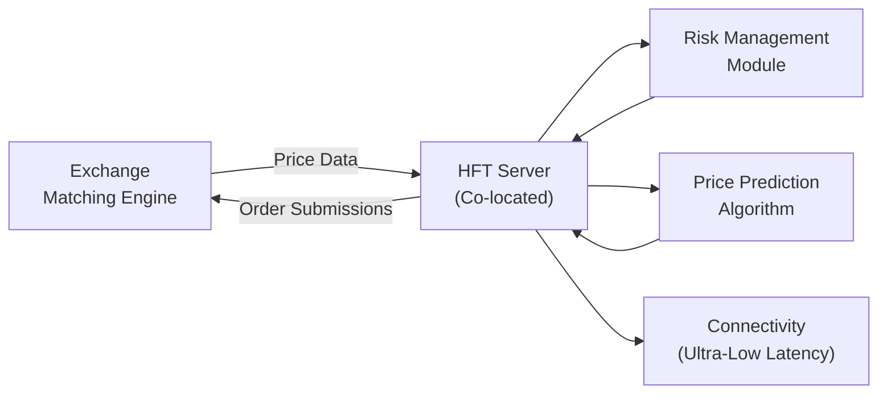

## The Rise of Automated Trading

Automated trading, sometimes called algorithmic or “algo” trading, has changed the face of modern financial markets. When I first heard about “robots” placing trades, I couldn’t help but imagine a sci-fi scenario of computers taking over the world. Well, that might be a bit dramatic, but automated trading definitely has transformed the way traders execute orders. Instead of picking up a phone and calling a broker, institutions now rely on computer programs to automatically trigger trades based on prices, economic data, or even social media sentiment.

From a derivatives perspective, algorithms have become essential for tasks like rolling futures positions, dynamic hedging with options, and arbitraging tiny inconsistencies in commodity or interest rate markets. At the heart of automated trading are sophisticated and data-driven strategies that reduce the reliance on human intervention in the order flow. The result? Quicker execution, narrower bid-ask spreads (sometimes), and precise timing of trades.

## Essentials of High-Frequency Trading

High-frequency trading (HFT) is the “Formula One” version of automated trading. Think shorter holding periods—sometimes just milliseconds. These strategies rely on ultra-low latency connections, co-located servers, and advanced risk models to make (and unwind) positions faster than most humans can blink. High-frequency traders scour markets for tradeable patterns and fleeting price discrepancies, often capitalizing on very small movements but leveraging huge volumes.

Why derivatives, you might ask? Because derivatives allow for leveraged exposure to underlying assets, so even a tiny price mispricing could yield significant gains when multiplied by large notional amounts. However, these same leveraged structures also amplify risk. If something goes wrong—as we saw in the famous “flash crash” episodes—HFT firms can unintentionally cause rapid price volatility, leaving regulators and other market participants scrambling.

## Algorithmic Strategies in Derivatives

Traders and investment managers use automated strategies in many corners of the derivatives world. Here are some categories:

• Market Making: Firms deploy algo strategies to continuously quote bid-ask prices, aiming to profit from the small spread. In derivatives like futures or options, these market makers help provide liquidity.

• Statistical Arbitrage: Programs model relationships among various instruments (for example, futures on correlated equity indices) and trade them if prices diverge from historical or theoretical norms. The idea might be to buy S&P 500 futures while shorting NASDAQ 100 futures if a model signals the S&P 500 is undervalued relative to the NASDAQ.

• Hedging and Risk Transfer: Automated algorithms continuously manage hedge ratios for large pension funds or insurance companies. For example, if interest rates shift by 10 basis points more than expected, an algorithm can instantly place offsetting trades in interest rate swaps or futures.

• Momentum and Trend-Following: Some automated strategies identify short-term price trends in underlying assets and use derivatives (like index futures) to capture quick gains.

• Machine Learning Strategies: Advanced AI/ML models ingest large volumes of price data, news sentiment, or macroeconomic indicators to predict short-term price directions. They then execute derivative trades almost instantaneously based on these signals.

## Market Microstructure Effects

Automated trading—especially HFT—has had a profound impact on market microstructure, which refers to how market participants interact to determine asset prices. At first glance, more liquidity enters the system, and bid-ask spreads can narrow because algorithms place numerous limit orders at tight price levels. But there can be times when these benefits vanish, like during periods of market stress. Algorithms may withdraw liquidity faster than you can say “flash crash.”

This phenomenon is partly because many HFT systems are designed to react quickly to signs of instability, canceling quotes faster than manual traders ever could. The result is a more fragile liquidity environment. Meanwhile, other traders might see ephemeral prices flickering in the order book—hundreds of quotes appear and disappear in fractions of a second. Some would call that beneficial liquidity; others label it “phantom liquidity” because it might evaporate in a crisis.

In our broader curriculum, especially sections like Market Microstructure and Liquidity Effects on Derivative Trading, you’ll see how the presence (or sudden absence) of these algorithms can materially influence execution costs, slippage, and short-term price volatility.

## Co-Location, Latency, and Technology Infrastructure

High-frequency firms spend millions for co-location: physically placing their servers in the same data center as the exchange’s matching engine. This arrangement trims down latency—the delay between a quote or price update and the moment a trading system can react to it. A few microseconds might not matter to you and me, but for HFT strategies, microseconds can be the difference between executing a profitable market-making spread and missing the trade altogether.

A typical HFT technology stack might include:

• Ultra-Fast Market Data Feeds: Low-latency connections to exchanges to receive price quotes in near real-time.  
• High-Performance Computing (HPC) Infrastructure: Servers optimized for parallel calculations, often employing specialized hardware.  
• Real-Time Risk Controls: Automated checks that compare the trade size or price deviation to set risk tolerances—essential for preventing runaway algorithms.  
• Kill Switches and Circuit Breakers: Mechanisms to stop or pause trading if something goes haywire—like a sudden spike in order rejections or pricing anomalies.

Below is a conceptual depiction of how a co-located algo trading framework might look in a derivatives context:

## Potential for Market Manipulation

Automated trading is not inherently malicious, but its scale and speed can enable manipulative practices:

• Spoofing: A trader places large orders they never intend to execute, purely to push prices in a certain direction or intimidate other participants. Then they suddenly cancel these orders.  
• Quote Stuffing: Flooding the market with massive (and often unnecessary) orders to overwhelm competitors’ systems. This disrupts data feeds and may slow down other traders’ ability to respond.  
• Layering: Similar to spoofing, layering involves placing multiple layers of bogus orders at different prices to create an illusion of market depth.

Regulators worldwide keep a close watch on these tactics, imposing hefty fines and sometimes criminal penalties. From a portfolio management standpoint, an awareness of these manipulative tactics is crucial to evaluate short-term price distortions and, more importantly, to avoid inadvertently doing something that violates regulations.

## Regulatory and Ethical Considerations

Financial authorities have reacted to possible misconduct with a variety of new rules. For instance, regulators ask HFT firms to register as market participants subject to capital requirements and ongoing surveillance. Exchanges impose fees on canceled orders past a certain ratio to deter quote stuffing. Some jurisdictions require that all automated strategies undergo thorough system testing and hazard modeling before going live.

Organizations such as the CFA Institute emphasize ethical behavior and transparency, encouraging practitioners to design algorithms that respect fairness and market integrity. In practical terms, that means building compliance into the development pipeline. If your firm’s developers create an algo to trade currency futures, the code must pass not only performance tests but also regulatory checks. The last thing anyone wants is to wake up to headlines about a huge fine because their new trading bot performed manipulative trades overnight.

## Effective Risk Management

Risk management in automated trading can be tricky. Instead of a single portfolio manager pushing a button, thousands of trades might fire off every second. A robust control framework is essential:

• Pre-trade Risk Checks: Validate each order (e.g., position size, price deviation from last traded price) against a set of thresholds.  
• Real-Time Monitoring: Track executed trades, open positions, and potential exposures across correlated instruments to prevent layering of unintended risk.  
• Dynamic Kill Switch: If the system goes “off the rails” by placing trades outside normal bounds, you want an automatic mechanism to shut down the algo in milliseconds.  
• Stress Testing: Simulate extreme market movements and see how your algorithms respond. If a large shock quickly triggers margin calls, do the algos gracefully unwind or do they add more positions?  
• Human Oversight: Even the best code can fail. Having a watchful human operator who can intervene (or at least confirm the kill switch) is vital.

On top of the risk management apparatus, it is crucial to maintain thorough compliance records. Regulators often want to see logs of how orders were generated, risk parameters in place, and how your firm responded to any anomalies.

## Practical Examples and Case Studies

Let’s take a scenario I personally witnessed in a training environment (thankfully not live). A new machine-learning-driven algo was tested for trading futures on agricultural commodities. The training data set was incomplete—it missed a small chunk of historical data from a prior drought cycle. Lo and behold, when similar drought conditions reappeared, the algo misread rapidly rising prices as an anomaly and went short futures at an aggressive pace. The real-time risk limits intervened, halting the strategy after a few trades. This avoided what could have been a major loss. This example highlights a key lesson: robust historical data and thorough backtesting are essential for success in automated derivatives trading.

In another widely reported case—often labeled a “mini flash crash”—an algo that was designed for small-lot trade scalping in currency futures had an integer overflow bug, meaning it suddenly started issuing orders priced at zero. While the exchange’s safeguard logic rejected these orders, the repeated attempts flooded the market data feed, briefly slowing other participants’ access. This is an example of how even a minor software glitch can cause system-wide effects in an automated environment.

## Conclusion and Final Thoughts

Automated trading and high-frequency trading (HFT) are set to remain integral to modern derivatives markets. Their speed and efficiency serve vital functions—from stabilizing spreads to offering hedging opportunities—but they also pose new challenges around liquidity fragility and systemic risk. If you’re aiming to integrate these strategies into a portfolio management context, remember that effective use of algo trading hinges on strong risk controls, compliance with regulations, and a solid ethical foundation.

Markets will continue evolving, and so will the technology. Perhaps tomorrow we’ll have quantum-computing-based algo systems that can model entire market ecosystems in real time—who knows? For now, the best approach is to keep learning, apply robust safeguards, and remain mindful of both the opportunities and the risks.

## References

• Aldridge, Irene. “High-Frequency Trading: A Practical Guide to Algorithmic Strategies and Trading Systems.” Wiley, 2nd ed., 2013.  
• CFA Institute. “Algorithmic and High-Frequency Trading.”  

---

## Test Your Knowledge: Automated and High-Frequency Trading in Derivatives



### In automated trading, which approach focuses on repeatedly buying and selling derivatives to profit from very small, short-lived price discrepancies?

- [ ] Market making
- [ ] Execution-only trades
- [x] High-frequency trading
- [ ] Long-term macro strategy

> **Explanation:** High-frequency trading (HFT) aims to capitalize on incremental price discrepancies in short bursts, often within milliseconds.

### Which of the following best describes co-location services?

- [x] Placing trading servers in close proximity to an exchange’s matching engine
- [ ] Using the same broker to execute both equities and derivatives
- [ ] Hosting algorithms on personal laptops
- [ ] Purchasing additional bandwidth from retail internet providers

> **Explanation:** Co-location reduces latency by putting a firm’s servers physically near the exchange’s servers, which improves execution speed.

### From a regulatory standpoint, which practice involves placing large orders to fool the market about supply or demand and then canceling them?

- [ ] Momentum shipping
- [x] Spoofing
- [ ] Latency arbitrage
- [ ] Execution layering

> **Explanation:** Spoofing is the act of placing large false orders to manipulate perceived market liquidity or prices, then canceling them before execution.

### What is the primary benefit of automated market making in derivatives?

- [ ] It eliminates all risk for market makers
- [ ] It removes the need for hedging
- [x] It can narrow bid-ask spreads by continuously updating quotes
- [ ] It solely benefits retail investors

> **Explanation:** Automated market making helps provide liquidity consistently, narrowing bid-ask spreads and facilitating trade executions.

### Which of the following is an essential control feature used to prevent runaway algorithms?

- [ ] Increasing the server’s clock speed
- [x] Kill switches
- [ ] Encouraging manual trades only
- [ ] Randomizing order times

> **Explanation:** A kill switch or circuit breaker can stop an automated trading strategy if it breaches predefined risk thresholds or shows erratic behavior.

### Which statement about market microstructure and HFT is most accurate?

- [x] HFT can improve liquidity under normal conditions but may withdraw liquidity rapidly under stress
- [ ] HFT consistently stabilizes markets in all conditions
- [ ] HFT has no impact on bid-ask spreads
- [ ] HFT prohibits real-time trade execution

> **Explanation:** While HFT provides liquidity under typical circumstances, it can swiftly disappear when volatility spikes, making markets more fragile.

### Which of the following describes a frequent motivation for machine learning-driven strategies in derivatives?

- [x] They can parse vast amounts of data to detect hidden patterns
- [ ] They remove all need for calibration or backtesting
- [ ] They never require large computing resources
- [ ] They are exempt from regulatory reporting

> **Explanation:** Advanced AI/ML strategies can process huge data sets to reveal predictive signals that would be impossible to discern manually.

### Which factor often pushes HFT firms to remove liquidity during heightened market volatility?

- [ ] They have an obligation to remain in the market
- [x] Their algorithms reduce or cancel orders to mitigate risk exposure
- [ ] Regulatory agencies force them to exit positions
- [ ] They seek to increase bid-ask spreads voluntarily

> **Explanation:** HFT algos frequently retreat from the market if risk thresholds are exceeded, heightening liquidity shortfalls during volatile periods.

### What is the main difference between automated trading strategies and high-frequency trading strategies?

- [ ] Automated trades are only used for long-term positions, while HFT is used for hedging
- [ ] Automated strategies always require co-location, while HFT does not
- [x] Automated strategies can be longer-term or short-term, whereas HFT focuses on extremely short-term trades
- [ ] They are identical; there is no difference

> **Explanation:** Automated trading covers a broad spectrum of time horizons, while HFT specifically exploits very short-lived price movements.

### Automated trading can help narrow bid-ask spreads, but it also:

- [x] Can exacerbate volatility if algorithms fail or withdraw liquidity quickly
- [ ] Is the guaranteed solution to all liquidity issues
- [ ] Eliminates market manipulation entirely
- [ ] Makes manual trading more important

> **Explanation:** Automated trading can enhance liquidity and efficiency, but it also introduces vulnerability if large volumes of orders are suddenly canceled or if an algo malfunctions.


