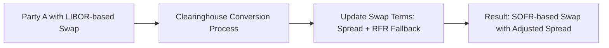

## Introduction
Let’s be honest: if you’d asked me a few years ago whether LIBOR—once described as the “world’s most important number”—would disappear, I might have said, “No way, it’s too critical for derivative markets, syndicated loans, and bond pricing.” Well, here we are. LIBOR has been replaced (almost entirely) by alternative Risk-Free Reference Rates (RFRs) in major jurisdictions around the world. It’s a huge transformation with lots of exciting (and sometimes daunting) implications for derivatives, especially interest rate swaps, futures, and other products that used to be pegged to LIBOR.

You might wonder: so what exactly happened? In short, several high-profile manipulation scandals eroded confidence in how LIBOR was determined. Regulators and market participants globally banded together to find more robust benchmarks, culminating in the birth and adoption of RFRs such as SOFR (Secured Overnight Financing Rate) in the US, SONIA (Sterling Overnight Index Average) in the UK, and €STR (Euro Short-Term Rate) in the Eurozone. These rates, derived from observable overnight transactions, are considered more transparent, less prone to manipulation, and more reflective of “risk-free” borrowing costs.

Below, we’ll take a deep dive into risk-free reference rates, why the shift occurred, how the transition affects the derivatives market, and what you need to watch out for as you study and practice in the wide world of finance.

## Why the Market Transitioned Away from LIBOR
If you were around in 2012, you probably remember the headlines about banks colluding to manipulate LIBOR submissions. This was not exactly a minor scandal—it cast a long shadow over one of the pillars of modern finance. LIBOR was determined by a panel of banks submitting estimations of their interbank borrowing rates. Unfortunately, those submissions weren’t always honest. As a result:

• Confidence in LIBOR shattered, prompting intense regulatory scrutiny.  
• Financial authorities, including the Financial Stability Board (FSB), recommended transitioning to transaction-based benchmarks instead of subjective quotes.  
• SOFR, SONIA, and other RFRs were introduced to provide robust alternatives backed by real transactions.  

This transition wasn’t just about solving an ethical or credibility issue; it also became a concern for systemic risk. Regulators recognized the massive notional exposure in derivatives, loans, and other instruments tied to LIBOR. If that reference rate was unreliable, then the entire financial system was subject to shaky ground.

## Key Differences Between LIBOR and New RFRs
A big question for many derivatives professionals is: “How exactly do RFRs differ from good old LIBOR?” Let’s highlight some critical distinctions:

• Transaction-Based vs. Survey-Based: RFRs come from overnight borrowing transactions in deep, liquid markets. In contrast, LIBOR was based on an estimation process by contributing banks.  
• No (or Minimal) Credit Premium: LIBOR implicitly included a bank credit risk component (the cost at which banks can borrow from each other). RFRs, on the other hand, aim to be practically risk-free, reflecting minimal or no credit risk.  
• Daily Compounding Conventions: Because RFRs are overnight rates, the final interest over a specific period often involves compounding daily rates (in arrears or in advance). LIBOR was typically set at the start of a period (in advance).  
• Increased Transparency: RFRs are published based on verifiable transaction data, reducing the chance of manipulation.  

When you’re valuing or hedging derivatives that used to reference LIBOR, you’ll find these differences can significantly alter the way floating payments are calculated or how the discount curve is constructed.

## Major RFRs Around the World
Although SOFR and SONIA get most of the headlines, each currency region has its own designated RFR. Below are some of the most common:

• US: SOFR (Secured Overnight Financing Rate)  
• UK: SONIA (Sterling Overnight Index Average)  
• Eurozone: €STR (Euro Short-Term Rate)  
• Japan: TONA (Tokyo Overnight Average Rate)  
• Switzerland: SARON (Swiss Average Rate Overnight)  

All these rates share a common philosophy: reflect near risk-free borrowing costs derived from high-volume, overnight funding markets.

## Impact on Derivative Products and Markets
For derivatives geeks like many of us, the question is: “How does the shift from LIBOR to RFRs reshape the derivative landscape?” Well, it’s been a big deal:

• Contract Fallbacks: Existing trades referencing LIBOR needed fallback provisions—so if LIBOR goes away, the floating rate automatically converts to a new reference (with possible adjustments, like a spread to reflect the credit risk difference).  
• Spread Adjustments: Because RFRs generally sit lower than LIBOR, a spread is often added to the RFR to mimic the prior LIBOR-based rate. This spread is determined by historical comparisons between LIBOR and the RFR over a predefined period.  
• Swaps and Swaptions: Interest rate swaps commonly referencing LIBOR for the floating leg had to adopt new RFRs such as SOFR. After the transition, the cleanest approach for new swaps is to reference SOFR from inception.  
• Basis Risk: Even though RFR-based instruments are standardized, you still might have basis risk if your legacy contracts remain on different fallback conventions, or if you hold exposures in multiple currencies with slightly different transition timelines.  
• Margin Calculations and Collateral: Central counterparties and clearinghouses have updated margin procedures to reflect the shift to RFRs. In many cases, new discounting curves for collateral are built from these risk-free rates.

The transition from LIBOR has introduced a significant learning curve. It’s not just about changing an index in Excel; it’s rethinking the entire foundation of how interest accrues on your floating-rate instruments.

## Operational Challenges and System Upgrades
Let me share a personal anecdote: When I was working with a middle-office derivatives team, they discovered that half of their systems heavily relied on a feed for LIBOR quotes. I remember hearing a colleague exclaim, “Oh boy, our risk system has LIBOR hard-coded in about a dozen places!” That kind of scenario is more common than you might think. Transitioning to RFRs forced banks and asset managers to:

• Update internal risk and pricing systems.  
• Amend existing ISDA documentation to incorporate standardized fallback language.  
• Communicate with clients about the changes, ensuring readiness for RFR-based resets.  
• Coordinate with clearinghouses to convert open positions, typically on a date agreed by the industry.

For many, this involved a massive re-papering effort, sometimes spanning hundreds (or even thousands) of contracts. On top of that, each contract needed to be carefully updated or replaced to avoid disputes or confusion about interest calculations once LIBOR was no longer published.

## Example of Converting a LIBOR Swap to SOFR
Imagine a plain vanilla interest rate swap: Party A pays LIBOR + 150 bps annually while receiving a fixed 3% from Party B on a notional of $10 million. Post-LIBOR, they need to switch to SOFR. The key steps might be:

1. Determining the Spread Adjustment  
   • A “spread” is added to SOFR so that payments remain economically as close as possible to the original LIBOR-based floating leg. This spread is typically based on a historical median between LIBOR and SOFR over a specific period.  

2. Updating Fallback Language via Protocol  
   • The International Swaps and Derivatives Association (ISDA) has published protocols for participants to adhere to uniform fallback terms automatically.  

3. Ratifying the New Terms  
   • Sometimes, the spread is negotiated if the standard fallback spread doesn’t perfectly reflect the risk profile.  
   • Everyone signs off, the legal docs are updated, and voila—your pay-floating swap is now pay-SOFR + 150 bps plus the spread adjustment.  

Because that might sound a bit abstract, here’s a visual overview of how a clearinghouse or central counterparty could facilitate the conversion process:

In practice, this could be a massive coordinated event so that all outstanding LIBOR swaps move to new RFR-based swaps simultaneously, preserving market symmetry (i.e., not giving one party an unfair advantage). The clearinghouse typically calculates the necessary adjustments and ensures the process is as seamless as possible.

## Basis Risk and Hedging Implications
Once you’ve converted a LIBOR-based derivative portfolio to RFR-based products, you might quickly notice the mismatch between “legacy” references still out in the market (some might have partial fallback language or use synthetic LIBOR in certain currencies) and fully transitioned RFR-based products. If your book straddles both worlds, you could be exposed to basis risk:

• When interest rates shift, the price behavior of the fallback-based instrument might differ slightly from the newly minted RFR swap.  
• If you’re hedging a loan that references a synthetic or transitional LIBOR rate with an RFR-based derivative, you need to carefully track any mismatch and tweak your hedge ratio if necessary.  

In other words, keep a close eye on how effectively your hedge offsets the exposure on the underlying instrument.

## Calculating Overnight RFR Accruals
One subtle but important procedural shift: compounding in arrears vs. in advance.  
• Compounding in Arrears: The overnight rate for each day is observed, and the rate is compounded “backward-looking.” The final payment amount gets known only near the end of the accrual period.  
• Compounding in Advance: A projected rate is set at the start, and the payment amount is known up front.  

Most jurisdictions prefer daily compounding in arrears for derivatives, appreciating that it’s more reflective of actual interest costs, though it can create a bit of complexity for operational folks who want to know the final payment earlier.

## Market Participants’ Experience
Over the last few years, dealers, hedge funds, corporate treasurers, and asset managers have had to:

• Embrace the “new normal” of RFR-based discounting curves in derivatives valuation.  
• Revamp risk management frameworks to ensure that hedge effectiveness (and hedge accounting if relevant under IFRS or US GAAP) remains intact.  
• Deal with the “spread mismatch” risk—where your fallback spread might not precisely equal the actual credit margin that LIBOR once encapsulated.  

It’s certainly been quite a journey. But ironically, many folks now say the shift was easier than expected—once they ironed out operations and updated the software. Meanwhile, the old fear that liquidity in RFR-based products might be an issue has largely diminished. SOFR-based and SONIA-based derivatives volumes have surged, with market participants usually quite comfortable trading these products.

## Best Practices and Potential Pitfalls
If you’re studying or working in derivatives, consider some do’s and don’ts:

• DO Stay Current: Monitor official working groups (e.g., the Alternative Reference Rates Committee in the US) and regulatory announcements.  
• DO Use Standard Protocols: Adopting the ISDA Fallbacks Protocol is the industry norm, ensuring a consistent approach and avoiding custom negotiation nightmares.  
• DO Revisit Hedge Effectiveness: If you’re dealing with hedge accounting, confirm that your new RFR-based instruments still effectively hedge your underlying exposures.  
• DON’T Ignore Spread Adjustments: They’re crucial to maintain economic equivalence between LIBOR and RFR-based references.  
• DON’T Wait Until the Last Minute: Even though many transitions have already occurred, legacy pockets may linger in certain currencies or for certain instruments.  

## Ethical and Regulatory Considerations
LIBOR’s downfall was partly an ethical scandal. For CFA candidates—and professionals in general—this is a reminder that market benchmarks hinge on trust and integrity. In line with the CFA Institute Code of Ethics and Standards of Professional Conduct, always ensure transparency with clients when transitioning reference rates. Communicate potential risks, costs, or changes to cash flows. On the regulatory front, be aware of compliance requirements for fallback language—especially in cross-border derivatives involving multiple RFR conventions.

## Conclusion and Final Exam Tips
The LIBOR-to-RFR transition was a watershed moment. Some folks compare it to Y2K for finance—an enormous, complex shift that demanded operational readiness, legal clarity, and constant vigilance. For your CFA exam (as well as real-world practice), here are a few final pointers:

• You might see an exam question about how to determine a fallback spread or how daily compounding in arrears works in a swap.  
• Expect scenario-based questions asking you to evaluate the impact of changing from LIBOR to SOFR on swap valuation, requiring an understanding of discounting curve changes and fallback provisions.  
• Keep watch for secondary effects: basis risk, potential mismatch in your hedge relationships, and the operational complexities of adopting new rates.  

Understanding these themes will position you well, not just for exam day, but for a career in forward-thinking derivatives trading, structuring, or risk management.

## Additional References
• ISDA (International Swaps and Derivatives Association): https://www.isda.org/  
• ARRC (Alternative Reference Rates Committee): https://www.newyorkfed.org/arrc  
• Bank of England on SONIA: https://www.bankofengland.co.uk/markets/sonia  
• BIS (Bank for International Settlements) publications on benchmark reform: https://www.bis.org  

You could also check out official documents addressing fallback mechanics, such as the “ISDA 2020 IBOR Fallbacks Protocol,” which lays out standard definitions and guidelines. Keeping up with these sources will help ensure you’re up to date on how the market is implementing and refining risk-free reference rates.

## Test Your Knowledge: LIBOR Transition and Risk-Free Rates



### Why did the global financial markets deem a transition away from LIBOR necessary?

- [x] LIBOR was susceptible to manipulation and lacked sufficient transaction-based data.
- [ ] The overnight markets always had higher liquidity than LIBOR-based markets.
- [ ] LIBOR was too volatile for central bank policy.
- [ ] RFRs are only used by large commercial banks.

> **Explanation:** The main driver of change was the manipulation scandal alongside the fact that LIBOR relied on quotes, not actual transactions. This lack of transparency and reliability triggered a wholesale shift to more robust, transaction-based benchmarks.

### Which of the following best describes a key difference between SOFR and LIBOR?

- [ ] SOFR is a forward-looking rate incorporating bank credit risk.
- [x] SOFR is an overnight reference rate with minimal credit risk baked in.
- [ ] LIBOR is an overnight rate that captures no credit risk premium.
- [ ] There is no meaningful difference between the two.

> **Explanation:** Unlike LIBOR, which included a bank credit premium, SOFR is a near-risk-free rate observed from overnight secured lending transactions in the U.S. Treasury repo market.

### A plain vanilla interest rate swap references 3-month LIBOR as the floating rate. After the LIBOR cessation, the floating leg is converted to SOFR. Which is most likely to be part of this transition?

- [x] A spread adjustment is added to SOFR to replicate LIBOR.
- [ ] The spread on the swap is removed to reduce complexity.
- [ ] The notional amount of the swap automatically decreases.
- [ ] The fixed rate is redefined as well.

> **Explanation:** Because SOFR is typically lower than LIBOR (due to no credit premium), a spread is needed to maintain economic equivalence.

### Which of the following is an operational challenge involved in converting existing LIBOR trades to RFRs?

- [ ] Eliminating the need for daily reset calculations.
- [ ] Accepting new trades only in the central limit order book.
- [x] Updating risk management systems to handle compounding overnight rates.
- [ ] Renegotiating notional amounts of all trades.

> **Explanation:** The shift to RFRs often involves daily compounding, which requires system updates to ensure accurate accrual calculations.

### What is a potential source of basis risk when transitioning from LIBOR to RFR-based derivatives?

- [ ] Derivatives referencing multiple RFRs for a single currency.
- [x] Legacy contracts referencing synthetic or fallback-based rates vs. standard RFR-based instruments.
- [ ] Trading an identical rate on different exchanges.
- [ ] Having no credit risk embedded in either rate.

> **Explanation:** If part of your portfolio references a newly minted RFR-based product, while others still rely on transitional or synthetic LIBOR rates, the rates may not move perfectly in tandem, creating basis risk.

### Under ISDA’s 2020 IBOR Fallbacks Protocol, what is the main role of the fallback spread?

- [x] Account for the historical difference between LIBOR and the new RFR.
- [ ] Eliminate the need for margining on the new trades.
- [ ] Protect dealers from credit risk of the counterparty.
- [ ] Convert overnight rates into forward-looking term rates immediately.

> **Explanation:** The fallback spread compensates for the difference between LIBOR’s embedded credit risk and RFR’s near-risk-free nature, preserving economic equivalence for both parties.

### In a compounding-in-arrears calculation for SOFR, when is the final payment amount typically known?

- [x] Near the end of the accrual period.
- [ ] Right at the start of the accrual period.
- [ ] One month before maturity.
- [ ] It is always calculated based on forward-looking projections.

> **Explanation:** Compounding in arrears accumulates actual overnight rates as they occur, so the final amount is finalized only close to the end of the accrual period.

### Which characteristic is true of the new risk-free reference rates (RFRs)?

- [x] They are generally based on high-volume overnight transactions, lowering manipulation risk.
- [ ] They rely on banks’ opinion surveys.
- [ ] They incorporate a significant premium for bank credit risk.
- [ ] They have replaced all global benchmarks without exception.

> **Explanation:** RFRs are primarily derived from empirical data on overnight transactions in deep markets. They are designed to be almost risk-free, making them less susceptible to manipulation.

### The transition from LIBOR to SONIA, SOFR, or other RFRs primarily affects which aspect of derivatives trading?

- [ ] Only affects credit default swaps.
- [x] Affects floating-rate calculations and discounting curves for interest rate derivatives.
- [ ] Eliminates the need for clearinghouses.
- [ ] Allows parties to ignore fallback provisions entirely.

> **Explanation:** The biggest impact falls on how the floating leg of an interest rate derivative is calculated and how discounting curves are built for valuation.

### A swap dealer is concerned that the fallback spreads may not perfectly capture the dynamics of old LIBOR references. This concern is primarily about:

- [x] Basis risk.
- [ ] Settlement risk.
- [ ] Exchange rate risk.
- [ ] Regulatory capital requirements.

> **Explanation:** The mismatch between the fallback spread and actual market conditions can generate basis risk since the fallback spread may not perfectly reflect day-to-day floating-rate dynamics.


