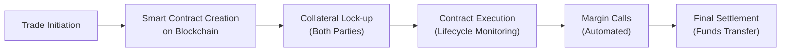

## Overview

Technological innovations are reshaping how exchanges operate, particularly for derivatives markets where speed, transparency, and robust settlement protocols are mission-critical. While earlier iterations of exchanges relied heavily on human floor traders yelling orders, nowadays you’ll rarely see that in action—most trades zip through electronic match engines powered by advanced infrastructure. It’s almost like we blinked, and everything became digitized overnight. In this section, we’ll explore these groundbreaking developments and examine how they integrate with modern exchange operations.

We’ll take a close look at how blockchain is transforming settlement procedures, how cloud technology enhances scalability, and why cybersecurity has become as essential as the matching engine itself. We’ll also review advanced analytics, AI-driven compliance tools, tokenized assets, decentralized finance (DeFi) concepts, and the nuts and bolts of real-time surveillance systems. Whether you’re new to derivatives or you’ve been trading for years, an understanding of these technologies is vital for navigating and managing today’s dynamic markets.

## Electronic Trading Platforms and Match Engines

### Evolution of Electronic Trading

Modern exchanges rely on sophisticated electronic trading platforms to match buy and sell orders. It honestly feels like an orchestrated dance of millions of transactions taking place per second. Back when I first visited a major exchange, open outcry trades were still going strong—brokers gathered on physical pits, holding up colored cards and frantically signaling. Now, these have mostly been replaced by server racks humming with near-zero latency technology.  

Electronic match engines:
- Allow participants worldwide to send orders 24/7 (depending on exchange hours).  
- Employ time-priority matching, ensuring fair execution for the earliest orders at a given price.  
- Integrate with risk management systems that instantly check margin and credit limits.  

At a high level, a typical workflow includes:
1. An order enters the exchange through an API or front-end.  
2. The trade engine checks if the order can be immediately matched.  
3. If yes, the match is executed automatically. If not, the order is placed in the electronic order book.  
4. Once trades are executed, confirmations are sent, and data is relayed for settlement downstream.  

Given the massive trade volume, exchanges invest heavily in hardware acceleration and ultra-low latency software. Some even place data centers near their largest participants, which is known as co-location, to reduce microseconds from transmission. Electronic trading has lowered operational costs, improved liquidity, and broadened market access, but it also necessitates robust technology structures to handle load spikes without meltdown.

### AI-Driven Analytics and Product Innovation

Electronic trading platforms and their data streams provide a wealth of order flow information. Exchanges increasingly explore artificial intelligence (AI) to create operational efficiencies, spot emerging market trends, and develop innovative products. As an example, AI might scan order flow patterns to identify segments under- or over-valued, prompting the launch of new derivative contracts that align with participant demand.  

Such usage of AI can:
- Enhance liquidity by recommending targeted market-making incentives.  
- Predict daily or intraday volatility, aiding margin adjustments.  
- Detect unusual patterns that might indicate market abuse or system anomalies.

## Cloud-Based Systems

### Scalability and Cost Efficiency

Exchanges today often run in hybrid or fully cloud-based environments. Why? Because cloud infrastructure provides on-demand computing power for data processing, analytics, and storage. Instead of upgrading traditional data centers (which can be unbelievably expensive), exchanges can scale up or down with minimal overhead.  

• Elastic infrastructure: Cloud setups can spin up extra servers during peak volume (like the early morning open or major news event) and scale down when volumes subside.  
• Real-time data: Cloud-based systems handle enormous streaming data loads, fueling analytics dashboards for risk managers.  
• Cost containment: By leveraging a pay-for-what-you-use model, smaller or niche exchanges can compete on technology without owning massive on-site data centers.

There’s always the question of security—exchanges typically adopt private or hybrid cloud setups to mitigate data breach risks. Encryption at rest and in transit, multi-factor authentication, and continuous monitoring are as essential as the underlying hardware.

### Practical Example

Imagine an exchange launching a new interest rate futures contract. Initially, participant interest might be modest, and the order flow is small. Over weeks, as more hedgers and speculators discover the product, usage skyrockets. Because the exchange uses a cloud-based solution, it can easily handle the volume growth and data complexity (e.g., historical tick data for back-testing trade strategies). This agility helps new products gain traction faster.  

## Blockchain and Distributed Ledger Technologies (DLT)

### Transforming Trade Settlement

Blockchain has stirred lively debate in finance—some see it as the next revolution, while others remain skeptical about mainstream adoption. In derivative markets, the main allure is real-time settlement on decentralized ledgers, potentially reducing counterparty risk and accelerating reconciliation processes.

At its core, blockchain or DLT can:
- Record all transactions on a shared, immutable ledger.  
- Automate clearing tasks by verifying trades, collateral, and final settlement.  
- Make data historically traceable for compliance and dispute resolution.  

A “smart contract” on blockchain can encode terms of a futures or options contract right into the ledger. That means once certain conditions—like a margin threshold or daily price settlement—are met, the contract self-executes. No middlemen, minimal delays. One day, we might see standardized derivatives fully integrated with a blockchain-based clearing mechanism, cutting settlement times down to seconds instead of days.

### Smart Contracts and Automated Lifecycle Events

Smart contracts are particularly intriguing in the derivatives sphere. They can automate the entire lifecycle of a contract:
1. Execution: The contract self-activates once all parties send collateral.  
2. Margin Calls: If collateral dips below the required threshold, the smart contract automatically requests more.  
3. Settlement: Upon contract maturity or early termination, the ledger calculates payouts and disburses funds.  

But it’s not all sunshine and roses. Smart contracts are only as good as their programming and the reliability of data oracles feeding external info (like interest rates or asset prices) into the blockchain. A glitch in the code or data feed can lead to serious disruptions. That said, the potential efficiency gains are substantial, and exchanges are actively exploring pilot projects to take advantage of self-executing functionalities.

### A Quick Peek at the Process

Here’s a simplified diagram illustrating how a blockchain-based derivative settlement might work:

This is a high-level view, but the essence is that the entire process resides on a distributed ledger, reducing the reliance on multiple intermediaries and manual verification steps.

## Tokenized Assets and DeFi Integration

### Bridging Traditional Finance and Decentralized Markets

Tokenization refers to representing real-world assets—like equities, bonds, or even real estate—as digital tokens on a blockchain. In traditional lease or mortgage markets, settlement can be slow. With tokenization, you can theoretically list these tokens on an exchange, making them tradable in near real-time. This introduces new forms of fractional ownership, liquidity, and possibly new derivative products.  

Moreover, decentralized finance (DeFi) protocols now allow lending, borrowing, and hedging operations without requiring a central entity (e.g., a bank). Some mainstream exchanges are dipping their toes into listing DeFi-based instruments as part of their product line—although regulatory uncertainties abound. There’s a sense that we’re glimpsing the beginning of an ecosystem where a corporate bond, an equity share, or even a fractional piece of real estate can be traded akin to any other digital token.

### Example: Tokenized Commodity Futures

Suppose an exchange decides to tokenize gold. Each token might represent 1 gram of physical gold stored in a vault. Traders can then easily buy and sell these tokens on a blockchain-based market, and derivatives (like futures or options) might develop seamlessly around these tokens. Settlement is simplified—the exchange can track token balances in real time and automatically process margin calls without waiting for third-party custodians.

It’s still an emerging concept. But the direction is clear: tokenization continues to merge with the mainstream derivatives world, creating new frontiers in how we structure, settle, and manage complex financial products.

## Cybersecurity and Exchange Resilience

### Critical Importance of Robust Security

Let’s face it: if there’s one major threat that can take down a modern exchange, it’s a cyberattack. Attackers might flood systems with malicious requests (e.g., a DDoS attack) or attempt to steal sensitive data. Because so many derivatives contracts rely on accurate and timely pricing, a single minute of downtime can lead to large losses and market dislocation.

Key security measures include:
- Firewalls and Intrusion Detection: Spot suspicious traffic.  
- Encryption Protocols: Private keys, user accounts, trading data.  
- Regular Penetration Testing: Ethical hackers attempt to break into the system.  
- Redundant Architecture: If one data center goes offline, operations move seamlessly to a backup.  

### Personal Reflection

I recall meeting a security engineer at a major futures exchange who said that every day felt like a new puzzle—they’d discover a fresh vulnerability or see a new type of hack attempt. Exchanges often partner with specialized cybersecurity firms to keep one step ahead of potential threats. So, the moral is: you can’t talk about advanced technology in trading without addressing how you secure it.

## Technology and Regulatory Compliance

### Real-Time Trade Surveillance

Regulatory compliance is a massive burden for exchanges—market manipulation or insider trading can undermine confidence if left unchecked. With modern technology, many exchanges run automated surveillance systems in real time. These systems:
- Monitor trades, order entries, and cancellations.  
- Use pattern recognition or machine learning to flag suspicious trading.  
- Generate compliance reports and suspicious activity alerts for regulators.  

It’s not just about policing bad actors; it’s also about upholding market integrity. Some advanced algorithms identify “layering” or “spoofing” by analyzing repeated patterns of placing and cancelling orders at scale. Without these systems, large-scale manipulations might go unnoticed.

### Technology in Regulatory Filings

Regulations globally—like MiFID II in the EU or Dodd-Frank in the U.S.—require detailed transaction reporting. Exchanges automate data extraction and submission, significantly lowering the manual burden. Compliance technology also ties into broader enterprise risk management, ensuring that margin requirements and capital adequacy align with evolving regulations. If an exchange can funnel data seamlessly from its order book to compliance and settlement systems, it fosters trust among regulators and participants.

## Best Practices and Common Pitfalls

1. Overreliance on Automation: While automation enhances efficiency, it’s crucial to ensure fail-safes in case of software glitches.  
2. Inadequate Resilience Planning: Exchanges should prepare for high-volume surges or unexpected events (like a major global announcement) that can quadruple volume instantaneously.  
3. Security Complacency: With hackers constantly evolving, periodic audits and updates are vital.  
4. Regulatory Gaps: Technology often moves faster than regulators. Exchanges that adopt new tech without clarifying compliance might face legal or operational hurdles.  
5. Data Quality: If AI algorithms rely on poor data, the resulting insights or market surveillance alerts can be misleading.  

## Practical Exam Tips

For candidates studying derivatives and exchange operations:
- Be ready to analyze how technology impacts market efficiency, liquidity, and overall risk.  
- In essay or item-set questions, you might be asked to evaluate the pros and cons of adopting blockchain-based settlement or to compare cloud-based vs. on-premises solutions for an exchange.  
- Remember that technological innovation isn’t purely beneficial—there can be systemwide risks if the technology fails or is exploited.  
- When addressing scenario-based exam questions, show an understanding of how advanced analytics and automated surveillance can detect market manipulation.  

## Glossary

• Smart Contract: A self-executing contract with the terms of the agreement directly written into code, typically running on a blockchain.  
• Tokenization: The process of converting the ownership of an asset into a digital token on a blockchain, enabling fractionalization and fluid transfer of value.  
• DeFi (Decentralized Finance): Financial services built on decentralized blockchain-based platforms, which typically reduce or eliminate the need for traditional intermediaries.  
• Trade Surveillance: Automated monitoring systems designed to detect and prevent market abuses such as spoofing, layering, and insider trading.

## References

• World Economic Forum. “Blockchain Beyond the Hype.” 2019.  
• Nasdaq Technology Solutions: https://www.nasdaq.com/solutions  

---

## Test Your Knowledge: Technological Innovations in Exchange Operations Quiz



### 1. Which of the following is a primary benefit of modern electronic trading platforms?

- [ ] They eliminate all forms of market manipulation through automation.
- [x] They can match massive volumes of trades at high speed with low operational cost.
- [ ] They fully remove the need for a clearinghouse.
- [ ] They require higher latency connections to optimize transactions.

> **Explanation:** Electronic trading platforms centralize matching of orders at high speed and lower cost, though they do not eliminate the need for clearinghouses and do not guarantee zero manipulation.

### 2. In a blockchain-based derivatives settlement, which step can be automated by a smart contract?

- [x] Triggering margin calls when collateral falls below a specified threshold.
- [ ] Calculating the daily price of the underlying asset via manual input.
- [ ] Removing all intermediaries from the transaction, including trade surveillance.
- [ ] Guaranteeing no defaults will ever occur.

> **Explanation:** Smart contracts can automatically check collateral requirements against real-time positions and call for additional margin. They do not eliminate the need for or guarantee zero defaults.

### 3. One advantage of using cloud-based systems in exchange operations is:

- [ ] Prohibiting participants from accessing near real-time data.
- [x] Allowing flexible, on-demand scalability to handle changing trading volumes.
- [ ] Limiting big data analytics to static, archived trades only.
- [ ] Removing cybersecurity concerns entirely.

> **Explanation:** Cloud-based systems let exchanges scale resources to meet demand spikes dynamically. However, they do not by themselves remove cybersecurity threats.

### 4. Which factor best explains why cybersecurity is critical for derivatives exchanges?

- [ ] Exchanges are never a target for cybercriminals.
- [ ] Exchanges cannot be shut down by cyberattacks due to physical floor trading.
- [x] Even short outages or data breaches can cause immense financial and reputational damage.
- [ ] Regulators disallow advanced cyber protections for derivatives markets.

> **Explanation:** A single critical breach or attack leading to an outage can cause market disruption, losses, and reputational harm. Cybersecurity concerns are therefore paramount.

### 5. Tokenization of assets can potentially do which of the following?

- [x] Provide fractional ownership and potentially increase market liquidity.
- [ ] Eliminate the need for regulatory oversight in every market jurisdiction.
- [x] Reduce settlement times by automating ownership and transfer on a blockchain.
- [ ] Guarantee global compliance across all jurisdictions automatically.

> **Explanation:** Tokenization can split assets into manageable units and record trades on a blockchain, potentially improving liquidity and settlement speeds. It doesn’t eliminate regulations or ensure compliance everywhere.

### 6. How do advanced analytics support product innovation on modern exchanges?

- [ ] By replacing the need for algorithmic trading interfaces.
- [x] By analyzing large datasets to identify gaps in market offerings or under-served asset classes.
- [ ] By forcing every exchange to offer the same suite of derivative products.
- [ ] By guaranteeing all new products will be successful.

> **Explanation:** Advanced analytics can reveal patterns in order flows and market demand, prompting exchanges to create or refine products that better serve participants.

### 7. What is a potential downside of automating most exchange functions?

- [x] Overreliance on software can lead to systemic failure if a glitch goes undetected.
- [ ] It guarantees advanced technology will always handle every trade perfectly.
- [x] Regular system audits might be overlooked if processes are deemed “fully automated.”
- [ ] Hardware no longer needs upgrades or maintenance.

> **Explanation:** Automation can deliver efficiency gains but introduces technology dependencies and requires ongoing audits, testing, and maintenance to avoid systemic breakdowns.

### 8. Which description aligns most accurately with a “smart contract” used in a derivatives context?

- [ ] A contract that monitors but does not enforce any margin requirements.
- [ ] A paper-based agreement that references code but executes outside its logic.
- [x] A decentralized piece of code that self-executes lifecycle events based on predefined conditions.
- [ ] A direct replacement for all legal contract frameworks worldwide.

> **Explanation:** Smart contracts operate on a blockchain, automatically executing contract terms (e.g., margin calls, settlement) without requiring further manual involvement.

### 9. Exchanges that incorporate AI-based trade surveillance tools:

- [x] Can detect suspicious trading patterns such as spoofing or layering more efficiently.
- [ ] No longer need any human oversight in compliance operations.
- [ ] Disallow any forms of high-frequency trades.
- [ ] Never suffer from false positives in compliance reporting.

> **Explanation:** AI-based surveillance tools bolster compliance efforts by quickly detecting manipulative order behaviors, though oversight and refinement remain necessary.

### 10. True or False: Blockchain-based derivatives completely eliminate the risk of default by either counterparty.

- [x] True
- [ ] False

> **Explanation:** This is a tricky statement. While blockchain can streamline processes, it doesn’t magically remove default risk altogether. Parties might fail to meet margin calls or have insufficient collateral. In reality, counterparty risk can be reduced but not entirely eliminated. The statement is thus an example of a potential misconception.  


