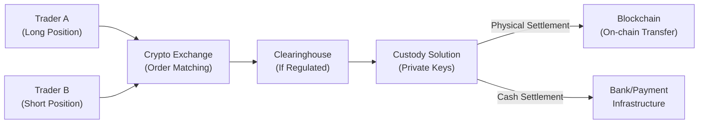

## Introduction and Context

I remember the first time I heard about a Bitcoin futures contract. A friend texted me frantically, “Hey, did you see that CME is listing BTC futures next month?” and I, honestly, had no clue what to think. Part of me was intrigued—digital currency? Another part of me was super skeptical. But that moment sparked a journey into understanding digital asset derivatives and how they fit into traditional finance. Well, let's just say it’s been a wild and often surprising ride.

Digital asset derivatives are financial instruments that derive their value from underlying crypto tokens (like Bitcoin, Ether) or tokenized representations of real-world assets (say real estate or art). As with other derivatives, they allow market participants to hedge, speculate, and manage risk, but they bring some new twists: high volatility, regulatory uncertainties, technology risk (like hacking or private key mismanagement), and the super-exciting realm of decentralized finance (DeFi).

Below, we’ll unpack how these derivatives work, how they’re traded, the risk management aspects, and the unique challenges (and opportunities!) they bring to the market. We’ll also touch on regulatory elements, custody and settlement models, and even on-chain derivative platforms that operate without central intermediaries.

## Basic Structure of Digital Asset Derivatives

Digital asset derivatives closely follow the structure of more traditional derivatives (see earlier discussions on forward commitments and contingent claims). However, the underlying here isn’t a physical commodity or a listed equity—it’s a blockchain-based asset or token. The main types include:

• Futures and Forwards on cryptocurrencies.  
• Options on popular digital tokens (calls and puts).  
• Perpetual swaps (commonly found on crypto exchanges).  
• Structured products referencing tokenized assets (for instance, fractional ownership units of high-value real estate).  

In many ways, these instruments replicate the payoffs we see in conventional derivatives. Yet liquidity, volatility, and custody solutions can be significantly different from, say, trading gold or equity index futures.

### Futures and Options on Major Cryptocurrencies

Bitcoin (BTC) and Ether (ETH) are the pioneering cryptos for which standardized exchange-traded futures and options emerged. The Chicago Mercantile Exchange (CME), for instance, launched cash-settled Bitcoin futures, while platforms such as the Bakkt exchange experimented with physically settled versions (meaning settlement involves actual Bitcoin delivery). Global crypto exchanges (like Binance or OKX) also offer their own futures and options—sometimes with features like high leverage or no fixed expiry (in the case of perpetual swaps).

Key point: The price drivers can diverge significantly from one exchange to another (especially overseas crypto exchanges vs. regulated Western exchanges). This can create arbitrage opportunities but also heightened basis risk.

### Perpetual Swaps

One interesting creation—maybe the flagship for crypto derivatives—has been the perpetual swap. It’s basically a futures contract with no expiry date, where the price is kept tethered to the spot market through a funding rate. If the perpetual price is above spot, holders of long positions typically pay a periodic funding fee to short positions, and vice versa. This encourages the perpetual price to converge toward the spot price in real time.

It’s a neat invention, but you gotta watch out for that funding rate, which can be quite erratic if the market is overly bullish or bearish. The main advantage? You don’t have to roll your position at expiry, as you would in a standard futures contract.

### Tokenization of Real-World Assets

Tokenization takes real or intangible assets (think real estate, fine art, or even intellectual property) and issues digital tokens on a blockchain that represent fractional ownership. The flexibility is remarkable. For instance, you can hold 0.0001% of a building in downtown Manhattan, with those ownership rights embedded in a cryptographic token.

In turn, derivatives can be written on these tokens—like a forward contract on real-estate tokens suspending the friction of property transactions. But the tricky part is ensuring the token truly confers legal ownership or claims on the underlying asset, which depends heavily on local legal frameworks. So, it’s not just about technology; ensuring robust legal enforceability can be a puzzle.

## Market Participants and Motivations

Remember from earlier sections that derivatives attract a variety of participants—hedgers, speculators, and arbitrageurs. The same is true in digital assets:

• Hedgers might be crypto miners locking in the value of their mined Bitcoin by shorting BTC futures.  
• Speculators can be day traders looking for quick gains, or macro funds adding crypto exposure.  
• Arbitrageurs thrive on the price discrepancies among multiple crypto exchanges and from inefficiencies in stablecoin markets, especially in times of heavy volatility.

High volatility in crypto means bigger potential returns for speculators and arbitrageurs, but also bigger blow-ups if positions go sideways. It’s not for the faint of heart.

## Regulatory Considerations and Challenges

Talk about uncertainty! Many jurisdictions struggle with how to classify cryptocurrencies: Are they commodities, securities, intangible property, something else entirely? The classification influences who can list derivatives and under what conditions. For example, in the United States, the Commodity Futures Trading Commission (CFTC) has generally taken the stance that Bitcoin and Ether are commodities, while the Securities and Exchange Commission (SEC) is more watchful of tokens that might pass the “Howey Test” for securities.

Why does it matter? Because whether something’s a commodity or security impacts the regulatory framework, capital requirements, exchange licensing, and more. If regulators classify a tokenized asset as a security, it must comply with relevant securities laws, which could mean more stringent listing requirements and more intense disclosure obligations.

In line with the CFA Institute Code of Ethics and Standards of Professional Conduct, finance professionals must pay careful attention to these emerging regulations, ensuring that client trades in digital assets are managed lawfully and ethically. Also, changes in regulation can affect liquidity—gaining or losing participants overnight if a region cracks down on certain tokens.

## Custody, Settlement, and Private Key Management

Digital assets stored on blockchain require public-private key cryptography. If you hold the private key, you effectively hold the assets. This is very different from having a share certificate in a conventional brokerage account. For physically settled crypto derivatives, participants need robust custody solutions—like institutional crypto custodians or self-custody with hardware wallets.

But custody is not trivial. If a private key is compromised, you could lose your holdings instantly, and there’s no recourse (like you’d have with FDIC insurance or conventional clearing systems). This is why institutional custodians have popped up, offering solutions such as multi-signature wallets, cold storage, or even advanced hot-cold wallet architectures.

### Diagram: Digital Asset Derivatives Flow

Below is a simplified illustration of how these trades might flow through various participants and settlement structures:



In some decentralized finance (DeFi) platforms, you might remove the clearinghouse entirely, and everything happens on-chain via automated smart contracts. That can be super efficient...or scary if the smart contract has vulnerabilities.

## Decentralized Finance (DeFi) Derivatives

So, you might ask: what’s DeFi? Think about a platform like an exchange, except it’s run by a smart contract on the blockchain, often governed by a distributed network of token holders. Derivative trades (options, futures, swaps) can be set up in a trustless way: you don’t rely on a single centralized operator to match and settle trades. Instead, self-executing code handles everything.

But this increases technology risk. Smart contract bugs can cause massive losses (like “rug pulls,” where code is intentionally malicious), and insurance coverage for such events is limited. Additionally, regulatory compliance is complex, as DeFi operates globally, often with pseudonymous participants. It’s a brave new world, but it’s moving fast and attracting a lot of attention from both retail investors and institutions wanting to experiment with new yield farming or structured products.

## Risk Management

### Volatility and Leverage

Crypto markets are famously volatile. Double-digit daily price moves are not unheard of. So, employing high leverage (some platforms offer 100x or more, which is frankly terrifying for novices) can mean your position is fine one hour and wiped out the next. Careful position sizing, robust margin calculations, and real-time risk monitoring are crucial.

### Liquidity and Fragmentation

Unlike many equity or futures markets where you might have just a few major exchanges, crypto is fragmented—multiple exchanges across different jurisdictions. Liquidity can vary drastically among them. You need to monitor order book depth, fees, and deposit/withdrawal times. That fragmentation can be an arbitrageur’s dream but can also mean uncertain price references for settlement.

### Custody and Hacking Risks

We touched on custody already. Hacking risk extends beyond stealing private keys. Exchanges themselves have been hacked, with clients losing funds. Large institutional participants typically use regulated exchanges and custodians with insurance policies. But always watch out for single points of failure.

### Protocol and Governance Vulnerabilities

In DeFi, the protocols themselves can become systematically risky if they hold billions in locked crypto assets. Exploits in code can lead to flash liquidations, chain reorgs, or manipulations of key price oracles (the data feeds that inform on-chain derivatives). For professional investors, this is a big due diligence point: who audits the code? Is it open source? Are there rigorous governance mechanisms in place?

## Common Pricing Considerations

Basic derivatives pricing relies on cost-of-carry and no-arbitrage frameworks. With digital assets, you insert factors like:

• Borrow/lending rates for the underlying crypto.  
• Staking yields or yield farming returns.  
• Market-driven convenience yields (like ability to quickly transfer across the globe).  
• High correlation or decoupling from equities or other macro assets.  

If we attempt a simple forward pricing approach for a cryptocurrency \\( S_0 \\) with a continuously compounded risk-free rate \\( r \\), ignoring storage costs, one might say:


F_0 = S_0 e^{rT}


But in crypto, you might incorporate an implied borrow rate \\( r_{crypto} \\) or a staking yield \\( r_{stake} \\). So a forward price might look more like:


F_0 = S_0 \times e^{(r - r_{stake}) T}


It’s rarely that neat, though, because these rates vary widely across decentralized lending protocols vs. centralized brokers. Plus, if you hold the spot crypto, you can stake it or lend it out for yield, which can significantly impact the forward curve.

## Sample Python Snippet: Fetching Crypto Price Data

Let’s say you want a quick look at live crypto prices for your risk model. You might use Python’s “requests” library to query a public API:

```python
import requests

def get_crypto_spot_price(symbol='BTCUSDT'):
    url = f"https://api.binance.com/api/v3/ticker/price?symbol={symbol}"
    data = requests.get(url).json()
    return float(data['price'])

if __name__ == "__main__":
    print("Current BTC/USDT spot price:", get_crypto_spot_price())
```

Of course, for a real trading system or serious risk management, you’d want robust error-handling, multiple data sources, synchronization with a price feed aggregator, and more. But it’s a taste of how you might integrate real-time quotes into your analytics.

## Practical Considerations and Best Practices

• Diversify across multiple exchanges and platforms to reduce single-exchange risk.  
• Maintain robust documentation and timeliness in margin calls. Crypto can move fast, so margining calls often happen multiple times per day.  
• Check the technology: Are you using a hardware wallet for private key storage? Who’s auditing the smart contract?  
• Evaluate cross-correlation: Many altcoins move in tandem with Bitcoin, especially during risk-off events. That correlation could hamper your hedging if you’re only short Bitcoin futures.  
• Stay updated with the latest regulatory guidance in your jurisdiction and in major global markets, since a major announcement can shift volume or even ban derivatives in some places overnight.  

## Exam Relevance and Strategies

In an exam context—especially within the CFA Program—digital asset derivatives questions might involve calculation of forward prices under unconventional cost-of-carry assumptions, analyzing the impact of intense volatility, or discussing best practices in custody and due diligence. You could see scenario-based questions on how a crypto miner might hedge price risk using futures, or how to manage counterparty risk with an offshore DeFi protocol.

• Approach item sets systematically: Identify the underlying asset, the cost-of-carry, and the relevant risk-free or crypto-lending rates.  
• For constructed responses (or short-answer contexts), be ready to articulate the unique operational and custodial risks that differ from standard derivatives.  
• Practice time management: Some questions might combine the theoretical aspects of no-arbitrage with real-world complexities (liquidity fragmentation, hacking, etc.). Keep your final response concise and well-structured.  

## Final Exam Tips

1. Memorize your formulas, but also understand how crypto-specific factors (staking yield, protocol risk, funding rates) can shift the classic no-arbitrage boundaries.  
2. Stay flexible: The exam could test conceptual knowledge of DeFi derivatives, so read any relevant Curriculum Addenda and keep an eye on official CFA Institute communications about newly introduced content.  
3. Don’t neglect professional standards: Expect at least one question about how the CFA Institute Code of Ethics applies to dealing with clients’ crypto assets.  
4. Use practice questions to get comfortable with the sudden “What if?” scenarios that are typical in crypto—like abrupt regulatory announcements or exchange outages.  
5. Budget your time so you can handle the multi-layered risk factor questions—especially if an item set references margin calls, chain splits, or unexpected events.  

## References for Further Study

• CFA Institute Research Foundation. “Cryptoassets: The Guide to Bitcoin, Blockchain, and Cryptocurrency for Investment Professionals.”  
• Antonopoulos, Andreas. “Mastering Bitcoin.” O’Reilly, 2017.  
• Basel Committee on Banking Supervision. “Prudential Treatment of Cryptoasset Exposures.”  
• Official CMA, CBOE, and major crypto exchange rulebooks on digital asset futures.  
• Various DeFi protocol whitepapers (Aave, MakerDAO, Uniswap) for insights into on-chain derivatives.

---

## Test Your Knowledge: Digital Asset Derivatives Quiz



### Which of the following best describes a perpetual swap in the crypto market?

- [ ] A futures contract requiring delivery at a specified date.
- [x] A derivative with no fixed maturity maintained via a funding rate mechanism.
- [ ] A structured note backed by stablecoins to eliminate price volatility.
- [ ] A forward contract requiring settlement of NFTs.

> **Explanation:** Perpetual swaps do not have an expiration date. They use a funding rate to keep the price aligned with the underlying spot market.

### When comparing physically settled Bitcoin futures to cash-settled Bitcoin futures, which statement is most accurate?

- [ ] Physically settled contracts always have lower risk than cash-settled contracts.
- [ ] Cash-settled contracts require direct holding of private keys by both counterparties.
- [x] Physically settled contracts involve actual transfer of BTC upon settlement, whereas cash-settled contracts pay the value difference in currency.
- [ ] Cash-settled contracts eliminate all counterparty risk in the transaction.

> **Explanation:** The key difference is that physically settled futures deliver the underlying Bitcoin, while the cash-settled version only exchanges the cash difference.

### Which of the following is NOT a common risk of trading digital asset derivatives?

- [ ] High volatility in crypto markets.
- [ ] Counterparty risk from unregulated exchanges.
- [ ] Smart contract vulnerabilities on DeFi platforms.
- [x] Guaranteed price stability over time.

> **Explanation:** Crypto derivatives do not guarantee price stability. High volatility is one of the defining characteristics of digital asset markets.

### What is a primary advantage of tokenizing real-world assets for derivative trading?

- [ ] It guarantees regulatory approval in any jurisdiction.
- [ ] It eliminates the need for technological infrastructure.
- [x] It allows fractional ownership and easier transacting of traditionally illiquid assets.
- [ ] It removes all legal complexities related to transferring asset ownership.

> **Explanation:** Tokenization allows fractional ownership and the ability to trade smaller portions of assets, although it does not eliminate legal complexities or guarantee regulatory approval.

### Which of the following describes a common function of a crypto custodian in physically settled derivative transactions?

- [x] Securely store private keys on behalf of institutional clients.
- [x] Provide multi-signature wallets or other cold storage solutions.
- [ ] Eliminate blockchain settlement to reduce transaction speeds.
- [ ] Minimize the need for audits or risk management protocols.

> **Explanation:** Custodians specialize in secure key storage, often using cold or offline solutions and multi-signature approaches.

### Which of the following best explains the role of the funding rate in crypto perpetual swaps?

- [ ] It is a fixed interest rate ensuring stable yields for all participants.
- [x] A mechanism to balance long and short demand, helping the swap price track the spot price.
- [ ] A mandatory annual fee for listing a new cryptocurrency.
- [ ] An indicator of transaction fees paid to miners for on-chain settlement.

> **Explanation:** The funding rate is a periodic payment (or receipt) mechanism that continuously aligns the perpetual swap price with the spot price, incentivizing traders to maintain parity.

### A DeFi derivative platform can remove which of the following traditional financial intermediaries?

- [x] Clearinghouses.
- [ ] Market participants themselves.
- [x] Centralized exchange operators.
- [ ] Smart contract developers.

> **Explanation:** In DeFi, smart contracts replace or reduce the need for traditional clearinghouses and centralized exchange operators. However, participants and developers remain essential.

### One major concern for cross-exchange arbitrage in crypto derivatives is:

- [ ] Guaranteed convergence of futures prices.
- [ ] Identical regulatory policies across all jurisdictions.
- [x] Fragmented liquidity and differing KYC/AML requirements.
- [ ] Zero correlation among crypto assets.

> **Explanation:** Crypto exchanges may be under different jurisdictions with varied liquidity and regulatory standards, impacting the feasibility and risk of cross-exchange arbitrage.

### How might staking yields affect the theoretical forward price of a cryptocurrency underlying?

- [x] Expected staking yields can effectively reduce the net cost of holding the underlying, thus lowering the forward price relative to a standard no-yield case.
- [ ] Staking yields always increase the forward price, regardless of other factors.
- [ ] Staking yields function like a risk-free rate for all digital assets, inflating forward prices.
- [ ] Staking yields do not have any influence on forward pricing.

> **Explanation:** Similar to dividends on equities, staking yields offer a benefit to holding the underlying, thereby reducing the forward price in a cost-of-carry model.

### True or False: The regulatory classification of a token (security vs. commodity) can drastically affect which products exchanges are allowed to list.

- [x] True
- [ ] False

> **Explanation:** If authorities classify a token as a security, it typically falls under more stringent regulations, impacting which platforms can legally offer derivatives on that token.


