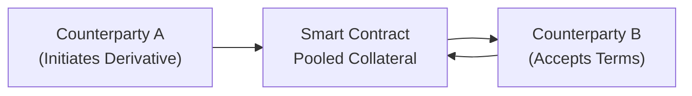

## Overview

Peer-to-peer (P2P) derivative platforms represent an emerging paradigm in the derivatives ecosystem. Instead of utilizing centralized exchanges or broker-dealers, these setups let market participants connect directly—often via blockchain smart contracts or specialized software. It’s almost like meeting a friend for coffee to discuss a private forward contract on, say, coffee beans themselves, but the friend might be someone halfway across the globe. This direct connectivity can provide an exciting level of flexibility and cost savings, but it also carries unique complexities around counterparty risk, liquidity management, and regulatory compliance.

In a typical P2P arrangement, there is no single clearinghouse guaranteeing both sides of the transaction. Instead, each party relies on technology—usually a smart contract—to enforce contract terms and margin requirements. While that might sound ultra-sleek and cutting-edge, it also means that participants must be more comfortable with the operational and legal intricacies of these platforms. And let’s be honest: even well-experienced finance professionals can find it a bit nerve-wracking to place their trust in a piece of code for settlement of derivatives.

Throughout this discussion, we’ll explore how P2P derivative platforms work, the risks and benefits they offer, and the steps you should take to safeguard yourself (and your portfolio) when trading on these platforms. Let’s dive in.

## Mechanics of Peer-to-Peer Derivative Platforms

P2P derivative platforms generally cut out the middleman. In a centralized market, an exchange or broker sits between counterparties. If you buy a crude oil futures contract through a recognized exchange, that exchange effectively becomes your counterparty, guaranteeing the contract’s performance. However, in a P2P environment:

• Participants list the terms they’re seeking (e.g., “I want a forward contract on 100 ounces of gold with a six-month expiry and this specific settlement procedure.”)  
• A potential counterparty then accepts those terms, or negotiations continue until meeting in the middle.  
• A final contract is struck, usually encoded in a digital smart contract.  

These platforms sometimes use algorithmic matching tools that pair potential buyers and sellers based on price or contract terms. Let’s illustrate the flow in a simple diagram:



In the above flow, both parties lock in collateral via a smart contract. The smart contract basically becomes the “escrow agent.” If everything goes smoothly, the contract enforces gains/losses automatically. If something goes wrong, dispute resolution processes (sometimes involving third-party oracles or arbitrators) kick in.

### Customizable Terms

Because a P2P derivative contract isn’t constrained by a standard exchange format, participants enjoy a high degree of customization—there is no official “standard lot size” or “listed expiry date.” This flexibility can be beneficial for hedgers who have unique exposures or want to craft specialized contract features, such as exotic payoff structures or tailor-made settlement triggers (e.g., referencing an exotic commodity that no major exchange lists). On the flip side, exotic customization can make it harder to find a matching counterparty, potentially increasing search costs and time to execution.

## Counterparty Risk Considerations

Whenever we remove a centralized intermediary that performs credit checks, margin calls, and final settlement, the question becomes: “How do I trust the folks on the other side of this trade?” Let’s consider some major risk points:

• Counterparty Default: In a P2P contract, if the losing party refuses or is unable to pay, there is no central clearinghouse to step in.  
• Credit Evaluations: Participants must self-evaluate the creditworthiness of each other. Some platforms offer rating systems, track records, or verification of wallet balances—similar to how e-commerce sites have vendor ratings. However, new or small participants may have limited or no track record.  
• Collateral Arrangements: In response to these default risks, many P2P platforms require real-time or frequent updates to collateral levels, allowing the smart contract to liquidate positions if margin shortfalls occur.

A personal anecdote: My first P2P derivative trade was a small notional forward on silver. I recall constantly refreshing the interface to ensure my counterparty’s posted collateral was still valid. It felt both empowering—because I was in direct control—and slightly nerve-racking, as I realized no central clearing entity was backing me up. That experience alone taught me the real value of robust margin mechanisms.

## Escrow and Collateral Management

Escrow services in P2P derivative platforms are often performed by the underlying smart contracts or by third-party software that “locks” each side’s funds. The aim is to ensure that if the contracted obligations aren’t met, the other side can be compensated fairly. Users can deposit stablecoins (in the crypto context) or other acceptable collateral. Some platforms integrate these functionalities:

- Dynamic Margining: Collateral requirements can adjust based on market volatility or changes in the underlying price. This limits credit exposure if the market moves sharply.  
- Automated Liquidation: If a user’s collateral falls below a maintenance threshold, the system may trigger an automatic liquidation, distributing the proceeds to the winning side or placing them in escrow pending final settlement.  
- Tiered Collateralization: Sophisticated platforms sometimes allow over-collateralization for highly volatile assets (e.g., requiring 150% collateral to cover potential large swings).

## Regulatory and Legal Implications

Regulatory frameworks often differ widely across jurisdictions. Traditional exchanges are subject to rigorous oversight regarding listing requirements, margin rules, and capital adequacy. But in P2P models:

• Participants from different countries might be transacting, surpassing the domain of a single regulatory body.  
• Some participants might exploit a gray area or outright circumvent regulations (sometimes unknowingly).  
• The platform itself might or might not be subject to local or cross-border licensing requirements.  

Because P2P derivative contracts often rely on decentralized technologies, they can be structured to be pseudonymous, creating potential challenges around KYC (Know Your Customer) and AML (Anti-Money Laundering) compliance. Moreover, if a dispute arises, the question of jurisdiction can become a headache. Which court hears the case? Under which contract law?

From a CFA Level I perspective, it’s crucial to note that these complexities can lead to both opportunities (arbitrage in less-regulated spaces or accessing new markets) and significant pitfalls (lack of legal recourse, potential violations of local regulations, reputational harm).

## Potential Impact on Market Efficiency

Proponents of P2P derivatives argue they enhance market efficiency by:

- Reducing transaction costs: No centralized clearing or exchange fees.  
- Broadening access: Smaller participants or niche hedgers can find custom solutions for unique exposures.  
- Stimulating innovation: Smart contract technology fosters creative payoff profiles and new risk management strategies.

Skeptics counter that:

- Lower liquidity: Some P2P platforms lack the depth of large futures markets, making trade execution less fluid.  
- Fragmented markets: The proliferation of many small P2P platforms can fragment liquidity, hamper price discovery, and create pockets of inefficiency.  
- Greater risks: If significant defaults or hacks occur, trust can erode quickly, undermining benefits.

## Liquidity and Pricing

While direct transactions can lower costs for some, the reality is that P2P marketplaces may offer only modest liquidity—especially for specialized instruments. When liquidity is low, one typically sees:

• Wider Bid-Ask Spreads: The difference between the best buy and sell prices can be significant, reflecting the risk premium market makers demand to compensate for potential default or illiquidity.  
• Slippage: Large trades can move the market price substantially if few counterparties are available to absorb the volume.  
• High Search Costs: Participants might spend time advertising or negotiating trades if an automated matching mechanism is inadequate.

From a portfolio management standpoint, these liquidity bottlenecks can be quite costly, particularly if someone needs to close or adjust a significant position quickly at a fair price.

## Risk Management Best Practices

### Reputation Systems and Rating Mechanisms

Several P2P platforms maintain user ratings. A participant might earn a high rating by consistently honoring agreements and maintaining adequate collateral. Before entering a trade, it’s wise to check the counterparty’s track record. While no system is perfect and reputation can be gamed, it remains an important line of defense.

### Smart Contract Audits and Code Verification

When code is law (that is, the contract is enforced automatically by software), you want to be sure that law doesn’t have gaping holes. For instance, a snippet in a smart contract that incorrectly calculates margin calls or has vulnerabilities that hackers could exploit can lead to severe financial losses. As we learn in many other contexts, code reviews and audits from reputable third parties are essential.

### Dispute Resolution Mechanisms

Even with the best contract language, disputes may arise—maybe there’s an extreme price movement, or a party claims the oracle data was inaccurate. A robust dispute resolution process (on-chain or off-chain) helps ensure fairness:

- Arbitration: Some platforms appoint trusted arbitrators or a decentralized network of oracles to vote on contested actions.  
- Escrow Release Guidelines: Step-by-step triggers for releasing funds, each requiring proof of certain contract terms being fulfilled.  
- Appeal Procedures: Mechanisms allowing parties to escalate a dispute if they believe the initial ruling was incorrect.

### Collateral and Margin Monitoring

In P2P markets, margin calls usually must happen automatically or with minimal manual intervention to stay ahead of forced liquidations. Best practices include:

- Using stable assets or recognized stablecoins (if operating in crypto) as collateral to mitigate high volatility in the collateral’s value.  
- Regularly monitoring real-time price data to ensure the posted collateral meets or exceeds maintenance requirements as the underlying financial instrument’s price shifts.

## Technology and Smart Contracts

Smart contracts form the backbone of many P2P derivative platforms, specifically those operating on public blockchains:

- Self-executing code: Contract terms (like payoff formulas, margin triggers, or event conditions) become a set of instructions that run automatically.  
- Tamper-resistance: Once uploaded to a blockchain, the core logic and data are difficult to alter retroactively.  
- Decentralized escrow: Funds are held in multi-signature wallets or specialized contract addresses.  

Still, technology introduces new threats. Hackers might exploit vulnerabilities in the code, or oracles feeding price data might be compromised. A robust architecture typically includes external checks and balances—like multiple data providers—to reduce reliance on any single source.

Below is a short (simplified) Python snippet that illustrates how a user might query a blockchain for an open P2P derivative position’s details using a Web3 library:

```python
from web3 import Web3

provider_url = "https://mainnet.infura.io/v3/YOUR-PROJECT-ID"
web3 = Web3(Web3.HTTPProvider(provider_url))

contract_address = "0xd2...123"
abi = [...]  # The contract ABI goes here

contract = web3.eth.contract(address=contract_address, abi=abi)

position_details = contract.functions.getPositionDetails(1).call()
print(position_details)
```

This code might return a structured data set indicating the notional, collateral posted, and the current PnL for the position. In practice, you’d build a robust interface for margin calls, settlement checks, or dispute resolution triggers.

## Practical Example: P2P Interest Rate Swap

Imagine two parties:

• Party A: Has floating-rate debt and wants a fixed interest outflow.  
• Party B: Prefers floating-rate inflows but is locked into a fixed rate.  

On a P2P derivative platform, they can hammer out a swap:
- Notional amount: $1,000,000.  
- Party A pays 5% fixed, receives LIBOR (or a new risk-free reference rate).  
- Party B pays LIBOR, receives 5% fixed.  

Since there’s no central counterparty, the two will deposit collateral in a smart contract. If rates spike above 5%, Party A’s position might be losing. The margin mechanism ensures A keeps topping up their collateral so B can be made whole at net settlement. If rates fall, B does the same. Following strict margin protocols is essential. If either side fails to post collateral, the platform can auto-liquidate positions or seize the posted margin.

## Common Pitfalls

• Assuming Perfect Code: Derivative novices may assume that a published smart contract with thousands of users is foolproof. But smart contracts can harbor bugs, or the external data source can fail.  
• Overly Complex Custom Terms: Sometimes traders create such specialized contract features that almost no one else wants to trade it, leading to illiquidity.  
• Underestimating Jurisdictional Risk: Cross-border P2P trades might violate local derivative regulations or capital controls.  
• Inadequate Collateral: Under-collateralization is a classical reason for defaults.  
• Technological Reliance: If the blockchain network experiences congestion or downtime, derivative users may be unable to perform margin calls in time.

## Conclusion and Further Reading

P2P derivative platforms bring a whole new dimension to financial markets, bridging advanced technology with well-known derivative instruments. Their direct nature can reduce costs, enable customization, and broaden access to a broader segment of traders. However, they also shift significant responsibility onto the participants for credit checks, collateral monitoring, and legal compliance. In short, these are powerful tools that require careful handling, much like any other high-leverage financial instrument.

For those interested in exploring these topics further, you can consult:  
• Schär, Fabian. “Decentralized Finance: On Blockchain- and Smart Contract-Based Financial Markets.” Federal Reserve Bank of St. Louis, 2021.  
• Various BIS (Bank for International Settlements) papers on Peer-to-Peer and DeFi markets.

As you prepare for exam-style questions, keep in mind the interplay of operational, liquidity, and credit risks in P2P derivative frameworks. Understanding how collateral flows, dispute resolution, and regulatory oversight differ from centralized markets will be crucial to mastering this subject—whether for exam day or real-world trading.

### Glossary

• **Escrow:** A financial arrangement where a third party (or a trust mechanism via a smart contract) holds funds or assets on behalf of transacting parties, releasing them upon specific conditions being met.  
• **P2P Platform:** A marketplace enabling direct interaction between buyers and sellers. No centralized authority is involved in matching or guaranteeing trades.  
• **Dispute Resolution Mechanism:** A set of processes and guidelines designed to resolve disagreements in contract interpretation or settlement. It may involve third-party arbitrators, on-chain oracles, or community governance.  
• **Smart Contract Audit:** A detailed code review assessing whether a smart contract contains security flaws, logical errors, or potential for exploitation.

---

## Test Your Knowledge: Peer-to-Peer Derivative Platforms



### Which of the following statements most accurately describes a key feature of a peer-to-peer (P2P) derivative platform?

- [ ] It is guaranteed by a central clearinghouse.
- [ ] It requires a regulatory license in the same way traditional exchanges do.
- [x] It connects counterparties directly without a centralized intermediary.
- [ ] It cannot involve any form of collateral.

> **Explanation:** P2P derivative platforms remove the centralized intermediary or exchange and match counterparties directly, often relying on smart contracts or automated programs for escrow and settlement.

### A primary advantage of a P2P derivative platform is:

- [x] Reduced reliance on a single intermediary or clearing broker.
- [ ] Guaranteed unlimited liquidity at all times.
- [ ] Automatic compliance with all regional regulations by design.
- [ ] Complete elimination of counterparty credit risk.

> **Explanation:** While P2P platforms can help reduce intermediary costs, they do not eliminate liquidity constraints or completely remove credit risk. The absence of a central clearinghouse places the onus on participants to manage credit exposure.

### Which of the following is a common risk in P2P derivatives?

- [ ] Central clearinghouse default risk.
- [ ] Lack of customization options for the contract.
- [x] Uncertain legal enforceability across different jurisdictions.
- [ ] Guaranteed liquidity to close out trades anytime.

> **Explanation:** Because participants can be from multiple jurisdictions, enforceability becomes intricate if disputes arise. Compared to standard exchange-traded products, cross-border P2P derivatives often face more ambiguous legal environments.

### How do participants on some P2P derivative platforms mitigate the risk of default?

- [ ] By relying solely on verbal agreements.
- [x] By posting collateral in smart contracts and maintaining margin requirements.
- [ ] By trading at regulated exchanges only.
- [ ] By eliminating margin calls altogether.

> **Explanation:** Without a central counterparty, well-designed P2P platforms mitigate default risk by requiring counterparties to post collateral (or margin) in escrow-type smart contracts. If a participant’s collateral becomes insufficient, the position may be liquidated automatically.

### A “smart contract audit” refers to:

- [ ] An official appraisal of the underlying asset’s value.
- [ ] An internal procedure for requesting more margin collateral.
- [x] A security review of the code to detect vulnerabilities and logical errors.
- [ ] A formal process of verifying clearinghouse solvency.

> **Explanation:** A smart contract audit is a critical step in ensuring the code’s correctness, especially when that code dictates margin calls, settlement rules, and dispute resolution in a decentralized environment.

### One notable disadvantage of P2P derivative platforms is:

- [x] Potentially lower liquidity compared to centralized exchanges.
- [ ] Guaranteed narrower bid-ask spreads.
- [ ] Inability to customize contract terms.
- [ ] Complete exemption from regulatory oversight.

> **Explanation:** With fewer market participants and the possibility of fragmented order books, P2P derivatives often face liquidity challenges. This can manifest as wider bid-ask spreads and difficulty in swiftly executing large trades.

### Under what circumstances might the dispute resolution mechanism of a P2P platform come into play?

- [ ] Whenever a central clearinghouse fails to meet its obligations.
- [x] When there is a disagreement on settlement or an allegation of incorrect margin calls.
- [ ] Only when regulators request an investigation into platform operations.
- [ ] Never, since all disputes are automatically resolved by the smart contract’s code.

> **Explanation:** Disputes typically arise with data errors, margin call mismatches, or incorrectly executed contract logic. An on-chain or off-chain dispute mechanism can verify these claims and determine the appropriate resolution.

### In a P2P interest rate swap, which of the following is most critical to ensuring the viability of the swap?

- [ ] A single global regulator overseeing the entire transaction.
- [ ] Zero-collateral agreement.
- [ ] Centralized daily settlement by a major exchange.
- [x] Adequate margin posting and a reliable mechanism to handle rate fluctuations.

> **Explanation:** Because there is no central clearinghouse guaranteeing the swap, the parties must rely on robust margin practices and a reliable system (often a smart contract) to enforce terms and handle collateral adjustments when rates move.

### A key motivation for using a decentralized P2P derivative platform is:

- [ ] To avoid the use of underlying collateral altogether.
- [ ] To reduce the flexibility and customization of contracts.
- [ ] To ensure local regulators always have oversight.
- [x] To transact directly without central intermediaries, potentially lowering fees.

> **Explanation:** Reduced reliance on central intermediaries can lower transaction costs and eliminate certain broker fees. However, participants must manage credit and operational risks that a central entity would typically handle.

### True or False: P2P derivative platforms completely eliminate all forms of counterparty risk.

- [x] True
- [ ] False

> **Explanation:** Trick question—this statement is actually false. P2P platforms do not eliminate counterparty risk; they merely shift it to the participants and the underlying technology or collateral mechanism. The correct answer to “P2P derivative platforms completely eliminate all forms of counterparty risk” is False.


