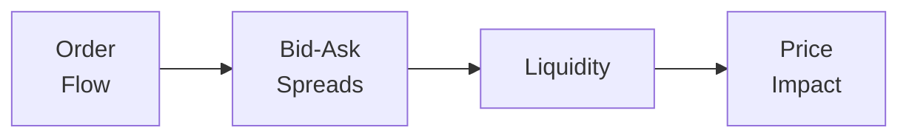

Market microstructure might sound a bit intimidating at first—believe me, when I first encountered the term, I wondered if I needed a microscope to see the nitty-gritty details! But, in reality, it’s the study of how market participants interact, how trades and orders get executed, and how transaction costs affect prices. In the context of derivatives, this concept gets even more fascinating because a derivative’s liquidity depends on many moving parts: the liquidity of its underlying asset, the specifics of the trading venue, and even the broader macroeconomic environment.

Market microstructure matters because it explains the why behind short-term price dynamics, helps us figure out trading costs, and, ultimately, shapes the environment that hedgers, speculators, and arbitrageurs operate in. Let’s dive deeper into these ideas and explore why liquidity in derivatives can sometimes dry up in an instant—only to come roaring back minutes or hours later.

Understanding Order Flow

Order flow is the heartbeat of any market—it’s essentially the continuous stream of buy and sell orders that traders place throughout the day. You’ll often hear it described as the pulse or lifeblood of a market, and that’s not an exaggeration. In derivatives, especially where many of the big players are professional market makers, an influx of orders at the best available price (the inside market) can rapidly move prices. If you place a large buy order in a thinly traded futures contract, you might end up moving the market price, simply because there aren’t enough sell orders available near the current bid-ask spread to fill your trade without a noticeable shift in price.

Price-Time Priority and Execution Mechanics

On most regulated exchanges, orders are matched based on price-time priority. This means orders at the best price get filled first, and if multiple orders exist at the same price, they’re matched on a first-come, first-served basis. When you toss in algorithms or high-frequency traders (HFTs), the race to be first can get pretty intense. You may recall from Section 1.12 (Automated Trading and High-Frequency Trading Environments) that having a faster connection or more sophisticated data processing can help traders jump ahead in the order queue.

It might feel a bit like waiting in a line for concert tickets—you definitely want to be at the front, paying a lower transaction cost and securing the trade you want. If you’re behind, the market might move away from you by the time your order even gets a chance.

Bid-Ask Spreads, Market Depth, and Liquidity

Liquidity in derivatives is often gauged by looking at how tight the bid-ask spread is and how deep the order book goes. A narrow bid-ask spread means that it’s cheaper to enter or exit a position; you’re paying less to execute a trade. However, it’s not enough to just look at the spread—market depth matters too. Suppose there’s a tight spread, but only a handful of contracts on each side. A moderately sized trade can blow through the best bids or offers, causing a bigger price impact. If the market is deeper, large trades are absorbed with less volatility.

Here’s a quick mermaid diagram that shows how order flow, bid-ask spreads, liquidity, and price impact connect:

In many derivative markets, like major equity index futures, liquidity is robust because these are popular hedging and speculative instruments, and a large number of traders and market makers ensure tighter spreads. But if we venture into a less-traded futures contract—maybe a frontier-market currency futures contract—liquidity can be sporadic. During peak hours, you’ll see decent depth, but outside those hours or during stressful events, liquidity might all but vanish, causing sharp price swings and wide bid-ask spreads.

Short-Term Price Leadership

An interesting phenomenon in derivatives is that, at times, the derivative market leads the spot market, while in other moments, the spot market leads the derivative. This leadership clash depends on how easily market participants can trade in each realm. For global equity indexes, futures often trade around the clock and can incorporate news even when the underlying cash market is closed. Thus, the derivates might set a price that the underlying spot market converges to once it opens.

The presence of arbitrage helps keep these price relations in line: if futures get too far out of sync with the spot, arbitrageurs can trade both sides (shorting one, buying the other) to profit from the dislocation, dragging prices back into alignment. Section 7 (Arbitrage, Replication, and Cost of Carry) dives deeper into these convergence mechanisms if you want a preview of how pros exploit small mispricings to bring markets back into harmony.

Market Depth, Resilience, and Price Impact

Now, you might think “So, if the market is liquid, everything’s great. No problem, right?” Well, not always. Liquidity can be fleeting. A market can appear well-supplied with orders one moment, but if a large shock hits—say, a sudden political event or a central bank announcement—traders might yank their orders or significantly widen their quotes to reduce risk. This is sometimes called a “liquidity vacuum.” Suddenly, even small trades can move the market in big ways, which is what we mean when we talk about price impact: how much the market price shifts when you trade a certain quantity.

Mathematically, a simple price impact function could be expressed as:


\Delta P = \lambda \times Q


where:
• \\(\Delta P\\) = change in price  
• \\(\lambda\\) = market impact coefficient (reflecting market liquidity)  
• \\(Q\\) = quantity traded  

The higher the \\(\lambda\\), the larger the price move for a given quantity. In practice, \\(\lambda\\) isn’t fixed, but changes with market conditions. During crises, it can skyrocket as participants become more cautious.

Margin Calls and Liquidity Cascades

One unique aspect of derivatives is their reliance on margin accounts. In Section 2.2 (Futures Contracts: Marking to Market and Margins), we talk about how futures get marked to market daily. If volatility spikes, brokers or clearinghouses may require higher margins to account for the increased risk. Traders might face margin calls, prompting them to close positions. That rush to close (or reduce) positions can cause a feedback loop—prices move further, more margin calls are triggered, even more participants exit, and liquidity declines further. It’s a bit like a domino effect.

In some historical stress events (think back to the 2008 crisis or the 2020 COVID-19 crash), liquidity drained from certain corners of the derivatives market quite fast. This phenomenon underscores how important it is to manage leverage carefully and pay attention to real-time risk metrics.

Algorithmic Execution and High-Frequency Considerations

With so many algorithms running the show—especially in the major index futures or currency futures markets—trade execution has become an art and a science. Algorithms might slice large orders into smaller pieces to minimize market impact, or they might use real-time signals (like order book depth or short-term momentum) to decide exactly when to place each child order.

For instance, if a hedge fund needs to buy a large chunk of S&P 500 E-mini futures, it might use an implementation shortfall algorithm to balance between getting a reasonable execution price and not signaling the market. This is where microstructure knowledge becomes invaluable—you can reduce costs and slippage by timing your trades well. Of course, as more participants use complex algorithms, microstructure mechanics can shift rapidly. The arms race for speed and better data never really ends.

Volatility, Stress, and Intra-Day Liquidity

Now, let me share a personal memory about a time I was watching the market on a volatile day: I saw liquidity basically disappear on a second-tier equity futures contract. One minute, the bid-ask was maybe a tick apart, with a modest queue of orders on both sides. Then a surprising piece of economic data hit. Suddenly, market makers pulled back their quotes, the spread jumped from, say, $0.20 wide to over $1.00, and the best bids were for maybe 10 lots while the best offers were for 5. If you tried to sell 100 contracts at market, you’d have pushed prices down in a heartbeat.

Situations like that illustrate how liquidity might not always be there when you need it most. A key concept, therefore, is resilience—how quickly the market recovers after a shock. In highly resilient markets such as major FX pairs (EUR/USD, USD/JPY), new limit orders often flood in after a big move, restoring depth. Less-resilient markets might stay patchy for longer, letting volatility continue to run wild.

Best Practices and Common Pitfalls

• Monitor Depth Beyond the Top of Book: Don’t only look at the inside bid and ask. Evaluating cumulative size a few ticks away can reveal how big a trade you can place before “walking the book.”  
• Use Limit Orders Carefully: Market orders guarantee execution but can get you a poor fill, especially in a thin market. Limit orders might avoid a surprise fill, yet they risk going unexecuted.  
• Watch for Potential Gaps During Announcements: Spread-widening is common right before major economic data or earnings releases. Gauge whether you can sit out until volatility normalizes.  
• Cushion for Margin Calls: Keep extra margin cushion so you’re not forced to liquidate positions at exactly the worst moment.  
• Understand Exchange Rules: Knowing how price-time priority works and whether you can partially fill or get a fill-or-kill arrangement can drastically affect your trade outcome.  

Real-World Scenarios

• Trading Commodity Futures in Low-Volume Hours: Energy markets can be liquid during U.S. or European hours but might be sluggish at other times, causing trades to move prices more sharply.  
• Equity Index Futures Leading the Underlying: Futures might indicate broad market sentiment hours before stock exchanges open, particularly after important overnight news.  
• Sudden Risk-Off Shifts: During a risk-off event, large institutions may close derivative positions quickly, driving up the cost of executing even moderate trades.  

Putting It All Together

Market microstructure in derivatives is like understanding traffic flow in a busy, ever-changing city. Order flows shift, roads get blocked, and traffic signals (price-time priority, margin requirements) sometimes redirect everyone. If you’re aware of these dynamics, you can plan your “route” (your trading strategy) more efficiently and avoid piling onto the roads at rush hour.

It’s always good to remember, though, that any illusions of liquidity can vanish in a heartbeat if everyone tries to stampede in the same direction. Keeping tabs on volatility, margin requirements, and the broader sentiment will help you navigate the inevitable challenges. And let’s face it: the best-laid trading plans can go awry if you ignore the microstructure subtleties behind the curtain. Pay attention to these details, practice diligent risk management, and you’ll be far better equipped to trade derivatives successfully.

Exam Relevance and Final Tips

• Understanding Microstructure = Efficient Execution. On exam day, you might see questions about how bid-ask spreads impact the net profitability of a trickly-executed hedge.  
• Toolkit for Tackling Scenarios. You could get a scenario-based question describing a spike in margin requirements followed by large-scale liquidations. Know how these events cascade.  
• Watch Out for “Lead-Lag” Applications. They might give you a scenario about whether futures or spot is leading price discovery. Analyzing this requires an understanding of microstructural drivers.  
• Integrate with Other Topics. Market microstructure issues pop up in risk management, especially where margin calls and liquidity crises connect to derivative payoffs.  

References

• Hasbrouck, Joel. “Empirical Market Microstructure.” Oxford University Press, 2007.  
• CFA Institute. “Liquidity and Trading in Derivative Markets.”  

## Practice Questions on Market Microstructure and Liquidity



### Which factor best describes the potential effect of a large market order on a thinly traded futures contract?

- [ ] Decreased price volatility
- [ ] Persistent narrow bid-ask spreads
- [x] Significant price impact
- [ ] Lower margin requirements

> **Explanation:** In a thinly traded market, large orders tend to move prices substantially because there are few offsetting orders at nearby price levels. That leads to significant price impact.

### When an exchange uses price-time priority for matching trades, which factor determines which orders get executed first if multiple traders place limit orders at the same price?

- [ ] Order size
- [ ] Trader’s margin balance
- [ ] Trader’s identity
- [x] Order arrival time

> **Explanation:** Under price-time priority, all orders at the best price have the same priority, and they are filled according to the time they arrived in the market.

### In the context of market microstructure, a liquidity vacuum occurs when:

- [x] Market participants withdraw or widen quotes during periods of stress.
- [ ] Margin requirements are drastically lowered by the clearinghouse.
- [ ] Order sizes become larger, but spreads remain normal.
- [ ] Trading volumes increase, causing deeper market depth.

> **Explanation:** A liquidity vacuum refers to a situation where orders disappear or spreads widen dramatically, making it difficult to execute trades without significant price movement.

### Which of the following best highlights how derivatives can lead spot markets?

- [ ] Because spot markets trade without interruption.
- [ ] Because derivatives nearly eliminate all arbitrage.
- [x] Because derivatives often trade continuously and can incorporate new information before the underlying opens.
- [ ] Because derivatives always have wider bid-ask spreads than their underlying.

> **Explanation:** Many derivatives, such as futures, trade around the clock, enabling them to react to news when the underlying market is closed. Traders look to derivatives prices for signals about how the underlying might open.

### A trader wanting to minimize the risk of a poor fill price on a large futures order in a liquid market will most likely:

- [x] Use an algorithmic strategy such as a time-weighted average price (TWAP) or volume-weighted average price (VWAP).
- [ ] Place a single large market order.
- [ ] Use only market-on-close orders.
- [ ] Wait for volatility to spike before placing the order.

> **Explanation:** Algorithmic execution strategies like TWAP or VWAP break up large orders to reduce market impact, helping the trader achieve a more average price.

### Which statement about microstructure and bid-ask spreads in derivatives is most accurate?

- [x] Higher liquidity typically results in narrower bid-ask spreads, reducing transaction costs.
- [ ] High liquidity guarantees no margin calls during volatile periods.
- [ ] Lower liquidity ensures more stable derivative prices.
- [ ] Bid-ask spreads and market depth are unrelated.

> **Explanation:** Liquid markets generally feature narrower bid-ask spreads, lower transaction costs, and typically more stable daily execution prices.

### Why might a sudden increase in initial margin requirements for a futures contract cause a price decline?

- [x] Traders may liquidate positions to meet new margin requirements, increasing selling pressure.
- [ ] Brokers automatically place arbitrage orders to offset margin changes.
- [ ] Underlying markets become illiquid.
- [ ] Price-time priority becomes invalid during margin increases.

> **Explanation:** When margin requirements rise, participants either post additional collateral or reduce positions. Rapid position unwinding often pushes prices down, especially if many traders exit simultaneously.

### Which phenomenon can lead to a “feedback loop” during a market downturn?

- [x] A margin-induced cascade of position liquidations
- [ ] Spread compression from overcompetition
- [ ] Stabilization from high-frequency market makers
- [ ] Guaranteed liquidity from regulatory bodies

> **Explanation:** Once margin calls prompt traders to close positions, prices may drop further, triggering additional margin calls, causing even more liquidation—a classic “feedback loop.”

### Market depth in a derivative market is best described as:

- [x] The total volume of buy and sell orders at various price levels close to the current market price.
- [ ] The number of distinct currency pairs traded on the exchange.
- [ ] The difference between long and short open interest in the market.
- [ ] The portion of capital allocated to margin accounts.

> **Explanation:** Market depth refers to how much liquidity is present at or near the inside bid-ask price. It shows the stack of buy and sell orders that can absorb larger trades without a large price move.

### True or False: A market with narrow bid-ask spreads can never experience sudden illiquidity.

- [x] True
- [ ] False

> **Explanation:** (Trick question setup!) Even markets that normally exhibit narrow bid-ask spreads can experience sudden illiquidity if major players pull orders and volatility spikes. A tight spread at one moment doesn’t guarantee long-term liquidity.


