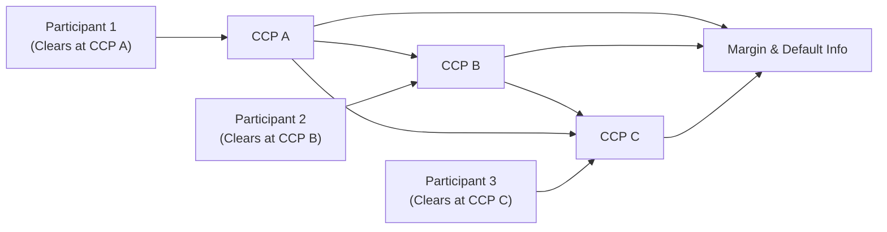

## Introduction and Overview

Interoperability among global clearinghouses is one of those topics that can feel both obvious and daunting at the same time. The idea, in a nutshell, is that multiple Central Counterparties (CCPs) can clear the same trades, or at least complementary trades, on behalf of market participants. Kinda like having multiple highways leading to the same destination—except it’s finance, so we also need traffic rules that keep everyone safe when the unexpected occurs. In derivatives markets, interoperability promises better efficiency by allowing participants to choose their preferred CCP for clearing. At the same time, it can create tricky risk-management challenges because the linkages among CCPs mean that problems in one clearinghouse might spill over to others.

In practice, interoperability is especially appealing in markets where cross-border or cross-exchange trading is common. For example, if you’re an international hedger or arbitrageur, you might want to centralize your collateral and reduce your margin calls across different positions in various jurisdictions. Interoperability is meant to help you do that by letting you net trades even if they’re cleared at different CCPs. But, wow, does that bring up some complicated risk-management questions. How do we handle a major default at one CCP if all the others are linked? And how do we coordinate margin and collateral calls so that they’re consistent across different regulatory frameworks?

This section walks you through the key benefits, pitfalls, and real-world examples of interoperability among global clearinghouses, as well as the risk controls that have emerged to keep the system stable.

## Key Concepts in Interoperability

### The Basics of CCP Interoperability

A Central Counterparty (CCP) stands between the buyer and the seller of a financial instrument, effectively guaranteeing the performance of both parties. By netting trades and requiring initial margins, CCPs reduce the overall systemic risk. Interoperability takes this framework a step further, aligning or connecting two or more CCPs so that a participant can choose which CCP to use for a given trade—even if their counterparty uses a different one.

At its core, interoperability relies on detailed Interoperability Agreements. These legal arrangements govern how CCPs will:

• Share trade data and positions in real time.  
• Coordinate margin requirements and default fund contributions.  
• Handle settlements and netting across different participant accounts.  

Because these agreements define how cash flows or collateral must be passed among the CCPs, they also define how each clearinghouse’s default waterfalls are triggered in the event of a participant’s failure. If that’s sounding a bit like advanced plumbing behind the scenes, you’re right—but it’s critical plumbing for the smooth operation of cross-market trades.

### Netting, Margin Benefits, and Capital Efficiency

One of the primary advantages of interoperability is improved capital efficiency. When your positions in multiple markets offset each other, you may need less collateral overall because your net exposure is lower. This improved netting can free up capital that might otherwise sit idle as margin or default-fund contributions in separate clearing systems. By choosing a single, preferred CCP to clear all your offsetting trades, you might reduce the total margin your firm must post.

However, netting benefits hinge on robust, consistent rules at each CCP. For instance, if CCP A requires higher margins for certain instruments than CCP B, can participants at CCP B enjoy the better netting benefits of CCP A? Possibly—but only if there’s a recognized equivalence in how each CCP calculates risk. Otherwise, a discrepancy can lead to serious confusion and potential shortfalls in margin coverage.

### Risk Management Standards

All of the fancy margin benefits in the world won’t matter if a CCP can’t handle a major crisis. That’s the simple reason there are strict requirements from globally recognized bodies (e.g., the Committee on Payments and Market Infrastructures (CPMI) and the International Organization of Securities Commissions (IOSCO)) that set minimum standards for CCP risk management. When CCPs interoperate, these standards must be upheld consistently by all participating CCPs.

Areas where these standards get particularly detailed include:

• Margin Methodologies: Aligning margin parameters (e.g., VaR models, stress scenarios) across CCPs.  
• Default Fund Contributions: Ensuring each CCP has a robust waterfall to handle defaults and that interoperable CCPs know how to coordinate if a default triggers cross-CCP exposures.  
• Settlement and Collateral Management: Uniform settlement protocols and collateral eligibility criteria.  

A personal anecdote: The first time I heard about interoperability, I got overly excited and imagined automatically netting positions across half a dozen CCPs in different time zones, thinking, “Oh, sweet, I’ll save a fortune on margins!” Then I realized how much detail goes into verifying that each CCP’s stress tests, margining, and settlement procedures align. It’s a bit like expecting to use a single subway ticket across different cities that each have their own fare rules, turnstile technology, and inspection systems.

## Benefits of Interoperability

### Competition and Lower Fees

In many jurisdictions, a single CCP has been the norm for each major asset class. Interoperability changes the game by enabling competition among CCPs for clearing a given product or exchange. This can lead to lower transaction fees, reduced collateral haircuts, and more innovative client services—generally creating a more market-driven environment that keeps clearing costs in check.

### Cross-Border Expansion and Market Liquidity

Liquidity can improve when participants from multiple regions or exchanges come together under interoperable CCP arrangements. For instance, a Hong Kong-based trader might feel more comfortable executing trades on an exchange in Europe if they can continue to clear with the Hong Kong CCP that they already know and trust. Interoperability can, therefore, expand cross-border activity, because participants aren’t forced to use unfamiliar CCPs in every new market they enter.

### Operational Simplicity for Participants

No one particularly likes dealing with multiple clearing memberships, each with its own system for margin calls, collateral acceptance, and default-fund contributions. If you can run trades through a single CCP membership (or at least fewer memberships), it’s simpler and less error-prone, from both an operational and legal standpoint. That said, in practical terms, you still need to ensure your CCP knows how to handle cross-CCP trades. So, it’s not exactly a free lunch, but it can streamline things compared to the alternative.

## Challenges and Risks

### Systemic Linkages and Default Contagion

Interoperability introduces shared exposure among CCPs. If a major clearing member defaults at one CCP and the resources at that CCP become depleted, other interoperating CCPs may face ripple effects—what if they’re holding net obligations from that same member, or from a branching chain of offsets?

Because of these systemic linkages, a shock can spread more rapidly. That’s a big reason why regulators and CCPs move slowly on interoperability proposals, especially in more complex derivative markets that tend to have bigger exposures than, say, straightforward equity trades. In times of stress, the last thing we want is an entire network of CCPs to be compromised because one link in the chain faced an unforeseen blow.

### Coordinated Margin Calls and Default Management

When trades are cleared across multiple CCPs, each with a different methodology, timing, or credit risk tolerance, we get into the weeds of harmonizing margin calls. For example, if CCP A calls for intraday margin top-ups more frequently than CCP B, a clearing participant might face liquidity constraints or becomes forced to shuffle collateral around unexpectedly. If that participant fails to post required margin to either CCP, it can trigger a default. If that default is not contained properly, the entire house-of-cards scenario begins to unfold.

Furthermore, if a conflict arises during a default management auction (where a CCP auctions off the defaulting member’s positions), orchestrating cross-CCP positions and liabilities can become extremely messy. Clear, pre-agreed processes and real-time data exchange are vital.

### Regulatory and Legal Complexities

Interoperability can involve different legal systems, especially if CCPs are based in different countries. What counts as “final settlement” in one jurisdiction might not perfectly map to settlement definitions in another. And that’s on top of differences in bankruptcy laws, netting enforceability, and capital requirements. This is why coordination and regulatory harmonization are non-negotiable stepping stones to truly safe interoperability.

Equities markets in the European Union have arguably made the most progress with interoperability, partly because equity trades are more standardized and smaller in notional value than many derivatives markets. But broadening these frameworks to complex derivatives structures remains challenging due to differences in product specifications, margining frameworks, and risk appetites across jurisdictions.

## Core Pillars for Effective Interoperability

### Real-Time Data Sharing

It’s almost impossible to manage interconnected exposures without transparent, high-speed data systems. CCPs must share participant-level exposure data, margin calls, and settlement instructions in real time. This constant stream of data helps identify potential shortfalls or mismatches before they become critical.

### Consistent Stress Testing

Stress testing is how CCPs measure their ability to withstand severe market events. If CCPs in an interoperability arrangement have widely different stress scenarios or calibrations, they may misalign in how much collateral they require from a participant. This misalignment can lead to shortfalls that become contagious if a crisis hits. Therefore, a common set (or at least highly correlated sets) of stress test methodologies is crucial.

### Robust Legal Agreements

Think of interoperability agreements as the user manual for cross-CCP coordination. They typically address:

• How to handle trade acceptance and clearing across CCPs.  
• Procedures for coordinating margin calls.  
• Mechanisms for real-time reconciliation of net positions.  
• Default management protocols, including how losses are allocated.  

Well-structured agreements define default waterfalls, cross-guarantees, or cross-marginalization procedures that reduce the risk of differences in interpretation if a default occurs. In other words, everything must be spelled out to avoid “Oh, that’s not in the contract” scenarios when the pressure is on.

### Diagram: Multi-CCP Interoperability Flows

Below is a simple Mermaid diagram that illustrates three CCPs (A, B, and C) operating under an Interoperability Agreement, each clearing trades for different participants while exchanging margin and default information in real time.

In this simplified diagram:

• Each participant trades on the same or interconnected markets but clears through a different CCP.  
• CCPs A, B, and C share margin and default risk info through an Interoperability Agreement (F1).  
• Netting is performed within each CCP, but the CCPs also coordinate so that overall exposures among them remain balanced and transparent.  

## Real-World Implementation

### European Equities: Progress in Interoperability

The European cash equities market is a poster child for CCP interoperability, with several CCPs (e.g., EuroCCP, LCH, and SIX x-clear) clearing trades executed across various exchanges. Because of well-defined and relatively uniform equity market structures, participants can choose their CCP within certain constraints. This choice fosters competition, reduces fees, and has proven fairly stable in normal market conditions.

That said, regulators remain watchful for potential domino effects, particularly under extremely volatile conditions. Regular stress testing and liquidity simulations help ensure that if a meltdown occurs, each CCP can handle its portion of exposure independently, without forcing the others into a crisis.

### Derivatives: Slower Adoption

Derivatives contracts—like futures, options, and especially complex swaps—are trickier to harmonize. Different margin models, contract specifications, and legal complexities hamper the creation of robust interoperability agreements. In addition, the notional values involved in derivatives are typically larger and more leveraged, intensifying potential systemic consequences. As a result, although the concept of interoperability in derivatives markets has gained attention, real-world adoption has been slower compared to securities markets.

## Best Practices and Pitfalls

### Best Practices

• Harmonize risk models: Ensure margining and stress testing are consistent or at least reconcilable.  
• Establish robust data pipelines: Implement high-frequency data sharing among CCPs.  
• Conduct frequent simulations: Periodic “war games” or crisis scenarios can reveal hidden points of vulnerability.  
• Align legal frameworks: Enforce standardized netting and settlement definitions across jurisdictions.

### Common Pitfalls

• Overlooking correlated exposures: Interoperable CCPs may overestimate netting benefits if certain exposures become correlated under stress.  
• Complex legal battles during default: If the Interoperability Agreement is vague or incomplete, cross-border disputes can ensue.  
• Inadequate capital for ongoing obligations: A single CCP may be sufficiently capitalized on paper, but in an interoperability arrangement, it also needs to stand ready for the potential defaults of linked CCP members.

## Final Exam Tips for CFA Candidates

• Understanding the systemic implications of interoperability is vital. In a typical exam question, you might be asked to analyze the impact of a member default in an interoperable CCP environment and propose risk mitigation steps.  
• Relate interoperability to the broader theme of financial stability. For instance, you might see an essay prompt on how cross-exchange netting can reduce capital costs but increase systemic linkages.  
• Make sure you can state both the benefits (capital efficiency, competition) and the risks (contagion, legal complexities) clearly.  
• If a scenario question describes how two CCPs share margin requirements, consider how differences in risk models might lead to challenges in real-time margin calls or default management.  
• A frequent pitfall in exam writing is to oversimplify margin netting. Examiners expect you to link netting benefits with the corresponding risk frameworks and constraints.  

## References and Further Reading

• European Central Counterparty Ltd. (EuroCCP):  
  https://euroccp.com/  

• Duffie, Darrell. “Financial Market Infrastructure: Access, Interoperability, and Antitrust.” ECB Forum, 2019.  

• Committee on Payments and Market Infrastructures (CPMI) and International Organization of Securities Commissions (IOSCO): Principles for Financial Market Infrastructures (PFMIs).  

• Bank for International Settlements (BIS):  
  https://www.bis.org/  

• LCH Group  
  https://www.lch.com/  

These sources offer deeper technical details on margin methodologies, default fund contributions, and how CCPs coordinate operationally in practice.

## Glossary

• CCP (Central Counterparty): The entity that stands between buyers and sellers in derivative or securities transactions to manage counterparty risk and guarantee settlement.  
• Interoperability Agreement: Legal and operational framework linking multiple CCPs so trades executed on the same or connected platforms can be cleared by different CCPs.  
• Netting: Reducing the total number or size of positions by summing positive and negative exposures, thus lowering capital and operational requirements.  
• Stress Testing: Modeling extreme but plausible market conditions to ensure that financial institutions (CCPs in this case) hold sufficient margin and capital to withstand severe shocks.

---

## Mastering Interoperability Among Global Clearinghouses: Practice Questions



### In an interoperable clearing setup, which of the following best explains how CCPs manage risk during a crisis event?

- [ ] Each CCP cancels all open trades to minimize exposures.  
- [x] They coordinate default management and margin calls through established interoperability agreements.  
- [ ] They rely solely on each member’s internal risk management without data sharing.  
- [ ] They fully outsource risk management to a third-party regulator.  

> **Explanation:** Under interoperability, CCPs sign comprehensive legal agreements that dictate how they’ll handle margin calls, netting, and default management procedures. They do not simply cancel trades or outsource these responsibilities.

### A key benefit of CCP interoperability for market participants is:

- [ ] Eliminating all margin requirements.  
- [x] Reducing collateral needs through cross-exchange netting.  
- [ ] Preventing default events altogether.  
- [ ] Avoiding settlement across time zones.  

> **Explanation:** Interoperability offers netting efficiencies, helping participants lower their total collateral needs. However, it certainly does not remove margin requirements or guarantee the elimination of defaults.

### Why are European equities often cited as the leading example for CCP interoperability?

- [ ] They are considered high-risk and benefit most from complex hedging strategies.  
- [x] They have more standardized structures and smaller notional values, making interoperability easier to implement.  
- [ ] They rely on specialized CCPs that do not require default fund contributions.  
- [ ] They are completely unregulated, allowing innovation.  

> **Explanation:** The standardization and smaller contract sizes of European equities make interoperability more practical and less risky, which is why many European markets have successfully implemented it.

### What is a primary concern regulators have with interoperability in complex derivatives markets?

- [x] Systemic risk can spread more easily if a major default occurs at one CCP.  
- [ ] Participants gain too many margin benefits, limiting liquidity.  
- [ ] Clearing fees become unmanageably high.  
- [ ] Liquidity gets fragmented among interoperable CCPs.  

> **Explanation:** In derivatives, the notional sizes are larger and risk distribution is more complex, increasing the likelihood of contagion if one CCP faces a significant default. This drives heightened regulatory scrutiny.

### In an interoperability arrangement, which component is absolutely necessary to avoid confusion about settlement procedures?

- [x] A robust Interoperability Agreement that precisely defines settlement and default management processes.  
- [ ] A single global bank responsible for all trades.  
- [x] Identical margin models but no legal framework.  
- [ ] A third-party bridging institution that holds all default funds.  

> **Explanation:** A well-defined Interoperability Agreement is crucial. It must address everything from margin rules to default auctions to settlement finality, ensuring all stakeholders know their responsibilities.

### One reason interoperability in derivatives has been slower to adopt than in equities is due to:

- [x] Greater complexity in margin models and contract structures for derivatives.  
- [ ] Lack of international interest in derivatives trading.  
- [ ] Equities being inherently risk-free.  
- [ ] Legal prohibitions on cross-border derivative trades.  

> **Explanation:** Derivatives carry more complex risk profiles and margining requirements, making consistent CCP interoperability rules more difficult to implement.

### In a scenario where each CCP employs slightly different stress test methodologies, how can CCPs address potential misalignments in capital requirements?

- [ ] Require participants to only trade with one CCP at a time.  
- [x] Adopt standardized or correlated stress testing frameworks to ensure consistent margining.  
- [ ] Abandon stress testing and rely solely on default insurance contracts.  
- [ ] Use interest rate swaps to offset differences.  

> **Explanation:** To prevent mismatches in margin requirements and potential shortfalls, CCPs need to coordinate or standardize their approach to stress testing so exposures are measured similarly.

### Which of the following is a potential downside of increased competition among CCPs through interoperability?

- [ ] Higher clearing fees  
- [ ] Reduced netting opportunities  
- [x] Lower profit margins for CCPs could cut into risk management budgets  
- [ ] Fewer participants in the market  

> **Explanation:** While competition can reduce transaction costs for traders, it might compress CCPs’ revenue streams, potentially leading to concerns about whether they can fund robust risk management practices.

### In a real-time interoperability agreement, what is the main benefit of sharing position and margin data at a high frequency?

- [x] CCPs can detect and address liquidity issues before they escalate into defaults.  
- [ ] It allows market participants to hide their trades from each other.  
- [ ] It replaces the need for default funds.  
- [ ] It ensures zero spread risk on cross-border trades.  

> **Explanation:** Real-time data sharing alerts CCPs to any building liquidity or margin shortfall problems, allowing them to take preventive measures quickly.

### True or False: Implementing interoperability always guarantees lower collateral requirements for every participant.

- [x] True  
- [ ] False  

> **Explanation:** Once trades net out across multiple markets, participants generally see a lower overall margin requirement. However, this depends on each CCP’s margin methodology and the correlation of a participant’s positions, so while typically beneficial, benefits may vary case by case.


