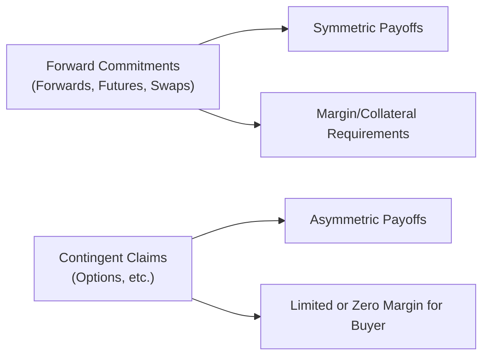

## Overview

Derivatives, at their heart, are agreements that derive value from an underlying asset, rate, or index. Two broad categories often introduced at the outset of derivative study are forward commitments and contingent claims. The first category (e.g., forwards, futures, swaps) obligates both parties to settle according to specified contractual terms, while the second category (e.g., options) gives the holder a right but not an obligation to act. This distinction is central to how these instruments are priced, margined, and used in portfolio management. And though it may sometimes seem like hair-splitting, trust me, once you’ve tried to hedge a portfolio with each kind of instrument, you’ll see how essential these differences are.

I’ll never forget one of my earliest roles on a trading desk—when I casually asked if we could “wait and see if we want to exercise our futures contracts.” My senior colleague gave me the most incredulous look and said: “Man, that’s not how futures work—they’re obligations, not a flexible ‘option.’” That moment drove home the difference between forward commitments and contingent claims like no textbook ever could.

## Key Characteristics of Forward Commitments

Forward commitments require both parties to fulfill specific obligations in the future. If you have a forward or futures contract, you can’t just shrug your shoulders and walk away if it’s unfavorable. You must deliver (or receive) the underlying or settle in cash, depending on the contract terms. Similarly, in a swap, each side is bound to exchange payments at scheduled intervals.

• Symmetrical Payoff Profiles:  
Both parties to a forward commitment have symmetrical potential gains or losses. A forward buyer gains when the spot price rises above the contracted price at expiration, while the seller gains if the spot price has fallen below the contracted price. This symmetry suggests that each side faces both upside and downside risk.

• Cost-of-Carry Framework:  
Forward commitments are frequently priced using the cost-of-carry model. The forward or futures price is determined by considering the spot price plus (or minus) costs such as storage, financing, and insurance and benefits such as dividends or coupon payments. If you’re analyzing equity index futures, for example, you might include expected dividend yields in the forward price formula.  
Mathematically, for certain underlyings, the fair forward price F₀ for time T can often be expressed as:  
F₀ = S₀ × e^(r – q)T  
where  
– S₀ = current spot price  
– r = risk-free rate  
– q = dividend yield (if applicable)  
– T = time to maturity  

• Margining and Collateral:  
Futures contracts, a standardized form of forward commitments, are typically subject to initial and variation margin requirements. Over-the-counter (OTC) forward contracts can also require collateral, though it’s negotiated bilaterally rather than set by an exchange. These margin policies help reduce credit risk but also mean that futures traders face daily cash flows based on market movements.

• Regulatory Environment:  
Exchange-traded instruments (like futures) are highly regulated, and clearinghouses often mitigate counterparty risk. Over-the-counter forwards tend to be more customized and can raise additional credit risk and regulatory considerations. You’ll see more on this in Chapter 1.4, where we discuss exchange-traded vs. over-the-counter derivatives in more detail.

## Key Characteristics of Contingent Claims

Contingent claims, such as options, only require one party (the seller/writer) to fulfill an obligation if certain conditions are met. The buyer of the option has a right but not an obligation. As a result, the payoff profile is asymmetric—losses for the buyer are capped at the premium paid, while gains can potentially be substantial.

• Asymmetrical Payoff Profiles:  
If you buy a call option, you can choose to exercise the option if the spot price ends up above the strike price, thereby realizing a profit. But if it’s not profitable, you simply let it expire unexercised. Your maximum loss is the cost (premium) of purchasing the option. The seller or writer of the option takes on an obligation and thus a potentially large (sometimes theoretically unlimited) risk.

• Option Pricing Considerations:  
While forward commitments revolve around cost-of-carry, option prices include the elements of volatility, time to expiration, and the probability distribution of future prices. Common models include the binomial-tree model (see Chapter 10.3) and the Black–Scholes–Merton model (Chapter 10.7). This is where the “Greeks” come into play—delta, gamma, theta, vega, and rho—reflecting sensitivity to underlying parameters.

• Margining and Collateral:  
Unlike futures, buyers of most exchange-traded options aren’t required to post margin; they pay the premium upfront. Sellers or writers of options, however, typically face significant margin requirements to protect against default risk. Over-the-counter options can involve collateral arrangements depending on the creditworthiness of the parties.

## Comparing the Two: Symmetrical vs. Asymmetrical Payoffs

Forward commitments create symmetrical exposures in which each party is on the hook for a potentially large gain or loss, depending on the movement of the underlying asset. In contrast, a contingent claim grants one party (the option buyer) the right, not the obligation, to trade, resulting in a “kinked” payoff diagram at the strike price.

Below is a simple Mermaid flowchart that summarizes some of these differences in visual form:

When you graph the payoff of a forward contract held to expiration, it appears as a straight line intersecting the horizontal axis at the contracted price. An option payoff diagram has that characteristic elbow shape at the strike, reflecting no downside risk beyond the premium for the buyer.

## Practical Use Cases

• Hedging and Risk Reduction:  
Forward commitments are a favorite among corporations that need to lock in prices—say, a wheat farmer who enters a forward contract to ensure a certain price for the harvest or a manufacturer locking in raw-material costs. Swaps are used extensively to manage interest rate or currency exposures. Meanwhile, contingent claims like options are handy when you want downside or upside protection but don’t want to face unlimited risk. A portfolio manager might buy put options on an equity index to limit potential losses while retaining upside if the market rallies.

• Directional Bets:  
Speculators often use futures or forward contracts to express a directional view on interest rates, commodities, or equities, while options allow more nuanced expressions of market views. For instance, a speculator expecting a surge in volatility might buy calls or puts (long straddles or strangles). If volatility does pop, any large move in the underlying—up or down—could yield profits.

• Yield Enhancement:  
Selling covered calls is a classic yield-enhancement strategy. You hold the underlying asset and write a call option on it, collecting a premium. If the price stays below the strike, you keep the premium. But you’re forfeiting any gains above the strike, which is something to keep in mind if you see a sudden bullish market.

## Risk Management Differences

From a risk management standpoint, forward commitments involve symmetrical risk for both sides, so margining or collateral provisions typically apply to both the long and the short. With contingent claims, the most immediate risk is faced by the party who sold the option. The option buyer can walk away at no further cost beyond the premium.

It’s also important to note that while forward commitments typically involve a near-100% notional exposure (since the entire underlying is notionally traded), contingent claims can grant economic exposure in excess of the capital laid out. The option premium might be a fraction of the underlying’s value, which can magnify potential returns—but also elevate the possibility of large losses for the seller if the markets move against them.

## Common Pitfalls and Best Practices

• Misunderstanding Obligations vs. Rights:  
As I mentioned earlier, never assume you can “decide later” with a forward or futures contract. If the market goes against you, you can’t just let it expire worthless the way you’d do with an out-of-the-money option.

• Inadequate Margin or Collateral:  
Futures exposures can escalate quickly if margin calls keep piling up. Always keep a cushion, especially in volatile markets. Similarly, if you write options, know that you’ll face margin calls if the underlying starts moving dramatically.

• Not Accounting for the Cost of Carry:  
Especially in commodities, storage, insurance, and financing costs can shift a forward or futures price significantly above or below the spot price. If you forget to adjust for these factors, you’ll make inaccurate estimates of fair value, leading to potential mispricing and poor decisions.

• Overlooking Volatility for Options:  
Purchasing options without properly evaluating implied volatility can be costly. A high premium (due to high implied volatility) can wipe out potential profits even if the underlying moves in your favor but doesn’t exceed the market’s expectations.

## Real-Life Example: Corporate Hedging Strategy

Imagine you are the CFO of a coffee importer. You’re worried about rising coffee bean prices over the next six months. You can hedge that risk either by:
• Entering a forward/futures contract to lock in a buying price. This symmetrical strategy protects you if coffee prices move higher but forgoes potential savings if prices decline.  
• Purchasing a call option on coffee futures. This asymmetrical payoff ensures that if coffee goes unexpectedly higher, your option payoff offsets the increase, but if coffee prices fall, your maximum loss is the option premium, and you can purchase the coffee at cheaper spot prices.  

Both strategies manage risk, but each involves different costs and payoffs. The forward contract typically has zero cost to enter (aside from margin), but you lose out if prices go down. The call option requires an upfront premium but provides flexibility if prices move in your favor.

## Exam Relevance and Tips

In the CFA Program—especially at Level I—understanding the fundamental differences between forward commitments and contingent claims is essential. You’ll see quantitative questions testing your ability to generate or interpret payoff graphs, or references to the cost-of-carry model to calculate forward prices. For option questions, you might need to apply put–call parity (explored in Chapter 10.2) or gauge the effect of volatility on an option’s premium. The exam might also present a scenario involving hedging or speculation, asking you to choose the most appropriate derivative instrument.

When responding to exam questions:

• Clearly identify whether the instrument in question is a forward commitment or a contingent claim.  
• If dealing with a forward commitment, apply the cost-of-carry approach.  
• If discussing an option, remember to factor in implied volatility, time value, and intrinsic value.  
• Pay attention to risk management aspects. The exam may ask you to choose the best hedge given specific risk exposures or regulatory constraints.

## Glossary

• Forward Commitment:  
A contract whose terms bind both parties to trade the underlying (asset, rate, or index) at a specific price on a future date.

• Contingent Claim:  
A contract that has a payoff dependent on whether an uncertain event occurs or whether an underlying price is above or below a certain level (e.g., options).

• Payoff Profile:  
A graphical representation or formula describing the gains or losses arising from a derivative at different underlying asset prices.

• Cost of Carry:  
The net cost (or benefit) of holding an underlying, which can include financing expenses, storage costs, dividends, or yield.

## References for Further Study

• McDonald, Robert L. “Derivatives Markets.” 3rd ed., Pearson, 2013.  
• CFA Institute. “Forward and Futures Contracts.” CFA Program Curriculum.  
• “Swaps Markets,” see Chapter 3 for a deeper look into the variety of swap agreements.  
• “Options and Contingent Claims,” see Chapter 4 for more on pricing methodologies, payoffs, and strategies.  

---

## Forward Commitments vs. Contingent Claims: Practice Quiz



### Which of the following best describes a forward commitment?  
- [x] A contract that obliges both parties to transact at a specified future date under agreed-upon terms.  
- [ ] A contract that grants the buyer the right but not the obligation to transact in the future.  
- [ ] A credit derivative that protects the buyer against default risk.  
- [ ] A type of security that only pays off if a specified market condition is met.  

> **Explanation:** Forward commitments require both parties to fulfill contractual obligations (buy or sell), unlike an option, which only confers a right without any obligation for the buyer.

### What primarily distinguishes a contingent claim from a forward commitment in terms of payoff?  
- [ ] The margin requirements are typically higher for contingent claims.  
- [x] The payoff for contingent claims is asymmetric, while the payoff for forward commitments is generally symmetric.  
- [ ] Forward commitments are traded on exchanges, while contingent claims are always OTC.  
- [ ] Forward commitments have a fixed premium cost, while contingent claims are entered at zero cost.  

> **Explanation:** A contingent claim, such as an option, provides a right without obligating the holder to exercise, creating an asymmetric payoff profile. Forward commitments’ payoffs are linear and symmetric.

### In the cost-of-carry model for equity futures pricing, which of the following components typically reduces the futures price relative to the spot?  
- [ ] Higher risk-free interest rates.  
- [x] Expected dividend yield.  
- [ ] Higher storage costs.  
- [ ] Lower convenience yields.  

> **Explanation:** When stocks pay dividends, the holder of the underlying receives these dividends, which reduces the theoretical futures price relative to the spot price in the cost-of-carry model.

### In an option contract, the maximum loss for the buyer is:  
- [ ] Unlimited, as they must honor the contract.  
- [ ] Equal to the notional amount of the underlying.  
- [ ] Contingent on implied volatility in the market.  
- [x] Limited to the premium paid for the option.  

> **Explanation:** The buyer of an option never loses more than the premium paid, reflecting the right—but not the obligation—to exercise the contract.

### Which statement accurately reflects a similarity between forward contracts and swaps?  
- [x] Both can be viewed conceptually as a series of forward commitments between two parties.  
- [ ] Both have an asymmetric payoff structure for the buyer.  
- [ ] Both require the payment of a premium at inception.  
- [ ] Neither are influenced by changes in the underlying spot price.  

> **Explanation:** Swaps are often decomposed into a series of forward contracts. Both are forms of forward commitments obligating both parties to perform.

### Assuming no arbitrage, what happens when storage costs for a commodity rise significantly?  
- [ ] The spot price of the commodity always decreases.  
- [ ] The forward price always decreases.  
- [ ] The forward price is unaffected if interest rates remain constant.  
- [x] The forward price generally increases to reflect higher cost of carry.  

> **Explanation:** Rising storage costs increase the cost of carry, which raises the forward price of the commodity to prevent arbitrage opportunities.

### A portfolio manager wants downside protection but is willing to pay a premium for it. Which derivative might be the most appropriate choice?  
- [x] Buying a put option on the underlying.  
- [ ] Selling a call option on the underlying.  
- [ ] Entering a long forward contract.  
- [ ] Entering a swap to pay fixed.  

> **Explanation:** Buying a put option provides downside protection (if the underlying falls below strike price). The put buyer decides whether or not to exercise, so risk is limited to the premium.

### Which party assumes the largest potential risk in a typical exchange-traded option contract?  
- [ ] The buyer of the option, who faces unlimited losses if the market moves against them.  
- [ ] The clearinghouse that matches trades.  
- [x] The seller (writer) of the option, who may face substantial or unlimited losses depending on the contract.  
- [ ] Both the buyer and the seller share equal risk.  

> **Explanation:** The option buyer’s risk is capped by the premium, while the seller takes on potentially large losses if the market moves unfavorably.

### What is a key advantage of a forward commitment (like a forward contract) over a contingent claim (like an option) from a hedger’s perspective?  
- [x] It can lock in a price without premium costs at initiation.  
- [ ] It provides unlimited upside with no downside.  
- [ ] It has lower margin requirements than an option.  
- [ ] It benefits strictly if volatility increases.  

> **Explanation:** Forward contracts generally do not involve an upfront premium, which appeals to many hedgers looking to fix a price at minimal initial cost.

### When writing an option, the seller must generally post margin because:  
- [x] The seller faces potentially significant liabilities if the market moves against the option position.  
- [ ] The seller needs to fund the premium paid by the buyer.  
- [ ] Margin is unnecessary—options always clear at zero cost.  
- [ ] This is required only by unregulated clearinghouses.  

> **Explanation:** Option sellers face open-ended (or at least sizable) risk, so exchanges require margin to ensure the seller can fulfill their obligations.


