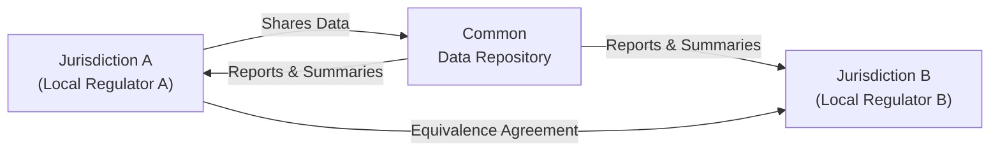
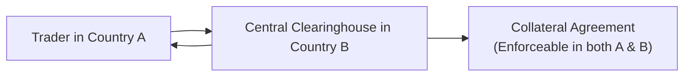

## Introduction and Rationale

Cross-border derivative transactions can be a real headache, you know? I remember working with a client whose swaps booked in one jurisdiction were regulated under a completely different set of rules than those in another region, and it felt like managing two completely different worlds. The central issue here is that derivatives, by nature, can zigzag across markets, time zones, and legal systems in the blink of an eye. That’s all perfectly normal—until you realize each jurisdiction might have its own laws, capital requirements, reporting formats, and even definitions of what constitutes a “derivative.” This complexity increases compliance burdens, can create conflict among overlapping rules, and sometimes just results in a pile of confusion.

Cross-border regulatory harmonization aims to coordinate the key aspects of derivative regulations across different nations. At a high level, it involves setting mutually recognized rules about reporting, clearing, capital, and default management so that (ideally) wherever the trade is executed or cleared, participants can follow a consistent framework. Let’s dig in to see why this matters so much, how global standard setters like IOSCO (International Organization of Securities Commissions) shape guidelines, and what challenges regulators still face.

## Intersections of Cross-Border Regulation

### Why Locations Matter So Much

Derivative end-users don’t always appreciate that a contract traded in one country might be cleared in another and eventually involve collateral posted in yet another jurisdiction. Each region may impose its own capital, margin, and reporting requirements with the goal of safeguarding the local market. The trouble starts when these rules differ significantly or conflict outright, causing participants either to:

• Duplicate efforts (reporting trades multiple times using varied templates).  
• Incur extra compliance costs because they must adhere to both sets of rules.  
• Potentially face contradictory obligations.

### The Push toward Harmonization

After the 2008 global financial crisis, the G20 countries agreed that over-the-counter (OTC) derivatives needed stricter oversight. With the Financial Stability Board (FSB) coordinating broad reforms and IOSCO publishing more detailed guidance, the aim was to have consistent:

• Clearing requirements (mandating central clearing for standard derivatives).  
• Margin requirements for non-centrally cleared derivatives.  
• Reporting standards to swap data repositories (SDRs).  
• Capital rules that reflect the economic realities of derivative exposures.

So, if your eyes are already glazing over at the mention of these standardized rules—well, you’re not alone. But it’s important: consistent frameworks make cross-border transactions less burdensome and reduce the chance that a market participant can shop around for weaker regulation.

## Key Components of Cross-Border Harmonization

### Equivalence and Substituted Compliance

Two big terms you’ll hear in this context are equivalence and substituted compliance.

• Equivalence: A regulatory authority in, say, Country A recognizes that Country B’s rules achieve the same regulatory outcomes. Once official equivalence is granted, participants from Country B can enter Country A’s market without having to follow a second, duplicative set of rules.  
• Substituted Compliance: A concept that allows firms to comply with the regulations of their home country in place of local requirements—provided these rules are “equivalent.” Essentially, if your home rules are good enough, a foreign regulator permits you to abide by those instead of the local ones.  

This system is intended to maintain high regulatory standards in a cross-border environment, minimize headaches for international firms, and hopefully not hamper competition.

### IOSCO and BIS Guidelines

At the global level, IOSCO (the International Organization of Securities Commissions) and the BIS (Bank for International Settlements) often emerge as the standard setters. IOSCO fosters consistent standards for securities and derivatives regulation, while the BIS, via its committees (like the Basel Committee on Banking Supervision), focuses on banking and financial stability. Both publish key guidelines on:

• Market infrastructures (trading platforms, central counterparties).  
• Reporting transparency (both pre- and post-trade).  
• Risk management best practices (like margin guidelines for uncleared swaps).

Although these organizations do not pass laws, their guidance strongly influences national regulations, especially when the G20 or the Financial Stability Board endorses specific proposals.

## Challenges and Ongoing Issues

Even with best efforts, cross-border harmonization has its challenges:

1. Data Sharing and Secrecy Laws: Certain jurisdictions (for instance, some with strict client confidentiality laws) have historically resisted broad data sharing. OTC derivatives reporting mandates often require detailed disclosures that conflict with secrecy laws.  
2. Different National Priorities: Governments vary in their emphasis on systemic risk oversight, market competitiveness, or even how they interpret “equivalent” rules. A mismatch in capital or reporting standards can hamper market participants who have to juggle multiple regimes.  
3. Legal Certainty in Default Management: Central clearinghouses collect collateral from both sides of a trade and must quickly deploy that collateral in a default scenario. Transferring and liquidating collateral across jurisdictions can be tricky if local courts don’t recognize the netting or if the default-management process is legally uncertain.  
4. Local Nuances: While global bodies want to unify as many rules as possible, each country has unique legal frameworks. Netting enforceability, insolvency proceedings, or even how a “credit event” is defined might differ among major derivatives hubs. Attempting to unify it all is a delicate process.

### Diagram: Cross-Border Regulatory Interactions

Below is a simplistic visualization of how two regulatory frameworks might interact when a derivative crosses country boundaries:



In this simplified picture, Jurisdiction A and Jurisdiction B share certain trade data through a common repository, and regulators rely on an equivalence agreement so that each side trusts the other’s regulatory standards.

## Substituted Compliance in Practice

### An Example Scenario

Picture a large multinational bank headquartered in Country X, trading an interest rate swap on an exchange in Country Y, cleared in Country Z. Without substituted compliance or equivalence, the bank might need to comply with:

1. Disclosure and reporting laws of Country X for all trades booked by an entity domiciled there,  
2. The clearing and margin requirements of Country Y,  
3. Potentially local laws in Country Z regarding how it must post collateral, net derivatives exposures, or handle default procedures.

If these three sets of rules conflict, the bank ends up in regulatory no-man’s land. Substituted compliance can let Country X’s firms abide by Country X’s home laws (if recognized as equivalent) rather than repeating or conflicting with Country Y or Z’s laws.

### Equivalence “Tangles” and Negotiations

You might recall (or maybe you’ve heard from chat around the trading floor) that negotiations about equivalence can drag on for years. Major financial centers—like the U.S., European Union, and certain parts of Asia—often require extensive reviews of each other’s regulatory frameworks. They want to ensure that capital, margin, and oversight mechanisms produce substantially similar outcomes.

Sometimes, equivalence is granted only for certain products (e.g., interest rate swaps but not credit default swaps), or in certain circumstances (e.g., trades above a certain notional threshold). This partial approach can lead to “complex patchworks” of recognized regulations and is a prime area where more streamlined efforts are still needed.

## Role of Global Entities

### G20 and the Financial Stability Board (FSB)

The G20 leaders hammered out the standard post-crisis “punch list” of OTC derivative reforms, stressing greater transparency and consistent regulatory coverage. The Financial Stability Board (FSB) is the forum that coordinates and monitors national-level progress, regularly issuing reports on whether and how each country is implementing reforms. The big message is: “Don’t let a crisis in one market sow seeds in another.”

### IOSCO

As the global body of securities regulators, IOSCO’s role is to unify its members behind common standards. This includes:

• Disclosure norms: specifying what must be reported for derivative trades, when, and in what format.  
• Best practices for clearinghouses: including margin methodologies, governance, and stress testing.  
• Harmonized data fields: ensuring that trade repositories collect consistent, comparable data.

### BIS

The Bank for International Settlements supports central banks, fosters monetary and financial stability, and influences derivative regulation primarily through committees. For instance, the Basel Committee on Banking Supervision sets capital requirements for banks, effectively determining how derivatives exposures factor into risk-weighted assets and capital buffers.

### The Netting Enforceability Puzzle

One of the hottest technical topics in cross-border derivatives is “netting enforceability.” Here’s why: when two parties do multiple trades, they often have a master agreement that allows netting of exposures. If the party on the other side defaults, netting means the remaining, non-defaulting party only has to pay or receive the net amount across all trades instead of facing each trade singly. This reduces credit risk drastically. But netting is only useful if local courts will uphold it. That’s why many netting opinions—legal endorsements that netting is recognized—are country-specific. Harmonizing netting rules helps ensure consistent outcomes across jurisdictions, so no one is blindsided by a foreign regulator rejecting a netting claim.

## Data Reporting and Transparency

Regulators worldwide have demanded that OTC derivatives trades be reported to specialized repositories to give authorities a clearer picture of market exposures. But the unfortunate truth is that different countries have different data fields, different unique transaction identifiers, and sometimes different definitions. Harmonizing these data standards is crucial to:

• Reduce duplication in reporting.  
• Make cross-border trade data more straightforward to aggregate.  
• Enhance regulators’ ability to spot systemic risks spanning multiple countries.

This remains a huge challenge, partly because data secrecy laws and operational tech complexities can hamper free-flowing information. However, IOSCO and the FSB continue to push for standardized data fields (like LEIs—Legal Entity Identifiers—and UTIs—Unique Trade Identifiers) to make cross-referencing feasible.

## Cross-Border Clearing Considerations

### Central Clearing Requirements

Many standard derivatives are now required to be cleared through central counterparties (CCPs). If your CCP is in another jurisdiction, your local regulator will want to ensure that CCP meets comparable standards for membership criteria, margin models, and default waterfalls.

### Collateral and Margins

Local laws can differ on how collateral is posted, rehypothecated, or segregated. If you post collateral to a foreign CCP, you need certainty that local regulations will protect you in case the CCP or clearing member defaults.

### Example Workflow

Let’s illustrate how cross-border clearing might function in an ideal scenario:



In this streamlined arrangement, country A’s regulators consider country B’s central clearing rules as “equivalent,” so the trader in A can use that CCP without having to do all the compliance steps twice. Meanwhile, the collateral arrangements are recognized in both countries.

## Best Practices and Strategies for Compliance

• Coordination Early On: If you’re a firm dealing with cross-border trades, coordinate with your legal and compliance teams early in the process so you know where any potential equivalence or substituted compliance can reduce your burdens.  
• Keep Up with Global Updates: Because the FSB and IOSCO regularly revise standards, it’s good practice to monitor official channels and professional bodies. This can feel tedious, but trust me, it’s a short-term pain for long-term clarity.  
• Understand Local Nuances: Even if broad equivalence is in place, local quirks may persist, such as licensing requirements or unique data fields.  
• Maintain Sound Legal Opinions: In cross-border deals, you always want to have robust, up-to-date legal opinions regarding netting, collateral enforceability, and default management. Don’t assume that what works at home automatically holds abroad.

## Potential Pitfalls and How to Avoid Them

• Fragmented Reporting: Submitting the same trade data to multiple repositories in different formats can lead to mismatched or inaccurate records. Work with your regulator to see if there’s a way to rely on a single data feed recognized across multiple jurisdictions.  
• Overlooking Different Collateral Rules: Some jurisdictions require that posted collateral be held in a bankruptcy-remote vehicle. Another might let you reuse collateral. Know these differences from the get-go.  
• Missing Substituted Compliance Deadlines: If regulators say you need to apply for substituted compliance by a certain date, missing that window could mean you end up with a double compliance burden.  
• Varying Definitions of “Equivalence”: Exactly how regulators define “equivalent” can differ widely. Clarify up front whether your regime’s margin models, capital rules, or default processes truly align with a foreign regulator’s expectations.

## A Tiny Python Example for Data Consolidation

Many large institutions employ some level of automation to gather cross-border regulatory data. Here’s a short Python snippet that (conceptually) merges two data sets in different formats, removing duplicates:

```python
import pandas as pd

df1 = pd.DataFrame({
    'TradeID': ['T123', 'T124'],
    'Notional': [1000000, 2000000],
    'Counterparty': ['CP_A', 'CP_B']
})

df2 = pd.DataFrame({
    'Transaction_ID': ['T123', 'T125'],
    'Amt': [1000000, 500000],
    'Ctpy': ['CP_A', 'CP_C']
})

df2.rename(columns={
    'Transaction_ID': 'TradeID',
    'Amt': 'Notional',
    'Ctpy': 'Counterparty'
}, inplace=True)

merged_df = pd.merge(df1, df2, on=['TradeID','Notional','Counterparty'], how='outer', indicator=True)

print(merged_df)
```

In practice, a more sophisticated approach ensures consistent unique identifiers (UTIs/LEIs), deals with differences in currency or interest rates, and meets each jurisdiction’s data requirements. But you get the idea: at least from a data standpoint, cross-border compliance can be partially automated if you plan for it.

## Future Developments

• The FSB and IOSCO are continuously looking for ways to unify margin practices for uncleared derivatives.  
• More countries are investigating or establishing equivalence agreements.  
• There’s ever-expanding talk about digitalization, data standardization, and the role of distributed ledger technology in smoothing cross-border flows.  
• In some corners, we see a push for “globally recognized unique product identifiers” that might unify the thousands and thousands of derivative instruments we see traded every day.

## Exam Tips for CFA Candidates

• Emphasize Key Definitions: Understand “equivalence” and “substituted compliance” inside out. These terms show up in cross-border regulatory questions.  
• Master the Entities: Know the roles of IOSCO, the FSB, BIS, and how each influences derivative oversight.  
• Real-World Impacts: Be sure you can explain how conflicts in regulation create practical issues for clearing, netting, and reporting.  
• Link to Systemic Risk: Connect how cross-border harmonization helps reduce systemic risk and fosters a more stable marketplace.  
• Time Management in Essays: If a question asks you to compare and contrast different regulatory frameworks, maintain a structured approach, and apply real examples or references to best practices.  

Consistency is key when the exam asks how a portfolio manager or firm would manage cross-border derivative trades under a patchwork of rules.

## References

• IOSCO. “Harmonization of OTC Derivative Regulations.” Retrieved from  
  https://www.iosco.org/

• Financial Stability Board. “OTC Derivatives Market Reforms: Progress Report.” Retrieved from  
  https://www.fsb.org/

• Bank for International Settlements. “Standards for Market Infrastructures.” Retrieved from  
  https://www.bis.org/

• G20. “Leaders Statement, The Pittsburgh Summit.” 2009.

• Basel Committee on Banking Supervision. “Capital Treatment for Bank Exposures to Central Counterparties.” BIS Publications.

## Assess Your Knowledge: Cross-Border Regulatory Harmonization



### Which of the following best describes "substituted compliance" in cross-border derivative regulation?

- [x] A firm’s ability to follow its home-country regulations when they are deemed equivalent to a host country’s rules.
- [ ] An exemption that allows a firm to opt out of all local regulatory obligations.
- [ ] A requirement for each firm to comply fully with duplicate sets of rules.
- [ ] A measure taken only after a major regulatory breach.
  
> **Explanation:** Substituted compliance means you can comply with your home regulations if they’re deemed comparable in outcomes to local regulations.

### Which global body coordinates regular progress reports on OTC derivative market reforms among G20 nations?

- [ ] IOSCO
- [x] The Financial Stability Board (FSB)
- [ ] The Bank for International Settlements (BIS)
- [ ] The United Nations (UN)
  
> **Explanation:** The FSB monitors and reports on each jurisdiction’s progress, ensuring consistent implementation of G20 mandates.

### Which statement is true regarding netting enforceability in cross-border derivatives?

- [x] Legal opinions are often required to confirm that netting provisions will be upheld in each relevant jurisdiction.
- [ ] Netting is universally recognized in all countries without condition.
- [ ] Central counterparties never require netting arrangements for cleared trades.
- [ ] Netting only reduces exposure for credit default swaps, not other derivatives.
  
> **Explanation:** A hallmark of cross-border trades is ensuring local jurisdiction courts honor netting agreements. Legal opinions help confirm that netting is enforceable.

### Why is equivalence important in the context of cross-border transaction oversight?

- [ ] It ensures that all derivatives globally are taxed identically.
- [ ] It replaces the need to review foreign regulations.
- [x] It recognizes that another jurisdiction’s rules produce similar outcomes, allowing fewer duplicative requirements.
- [ ] It prevents clearinghouses from operating internationally.
  
> **Explanation:** Equivalence is granted when a foreign regulatory regime is viewed as sufficiently robust, reducing overlapping oversight.

### Which of the following entities is most closely associated with establishing securities and derivatives market standards?

- [ ] The World Bank
- [ ] The European Central Bank
- [x] IOSCO (International Organization of Securities Commissions)
- [ ] World Trade Organization
  
> **Explanation:** IOSCO focuses on securities regulation and setting high-level policy for derivative markets, often in collaboration with other bodies.

### What is a main challenge in standardizing OTC derivatives reporting requirements across different jurisdictions?

- [ ] Solutions for data standardization already exist and are universally applied.
- [x] Different countries have varying data fields, confidentiality laws, and definitions of “derivatives.”
- [ ] Reporting is mandatory only for exchange-traded derivatives, not OTC products.
- [ ] All regulators demand the same format, causing uniform compliance costs.
  
> **Explanation:** Fragmentation persists due to national differences in definitions and secrecy laws, which makes universal data standards tough to implement.

### Cross-border clearing relies heavily on which factor for effective default management?

- [ ] Exclusive reliance on domestic courts for collateral claims.
- [x] Legal clarity that collateral posted with a foreign CCP can be liquidated or transferred as intended.
- [ ] Avoiding membership in any international clearing organizations.
- [ ] Eliminating margin requirements for cross-border trades.
  
> **Explanation:** Legal clarity ensures posted collateral can be used in a default scenario, even if the CCP and counterparties are in different jurisdictions.

### Which organization plays a prominent role in setting global capital requirements for banks trading derivatives?

- [ ] Financial Stability Board (FSB)
- [x] Basel Committee on Banking Supervision (under the BIS)
- [ ] The Commodity Futures Trading Commission (CFTC)
- [ ] G20
  
> **Explanation:** The Basel Committee under the BIS develops capital frameworks, such as Basel III, ensuring banks hold sufficient buffers for derivative exposures.

### One advantage of “substituted compliance” arrangements is:

- [ ] Firms have no obligation to monitor foreign regulators.
- [ ] Compliance is optional in all jurisdictions.
- [x] Firms can avoid duplicative regulatory burdens when regimes are recognized as equivalent.
- [ ] Fees for cross-border reporting are waived entirely.
  
> **Explanation:** Substituted compliance helps reduce duplication, meaning a firm primarily follows its home regime if it’s officially recognized as aligned with the host jurisdiction’s rules.

### True or False: Cross-border regulatory harmonization completely eliminates all compliance challenges in international derivative trading.

- [x] True
- [ ] False

> **Explanation:** This is actually a trick question—the notion that harmonization completely eliminates challenges is overly optimistic. While significant reductions in compliance conflicts may occur, local nuances and ongoing reforms mean some challenges will always remain.


