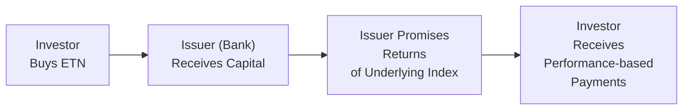
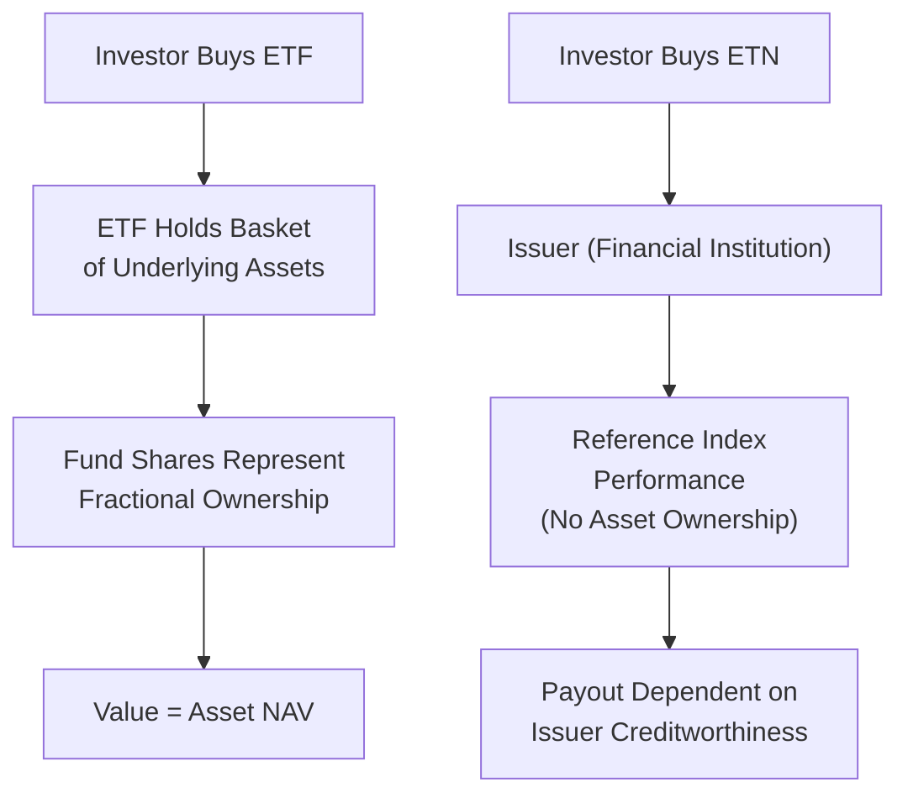

## Understanding the Basics of ETNs

Whenever someone in a trading room asks me about exotic-seeming products, I can’t help recalling the first time I encountered an Exchange-Traded Note (ETN). I remember feeling excited—and maybe slightly nervous—when I realized these things were neither quite like bonds nor quite like mutual funds. That’s because ETNs are senior, unsecured debt obligations issued by a bank or other financial institution. Unlike a typical bond that promises a fixed coupon and principal repayment, an ETN promises returns linked to the performance of an underlying benchmark, so if that benchmark moves up or down, your payoff moves along with it.

From a bird’s-eye view, ETNs work sort of like an IOU from the issuer: “Buy our note, and in return, we’ll pay you whatever the underlying index returns, minus fees.” But here’s the catch—since an ETN is essentially a debt instrument, you’re relying on the issuer’s creditworthiness. If the issuer can’t back the note (think bankruptcy or serious financial trouble), you may lose out regardless of how well the benchmark did. That’s a stark distinction from Exchange-Traded Funds (ETFs), where you own a slice of an actual portfolio of assets.

Below is a simple diagram illustrating the basic flow of an ETN transaction:



In this diagram, the investor’s ETN purchase means the issuer gets cash (like with any bond issuance). The issuer then promises a payoff linked to a reference index. At maturity (or if redeemed earlier), the investor receives the performance-based payout.  

## Key Structural Features

ETNs are known for their ability to track complicated assets or complex strategies that might be impractical or expensive to replicate through other structures. They can provide exposure to commodities, currencies, or volatility indexes without an investor having to trade futures, options, or swaps directly. Some notes might even come with leverage included—offering multiples of the reference index’s daily return—or be designed to produce inverse returns when the index moves in a particular direction.

• Senior, Unsecured Debt. Each ETN is, at heart, a debt obligation. That means it has a maturity date and ranks above other junior obligations if the issuer goes bankrupt. However, even seniority doesn’t eliminate the chance that the issuer could default.  
• No Direct Ownership of the Underlying Asset. ETNs simply promise a return that references an index; there’s no actual “basket” or “pool” of securities the note holder owns. This stands in contrast to ETFs, where shareholders essentially own fractional interests in the underlying portfolio.  
• Fees, Not Coupons. The expectation is that the returns (positive or negative) will track the reference index minus an annual fee (and potentially other embedded costs). In many ETNs, you won’t see periodic interest or coupon payments the way you would with a standard bond.  

## Why Credit Risk Matters So Much

Unlike an ETF that is backed by actual securities, an ETN’s performance is purely a function of the issuer’s promise. And, well, we’ve all seen situations where large institutions face trouble—think of the 2008 financial crisis. If the institution that issued your ETN defaults or if its credit rating sinks dramatically, expect the note's market price to tumble, regardless of how the underlying index is performing. This is why credit risk is the biggest standout risk in ETNs.

Case in Point: During the financial crisis, some ETNs experienced sharp drops in price even though their reference indexes were relatively stable. Investors, spooked by doubts about the issuers’ solvency, were not willing to pay for the issuer’s promise anymore.

Keep in mind that the market price of an ETN can trade below its theoretical fair value if investors fear future default risk or anticipate a lack of liquidity. That difference between theoretical “indicative” value and actual trading price can become significant, especially in volatile market conditions.

## Comparing ETNs and ETFs

Market participants sometimes find ETNs and ETFs confusingly similar because both are exchange-traded products with ticker symbols. However, their underlying mechanics differ in critical ways. Let’s compare:

| Factor          | ETN                                                            | ETF                                                      |
|-----------------|----------------------------------------------------------------|----------------------------------------------------------|
| Structure       | Senior, unsecured debt obligation                              | Fund holding a basket of underlying assets              |
| Underlying      | Tracks index performance, but no direct ownership of assets    | Direct ownership of securities or commodities           |
| Credit Risk     | Subject to issuer default risk                                 | Minimal credit risk (assets typically segregated)       |
| Fees            | May have management fees and annual tracking fees              | Often low expense ratios, fund-level fees               |
| Tax Treatment   | Potential deferral of gains until sale/maturity               | Capital gains occur upon rebalancing or distributions   |
| Liquidity       | Price may deviate from fair value if liquidity dries up        | Supported by creation/redemption with authorized participants |
| Maturity        | Has a maturity date; issuer can choose to accelerate or call   | Doesn’t have a maturity, can exist indefinitely         |

So, yes, they’re both listed on exchanges, but that’s about where the direct comparison ends. With an ETF, you indirectly own the underlying assets. With an ETN, you own a promise.

## Potential Tax Advantages

ETNs sometimes attract investors looking for nuanced tax positioning. Because ETNs typically do not generate interim distributions (like dividends or coupons), investors may defer recognition of gains for tax purposes until the sale or maturity of the note. By contrast, many ETFs or mutual funds distribute gains annually. That said, tax nuances differ by jurisdiction, and regulators can change the tax treatment if they suspect a product is being used primarily to avoid taxes. If you’re looking at ETNs for tax reasons, it’s wise to keep an eye on the regulatory environment and consult a professional—preferably one with a sense of humor to keep tax talk interesting.

## Liquidity and Market-Making

In an ideal world, ETNs would trade perfectly in sync with their intrinsic value, updating in real time as the underlying index moves. But real life is complicated. Most ETN liquidity is managed by the issuer or its designated broker-dealer. These market makers provide quotes to buy or sell the ETN on the exchange, aiming to keep the ETN’s market price in line with its indicative value.

Well, guess what can happen if the issuer (or underwriter) decides to halt or reduce its market-making activities? The ETN’s trading spread might widen, or prices could become extremely volatile. In thinly traded ETNs, large buy or sell orders can disrupt prices. One day you might get a fair deal, while on another day, you might see the ETN’s price jump or dip significantly from fundamentals simply because there aren’t enough counterparties in the market.

## Leveraged and Inverse ETNs

If plain vanilla ETNs aren’t intriguing enough, the market also offers leveraged and inverse versions. Leveraged ETNs aim to return some multiple (2×, 3×, or even more) of the daily performance of the underlying index, while inverse ETNs seek to deliver the daily opposite return. Holding these over the long term, though, can lead to some interesting and sometimes unwelcome outcomes due to the effect of daily resets.

Imagine a 2× leveraged ETN on a volatile index. If the index alternates between gains and losses, the daily reset and compounding could erode returns over time. A simplified numerical example can illustrate the compounding effect:

• Start: Index at 100; 2× ETN is also $100 for simplicity.  
• Day 1: Index gains 10% to 110. ETN gains 2×10% = 20%, new ETN value = $120.  
• Day 2: Index loses 10%. That 10% is calculated on the new index level of 110, so the index ends at 99.  
   – The 2× ETN loses 2×10% = 20%, but this 20% is on the new ETN value of $120, so the ETN goes down by $24 to $96.  
• Net result after two days: Index is at 99 (a 1% overall loss from 100), while the ETN is at 96 (a 4% overall loss).

That’s just an example, but it highlights why short-term traders may love the daily leveraged structure, while long-term buy-and-hold investors could be in for a nasty surprise if they hold a leveraged or inverse ETN through sustained volatility.

## Practical Applications of ETNs

So, you might be asking: Why bother with ETNs at all? Well, a few good reasons stand out:

• Access to Hard-to-Replicate Markets. If you want direct exposure to, say, a very specialized commodity index or a foreign currency basket, it might be complex or cumbersome to piece together a direct futures or spot-based strategy. An ETN can provide a simpler, single-ticket solution.  

• Potential Tax Efficiencies. As touched on above, some investors prefer the structure due to the possibility of deferring capital gains or managing tax obligations differently from ETFs.  

• Low Tracking Error (Ignoring Credit Risk). ETNs, in theory, deliver an exact replication of the reference index’s return (minus fees), since the issuer isn’t rebalancing a physical portfolio. If the issuer is financially strong, you might see less day-to-day tracking difference over short horizons compared to physically backed structures (though the credit risk factor remains ever present).

But let’s be real: if an ETN is closely tracking something super niche or especially volatile, please read the fine print and check the liquidity. The last thing you want is to end up stuck in a product you can’t trade out of or one that’s tethered to an issuer in shaky financial shape.

## Major Risks to Keep in Mind

• Credit Risk. The biggest risk, as hammered home, is if the issuer can’t or won’t fulfill its debt obligation.  

• Liquidity Risk. Market makers may reduce or stop their activity, causing large bid–ask spreads or wild price swings.  

• Tracking and Reset Risk. Certain ETNs, especially leveraged or inverse ones, rebalance daily. Over multiple days, these effects can produce returns that differ significantly from a simple multiple of the underlying index’s performance.  

• Call or Early Redemption Risk. In some ETNs, the issuer has the right to redeem (call) the notes prior to maturity. That can catch you off guard if you planned a long-term position and the issuer forcibly closes it.

## A Quick Real-World Anecdote

I recall a friend who jumped into a volatility-based ETN, lured by the possibility of “hedging” their equity exposure. Initially, it worked brilliantly—equities dipped, the volatility ETN soared. But then the issuer announced an early redemption at an inopportune time. My friend ended up with a net profit but was forced out of the position before he wanted to exit, having to reinvest that capital in a less favorable environment. It was a stark reminder that ETNs carry not only the volatility of the underlying index but also the unpredictability of issuer decisions.

## Best Practices When Considering ETNs

• Evaluate the Issuer: What’s the credit rating? Is the bank or institution stable?  
• Examine Liquidity: Check trading volumes and the size of bid–ask spreads. Thin markets can result in surprise pricing.  
• Understand Fees: Are there annual fees, daily resets, or other hidden costs such as “acceleration fees”?  
• Be Mindful of Tax Treatment: Confirm with a tax professional how your particular jurisdiction treats ETNs.  
• Check the Term Sheet: Pay special attention to any redemption clauses or accelerated maturity options the issuer might hold.  
• Watch for Structural Complexity: Leveraged or inverse ETNs demand an extra layer of caution, as daily rebalancing can significantly affect your returns.  

## Simple Python Snippet for Hypothetical Daily ETN Value Tracking

Below is a small Python code snippet showing how you might track a hypothetical leveraged ETN’s price over time if you have daily returns for an underlying index. This is just for illustration—you’d need real data for an actual analysis.

```python
import numpy as np

daily_index_returns = np.array([0.02, -0.015, 0.01, -0.03, 0.015])  # 5 days of returns

leverage_factor = 2.0
etn_value = 100.0  # starting price of ETN

for i, r in enumerate(daily_index_returns, 1):
    # ETN daily return is leverage_factor times the index's daily return
    etn_daily_return = leverage_factor * r
    etn_value *= (1 + etn_daily_return)
    print(f"Day {i} - ETN Value: {etn_value:.2f}")
```

Output from this snippet would illustrate day-by-day compounding, which often leads to results that differ from a simple “2× times net index change over the entire period.”

## Additional Visual Comparison

To reinforce major differences in structure, here’s a second diagram contrasting the flow of an ETF vs. an ETN. For simplicity, the example lumps together the creation/redemption mechanism for ETFs and the issuer mechanism for ETNs:



In the ETF segment (top), the investor effectively owns partial interest in a real pool of securities. In the ETN segment (bottom), the investor owns a debt instrument with payoff tied to the reference index.

## Glossary

• ETN (Exchange-Traded Note): A senior, unsecured debt instrument that promises returns based on the performance of a reference index, minus fees.  
• Credit Risk: The chance that a debt issuer, such as a bank, cannot meet its obligations. With ETNs, this is paramount because there is no collateralized backing of assets.  
• Leveraged ETN: A note designed to deliver a multiple (e.g., 2× or 3×) of the daily index performance.  
• Inverse ETN: A note designed to move in the opposite direction of the daily index change.  

## Concluding Thoughts and Exam Tips

ETNs can be fascinating instruments when used with a clear strategic goal and informed risk tolerance. Their unique debt-based structure, coupled with the variety of benchmarks they can track, opens opportunities to invest in areas that might otherwise be difficult to access. But never forget the importance of the issuer’s creditworthiness, liquidity concerns, and the daily reset complexities if you opt for leveraged or inverse notes.

For exam preparation, it’s crucial to remember:

• ETNs are not the same as ETFs (an important testable difference).  
• Credit risk is central—and often tested—whenever ETNs appear in exam scenarios.  
• Leveraged/inverse structures may lead to performance deviations beyond what you might intuitively expect.  
• Fees, tax treatment, and the potential for early issuer redemption are key areas to question in a case-based exam scenario.

In a typical test question, you might be asked to compare ETNs and ETFs in terms of credit risk and underlying asset ownership. You could also see a scenario describing how daily reset and leverage might amplify losses or how an ETN’s value deviates from the reference index if the issuer’s credit spreads widen. Practice walking through these examples carefully—understanding exactly why an ETN’s price can decouple from its indicative value is a must.

## References

• SEC (U.S. Securities and Exchange Commission). “Exchange-Traded Notes—SEC Investor Bulletin.” 2013.  
• FINRA. “ETFs vs. ETNs: What’s the Difference?” https://www.finra.org/  

---

## Test Your Knowledge: Exchange-Traded Notes (ETNs) Fundamentals



### Which of the following statements best describes an ETN?

- [x] It is a senior, unsecured debt instrument that provides returns based on a specified index.
- [ ] It is a fund that holds a basket of underlying assets.
- [ ] It is guaranteed by the issuer’s collateral.
- [ ] It provides partial ownership in a portfolio of securities.

> **Explanation:** An ETN is a form of debt obligation backed only by the issuer’s credit and linked to an index’s performance. It does not provide ownership of any underlying asset.

### What is the primary risk differentiator for ETNs compared to most ETFs?

- [x] Issuer credit risk.
- [ ] Higher liquidity requirements.
- [ ] Greater transaction costs.
- [ ] More frequent coupon payments.

> **Explanation:** The signature risk for ETNs is the fact that they are unsecured debt subject to the creditworthiness of the issuer, unlike ETFs backed by a pool of assets.

### Why might an investor choose a leveraged ETN?

- [x] To gain a multiple of the daily returns of a particular index.
- [ ] To avoid any potential credit risk from the issuer.
- [ ] To own a diversified portfolio of the underlying index constituents.
- [ ] To eliminate tracking error.

> **Explanation:** Leveraged ETNs seek to amplify daily returns (e.g., 2× or 3×). However, this comes with increased volatility and compounding effects.

### Which of the following is a key structural difference between ETFs and ETNs?

- [x] ETNs are debt instruments with no direct asset ownership, whereas ETFs hold actual underlying assets.
- [ ] ETNs always have lower fees and no maturity date, whereas ETFs usually mature.
- [ ] ETNs cannot be traded intraday, whereas ETFs can.
- [ ] ETNs typically have no liquidity, whereas ETFs maintain fixed liquidity.

> **Explanation:** ETNs are unsecured debt obligations without ownership of underlying assets, in contrast to ETFs, which hold actual securities.

### In the event of issuer default, how does the ETN holder’s claim compare to that of an ETF holder?

- [x] The ETN holder can lose all or part of their investment because of the issuer’s credit risk.
- [ ] The ETN holder benefits from segregated assets that can be sold to recoup losses.
- [ ] The ETF holder is in a subordinate position to the ETN holder under bankruptcy law.
- [ ] The ETN holder automatically takes control of the underlying index.

> **Explanation:** Because ETNs are unsecured obligations, if the issuer defaults, investors have no recourse to underlying assets (there are none). They must line up with the issuer’s other unsecured creditors.

### Which reason might cause an ETN’s market price to deviate significantly from its indicative value?

- [x] Reduced market-making activity from the issuer or underwriter.
- [ ] Frequent distribution of dividends to ETN holders.
- [ ] A mandatory segregated asset reserve the issuer holds.
- [ ] Changes in the sponsor’s daily creation/redemption mechanism.

> **Explanation:** Market-making activities by the issuer can keep the ETN’s trading price near its indicative value. If that support diminishes, the ETN’s market price can swing drastically from intrinsic value.

### What is the biggest advantage of an ETN over a physically replicated ETF in tracking a difficult index?

- [x] ETNs can often achieve virtually perfect tracking (minus fees) in theory, since no physical rebalancing is required.
- [ ] ETNs require no fees.
- [ ] ETNs guarantee a premium to the index return.
- [ ] ETNs have no credit risk compared to ETFs.

> **Explanation:** A key selling point of ETNs is their lack of portfolio rebalancing, enabling tighter tracking of the index (subject, of course, to credit risk).

### What mechanism often causes leveraged and inverse ETNs to yield unexpected long-term results?

- [x] The daily reset feature.
- [ ] Their underlying basket of physical securities changes.
- [ ] They pay high quarterly dividends.
- [ ] They have no maturity.

> **Explanation:** Because leveraged and inverse ETNs typically reset daily, compounding effects can produce returns that differ significantly from a simple multiple or inverse of the benchmark over multi-day horizons.

### Why is liquidity risk often a concern with ETNs?

- [x] ETN liquidity largely depends on the issuer’s or underwriter’s willingness to make an active market.
- [ ] ETNs are required by law to suspend trading for multiple hours daily.
- [ ] ETN contracts must be settled in-kind through the underlying asset.
- [ ] ETNs are restricted to institutional investments only.

> **Explanation:** If the issuer or underwriter stops providing two-sided quotes, trading volumes can dry up, leading to large bid–ask spreads and erratic price movements.

### True or False: An ETN holder owns a pro rata share of the underlying index's assets.

- [x] False
- [ ] True

> **Explanation:** ETN investors have no ownership stake in the underlying index or assets; they only have a claim against the issuer’s promise to pay index-linked returns.


