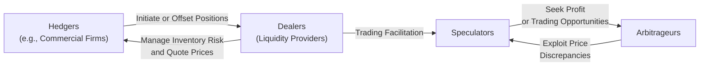

### Market Overview

Derivative markets, in my opinion, can feel a bit intimidating the first time you see them. I still remember when I was a junior analyst and tried to figure out how a single futures contract on crude oil could help an airline reduce its fuel cost risk. Back then, it felt almost magical—like you could wave a wand and say, “Hey, I’m locking in my cost for the next year.” But as soon as you dig a bit deeper, you see that there’s a whole ecosystem of participants—hedgers, speculators, arbitrageurs—plus regulated exchanges and over-the-counter (OTC) networks. Each piece is vital in bringing liquidity, price discovery, and credit support to the marketplace.

Derivative markets typically revolve around two broad structures:

• Organized exchanges, like the Chicago Mercantile Exchange (CME) or Eurex, which handle standardized contracts.  
• Over-the-counter (OTC) markets, where contracts are bilateral and can be customized.

Both structures offer ways for participants to trade risk. But they differ in how trades are settled, how standardization is handled, and ultimately, how risk is transferred between buyers and sellers.

### Key Participants in Derivative Markets

Diverse participants contribute to both the vibrancy and the stability of derivatives trading, though sometimes stability might feel like a bit of a roller coaster. Each participant type has a core motivation, and understanding these motivations clarifies why liquidity forms and how market dynamics shift over time.

**Hedgers**  
• Hedgers usually already face some financial risk—think airlines worried about rising fuel prices or corporations bracing for exchange rate volatility.  
• They use derivatives to manage or offset existing exposures.  
• By locking in forwards or futures, or by purchasing options, hedgers aim to stabilize their cash flows or protect profit margins.

**Speculators**  
• Speculators actively seek profit from market movements.  
• They don’t necessarily have an underlying exposure—they might just hold a view on interest rates, commodity prices, or equity indices.  
• Because they are willing to accept higher risk, speculators often provide the liquidity that hedgers need. Of course, speculators can also get it wrong—sometimes painfully so.

**Arbitrageurs**  
• Arbitrageurs spot and exploit price discrepancies across markets or instruments.  
• They rely on the principle of no-arbitrage: the same asset, or closely related assets, shouldn’t simultaneously trade at different prices in efficient markets.  
• By buying where something’s undervalued and selling where it’s overvalued, arbitrageurs theoretically lock in near risk-free profit. They help align prices across products and geographies.

**Dealers**  
• Dealers (often banks or specialized brokerage firms) frequently buy and sell derivatives in the market, effectively acting as market makers.  
• They facilitate trades for clients by quoting both bid and ask prices, earning the spread.  
• Of course, they can accumulate inventory risk. If they go too far out on a limb and can’t offset positions, they might suffer losses.  

Collectively, these participants provide constant ebb and flow—hedgers want to reduce volatility, speculators want to take on risk, arbitrageurs want to exploit inefficiencies, and dealers keep everyone moving by matching orders and absorbing short-run imbalances.

### Organized Exchanges vs. OTC Market Structures

We can split derivative trading venues into two major categories, each serving different needs:

**Organized Exchanges**  
• Standardized contracts. For instance, a crude-oil futures contract on the CME has a fixed lot size and defined delivery terms.  
• The exchange’s clearinghouse stands between buyer and seller, guaranteeing performance upon deposit of margins. This setup, in theory, reduces credit risk.  
• Prices and trade volumes are typically reported publicly, fostering transparency.  
• Exchange rules (e.g., margin requirements, position limits, daily price limits) reduce systemic risk but can reduce flexibility for participants who need more tailored hedges.

**OTC Markets**  
• No central clearinghouse (although regulatory reforms in some jurisdictions have mandated central clearing for many OTC instruments).  
• Contracts can be customized: if a farmer wants a forward for 2,750 bushels of a specific grain, or a corporation wants an interest rate swap that extends for 7 years with a particular amortization schedule, the OTC market typically accommodates that.  
• Credit risk is borne bilaterally, so counterparties carefully assess each other’s creditworthiness, often requiring collateral or other credit support.  
• OTC derivatives can be more opaque: trading volumes and prices are less transparent unless reported to a repository or regulated reporting system.

A good way to picture it is like visiting two different marketplaces for buying shoes. The exchange environment sells shoes in only a few standard sizes and styles. The OTC environment lets you get anything bespoke—but you might need to trust the shoemaker’s solvency and quality.

### Liquidity and Market Depth

Liquidity emerges in markets where many participants with different objectives are active at the same time. In a vibrant derivatives market:

• **Tight bid-ask spreads**: The difference between the price at which you can buy and sell is small.  
• **Deep order books**: You can buy or sell in large quantities without dramatically moving the price.  
• **Continuous turnover**: High trading volume and open interest reflect robust activity.

Hedgers provide overall demand for risk reduction, speculators supply risk capital, and arbitrageurs correct any mispricings. That interplay fosters the willingness to trade. Larger players—like pension funds, hedge funds, and multinational corporations—can access significant liquidity to hedge or create large positions. Meanwhile, smaller hedgers or retail speculators often tag along, benefiting from the established liquidity.

### Monitoring Open Interest and Trading Volume

When analyzing a derivative market, two metrics often pop up:

• **Trading Volume**: The total amount of contracts traded in a given time period. It shows how actively a particular market is changing hands.  
• **Open Interest**: The total number of outstanding derivative contracts that have not been settled or closed. Think of it as how many positions remain “open.”  

If you see a surge in open interest alongside rising prices, for example, it might signal that new money is pouring in and fueling a bullish sentiment. Conversely, if prices rise but open interest dwindles, that could suggest a classic short covering scenario rather than genuine new buying.

### Practical Examples of Derivative Participants

Let’s walk through how different sectors might interact in the derivative marketplace:

**Airlines and Fuel Hedging**  
An airline expecting to purchase 10 million gallons of jet fuel over the next six months might enter into futures or forward contracts to lock in prices. The airline’s goal is not to speculate on oil prices but to remove uncertainties around future costs. This is a classic hedging strategy.

**Farmers and Crop Protection**  
Farmers planting wheat can sell wheat futures to lock in a price for their upcoming harvest. This reduces uncertainty in their revenue. On the flip side, the speculator who takes the other side might believe wheat prices will rise significantly, hoping to cash in on an anticipated short-term price hike.

**Fund Managers and Options**  
An equity fund manager might purchase put options on a major market index to protect against broad downside risk. Alternatively, that manager might write (sell) covered calls to generate income when they hold the underlying stock. Each option trade transfers risk to someone else—another speculator or a different hedger.

**Banks and Interest Rate Swaps**  
Commercial banks often engage in interest rate swaps, converting floating-rate liabilities to fixed rates or vice versa, depending on their balance sheet needs. A bank that holds floating-rate assets but fixed-rate liabilities, for instance, might use a swap to align durations and protect against rising rates.

**Arbitrage in Action**  
You might see an arbitrageur simultaneously entering futures contracts on two correlated commodities—say, Brent crude oil and WTI crude oil—if they notice a temporary deviation in their usual price spread. By buying the cheaper and selling the more expensive, the arbitrageur hopes to profit when prices revert to a historically stable relationship.

### Diagram: Flow of Market Participants

Below is a simple visual representation of how participants might interact in the derivative market. Hedgers, speculators, dealers, and arbitrageurs often trade among each other, directly or via intermediaries (such as brokers).

### Best Practices and Common Pitfalls

**Best Practices**  
• Understand your objectives: Know if you’re hedging, speculating, or arbitraging. A mismatch in strategy can lead to unintended outcomes.  
• Monitor counterparty risk: In OTC markets, the near-unrestricted flexibility comes with credit exposure. Collateral agreements or central clearing can mitigate it.  
• Keep an eye on liquidity: Thinly traded contracts can widen bid-ask spreads, increasing costs.  
• Use stop orders and position limits: Tools like stop-loss orders can help avoid catastrophic losses. Position limits, whether self-imposed or regulatory, reduce excessive risk-taking.

**Common Pitfalls**  
• Over-leveraging: Implied leverage in derivatives can be seductive. A small capital outlay can control large notional exposures, quickly amplifying gains—or losses.  
• Ignoring basis risk: Sometimes the derivative you use for hedging isn’t a perfect match to your underlying exposure. Price differences can erode hedge effectiveness.  
• Misunderstanding contract terms: In futures especially, delivery specifications or margin calls can catch you by surprise if you’re not fully prepared.  
• Unclear exit strategies: Just opening a derivative position isn’t enough; you need to plan how you’ll manage or exit that position based on evolving market conditions.

### Final Exam Tips

• **Scenario-based perspectives**: On the exam, you might be given a scenario about a hedger or speculator with a specific goal. Outline which derivative contract best matches their needs.  
• **Formulas and relationships**: Be comfortable with the cost of carry model, basis relationships, or identifying which participant stands to benefit from certain price moves.  
• **Risk transfer**: Think about which party is transferring risk and which party is accepting it. The exam may test your understanding of who’s the natural hedger and who’s taking on risk.  
• **Advantages vs. disadvantages**: Remember the main differences between exchange-traded and OTC derivatives, including margin requirements, credit risk, and customizability.  
• **Regulatory aspects**: Be aware of how clearinghouses, margin systems, and netting agreements reduce systemic risk. Also consider how capital requirements and regulations shape dealer behavior.  

In real-life trading, the synergy among different participant types fosters consistent price discovery and risk transfer. And yes, it can feel like a massive, complicated dance, but once you see the roles each participant is playing, the steps become much clearer.

### References

• Kolb, Robert W. “Futures, Options, and Swaps.” 5th ed., Wiley, 2013.  
• CFA Institute. “Exchange-Traded vs. OTC Derivatives.” CFA Program Curriculum.

---

## Test Your Knowledge: Derivative Markets and Participants



### Which statement best describes hedgers in derivative markets?

- [ ] They trade only to exploit temporary price inefficiencies.
- [x] They use derivatives to offset or reduce existing market exposures.
- [ ] They always provide liquidity by quoting two-sided prices.
- [ ] They profit by “delta-hedging” volatility exposure.

> **Explanation:** Hedgers use derivatives primarily to reduce or eliminate an underlying risk, such as foreign exchange risk or commodity price risk, rather than to profit from short-term fluctuations.

### Which of the following is a key difference between exchange-traded and OTC derivatives?

- [ ] OTC derivatives have no counterparty risk.
- [ ] Exchange-traded derivatives are more customizable.
- [x] Exchange-traded contracts are standardized, while OTC contracts can be customized.
- [ ] Both markets are fully transparent with equal regulatory oversight.

> **Explanation:** Organized exchanges list standardized contracts and use a clearinghouse, while OTC contracts are privately negotiated, allowing for customization but sometimes adding counterparty risk.

### What best characterizes the role of a dealer in derivative markets?

- [x] Provide liquidity by regularly quoting bid and ask prices.
- [ ] Engage primarily in arbitrage to exploit price differences.
- [ ] Seek to hedge all positions at zero cost.
- [ ] Only take positions when interest rates are below a certain threshold.

> **Explanation:** Dealers act as market makers, facilitating trades by quoting prices to both buyers and sellers and profiting primarily from the bid-ask spread.

### Why might a central bank enter into a foreign exchange derivative contract?

- [ ] To maximize private shareholder profit.
- [x] To manage currency exposure and protect reserves.
- [ ] To outcompete commercial banks in the currency market.
- [ ] To pay down government debt directly.

> **Explanation:** Central banks often use derivatives to stabilize or manage exposure in foreign exchange reserves or to control interest-rate-related impacts on these reserves.

### What term describes the total number of outstanding derivative contracts that have not yet been offset or delivered?

- [x] Open interest
- [ ] Trading volume
- [ ] Notional principal
- [ ] Margin balance

> **Explanation:** “Open interest” refers to all outstanding contracts—futures, options, or otherwise—that remain open. Trading volume counts how many contracts changed hands, but not how many remain open.

### Which of the following typically arises when a participant uses a futures contract to hedge but the contract’s underlying is not a perfect match?

- [ ] Overhedging
- [ ] Mark-to-market mismatch
- [x] Basis risk
- [ ] Counterparty risk

> **Explanation:** Basis risk occurs because the price of the futures contract doesn’t move exactly in tandem with the asset being hedged. Even if it’s highly correlated, small discrepancies can impact the hedge’s effectiveness.

### In the context of derivative market participants, which behavior best characterizes a speculator?

- [x] Entering positions purely to profit from price changes.
- [ ] Guaranteeing contract performance through a clearinghouse function.
- [x] Accepting the exposure that hedgers want to offset.
- [ ] Offsetting credit risk by demanding collateral from customers.

> **Explanation:** Speculators actively seek market exposure and profit from favorable price movement. They’re often the ones taking on the risk that hedgers want to offload. Although they might also demand collateral, the primary reason for their derivative usage is speculative profit.

### Which of the following methods helps reduce counterparty risk in OTC markets?

- [x] Requiring collateral or margin agreements.
- [ ] Using smaller contract sizes that expire quickly.
- [ ] Avoiding interest rate swaps entirely.
- [ ] Relying on trading volume to gauge market sentiment.

> **Explanation:** A common practice for controlling credit risk in an OTC setting is to introduce periodic collateral checks (margin calls) or sign agreements that detail how collateral can be posted, thus mitigating potential default exposure.

### Why do many pension funds and insurance companies use derivatives?

- [ ] To increase volatility in their portfolios.
- [ ] To day-trade for speculative gains.
- [ ] To bypass regulatory capital requirements.
- [x] To manage long-term exposures (e.g., interest rate risk) in their portfolios.

> **Explanation:** Pension funds and insurers frequently face long-term liability profiles. They often use derivatives like interest rate swaps to align asset and liability durations, reducing mismatch risk.

### In a well-functioning derivative market, who benefits from the activities of arbitrageurs?

- [x] All market participants benefit indirectly from improved pricing efficiency.
- [ ] Only government policymakers tracking money supply.
- [ ] Only speculative traders looking to capitalize on trends.
- [ ] Clearinghouses relying on daily marking to market.

> **Explanation:** Arbitrageurs narrow price discrepancies and enhance overall market efficiency. Their activity helps all market participants by ensuring fairer prices and reducing potential mispricing over time.


