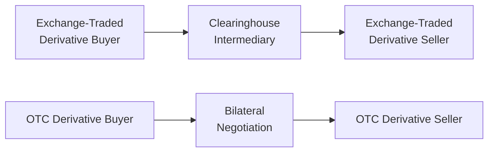

## Introduction

Derivatives come in many shapes and sizes, but we often categorize them under two broad headings: Exchange-Traded Derivatives (ETDs) and Over-the-Counter (OTC) derivatives. Both serve vital roles in modern financial markets, whether you’re hedging a position in a pension fund or speculating on currency fluctuations. In this section, we’ll explore what makes each category unique, how participants use them, and the regulatory landscape that governs them.

Many of us start our derivatives journey by first hearing about futures traded on a busy exchange floor, but it’s only when you step into the world of large investment banks and specialized institutions that you realize there is a whole separate universe—OTC derivatives—built around privately negotiated contracts. And yes, they can be as flexible as you want, but they also come with more nuanced risks. Let’s walk through these differences step by step.

## Exchange-Traded Derivatives

### Standardization and Uniform Contracts

One of the first lessons you’ll learn in any derivatives course: when a derivative contract trades on an exchange, it’s standardized. You want a futures contract on corn? The exchange dictates how many bushels, what quality, the delivery months, and even the specific daily price limits (if any). This uniformity simplifies the trading process and promotes liquidity by ensuring the same product is traded repeatedly. Everybody knows exactly what they’re getting.

• Contract Size: Each equity futures contract might represent 50 shares, 100 shares, or some other fixed multiple.  
• Delivery Date: Exchanges set relatively standardized calendars—e.g., March, June, September, December.  
• Tick Size: Exchanges also determine the minimum price increments to keep the market liquid.

In my personal trading experience years ago, I remember my first futures contract on the S&P 500 E-mini. The specifications—like the multiplier (e.g., $50 times the index level) and expiration (quarterly)—were all laid out in black and white. No guesswork, no negotiating.

### Role of the Clearinghouse

One of the greatest strengths of an exchange-traded contract lies in the clearinghouse system. The clearinghouse stands between two trading parties, guaranteeing contract performance. It effectively becomes the buyer to every seller and the seller to every buyer. This design radically reduces counterparty risk, because if one trader defaults, the clearinghouse steps in to ensure the other side remains whole (subject, of course, to the margin system).

Most exchanges require initial margin—essentially a good-faith deposit—to open a position, plus maintenance margins to keep that position open. If the market moves against you, the exchange can issue a margin call requiring you to deposit more funds. This daily mark-to-market process helps keep risk transparent and well-managed.

### Price Transparency and Liquidity

Exchange-Traded Derivatives benefit from a centralized order book, meaning you can see available bids and offers (and some level of market depth). This pricing transparency, combined with contract standardization, typically fosters robust liquidity. For large contracts like equity index futures, foreign exchange futures, or major commodity futures, the participation of many traders—ranging from hedgers to high-frequency traders—ensures relatively tight bid–ask spreads in normal market conditions.

### Regulatory Oversight

Exchanges are heavily regulated. For instance, in the United States, the Commodity Futures Trading Commission (CFTC) supervises futures markets, while the Securities and Exchange Commission (SEC) oversees listed options. Other jurisdictions have similarly vigilant regulators (e.g., the Financial Conduct Authority in the UK). These bodies aim to maintain fair and orderly markets, set position limits, track large trades, and curb excessive speculation or market manipulation.

So, if you’re trading futures contracts on a major exchange, you’re also benefiting from:

• Rigorous reporting requirements.  
• Strict rules on risk management.  
• Central clearing with uniform margin protocols.

### Advantages and Disadvantages

Because exchange-traded contracts are standardized and centrally cleared, they provide ease of entry and exit, strong liquidity, and minimal counterparty risk. However, the set contract terms can limit your ability to customize the instrument. For instance, if you want a commodity deliverable in 17 days with unusual underlying specifications, an exchange might not have that exact contract. You’d likely look to the OTC market for a truly bespoke solution.

## Over-the-Counter Derivatives

### Customizable Contracts

OTC derivatives are privately negotiated between counterparties—often banks, large corporations, asset managers, or sophisticated hedge funds. Let’s say you’re a midsize manufacturer that needs to hedge Australian dollar exposure for a highly specific schedule of cash flows. You could approach a bank and negotiate a custom forward contract or swap that matches your exact payment dates, notional amounts, and any other special provisions.

This flexibility is the hallmark of OTC derivatives: you can fine-tune terms to match your precise hedging or speculative needs. But with customization comes complexity. And complexity, in turn, can breed operational, valuation, and legal challenges if not carefully managed.

### Bilateral Risk and Collateralization

Unlike the exchange environment, OTC derivatives don’t automatically benefit from a clearinghouse guarantee. Instead, you face your counterparty directly. If you’re dealing with a highly rated global bank, the credit risk might be low but not zero. In the 2008–2009 financial crisis, once AAA-rated institutions occasionally found themselves teetering on the brink. 

The primary shield here is collateralization and bilateral credit support agreements. Each counterparty agrees to post enough collateral (cash or securities) to cover potential expected losses, usually determined by a daily mark-to-market valuation. This setup mitigates counterparty risk—particularly if you’re careful about how you negotiate your margin thresholds, the type of collateral accepted, and operational processes.

### Less Transparency, Dealer Quotes

In an OTC environment, prices are typically quoted by dealers (often large banks) rather than discovered in a publicly accessible order book. For instance, if you want a 10-year interest rate swap, you’ll request quotes from a few dealers you trust. The quotes may or may not match, so you can “shop around.” But there’s no central tape or single last-trade price.

For large portfolio managers, sophisticated risk modeling helps them estimate fair value. For a smaller participant, you might rely on the bank’s quotes. This arrangement can yield wide bid–ask spreads if the market is volatile or if your transaction is unusual in size or type.

### Regulatory Environment Post-2008

Historically, OTC markets were less scrutinized than exchanges. But after the 2008 credit crisis—when OTC derivatives such as mortgage-backed instruments and credit default swaps contributed to systemic stress—global regulators introduced new rules. Among the most notable:

• Mandatory clearing for certain standardized OTC derivatives (interest rate swaps in major currencies, some credit default swaps).  
• Trade reporting requirements to ensure regulators have a clearer view of open positions.  
• Higher capital charges for banks that hold uncleared OTC positions, incentivizing them to use central clearing where possible.  
• Bilateral margin rules that impose stricter collateral requirements on non-centrally cleared derivatives.

These measures can blur the traditional lines between OTC and exchange-traded markets. Now, certain swaps effectively trade like exchange derivatives, with clearinghouses providing margin frameworks. But true customization remains in the purely bilateral realm, albeit with heavier regulation than before.

### Advantages and Disadvantages

OTC derivatives shine when you need something the exchange doesn’t offer. Whether it’s a tailored interest rate hedge, a specific credit default swap on a niche corporate issuer, or an exotic currency pair, OTC markets can structure nearly any instrument. That said, you carry direct counterparty risk (tempered by collateral agreements) and face lower liquidity potential. Add in negotiations, documentation, and sometimes opaque pricing, and that’s the trade-off for customizing your exposure.

## Comparing ETDs and OTC Derivatives

Below is a brief comparison table for a high-level snapshot:

| Feature                    | Exchange-Traded                         | Over-the-Counter                                   |
|----------------------------|-----------------------------------------|----------------------------------------------------|
| Contract Terms            | Standardized by exchange                | Flexible, negotiated between counterparties        |
| Clearing and Counterparty | Central clearinghouse (minimal credit risk) | Bilateral relationships, collateralization, margin |
| Transparency              | High (central limit order book)         | Lower (dealer quotes, private negotiation)         |
| Regulation                | Exchange-specific, e.g., CFTC, SEC      | Various local rules and frameworks, post-trade reporting |
| Margin or Collateral      | Mandated by clearinghouse               | Negotiated collateral posting, daily margin calls  |
| Liquidity                 | Often high, especially for major contracts | Varies widely; can be illiquid for niche products  |

### Visual Overview of Clearing vs. Bilateral Risks

In the exchange-traded setup (top row), the clearinghouse stands between buyer and seller, which mitigates counterparty credit risk. Over-the-counter (bottom row) is a direct link between buyer and seller, typically governed by a credit support annex (CSA) or bilateral agreement.

## Practical Examples and Case Studies

### Case Study: Using Futures vs. Negotiated Forwards

• Hedging Corn Prices: A grain producer can easily hedge via corn futures on a major commodity exchange (e.g., CME Group), locking in a production price for a certain delivery month. Quick, standardized, and liquid. But if the producer wants a more customized schedule—like partial deliveries in five separate months that don’t match standard futures expirations—they might go to a bank and negotiate a custom forward contract.  

• Corporate FX Hedge: A European multinational expecting large USD proceeds in 45 days might look at exchange-traded EUR/USD futures. But if 45 days doesn’t align nicely with the monthly or quarterly futures cycle, the company might instead do an OTC forward contract that precisely matches their cash flow date.

### Case Study: Interest Rate Swaps

• Exchange-Traded Swap Futures: In recent years, some clearinghouses introduced “swap future” products. They replicate certain aspects of interest rate swaps but settle like futures. This approach can reduce the credit risk complexities of a long-term swap, though customization is more limited.  

• Traditional OTC Swap: In a big interest rate swap, a corporate treasurer might want very specific terms (like a swap starting in six months, with a notional that amortizes over the next five years, matched to the company’s debt schedule). That’s not standard in an exchange contract, so an OTC route would be the best fit.

## Best Practices and Challenges

### Best Practices for ETDs

1. Understand Margin Dynamics: Keep spare liquidity for margin calls. Exchanges can be quick to liquidate positions if margin drops below required levels.  
2. Track Roll Dates: Standardized contracts expire at set intervals, so be aware of rollover timing to avoid unwanted delivery or locked capital.  
3. Regulatory Compliance: Stay up-to-date on position and accountability limits. Large traders must often report positions to the exchange or regulators.

### Best Practices for OTC

1. Robust Collateral Agreements: Negotiate collateral triggers clearly. In my own experience, a misalignment on what qualifies as acceptable collateral caused headaches during a market stress event when my counterparty insisted on cash only.  
2. Documentation: Thoroughly review the ISDA Master Agreement and any credit support annex (CSA). Clarify definitions of default, termination events, and dispute procedures.  
3. Pricing Transparency: Request multiple dealer quotes or maintain your own valuation models. Some exotic OTCs can be notoriously opaque.

### Common Pitfalls

- Overreliance on Uncollateralized OTC: If you skip robust credit support or margin requirements, your counterparty’s credit deterioration can create loss exposure.  
- Neglecting Liquidity: Even if a contract is perfectly priced, a sudden market or credit shock can make unwinding that position expensive or impossible.  
- Inadequate Documentation: Vague or incomplete bilateral agreements have led many institutions into legal battles, especially when a large trade goes sour.

## Post-2008 Evolution and Clearing Mandates

Following the global financial crisis, G20 leaders agreed on reforms that push standardized OTC trades toward central clearing. That includes certain interest rate swaps and credit default swaps, which essentially blend exchange-style clearinghouse benefits with OTC features. However, purely customized trades remain outside that clearing framework. Regulators worldwide continue to refine rules to ensure greater transparency, risk management, and market stability.

## Exam Tips and Final Thoughts

• Study the Distinctions: For exam questions, be clear on whether the question references exchange-traded or OTC derivatives. Learning the fundamental differences in standardization, margining, and counterparty risk is crucial.  
• Real-World Relevance: Remember how these differences play out in practice. The exam might present a scenario about a corporate treasurer choosing between an exchange-traded hedge or a custom forward contract.  
• Regulatory Nuances: The test especially loves to see if you understand ongoing regulatory reforms, central clearing mandates, and the impact on liquidity and risk management.  
• Don’t Overlook Credit Risk: Even if a contract’s payoff is straightforward, who’s on the other side and how margining works can be a make-or-break factor.

Ultimately, exchange-traded and over-the-counter derivatives can serve different purposes in your portfolio or hedging program. Know the trade-offs in customization, credit exposure, liquidity, and regulation—and you’ll be well on your way to mastering derivatives at the Level I exam and beyond.

## References

- Pirrong, Craig. “The Economics of Commodity Trading Firms.” Trafigura, 2014.  
- CFA Institute. “Clearing and Settlement in Derivatives.” CFA Program Curriculum.  
- CFTC (U.S. Commodity Futures Trading Commission). cftc.gov.  
- BIS (Bank for International Settlements). “OTC Derivatives Market Activity.” bis.org.  

## Test Your Knowledge: Exchange-Traded vs. OTC Derivatives



### Which of the following best describes a key benefit of exchange-traded derivatives?

- [ ] They always have lower transaction costs than OTC derivatives.
- [x] They use a clearinghouse that substantially reduces counterparty credit risk.
- [ ] They allow for highly customized contract terms.
- [ ] They are exempt from regulatory requirements.

> **Explanation:** A central clearinghouse guarantees the performance of both parties, minimizing counterparty risk in exchange-traded derivatives.

### Which of the following is a typical characteristic of OTC derivatives?

- [x] They can be customized to fit the exact needs of the contracting parties.
- [ ] They are fully guaranteed by an exchange clearinghouse.
- [ ] They are generally free from collateral requirements.
- [ ] They are completely transparent with publicly displayed quotes.

> **Explanation:** OTC derivatives allow for bespoke terms negotiated between counterparties, often requiring collateral arrangements without a central clearinghouse.

### Which statement about margin requirements in exchange-traded derivatives is most accurate?

- [ ] They are typically higher than OTC variations because of customization.
- [x] They are set by the exchange and enforced by the clearinghouse.
- [ ] They are nonexistent because exchange-traded contracts have no counterparty risk.
- [ ] They are determined via bilateral negotiations between the two contract parties.

> **Explanation:** In exchange-traded derivatives, margin requirements (initial and maintenance) are dictated by exchange rules and enforced daily by the clearinghouse.

### After the 2008 financial crisis, global regulators mandated:

- [ ] That all OTC derivatives be traded exclusively on exchanges.
- [ ] That OTC derivative positions can no longer be used for hedging treasury operations.
- [x] Clearing requirements for certain standardized OTC derivative contracts.
- [ ] The immediate elimination of all collateral agreements.

> **Explanation:** Regulatory reforms after the crisis introduced mandatory clearing for standardized OTC contracts (e.g., interest rate swaps), boosting transparency and reducing systemic risk.

### In a typical OTC forward contract, which of the following is TRUE?

- [x] The settlement terms and dates can be freely negotiated.
- [ ] There is a single central counterparty guaranteeing the trade.
- [ ] All positions are marked to market daily by a clearinghouse.
- [ ] The contract size is determined by the exchange.

> **Explanation:** OTC forward contracts are bilateral agreements with customizable features—no standardization or central clearing.

### Which statement best characterizes standardization in exchange-traded derivatives?

- [ ] Only the contract size is standardized, but expiration is always negotiable.
- [ ] Standardization extends only to margin procedures, not contract terms.
- [x] All main contract specifications (contract size, expiration dates) are pre-determined by the exchange.
- [ ] Standardization is optional and up to the individual trader.

> **Explanation:** By design, exchange rules set uniform terms—like contract size, expiration, and the underlying asset—making these contracts interchangeable.

### How does customization in OTC derivatives typically affect liquidity?

- [ ] It dramatically increases liquidity, since every participant wants the same custom specs.
- [ ] It has zero impact on liquidity since all derivatives have the same market depth.
- [ ] It always guarantees lower costs due to private negotiation.
- [x] It can reduce liquidity because each contract is tailored to specific needs and may not be easily transferrable.

> **Explanation:** Customized contracts can be less liquid, as the exact terms might not match other traders’ needs, making them harder to offset in the market.

### Which factor commonly increases counterparty credit risk for OTC derivatives compared to ETDs?

- [ ] Requirement for daily mark-to-market settlements.
- [ ] Lack of any legal documentation.
- [x] Absence of a central clearinghouse to interpose itself between the two parties.
- [ ] Predictable contract size and expiration terms.

> **Explanation:** Without a central clearinghouse, OTC parties rely on bilateral agreements and collateral, meaning any counterparty default risk falls directly on the other party.

### One reason post-2008 reforms encourage central clearing of standardized OTC contracts is:

- [ ] To eliminate the need for margin collateral for those contracts.
- [ ] To increase customization options for smaller market participants.
- [ ] To ensure that national stock exchanges can trade these products without regulatory burdens.
- [x] To reduce systemic risk by shifting counterparty risk to a well-capitalized clearinghouse.

> **Explanation:** When standardized OTC trades are cleared centrally, the clearinghouse effectively absorbs default risk, thus reducing the potential for a chain reaction of defaults.

### True or False: In an exchange-traded contract, margins are not required because the clearinghouse guarantees performance.

- [ ] True
- [x] False

> **Explanation:** Even though a clearinghouse guarantees performance, traders must still post initial and variation margins to limit the clearinghouse’s risk and uphold market integrity.


