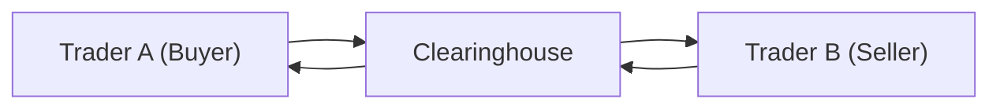

## Introduction

Have you ever watched two friends make a bet and noticed they ask a neutral third person to hold the money until the game ends? That—believe it or not—reminds me of how clearinghouses operate in derivatives markets. It's a bit more sophisticated than just holding onto cash, of course, but the spirit is the same. Clearinghouses, also known as clearing corporations, stand between buyers and sellers to ensure transactions go smoothly and all parties hold up their end of the deal. In the context of financial markets, especially derivatives, these centralized entities reduce counterparty risk and help keep the trading environment stable. 

Let’s explore how clearinghouses work, the protective structures they have in place, and the global regulatory frameworks that keep it all in check.

## The Core Function of Clearinghouses

Clearinghouses act as the buyer to every seller and the seller to every buyer in an exchange-traded derivatives contract. As soon as a trade is executed on an exchange, the clearinghouse “steps in,” substituting itself as the central counterparty (CCP). So if Trader A fails to deliver on their side of the contract, the clearinghouse still fulfills its obligations to Trader B, and vice versa. 

This central role can significantly lower systemic risk. Without a clearinghouse, each market participant would have to rely on their counterparty’s creditworthiness. Imagine the chaos if every single trade carried the risk that your trading partner might file for bankruptcy overnight. A clearinghouse ensures this doesn’t bring the entire market to its knees.

Below is a simplified Mermaid diagram illustrating the flow:



In reality, each initial trade between Trader A and Trader B is quickly replaced by two separate trades—Trader A to the clearinghouse and the clearinghouse to Trader B. This approach standardizes obligations and makes managing complex webs of trades more straightforward.

## Daily Marking to Market

One of the clearinghouse’s hallmark processes is daily marking to market. Now, that might sound like something out of your high-school geometry class, but it’s actually a straightforward idea with big implications for risk management. Each day (and sometimes intraday, in fast-moving markets), open derivatives contracts are revalued at the current market price. 

If you hold a futures position that gains value, the clearinghouse credits your account with what we call “variation margin.” If your position loses value, your account is debited. This daily settlement process prevents losses from piling up unchecked. Here’s a small example:

Suppose you buy a futures contract at a price of 100. The next day, the price goes to 105. Your account is credited with the gain, so you receive a variation margin of 5. If the following day the price drops to 102, you pay back 3 of those points. By doing these daily adjustments, the likelihood of huge unresolved debts is reduced since any mismatch gets corrected right away.

## Margin Systems and Their Role

Clearinghouses use well-designed margin requirements to further mitigate risk. Typically, you’ll see:

• Initial Margin: Think of it as “skin in the game.” When you open a position, you post collateral to show you’re serious.  
• Variation Margin: Collateral exchanged daily (or intraday) based on mark-to-market movements, as just explained.  
• Maintenance Margin: A threshold that, if your account balance dips below, prompts a top-up to the initial margin level.

Strict margining policies mean participants don’t hold zero-collateral trades—if you want to play in the derivatives arena, you need to prove your ability to meet losses.

### Quick Python Example for Variation Margin

Let's illustrate how variation margin might look in a tiny Python snippet. Suppose you have a futures contract with an initial margin requirement, and you want to track your daily settlement over a short data series:

```python
futures_prices = [100, 105, 102, 108, 110]
initial_price = futures_prices[0]
position_size = 10  # e.g., 10 contracts
initial_margin = 1000  # hypothetical figure

account_balance = initial_margin
previous_day_price = initial_price

for day, price in enumerate(futures_prices[1:], 1):
    variation = (price - previous_day_price) * position_size
    account_balance += variation
    previous_day_price = price
    print(f"Day {day}: Price={price}, Variation={variation}, New Balance={account_balance}")
```

In a real clearinghouse environment, all this booking is done automatically in the back-end systems. But it’s still helpful to conceptualize how gains and losses get added to or subtracted from your account.

## Default Waterfalls: Layered Protection

If margin calls and daily settlements aren’t enough in extreme situations, clearinghouses rely on a so-called “default waterfall.” Imagine it like a series of resource pools that the clearinghouse taps into if one or more member firms can’t cover their losses:

1. The defaulting member’s own margins and collateral.  
2. The defaulting member’s contribution to the clearinghouse’s guarantee or default fund.  
3. The clearinghouse’s own capital (such as its equity or a dedicated reserve).  
4. Contributions of non-defaulting members to the default fund (sometimes carefully measured in tranches).  

The idea is straightforward: use the defaulter’s resources first, then move up through each layer in a structured way. It’s basically a risk waterfall: each layer only comes into play if the prior layer is fully depleted.

## Regulatory Landscape

### Overview

Regulatory environments vary across jurisdictions, but they share common goals: enhance transparency, protect investors, and mitigate systemic risk. After the 2008 financial crisis, regulators realized that unregulated over-the-counter (OTC) markets could become a breeding ground for systemic problems. This recognition spurred new laws and regulations mandating that standardized OTC derivatives be cleared through CCPs whenever possible.

Major frameworks include:

• The Dodd-Frank Wall Street Reform and Consumer Protection Act (Dodd-Frank) in the United States.  
• The European Market Infrastructure Regulation (EMIR) in the European Union.  
• Similar guidelines in other global markets, often influenced by the G20 commitments to promote central clearing.

### Dodd-Frank in the U.S.

In the U.S., Title VII of Dodd-Frank overhauled derivative market regulation. It mandated that many standardized swap contracts go through central clearing. It also established swap data repositories (SDRs) to which trades must be reported, thereby improving visibility (and hopefully trust) in the markets.

I recall a regulatory briefing I attended where an executive from a large futures exchange quipped: “Before Dodd-Frank, it felt like some derivatives were passing under the radar. Now they’re all in the spotlight and can’t hide.” That spotlight approach helps reduce the “dark corners” of the derivatives universe and lowers the risk that one large default might threaten the water supply for everyone else.

### EMIR in the EU

Meanwhile, the EU has a comparable set of rules under EMIR. It likewise requires mandatory clearing for standardized OTC derivatives, mandatory reporting to trade repositories, and robust risk-management standards for CCPs, including margin and collateral requirements. Central clearing is now the name of the game for any derivative that meets the standardization criteria, with some interesting exceptions (e.g., physically settled FX forwards in certain EU jurisdictions).

### Exchange Self-Regulation

Exchanges that list derivatives often have self-regulatory obligations. This might mean auditing member firms for compliance, watching out for suspicious trading behavior (like front-running or spoofing), and enforcing rules around position limits. If a participant is found to be violating rules—say they’re consistently missing margin calls—the exchange’s regulatory body can impose fines, suspend them, or even revoke membership.

By combining external regulation (like Dodd-Frank or EMIR) with robust exchange-based self-regulation, markets enjoy multiple lines of oversight. This layered approach ensures that problems in one corner of the market don’t remain hidden.

## Cross-Border Transactions and Interoperability

Derivatives don’t confine themselves within national borders. Currency swaps, equity index options, global commodity futures—these markets see cross-border flow all day. That’s where the regulatory environment gets tricky. Firms may have to comply with Dodd-Frank while also adhering to EMIR, if they operate in both regions, for instance.

Sometimes regulators grant “equivalence” or “recognition” status to foreign clearinghouses, which effectively acknowledges that the foreign framework meets comparable standards. It’s not always a smooth ride—there have been (and still are) debates about equivalence, with concerns that one jurisdiction’s rules might not fully align with another’s. 

CLEs (central clearing counterparties) might seek multiple regulatory licenses. For example, a European CCP might seek recognition from the U.S. Commodity Futures Trading Commission (CFTC) and from the Securities and Exchange Commission (SEC). This can be a complicated, resource-intensive process, but the potential cross-border business can be huge, so many clearinghouses find it worthwhile to comply with each regulator’s demands.

## The Ever-Evolving Environment

Clearinghouses and regulators face continuous technological evolution. Automated trading and high-frequency trading can stress intraday margin requirements. Emerging asset classes like digital assets (e.g., cryptocurrencies) pose new settlement challenges. And new regulations—like ongoing Basel Committee on Banking Supervision updates for capital adequacy—affect how banks that trade derivatives factor clearing exposures into their balance sheets. 

Looking forward, we can anticipate further refinements in default waterfalls, especially with the rise of portfolio margining approaches. And, as the markets learned from the 2020 COVID-related volatility swings, clearing rules and protocols can either bolster or hamper market liquidity if not carefully calibrated. 

## Key Glossary Terms

• **Default Waterfall**: The structured sequence of financial resources (margins, guaranty funds, clearinghouse equity, and so on) used to cover a member default.  
• **Systemic Risk**: The threat that one participant’s failure leads to a domino effect across the financial system. Clearinghouses mitigate systemic risk by standing as a robust central counterparty.  
• **Trade Repositories**: Entities designated to record and store data on derivative trades, improving transparency. Examples include swap data repositories (SDRs) in the U.S. or repositories approved under EMIR in Europe.  
• **Dodd-Frank Act**: U.S. legislation implemented after the 2008 crisis to enhance financial stability, including mandatory clearing for standardized OTC derivatives and reporting requirements.  

## Best Practices and Common Pitfalls

• **Best Practice—Stress Testing**: Clearinghouses regularly stress-test their margin models and default waterfalls using extreme market movements to ensure they have enough capital to withstand a significant default event.  
• **Pitfall—Ignoring Cross-Jurisdictional Requirements**: Firms trading globally sometimes overlook additional regulatory filings—or worse, fail to meet margin calls governed by foreign laws. This can lead to costly fines and reputational damage.  
• **Best Practice—Portfolio Margining**: Adopting a holistic view of risk across correlated positions can reduce overall margin requirements without increasing the system’s risk. However, it requires advanced risk modeling and deep understanding of correlation structures.

## Concluding Thoughts

Clearinghouses are truly the unsung heroes of the derivatives world, quietly facilitating trades, managing risk, and upholding market stability. Their margining processes and default waterfalls help ensure that losses are contained rather than spilling over to the entire system. Meanwhile, the post-financial-crisis regulatory landscape, including Dodd-Frank and EMIR, has spread these protective benefits to many OTC trades that were once left in the shadows. Despite occasional quirks and complexities—especially cross-border collaborations—this central clearing model is now a cornerstone of global efforts to reduce systemic risk.

As you progress throughout your CFA journey, keep in mind how these issues tie into broader topics like risk management, capital requirements, or advanced derivative strategies. There’s a reason regulatory frameworks highlight clearing: it’s the beating heart of a stable derivatives ecosystem.

## References for Further Study

• Gregory, Jon. “Central Counterparties: Risk Management, Recovery and Resolution.” Wiley, 2014.  
• European Securities and Markets Authority (ESMA): https://www.esma.europa.eu/  
• U.S. Commodity Futures Trading Commission (CFTC): https://www.cftc.gov  
• Securities and Exchange Commission (SEC): https://www.sec.gov  

---  

## Test Your Knowledge: Clearinghouses and Regulatory Frameworks



### Which statement best describes a clearinghouse’s role in derivatives markets?

- [ ] It acts only as a regulator that monitors broker-dealers.  
- [ ] It serves as a tool for market makers to avoid margin requirements.  
- [x] It becomes the central counterparty to both buyers and sellers of a derivative contract.  
- [ ] It is a pricing reference entity that sets daily futures settlement prices.  

> **Explanation:** A clearinghouse steps in as the central counterparty to every buyer and seller, ensuring that each side of the transaction can be fulfilled even if the original counterparty defaults.

### Which layer of protection is used first if a clearing member defaults on its obligations?

- [ ] The entire default fund of non-defaulting members.  
- [ ] The clearinghouse’s equity.  
- [x] The defaulting member’s posted margin and collateral.  
- [ ] The government’s fiscal budget.  

> **Explanation:** The default waterfall taps into the defaulting member’s margin and collateral before proceeding to other resources, such as guarantee funds or the clearinghouse’s equity.

### Under Dodd-Frank in the U.S., which action is mandated for standardized OTC derivatives?

- [ ] Bilateral settlement with no collateral requirement.  
- [x] Central clearing through a registered clearinghouse.  
- [ ] Prohibition from trading on any platform.  
- [ ] Mandatory physical delivery on settlement.  

> **Explanation:** Post-financial crisis reforms require standardized OTC derivatives to be cleared through CCPs, rather than being settled bilaterally.

### What is a key objective of the daily marking-to-market process used by clearinghouses?

- [ ] Reducing the need for collateral.  
- [ ] Eliminating short selling in derivatives markets.  
- [x] Promptly settling gains and losses to limit risk accumulation.  
- [ ] Shifting credit risk from traders to regulators.  

> **Explanation:** By marking positions to market each day, unrealized gains/losses are recognized immediately. Traders must either receive or post variation margin, thus preventing the build-up of large uncollateralized exposures.

### In a default waterfall, which step comes immediately after a defaulting member’s margin is depleted?

- [ ] Governmental bailout funds.  
- [x] The defaulting member’s contribution to the clearing fund.  
- [ ] All other clearing members’ margins.  
- [ ] The entire industry insurance pool.  

> **Explanation:** Once the defaulting member’s own margin is exhausted, the next layer is usually the member’s default-fund contribution, before any clearinghouse resources or contributions from non-defaulting members are tapped.

### Which term refers to the possibility that a single institutional failure could trigger a broader financial crisis?

- [ ] Regulatory Immunity.  
- [ ] Liquidity Fragmentation.  
- [ ] Variation Collateral.  
- [x] Systemic Risk.  

> **Explanation:** Systemic risk is the concern that the failure of one large market participant could have ripple effects across the financial system.

### Which entity in the EU is primarily responsible for ensuring compliance with derivatives market rules under EMIR?

- [ ] Bank for International Settlements (BIS).  
- [ ] The Federal Reserve.  
- [x] The European Securities and Markets Authority (ESMA).  
- [ ] Organization for Economic Cooperation and Development (OECD).  

> **Explanation:** Under EMIR, ESMA is the key authority overseeing clearing obligations, trade repositories, and other aspects related to derivative market transparency and stability in the EU.

### What is the main aim of requiring derivatives trades to be reported to trade repositories?

- [ ] Enabling brokers to create new standardized contracts.  
- [ ] Preventing unregistered brokers from executing trades.  
- [x] Improving overall market transparency and oversight.  
- [ ] Raising capital for the clearinghouse.  

> **Explanation:** Trade repositories collect data on executed derivatives transactions, helping regulators and market participants see the true extent of market exposures.

### Why do some clearinghouses seek recognition from multiple regulators (e.g., both the CFTC and ESMA)?

- [x] To facilitate cross-border transactions and be able to serve global market participants.  
- [ ] Because it is legally required to operate for only one jurisdiction at a time.  
- [ ] To maintain a monopoly on issuer registration.  
- [ ] For compliance with high-frequency trading algorithms.  

> **Explanation:** Clearinghouses that operate globally often need approvals from multiple regulators (like the U.S. CFTC and EU authorities) to handle cross-border trades under each jurisdiction’s regulatory framework.

### True or False: A central clearinghouse only benefits the derivatives market in the United States.

- [ ] False  
- [x] True (This is intentionally incorrect—see explanation.)  

> **Explanation:** This answer is intentionally reversed to test reading comprehension. In reality, the statement is false. Central clearinghouses operate globally, including Europe, Asia, and other key markets, providing risk mitigation and transparency benefits around the world.


