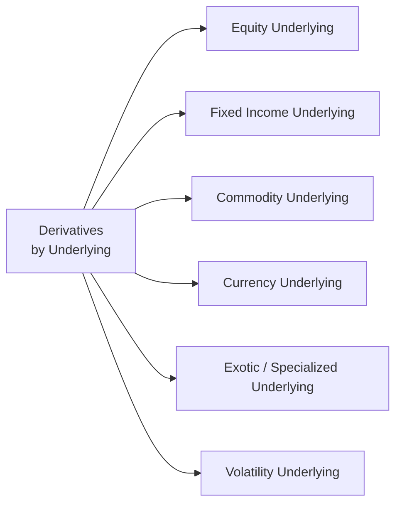

**Overview and Context**

Derivatives draw their value from other assets (often called the "underlying"), which can be anything from a simple stock or bond to something more complex like weather conditions or implied volatility. Whether you’re trading a plain-vanilla equity option or an exotic contract linked to precipitation levels in Brazil, it’s all about referencing—and managing the risks of—some underlying element. 

When I began studying derivatives, I was fascinated (and a little intimidated) by how many different underlyings existed. Ah, you know how it goes: you’re trying to figure out what sets commodity futures apart from stock index futures, and suddenly you’re reading about a weather swap that pays off if rainfall in a certain region is below average. It can feel like an overwhelming list of possibilities. But once you group them into buckets—equity, fixed income, currency, commodity, exotic, and volatility derivatives—things start to feel more manageable. 

Below, we’ll discuss each main category in some detail, exploring the features, typical use cases, and potential pitfalls. Then we’ll highlight some real-world examples, mention how these derivatives might show up in your portfolio, and present a mermaid diagram to illustrate how they’re all connected. By the end, you’ll see how classification can be your best friend in understanding (and taming) the sometimes-wild world of derivatives.

## Major Categories of Underlying Assets

### Equity Derivatives

Equity derivatives reference shares of companies—like Apple or Toyota—or baskets/indices of stocks, such as the S&P 500 or MSCI Emerging Markets. The simplest examples most of us hear about are stock options, stock index futures, and equity swaps.

• Single-Stock Options:  
  A contract providing the right (but not the obligation) to buy or sell a specific company’s shares at a predetermined strike price. Call options give the right to buy; put options give the right to sell. These can be American- or European-style, with varying dynamics for exercise rights.

• Index Futures:  
  These futures contracts track a particular equity index, allowing investors to hedge or speculate on the direction of the entire market. For instance, if you need to hedge your broad equity exposure, selling index futures can be an efficient approach.

• Equity Swaps:  
  An agreement to exchange a return (like the return on the S&P 500) for a different return (like a fixed rate). They can be used to gain synthetic exposure to an index, or to transform a portfolio’s risk profile—perhaps receiving equity returns and paying a fixed rate to modify the nature of a fund’s performance.

From a practical standpoint, one of the biggest challenges with equity-based underlyings is stock-specific event risk (e.g., earnings announcements, mergers, or regulatory changes). Options can become quite volatile around corporate events, so robust risk management is crucial. On the other hand, index-based equity derivatives generally carry less idiosyncratic risk since individual stock swings get diluted by the broader basket.

### Fixed Income Derivatives

Fixed income derivatives reference instruments like government bonds, corporate bonds, or interest rates themselves (e.g., LIBOR, SONIA, SOFR). They’re essential for interest rate risk management, yield curve positioning, and adjusting duration. 

• Treasury Futures:  
  Widely used by portfolio managers to fine-tune interest rate risk, these futures are standardized contracts on government bonds. They’re settled either through physical delivery of notes/bonds or cash-settlement.

• Interest Rate Swaps:  
  A cornerstone of interest rate risk management, an interest rate swap is an agreement where one party pays a fixed rate and receives a floating rate (or vice versa) on a notional principal amount. This instrument transforms the interest rate profile of cash flows, helping a company or fund manager either lock in fixed borrowing costs or benefit from floating rates.

• Credit Default Swaps (CDS):  
  Although often considered under “credit derivatives,” these can be folded into the broader fixed income category. A CDS allows the buyer of protection to hedge against the default (or credit event) of a borrower. It has become a vital tool for managing credit risk and is sometimes used for speculative positions on the likelihood of default.

One signature of fixed income derivatives is their sensitivity to macroeconomic data—like inflation reports or central bank announcements—and changes in the yield curve. The slightest hint of central bank tightening can move interest rate swap valuations significantly. It’s important to understand not only the credit quality of the reference bond (if any) but also how interest rates across different maturities might shift.

### Commodity Derivatives

Commodity derivatives encompass a broad category of assets, from agriculture (grains, livestock) to energy (crude oil, natural gas) to metals (base metals like copper or precious metals like gold). Each of these sub-categories has unique supply-and-demand fundamentals, seasonal cycles, and geographic nuances.

• Agricultural Commodities (e.g., wheat, corn):  
  These are often subject to seasonal patterns and unpredictable factors such as extreme weather or disease outbreaks.

• Energy Commodities (e.g., crude oil, natural gas):  
  Prone to geopolitical influences, supply chain disruptions, and OPEC-related announcements. Anyone remember the dramatic oil price fluctuations in times of conflict or sudden shifts in demand?

• Metals (e.g., gold, silver, copper):  
  Often seen as a store of value (particularly gold), or used heavily in industrial processes (copper). Investors may use metals futures to hedge production or price exposure.

Commodity derivatives are heavily used by commercial hedgers like farmers, mining companies, and energy producers. However, they also attract speculators drawn by price volatility and the potential for returns that are uncorrelated with traditional asset classes. This uncorrelated nature can appeal to portfolio managers seeking diversification. 

But keep in mind, commodity prices might experience backwardation or contango (we discuss these terms more thoroughly in Chapter 8, where we dive into futures markets), which directly affects the roll yield on futures contracts. Also, carrying costs—like storage and insurance—play a significant role in pricing these derivatives.

### Currency (FX) Derivatives

Currency derivatives allow participants to manage or speculate on exchange rates between two different currencies. They typically trade in over-the-counter (OTC) markets (e.g., FX forwards, currency swaps) but also exist in standardized forms on exchanges as currency futures.

• FX Forwards:  
  A bilateral agreement between two parties to exchange a fixed amount of one currency for a fixed amount of another on a future date at a predetermined rate (called the forward rate). FX forwards are a primary tool used by exporters, importers, and investors in foreign securities to mitigate exchange rate risk.

• Currency Futures:  
  Standardized contracts on an exchange that specify the size, delivery date, and settlement terms. Though less flexible than forwards, they offer clearinghouse intermediation, which reduces credit risk.

• Currency Swaps:  
  These swaps allow participants to exchange principal and interest in one currency for principal and interest in another. Often used by companies with long-term liabilities in a foreign currency or by portfolio managers diversifying into foreign bonds.

FX derivatives can be impacted by monetary policy decisions, capital flows, or geopolitical tensions. I remember working on a project involving currency risk for a multinational firm operating in emerging markets—it was eye-opening to see how local politics, tariffs, and even rumor-driven sentiment could send exchange rates on a roller coaster. So, always keep an eye on those cross-border macro factors.

### Exotic and Specialized Underlyings

Beyond the usual suspects, there’s a universe of specialized or “exotic” assets. These can include precipitation levels, average temperatures, hurricanes, or even freight rates used in shipping goods across the oceans:

• Weather Derivatives:  
  They pay off based on meteorological outcomes (e.g., total rainfall in a region over a set period). Utilities, energy companies, and agricultural businesses use them to mitigate the risks posed by abnormal weather.

• Freight Rates (e.g., Baltic Exchange indices):  
  Freight derivatives help shipping companies or commodity traders hedge shipping costs. Given the cyclical nature of maritime commerce, freight rate movements can be highly volatile and influenced by global trade flows.

• Power Usage and Emissions:  
  These derivatives might pay off based on power consumption patterns (related to temperature, economic activity) or carbon emission allowances. With expanding carbon markets, many companies are getting introduced to derivative structures that help them manage emission compliance risk.

An “exotic derivative” is typically any derivative with payoffs or structures more complex than the standard “vanilla” instruments. Some exotic derivatives incorporate multiple underlyings (like a “rainbow option”) or have path-dependent features (like barrier options that kick in or knock out based on certain price levels).  

While exotic derivatives can be effective at tailoring a specific risk-reward profile, they often come with significant pricing complexity and thinner liquidity. So, advanced modeling skills and a thorough understanding of local markets are must-haves.

### Volatility Derivatives

Volatility derivatives focus on the implied or realized volatility of an underlying asset, rather than its price. A prime example is the CBOE Volatility Index (VIX), which tracks the market’s expectation of near-term volatility of the S&P 500 index.

• VIX Futures:  
  Allow traders to speculate on or hedge against changes in volatility. If you believe equity market volatility will spike, you might go long VIX futures to profit from surging volatility.

• Variance Swaps and Volatility Swaps:  
  More advanced instruments that pay off based on the realized variance (or volatility) of an underlying over a certain period. They’re frequently used by institutional traders to hedge or gain exposure to volatility risk.

Volatility derivatives may not be “intuitive” at first glance. We’re used to price-based contracts—buy low, sell high, right? But here, you’re trading a measure of how much that price might fluctuate. Volatility itself responds to events like earnings, global crises, major announcements, etc. In some ways, it’s a gauge of market fear or complacency.

## Key Risk Factors and Considerations

Each type of underlying asset has distinct features and risk drivers. Let’s highlight a few:

• Seasonal Patterns:  
  Agricultural commodities, weather derivatives, and even certain energy contracts can exhibit strong seasonality. Understanding these patterns can be crucial to timing hedges or managing a portfolio’s roll strategy.

• Interest Rate Sensitivity:  
  Fixed income derivatives and some currency derivatives are especially sensitive to central bank policy shifts and changes in global interest rates.

• Liquidity and Market Depth:  
  Certain exotic instruments or niche commodity contracts might have limited trading volumes. This can lead to wide bid-ask spreads and potentially large slippage if you need to enter or exit a position quickly.

• Correlation with Broader Markets:  
  Some underlyings, like gold or volatility indices, may behave differently than equities during market turmoil. This can be a good thing (diversification) or an unwelcome surprise if you’re not prepared for how correlation patterns can change under stress.

Understanding these characteristics is vital. No matter how advanced your derivative strategy, if you’re uncertain about the underlying’s behavior, it’s like driving blindfolded. That’s one reason classification of underlyings is taught early in derivative courses—the nature of the underlying sets the stage for everything else: pricing models, hedging techniques, margin requirements, and potential regulatory constraints.

## Visualizing the Classification

Sometimes, a picture helps to see how it all fits together. The following Mermaid diagram offers a high-level snapshot of derivative classifications based on their underlying:

You can think of these categories as “branches” of a larger tree, each with its own sub-branches. For instance, “Fixed Income Underlying” leads to interest rate swaps, bond futures, or CDS. “Commodity Underlying” splits into agricultural, energy, and metal derivatives, and so on.

## Practical Applications and Examples

• Portfolios with international equity holdings often adopt currency forwards to hedge exchange rate volatility. If you own stocks in Europe but your reporting currency is USD, it might be wise to neutralize (or partially hedge) that currency exposure—especially if you anticipate big interest rate differentials or macro surprises.

• A commodity producer, say a wheat farmer, may sell wheat futures to lock in prices ahead of harvest. Conversely, a cereals manufacturer reliant on wheat inputs may buy that same contract to protect against rising prices.

• A corporate treasurer paying floating interest on debt might enter an interest rate swap, paying fixed and receiving floating—thus immunizing the company’s obligations against rising rates.

• An asset manager who thinks the market is too complacent might purchase VIX futures to protect against near-term volatility spikes.

## Integrating Classification with Strategy

Derivatives are tools. That means the best approach depends on your objectives—hedging, speculating, or arbitrage. If you’re looking to hedge interest rate risk, a fixed income underlying (like a Treasury future or interest rate swap) is your go-to. If your main aim is to lock in commodity inputs, you’ll explore relevant commodity derivatives. If you suspect a big volatility event (central bank announcements, elections, etc.), you might turn to volatility derivatives.

In more advanced contexts, multi-asset strategies can combine these categories—like using equity index futures, bond futures, and currency forwards to build synthetic global asset allocations. It’s quite common in modern portfolio management to tweak the portfolio’s exposures quickly using futures and swaps, rather than trading underlying securities directly.

## Best Practices and Common Pitfalls

• Do Your Homework:  
  Each underlying demands an understanding of distinctive factors—like contango for certain commodities, or implied-volatility shifts around earnings for an equity. Skipping that research can be expensive.

• Manage Liquidity and Rolling Costs:  
  Always be mindful of transaction costs and roll yields, especially for commodity and volatility derivatives. Thinly traded markets can be tricky to navigate.

• Keep an Eye on Correlation:  
  Correlation structures can flip during crises. An asset that seemed uncorrelated to equities may suddenly drop alongside them if panic strikes.

• Watch Out for “Model Risk”:  
  Exotic derivatives often require sophisticated pricing models. A small miscalibration in assumptions could lead to large mispricings.

• Regulatory and Accounting Nuances:  
  Different markets have different regulations, margin requirements, and clearing obligations. You might also face varied accounting treatments (IFRS vs. US GAAP) for derivative gains and losses.

## References for Further Exploration

- Black, Fischer. “The Pricing of Commodity Contracts.” Journal of Financial Economics, 1976.  
- CFA Institute. “Types of Underlying Assets in Derivatives.” CFA Program Curriculum.  
- Hull, John C. Options, Futures, and Other Derivatives.  
- Kärkkäinen, Tapio, and Salo, Ahti. “Weather and Energy Derivatives: Tools for Managing Climate Risk.” Energy Economics.  
- Official websites of major derivative exchanges (e.g., CME Group, ICE, Eurex) for contract specifications and educational materials.  

If you want even deeper dives, Chapter 2 of this volume covers forwards and futures in detail, while Chapter 3 focuses on swaps—both interest rate and currency. Later sections (Chapters 8-10) examine derivative pricing, including the cost-of-carry and Black–Scholes–Merton model for options.

---

## Test Your Knowledge: Classification of Underlying Assets



### Which type of underlying asset is most likely to exhibit strong seasonality?

- [ ] Fixed Income
- [ ] Volatility
- [x] Commodity (Agricultural)
- [ ] Equity

> **Explanation:** Agricultural commodities, such as grains, often have growing seasons and harvest cycles, leading to predictable seasonal price patterns.

### Which derivative would a corporation commonly use to manage floating interest payments?

- [ ] Volatility Swap
- [ ] Currency Future
- [ ] Equity Option
- [x] Interest Rate Swap

> **Explanation:** Swapping from floating to fixed interest payments (or vice versa) is typically done using an Interest Rate Swap.

### An “exotic” derivative…

- [x] Often has a more complex structure than plain-vanilla contract types.
- [ ] Must reference weather patterns.
- [ ] Tracks only a single underlying asset.
- [ ] Can only be traded on regulated exchanges.

> **Explanation:** Exotic derivatives often have non-standard or elaborate payoff structures, possibly multi-asset or path-dependent.

### Which of the following best describes a VIX future?

- [ ] A future contract on a particular stock’s price. 
- [ ] A forward contract referencing a currency pair. 
- [ ] A yield-based future on a government bond’s interest rate.
- [x] A contract tracking implied volatility of the S&P 500.

> **Explanation:** VIX futures let traders speculate on or hedge against changes in the S&P 500’s implied volatility.

### One major difference between commodity futures and currency forwards is:

- [x] Commodity futures often trade on centralized exchanges, while FX forwards are primarily OTC.
- [ ] Currency forwards are always physically settled, while commodity futures are cash-settled.
- [ ] Commodity futures have no margin requirements.
- [ ] FX forwards are more liquid than all commodity futures.

> **Explanation:** Although there are exceptions and overlaps, commodities frequently trade as standardized futures, whereas currency derivatives dominate in OTC forward markets.

### Which underlying asset typically exhibits more sensitivity to central bank announcements?

- [ ] Weather
- [ ] Equity
- [x] Fixed Income
- [ ] Freight

> **Explanation:** Fixed income assets are most directly impacted by changes in interest rates and monetary policy.

### What is the primary benefit of using freight derivatives in shipping?

- [x] They can hedge against volatile shipping costs.
- [ ] They reduce exposure to currency risks.
- [ ] They serve purely as an arbitrage vehicle.
- [ ] They perfectly hedge interest rate movements.

> **Explanation:** Freight derivatives let shipping companies or traders manage the risk of fluctuating freight rates.

### A primary reason to trade currency futures on an exchange might include:

- [ ] Unlimited contract customization.
- [ ] Avoiding the need for margin.
- [x] Reduced counterparty credit risk due to clearinghouse intermediation.
- [ ] Eliminating foreign exchange risk altogether.

> **Explanation:** Exchange-traded currency futures provide the benefit of clearing services, reducing credit risk relative to bilateral agreements.

### Which factor is not typically considered when evaluating commodity derivative prices?

- [ ] Seasonality
- [ ] Storage costs
- [x] Dividend yield
- [ ] Convenience yield

> **Explanation:** While dividends can be relevant for equities, commodity pricing models focus on storage costs, convenience yield, and seasonality rather than dividends.

### True or False: Volatility derivatives rely on price movements of the underlying asset rather than implied volatility.

- [ ] True
- [x] False

> **Explanation:** Volatility derivatives (e.g., VIX futures) focus on implied volatility of the asset, not merely its price level.


