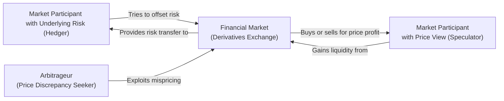

## Overview
Derivatives markets bring together a diverse set of participants who each have different objectives, risk tolerances, and strategies. Three primary groups we often hear about—hedgers, speculators, and arbitrageurs—play vital roles in ensuring that derivatives markets remain liquid, efficient, and responsive to market conditions. 

It might sound like abstract theory, but trust me, I’ve seen all three roles in action on a regular basis, even in a small coffee shop conversation with a friend who was trying to lock in the price of cocoa beans for his bakery. Understanding these participants and how they interact can give you a deeper appreciation for how risk is managed and priced in pretty much every major (and minor) financial market.

## Key Distinctions and Motivations
Below is a high-level snapshot of each participant’s typical profile:

- Hedgers: Primarily aim to reduce risk.  
- Speculators: Willingly assume risk in pursuit of profit.  
- Arbitrageurs: Seek any discrepancy in prices that may yield a risk-free (or very low-risk) return.  

Their motives may seem straightforward, but in practice, the lines can blur, and a single participant might take on multiple roles at once. Let’s dive into each.

## Hedgers
Hedgers enter derivatives contracts with the goal of offsetting or reducing the risks they already face from holding an underlying asset or liability (such as a future sales commitment or an upcoming purchase). Hedging typically involves taking a derivative position whose value tends to move inversely to the underlying exposure. That way, if the underlying exposure suffers a loss, the derivative (hopefully) produces an offsetting gain.

### Common Examples
• A farmer growing wheat might sell (short) wheat futures to lock in a price for the upcoming harvest. Any drop in the price of wheat after planting no longer poses a devastating risk because the short position in futures should gain if spot prices fall.  
• Similarly, an airline seeking to manage fuel costs might purchase (long) crude oil futures or aviation fuel forwards. If the price of oil or jet fuel rises, the hedge seeks to offset the airline’s increased operational costs.

From personal experience, I once heard an anecdote about a local brewer in my hometown. She was worried about volatile barley prices, so she locked in a six-month barley futures contract at a set price. With that derivative “insurance,” she could brew her craft beer without worrying if barley futures spiked next season.

### Hedging Objectives
• Stabilizing cash flows  
• Minimizing the impact of adverse price movements  
• Achieving greater certainty about future budget, investment, or production costs  

### Potential Pitfalls
• Overhedging (taking on a larger hedge than the underlying exposure, possibly turning it into speculation).  
• Basis risk (when the hedging instrument doesn’t perfectly track the movements of the underlying exposure).  
• Liquidity constraints in certain derivative markets.  

## Speculators
Speculators, on the other hand, deliberately seek out risk in derivatives markets to profit from anticipated price movements. While hedgers often focus on being “risk-averse,” speculators thrive on risk acceptance, provided they believe they have an informational edge or a strong market view. 

### Speculative Motivations
• Profit from expected price upward or downward moves  
• Gain leveraged exposure to underlying markets (futures, options, and other derivatives allow speculators to control a large notional amount with relatively small capital through margin)  

### Example: Short-Term Metals Trader
Let’s say a metals trader believes that copper prices are about to surge due to supply disruptions at major mines. The trader can buy copper futures to speculate on the price increase. If copper prices rise as expected, the trader profits on the futures contracts.

Or a less glamorous example: Suppose someone expects currency fluctuations after a major central bank announcement. They might buy a currency option or short a forward contract on the currency, hoping to cash in if the market moves in their favor. Of course, if the speculation goes the other way, losses can mount quickly.

### Benefits and Risks
• Speculators often enhance market liquidity, making it easier for hedgers to enter or exit their positions.  
• Speculators face the potential for substantial losses when market calls are wrong.  
• Regulatory bodies sometimes watch speculators closely, imposing margin requirements and position limits to limit excessive volatility or systemic risk.

## Arbitrageurs
Arbitrageurs are the market participants who strive to capture price discrepancies across different markets, instruments, or exchange venues. The essence of arbitrage is to lock in a nearly risk-free profit by trading any mispricing out of the system. 

### Types of Arbitrage
• **Spatial Arbitrage:** Exploiting price differences for the same asset across different geographical locations or exchanges.  
• **Triangular Currency Arbitrage:** Spotting inconsistencies in cross-currency exchange rates.  
• **Cash-and-Carry Arbitrage:** Involves buying an asset in the spot market while simultaneously selling it forward, pocketing the difference between the cost of carrying the asset and the forward price.  

While the ideal scenario for an arbitrageur is risk-free profit, real-world transactions often carry minor risks—like execution risk, timing mismatches, or potential regulatory/settlement frictions. Nonetheless, arbitrage activity is crucial for keeping prices aligned, and it’s a key factor in market efficiency.

### Practical Example
Imagine you see Gold Future A priced at $1,800 per troy ounce on one exchange, and an identical contract (same underlying, same expiration) trading at $1,805 on another exchange. By simultaneously buying the cheaper contract and selling the more expensive one, an arbitrageur might lock in the $5 difference. Yes, there are transaction costs and fees to account for, but if the difference is large enough and the trader can execute fast enough, it becomes a “free lunch” that quickly normalizes prices.

## Overlapping Roles and Blurred Lines
In practice, the neat distinctions among hedgers, speculators, and arbitrageurs can get, well, a bit messy. A large institution might hedge interest rate exposure on its bond portfolio (hedger) while also taking directional bets on currency movements (speculator). If the opportunity arises, the same institution could also engage in an arbitrage trade between markets. 

One of my ex-colleagues in a trading firm once joked: “We hedge our speculation and speculate on our hedges,” capturing the reality that real-world trading strategies often combine multiple motives. Even a hedger might have a small directional bias based on fundamental research, effectively crossing the line into light speculation.

## Market Liquidity and Risk Redistribution
All three participant types bring significant benefits to the market structure:

• **Hedgers**: Provide an essential risk-transfer service. Those who want to avoid risk can hand it off to those willing to take it on.  
• **Speculators**: Inject liquidity and enable continuous price discovery. Without speculators, it might be difficult for hedgers to find counterparties.  
• **Arbitrageurs**: Ensure prices in different markets or contracts do not drift apart for long, thus improving market efficiency.  

### Visual Overview
Below is a simplified diagram illustrating the interactions among these three distinct (yet occasionally overlapping) roles:

As you can see:  
• The hedger seeks to offset risk in the market.  
• The speculator interacts with the market primarily for directional trades.  
• The arbitrageur watches for any inconsistencies in prices to earn a near risk-free profit.  

## Regulatory Perspectives
Regulators frequently categorize positions based on whether they serve a genuine hedging need or are purely speculative or arbitrage-oriented. Some key points:

- **Position Limits**: Regulators like the CFTC (Commodity Futures Trading Commission in the US) impose limits on the size of positions speculators can take to curb excessive market influence. Genuine hedgers often receive exemptions because they hold positions aligned with real commercial exposures.  
- **Margin Requirements**: Speculators typically face standard or higher margin requirements, reflecting the risk that they might not have an offsetting underlying asset. Hedgers may have margin offsets or lower requirements if they can demonstrate that the derivative position directly reduces their underlying risk.  
- **Reporting**: Large traders or systemically relevant institutions often must report positions to regulators or exchanges (e.g., the CFTC’s Commitment of Traders report). These disclosures reveal how many participants are hedgers vs. speculators, which is extremely helpful for market analysis.

## Observing Market Data
You’ll often see analysts dissect changes in open interest and trading volume in major derivative markets to gauge participant behavior. For instance:

- A surge in open interest accompanied by stable or rising prices could be new speculators entering the market.  
- A sudden increase in hedging-oriented positions might reflect producers locking in prices ahead of a known event, such as harvest time in agricultural markets.

Interpreting this data often requires blending fundamental market research with knowledge of typical participant behavior.

## Best Practices and Common Pitfalls
Even though hedgers, speculators, and arbitrageurs each have distinct reasons for using derivatives, there are a few best practices that apply to everyone:

1. **Clarity of Objectives**: Always define your main purpose for a trade: is it to reduce an exposure you currently have, to take on risk for potential profit, or to exploit mispricing?  
2. **Risk Management**: Regardless of your role, have a plan for mitigating potential losses. For hedgers, remain vigilant about basis risk. For speculators, watch your leverage. For arbitrageurs, keep an eye on execution risk and transaction costs.  
3. **Regulatory Compliance**: Know the margin rules, position limits, and reporting requirements specific to your local exchange or jurisdiction.  
4. **Monitoring Market Conditions**: Factors like liquidity, volatility, and interest rates can rapidly change the risk–reward profile of any derivative strategy.  
5. **Continuous Education**: Markets evolve—new instruments, new regulations, and new technologies like high-frequency trading or AI-driven strategies can quickly change the playing field.

## Personal Reflection
When I first started exploring derivatives, I thought speculators were “gamblers,” hedgers were “careful businesses,” and arbitrageurs were “geniuses with fancy math.” Over time, I realized each role is essential—from a global economy standpoint, these participants collectively make the markets more robust. It’s much like a relay race: every runner (participant) has a distinct role, but together, they move the baton (risk) from one stage to another in a well-functioning system.

## Exam Tips
• **Differentiating Motivations**: Be prepared to identify whether a position is for hedging, speculation, or arbitrage. On the CFA exam, you might see a scenario describing a soybean producer locking in prices ahead of harvest (hedger) or an investor projecting a bullish stance on an index (speculator).  
• **Regulatory Implications**: Know how position limits or margin requirements can differ among these participants. You may be asked to calculate margin implications or discuss whether a position meets hedging criteria.  
• **Basis Risk**: Understand the subtleties of basis risk for hedgers. This often appears in exam questions focusing on hedge effectiveness.  
• **Arbitrage Mechanics**: If you see cash-and-carry arbitrage or triangular currency arbitrage scenarios, be ready to exhibit step-by-step processes or payoff calculations. The exam might also test your knowledge on real-world frictions, such as transaction costs or capital constraints.  
• **Integration with Other Topics**: Roles of market participants can show up in ethics questions, portfolio management cases, or even performance attribution. Be sure you can link these concepts to broader portfolio and risk management topics.

## References
- Hull, John C. (2021). “Risk Transfer: Hedgers, Speculators, and Arbitrageurs.” In Options, Futures, and Other Derivatives. Pearson.  
- CFA Institute. “Participant Types and Market Functions.” CFA Program Curriculum.  
- Fabozzi, F., & Mann, S. (2012). The Handbook of Fixed Income Securities. McGraw-Hill.  

## Distinguishing Hedgers, Speculators, and Arbitrageurs: Practice Questions



### Which of the following best describes a hedger's primary motivation?

- [ ] Seeking high returns through leveraged positions
- [x] Reducing or eliminating existing price risk
- [ ] Exploiting temporary price inconsistencies
- [ ] Taking advantage of expected directional moves

> **Explanation:** A hedger’s primary objective is to reduce or eliminate an existing exposure to price risk, such as a farmer protecting against dropping crop prices.

### A company that locks in exchange rates to pay overseas suppliers is most likely acting as:

- [ ] A speculator
- [x] A hedger
- [ ] An arbitrageur
- [ ] A market maker

> **Explanation:** Managing future currency obligations by locking in an exchange rate is a classic hedging strategy aimed at reducing FX risk.

### Which statement is true regarding arbitrage?

- [x] It involves attempting to profit from price discrepancies in different markets.
- [ ] It generally carries unlimited downside risk.
- [ ] It solely focuses on directional bets.
- [ ] It is primarily concerned with altering existing exposures.

> **Explanation:** Arbitrage exploits price differences for (ideally) risk-free or very low-risk returns. It does not focus on taking large directional positions.

### When a farmer sells soybean futures to lock in a stable selling price for the upcoming harvest, the farmer is:

- [ ] Speculating on a price increase
- [x] Hedging future revenues
- [ ] Operating a cash-and-carry arbitrage strategy
- [ ] Engaging in currency hedging

> **Explanation:** By selling futures, the farmer is hedging future revenue from soybean sales and reducing the risk of price fluctuations.

### True or False: A speculator entering an oil futures contract always has an underlying oil exposure to protect.

- [ ] True
- [x] False

> **Explanation:** Speculators do not necessarily have an underlying exposure; they take positions in a derivative instrument to profit from expected price movements.

### In practice, a single large financial institution might simultaneously act as:

- [x] A hedger, speculator, and arbitrageur
- [ ] A hedger alone, to avoid conflict of interest
- [ ] A speculator alone, focusing only on risk-taking
- [ ] An arbitrageur alone, ignoring hedge considerations

> **Explanation:** Institutions often have multiple trades serving distinct purposes—hedging certain exposures, speculating on others, and exploiting arbitrage when opportunities arise.

### Speculators are valuable to a healthy derivatives market because:

- [ ] They drive away hedgers through fear of volatility.
- [x] They provide liquidity and accept risk that hedgers wish to shed.
- [ ] They have no impact on price discovery.
- [ ] They increase basis risk for all participants.

> **Explanation:** Speculators enhance liquidity and assume the risk that hedgers want to offload, helping markets function more efficiently.

### If the forward price of a commodity is significantly higher than its spot price plus carrying costs, an arbitrageur might:

- [ ] Buy forward and sell spot
- [ ] Do nothing, because it’s a normal curve
- [x] Buy in the spot market and simultaneously sell forward
- [ ] Only engage in expansionary speculation

> **Explanation:** When the forward price exceeds the spot price plus carrying costs, a cash-and-carry arbitrage strategy can be implemented by buying the asset now and selling it forward.

### Regulators often place position limits on speculators in derivatives markets primarily to:

- [x] Prevent excessive speculation from distorting prices
- [ ] Restrict arbitrage opportunities
- [ ] Encourage hedging against price risk
- [ ] Generate additional tax revenue

> **Explanation:** Speculative position limits aim to prevent market manipulation and excessive volatility caused by overly large speculative trades.

### Which statement best captures the difference between a hedger and a speculator?

- [x] A hedger uses derivatives to reduce existing risk, while a speculator uses them to profit from anticipated price movements.
- [ ] A hedger always has smaller positions than a speculator.
- [ ] A hedger can only use futures, while a speculator can only use options.
- [ ] A hedger never profits from market movements.

> **Explanation:** The hedger’s main goal is risk reduction by offsetting an underlying exposure, while the speculator seeks gains by taking on risk.  


