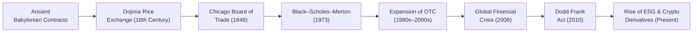

## Early Roots of Derivatives: Ancient and Medieval Times

Sometimes, when I look at how vast and complex the derivatives market has become, I’m blown away by how far back we can trace its origins. And I’m not just talking a few hundred years – we’re going all the way back to ancient Babylon. The famed Code of Hammurabi (circa 1750 BCE) is believed to contain clauses that allowed traders to agree on future prices for crops like grain. These early “forwards” might not look exactly like our modern, standardized contracts, but the concept was surprisingly similar: fix a price now for something you’ll deliver later.

In medieval Europe, merchants in places like Venice or Bruges faced the problem of shipping goods over long distances and uncertain seas. They found it helpful to set certain price terms in advance. Forward-style contracts allowed them to partially hedge the risk of price fluctuations in distant markets, even though they didn’t have a clearinghouse or an exchange like we do today. It was informal, but it did the job well enough to keep trade flourishing.

## The Dojima Rice Exchange: The First Organized Futures Market

Fast-forward to 18th-century Japan. One of the most intriguing stories in the world of derivatives centers on the Dojima Rice Exchange in Osaka. This exchange, established in 1730, is widely regarded as the first modern futures market. It was revolutionary because it formalized the trading of rice coupons, turning them into standardized contracts. Picture merchants and samurai using these coupons to hedge or speculate on the future price of rice, which at the time was both a staple commodity and a form of currency often used to pay samurai salaries. 

In effect, theDōjima Rice Exchange brought us many elements that would become second nature in futures markets: standardized contract terms, margin requirements (though they weren’t called that), and a rudimentary clearing function. It formed a template that modern exchanges eventually followed.

## Standardization in Chicago: The CBOT

No conversation about derivatives history would be complete without the Chicago Board of Trade (CBOT). Established in 1848, the CBOT formalized grain futures trading in the United States. Chicago’s strategic location—close to farmland and major transportation routes—made it the perfect hub for agricultural commodity trading. 

Before the CBOT, farmers and buyers might have handshake agreements or informal forward contracts. But as American agriculture scaled up, people needed a more reliable marketplace with transparent pricing. By introducing standardized contract sizes, delivery grades, and rules, CBOT made it possible for farmers and grain merchants to reduce or manage their price risk in a more systematic way. Later, as you’ll see in Chapter 2 on Forward and Futures Contracts, many of our current rules for futures—including marking to market—find their roots in adaptations introduced by CBOT and similar exchanges.

## 20th Century Transformations: Key Milestones

Early in the 20th century, derivatives were often overshadowed by cash markets. Still, forward and futures markets remained vital to agricultural and industrial sectors. Then came the mid-1900s, which saw the emergence of new financial derivatives, particularly around foreign exchange and government bonds.

• Bretton Woods & Currency Volatility: With the Bretton Woods system pegging currencies, there was initially less need for currency derivatives. However, when Bretton Woods ended in 1971 and major currencies began to float, foreign exchange risk became significant. This shift sparked the birth of currency futures (launched at the Chicago Mercantile Exchange in 1972) and, a few decades down the line, numerous sophisticated FX options.

• Energy Markets: Oil shocks in the 1970s also accelerated the need for risk management tools in energy. Contracts for crude oil, heating oil, and natural gas began to gain popularity, giving rise to entire segments of the derivatives industry focused on energy.

## The Black–Scholes–Merton Revolution

If there’s one thing that stands out in the “modernization” of derivatives, it’s the introduction of mathematical pricing models. In 1973, Fischer Black, Myron Scholes, and Robert Merton published their groundbreaking work on option pricing (the Black–Scholes–Merton model). Suddenly, there was a formula that provided a theoretical fair value for European-style call options, using assumptions about volatility, risk-free rates, and time.

This model revolutionized how traders viewed options. It wasn’t just guesswork anymore—there was a method to help identify mispricing, spur arbitrage opportunities, and conceptualize volatility itself as something tradable. This contributed to a huge uptick in options trading, culminating in the launch of standardized exchange-traded option contracts at the Chicago Board Options Exchange (CBOE) that same year. The synergy between advanced financial theory and practical trading floors is still a major driver of derivatives innovation. (For more on the fascinating mathematics behind these breakthroughs, see Chapter 10: Pricing and Valuation of Options.)

## Interest Rate Swaps, Currency Swaps, and the 1970s–1980s

Just as the Black–Scholes–Merton model was taking off, economic conditions in the 1970s gave birth to another giant leap: interest rate and currency swaps. In an environment of rising and volatile interest rates, companies and banks needed to exchange fixed payments for floating payments. The first widely recognized “modern” interest rate swap took place in the early 1980s between IBM and the World Bank. Meanwhile, the growth of multinational corporations investing globally also stoked the need for currency swaps.

These instruments quickly evolved from niche products to massive over-the-counter (OTC) volumes. Banks created dedicated swap desks, and the notional value of outstanding swaps soared. You’ll find all the gritty details in Chapter 3: Swaps, but suffice it to say that the 1980s saw an explosion of new derivative products that went well beyond agricultural underlyings.

## Electronic Trading & Deregulation (1990s–2000s)

The 1990s and early 2000s heralded a transformation in market infrastructure—electronic trading. Exchanges gradually replaced or supplemented “open outcry” floors with electronic order matching systems. This shift expanded market accessibility dramatically. Now, an investor in Tokyo could seamlessly trade U.S. T-bond futures on the Chicago Board of Trade without the time zone and communication hurdles that used to exist.

Deregulation also played a huge role. You might recall that in the United States, legislation like the Commodity Futures Modernization Act (2000) provided new freedoms for certain OTC derivatives. A wave of exotic products emerged—think credit derivatives, structured swaps, and hybrid instruments bundling multiple underlying exposures. These instruments gave investors new ways to manage (or speculate on) credit risk, interest rate risk, and equity risk all at once. But as many discovered later, these products also carried hidden complexities and counterparty exposures.

## The 2008 Financial Crisis and Post-Crisis Reforms

Well, we all know the punchline from the early 2000s party: the subprime mortgage meltdown and the global financial crisis of 2008. Derivatives, especially credit default swaps (CDS) and structured mortgage-backed securities, were in the spotlight. Spiraling counterparty risk, illiquid structured products, and poorly understood exposures forced policymakers to undertake sweeping reforms.

Legislation like the Dodd–Frank Wall Street Reform and Consumer Protection Act (2010) aimed to centralize clearing for standardized OTC derivatives, improve transparency with trade repositories, and require higher capital provisioning from counterparties. In the European Union, the European Market Infrastructure Regulation (EMIR) served a similar purpose. If you’re interested in the nitty-gritty of how margin, clearing, and capital rules evolved post-crisis, you’ll want to read Chapter 6: Derivative Benefits, Risks, and Uses, which dives into regulatory considerations.

The 2008 shock also put risk management at the forefront of corporate boardrooms. Suddenly, everyone was reevaluating whether they truly understood the complexities of their hedges. To an extent, the crisis also pushed a chunk of OTC trading to more transparent avenues, ironically spurring growth in cleared swap futures and standardized central clearing solutions.

## Emerging Trends: ESG and Cryptocurrency Derivatives

Times are still changing! Today, we’re watching the derivatives space stretch into new arenas at a breakneck pace:

• Cryptocurrency Derivatives: Bitcoin futures first launched in 2017 at the Chicago Mercantile Exchange (CME), followed soon after by options on Bitcoin and a wave of altcoin-linked derivatives on various specialized exchanges worldwide. Now, stablecoin and decentralized finance (DeFi) platforms also propose new derivative-like products. Regulation is still catching up, but the market—much like in the days of the first farmers in Babylon—continues to find ways to trade on uncertain future price developments.

• ESG-Linked Derivatives: Environmental, Social, and Governance concerns now influence the cost of capital for many firms, shaping new classes of swaps, futures, and even options tied to ESG metrics or specific sustainability benchmarks. Firms can hedge carbon credit costs or gain exposure to sustainability indexes. There’s a lot of innovation here, and the next few years may see these products become standard risk management tools for climate-conscious enterprises.

## Visualizing Major Milestones

Below is a simplified flowchart highlighting some of the key events in the evolution of derivatives. It’s amazing how each milestone expanded the market’s reach and shaped modern risk management practices.

## Best Practices, Potential Pitfalls, and Lessons Learned

• Complexity vs. Transparency: One key lesson repeated throughout history is that innovations in derivatives often outpace the understanding of their risk profiles. Standardization and transparency usually help, but markets can still become opaque when exotic products dominate.

• Regulation and Oversight: Reforms like Dodd–Frank and EMIR show that the regulatory pendulum can swing from light oversight to stricter rules. Participants must stay current on compliance requirements.

• Counterparty Risk: Even centuries ago in Dojima, there was the question of whether your trading partner could deliver the rice promised. Modern clearinghouses help mitigate this risk, but “wrong-way” counterparty exposures can still materialize, as we saw in 2008.

• Technological Advancements: Electronic trading and automated strategies can provide liquidity and efficiency, but they can also introduce new risks, such as flash crashes or algorithmic errors, if not properly monitored.

If you keep these points in mind, you’ll see that the story of derivatives has always been about balancing innovation with risk control, anchored by market participants’ desire to hedge exposures or seek profits.

## Exam Tips and Key Points

• Chronology Matters: Understanding the historical context can help you recall why certain markets or products emerged when they did. On the exam, you might see an essay question linking interest-rate swaps to the volatile rate environment of the 1970s–1980s.

• The Role of Models: Black–Scholes–Merton revolutionized the industry. Be ready to apply or critique the model assumptions in scenario-based questions (for more on this, see Chapter 10).

• Regulatory Framework: Post-2008 rules around central clearing, margin requirements, and disclosure frequently appear in discussion questions. Remember to consider both the benefits and limitations of reforms in short-answer or mini-essay items.

• Linking to Other Derivative Types: Historical perspective is useful when analyzing everything from the “Cost of Carry” model (Chapter 7) to advanced topics like credit default swaps (Chapter 5). Modern derivative instruments all trace their lineage to the fundamental ideas of standardization, hedging, and optionality laid down centuries or decades earlier.

## Glossary

• Dojima Rice Exchange: An 18th-century Japanese market considered to be the first modern futures exchange, specializing in standardized rice coupons.

• Black–Scholes–Merton Model: The 1973 framework by Fischer Black, Myron Scholes, and Robert Merton for pricing European-style options, using assumptions about volatility, time, and the risk-free rate.

• Deregulation: The relaxation of government rules in financial markets, which can spark innovation and growth but also introduce greater systemic risk.

• ESG Derivatives: Instruments tied to environmental, social, and governance benchmarks or risk exposures, reflecting sustainability-oriented strategies.

## References

• Bernstein, Peter L. “Against the Gods: The Remarkable Story of Risk.” Wiley, 1998.  
• Das, Satyajit. “Traders, Guns & Money: Knowns and Unknowns in the Dazzling World of Derivatives.” FT Press, 2010.  

----

## Test Your Knowledge: Historical Milestones in Derivative Markets



### Which ancient civilization is most often credited with having some of the earliest known forms of forward contracts?

- [ ] Ancient Greece
- [x] Babylonian
- [ ] Roman Empire
- [ ] Mayan Civilization

> **Explanation:** The Code of Hammurabi (circa 1750 BCE) in ancient Babylon contained provisions that resembled modern forward-style contracts.

### What is a key historical significance of the Dojima Rice Exchange in 18th-century Japan?

- [ ] It introduced government-set contract prices.
- [ ] It only traded goods for barter.
- [x] It established one of the first formal futures markets with standardized contracts.
- [ ] It was outlawed for promoting speculation.

> **Explanation:** The Dojima Rice Exchange standardized rice coupons into futures-like contracts, widely recognized as a precursor to modern futures trading.

### Which of the following happened after the end of the Bretton Woods system in 1971?

- [x] Growth of currency futures and forex derivatives.
- [ ] Complete elimination of exchange rate volatility.
- [ ] Collapse of all derivative markets.
- [ ] Prohibition of OTC trading in the U.S.

> **Explanation:** Once major currencies began floating freely, their volatility spurred a growing need for hedging. This led to the introduction and expansion of currency futures and similar products on several exchanges.

### What critical development in option pricing theory emerged in 1973?

- [ ] Mandatory clearing for all option markets.
- [x] The publication of the Black–Scholes–Merton model.
- [ ] The decimalization of option prices.
- [ ] Full nationalization of all derivative contracts.

> **Explanation:** 1973 saw the groundbreaking work by Fischer Black, Myron Scholes, and Robert Merton, which fundamentally changed how market participants value and trade options.

### Interest rate swaps first gained significant prominence due to:

- [ ] Low and stable interest rates in the 1950s.
- [x] Volatile interest rate conditions in the late 1970s and early 1980s.
- [ ] A global ban on mutual fund investments.
- [ ] Central banks refusing to set benchmark rates.

> **Explanation:** Firms needed solutions to manage fluctuations in interest rates, giving rise to early interest rate swaps. IBM and the World Bank famously engaged in one of the first major swaps.

### Which development was key to expanding market access and speeding up trade execution in the 1990s?

- [ ] Reintroduction of bartering floors.
- [ ] Abandonment of all electronic systems.
- [x] Widespread adoption of electronic trading platforms.
- [ ] Government takeover of all futures exchanges.

> **Explanation:** Electronic trading allowed global market participants to trade in real time, making derivatives markets more liquid and accessible.

### What major lesson did the 2008 financial crisis teach about derivatives?

- [ ] All derivative products should be banned.
- [ ] Standardized exchange-traded futures are more dangerous than OTC.
- [x] Complexity and lack of transparency in OTC products can amplify systemic risk.
- [ ] Derivatives have no impact on lending standards.

> **Explanation:** The crisis demonstrated how unmitigated counterparty risks, opaque structures, and insufficient disclosure could magnify the systemic impact of market stress.

### Which U.S. legislative act was designed to improve transparency and risk management in derivatives post-2008?

- [x] Dodd–Frank Wall Street Reform and Consumer Protection Act
- [ ] The New Deal
- [ ] Sarbanes–Oxley Act
- [ ] Glass–Steagall Act

> **Explanation:** Dodd–Frank introduced centralized clearing mandates and higher capital requirements for standardized OTC derivatives, aiming to address counterparty risk.

### ESG derivatives typically focus on:

- [ ] Military technology innovations.
- [ ] Eliminating volatility in currency markets.
- [ ] Speculating purely on interest rate movements.
- [x] Sustainability-linked benchmarks and risk exposures.

> **Explanation:** ESG-linked derivatives enable trading or hedging based on environmental, social, and governance metrics, reflecting the broader sustainability trend in markets.

### True or False: Cryptocurrency derivatives began to appear in mainstream exchanges around 2017.

- [x] True
- [ ] False

> **Explanation:** Bitcoin futures went live on the Chicago Mercantile Exchange (CME) in 2017, paving the way for further crypto offerings on regulated exchanges.


