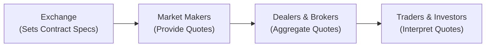

## Overview

When I first started looking at derivative prices, I was a bit overwhelmed. Everyone was talking about ticks, spreads, yield-based quotes, price-based quotes—yikes. But let’s be honest: if you’re new to these markets, it can feel like learning a new language. Even if you’re a seasoned pro, each asset class seems to have its own secret handshake. In this section, we’ll peel back the layers of these quoting conventions, from equity options to foreign exchange (FX) derivatives, and hopefully demystify the process. 

We’ll cover why equity options are quoted one way while bond futures are quoted another, how bid–ask spreads reflect liquidity and risk, and why interest rate swaps don’t even use a price-based quote at all. We’ll also look at how these conventions can differ across geographies, such as yen-based quotes in Japan or euro-based quotes in Europe. By the end, you’ll see that once you get a handle on the logic behind these conventions, you can confidently navigate even the most unfamiliar derivatives market.

## The Importance of Quoting Conventions

Conventions in quoting derivative prices are not arbitrary; they arise from the nature of each underlying asset and the practical needs of market participants. In simple terms, quoting conventions make trading more straightforward by standardizing how prices are expressed. They also allow us to quickly compare apples to apples (or in derivatives-speak, one contract’s details to another’s).  

• When you buy an equity call option, you might see a premium of, say, $2.50. But that $2.50 is per share, and each equity option contract typically covers 100 shares. So the total premium would actually be $2.50 × 100 = $250.  
• In bond futures, you might spot a price of $98.25, but it could be expressed per $100 face value. If your contract size is $100,000 notional, you’d interpret that $98.25 as a fraction of the total notional value.  
• FX derivatives might be quoted in a direct or indirect manner, which can be quite confusing to new traders. In some currency pairs, the quote is “how many US dollars for one euro,” whereas in others, it’s the exact opposite.

Without consistent quoting conventions, you’d spend way too much time converting and rechecking numbers. Worse, you might misinterpret a price altogether—which can be a recipe for expensive mistakes.

## Equity Options: Premiums per Share

Equity options are typically quoted on a per-share basis, though the lot size is often 100 shares per contract (or 50, depending on the local market). This means if an option is quoted at $1.20, you usually have to multiply by 100 to get the total cost (premium) for one contract.  

Options also come with short-hand notations for strikes and maturities. You might see something like:  
• A call option on XYZ stock, with a strike of $50, expiring on the third Friday of the next month, might be quoted as “XYZ Jan50C” with a displayed premium.  
• The premium might say “$1.20,” but that’s $1.20 per share.  

In many equity option markets, the tick size (the smallest price increment) might be $0.05 for premiums above $3.00 and $0.01 for lower premiums—though each exchange can set its own rules. And you’ll definitely want to keep an eye on the bid–ask spread, which can get wide if the stock is thinly traded or if the option is far out-of-the-money.

## Bond Futures: Price per $100 Notional

Bond futures, such as U.S. Treasury futures, are famously quoted as a fractional price per $100 of face value. Sometimes they use increments like 1/32nd of a point. So a quote of 98-16 means 98 and 16/32 dollars per $100 face amount. If you need to convert that to a decimal, you’d do:

98 + 16/32 = 98.5

Or 98-16½ might be 98 + 16.5/32 = 98.515625.

Real fun, right? Once you get used to it, it’s not too bad. The logic is that government and corporate bonds historically traded in fractions, so the futures carried that convention forward. As you move away from U.S. markets, you might see decimal quotes instead. European bond futures (like the German Bund future) typically quote in decimals, making life just a touch easier for mental arithmetic.

## Bid–Ask Spreads and Liquidity

The bid–ask spread is the difference between the highest price buyers are willing to pay (the bid) and the lowest price sellers are asking. It’s a key indicator of liquidity and transaction cost. Here’s a quick anecdote: I once tried trading a lightly traded commodity option where the bid–ask spread was nearly a full point wide (something like $0.80–$1.80). It was like stepping into a ghost town—no volume in sight. Sure enough, just executing the trade meant an immediate potential loss if I had to exit quickly.

In a more liquid market, say standard S&P 500 equity index options or major FX pairs, the spread might be just a few ticks. Market makers and dealers need compensation for providing liquidity, and that’s reflected in the spread. The narrower the spread, the easier it is to enter and exit positions without taking a big hit on transaction costs.

## Foreign Exchange (FX) Quoting

FX quoting can be tricky because of direct vs. indirect quotes. Here are the basics:  

• A direct quote is the amount of domestic currency needed to buy one unit of foreign currency. For example, in the United States, USD/EUR at 1.10 means it costs $1.10 to get one euro.  
• An indirect quote reverses it: EUR/USD at 0.9091 means it costs €0.9091 to buy one US dollar.  

Most major currency pairs tend to be quoted in a particular format. For instance, EUR/USD is a direct quote for someone using U.S. dollars as their home base. But for someone in Europe, it’s indirectly telling them how many euros they need for one dollar.  

FX options and futures can be quoted similarly, often focusing on implied volatility or the forward rate. It’s also worth mentioning that the notional value behind each contract can be quite large. For example, one CME Euro FX future has a contract size of 125,000 euros, so you always have to multiply the quoted price by 125,000 to get the total contract value in dollars.

## Interest Rate Derivatives: Quoted as Rates

Some interest rate derivatives—for example, interest rate swaps—aren’t typically quoted in a price for the entire contract. Instead, you’ll see a “fixed rate” quoted for the swap. In a classic plain-vanilla interest rate swap, you might see:  

• 4.25% for a 5-year swap, referencing a specific floating rate index such as 3-month LIBOR or its successor rate (like SOFR).  
• The quoted figure is the annualized fixed rate that would make the swap’s present value zero at initiation.  

You can think of it like this: in an interest rate swap, one side pays a fixed rate, the other pays a floating rate. The rate that’s quoted in the market is effectively the rate that makes these cash flows have the same value. No single “price” in dollars is given for the swap at the outset—though you can certainly convert that rate into net present value (NPV) if you want to see the swap’s mark-to-market at any time.

## Commodity Futures: Tick Sizes and Point Values

Commodity futures might appear more direct because they quote a price per unit—like $80.50 per barrel of crude oil. But you also have to consider the contract specifications:

• One oil futures contract on the NYMEX might represent 1,000 barrels, so each $1 move in price translates into $1,000 of value change.  
• A tick size might be $0.01 or $0.025, representing the minimum price movement.  

Then there’s the concept of point value. If gold futures move from $1,900.00 to $1,901.00 per ounce and each contract is 100 ounces, that’s $100 of total notional change for a single contract. Always check the exchange’s contract specs to know your tick size, point value, and total notional.

## Local Conventions and Global Markets

Derivatives trade in many currencies. For example, you might trade a European equity option in euros, an FX future in U.S. dollars, or a Tokyo-based futures contract in Japanese yen. Market participants must be aware of these local quoting customs:  

• Decimal places: Some might quote to two decimal places, others to five.  
• Currency labels: The symbol might be JPY (Japanese yen), EUR (euro), or GBP (British pound).  
• Day counts and yield quoting: Think about how interest rates are annualized. Each market might have slightly different day counts.  

Ensuring you don’t mix up currency notations can prevent some humiliating mistakes. I once heard about a new trainee confusing JPY 1,000 with USD 1,000—trust me, not a good moment in the office.

## Standardizing Notation for Comparison

When evaluating multiple derivatives, it’s critical to standardize your approach:

• Convert all quotes to a consistent decimal format.  
• Use the same yield convention (e.g., actual/360, actual/365) when comparing interest rate instruments.  
• Document the contract size so you don’t forget how many shares, barrels, or currency units you’re dealing with.  

Some professional platforms allow you to input the notional or contract specs, then automatically convert quotes into your preferred format. This can be super helpful when you’re comparing, say, a bond future in fractional 32nds to an interest rate swap quoted in annual percentage rates.

## Bid–Ask Spreads in Practice

The next time you look at a derivative quote, check out the bid–ask spread. See how wide or narrow it is. This totally matters for your total transaction cost. If you’re actively trading, you might also pay attention to the “levels of liquidity” just beyond the best bid and offer. Some advanced traders look at “market depth” to see how quickly the price might move if they buy or sell larger quantities.

## A Quick Mermaid Diagram on Quote Flow

Below is a very simple representation of how quoting flows from the exchange to market participants:

• The exchange defines the contract size, tick size, and settlement rules.  
• Then market makers provide bid and ask prices on that contract.  
• Dealers and brokers aggregate quotes, often stepping in to facilitate trades or manage order flow.  
• Finally, traders—including institutions and retail investors—monitor quoted prices to decide on trades.

## Common Pitfalls and Best Practices

• Ignoring Contract Multiplier: An option might seem cheap at $1.00, but remember to multiply by the contract size (often 100 shares).  
• Mixing Up Direct and Indirect Quotes: In FX, be crystal clear on which side of the currency pair is the base vs. quote currency.  
• Overlooking Tick Value: If the minimum tick is $0.005 for a contract size of 1,000 units, each tick could be $5 of real P/L.  
• Bid–Ask Spread Surprises: A wide spread can mean a significant cost to open and close a position, especially in less liquid markets.  
• Confusing Notional vs. Price: For interest rate swaps, a 4% quoted rate might seem small or large. One should also look at the notional amount behind that rate.  

One best practice is always to confirm the quotes you see with the actual exchange or clearinghouse specification page. Usually, the exchange’s website (e.g., CME Group, ICE) has a contract spec page detailing the multiplier, tick size, face value, or any other special quoting conventions.

## Real-World Example: Bond Futures Quoting

Suppose you’re looking to hedge interest rate risk using U.S. Treasury futures. The contract might be quoted at 112-08, meaning 112 and 8/32. Here’s a short numeric illustration:

• 112-08 = 112 + 8/32 = 112.25  
• Each full point (1 point) equals $1,000 per contract because the notional is $100,000. Thus, 112 points is $112,000 in notional terms.  
• 8/32 of a point is $250 (because 1 point is $1,000, so 8/32 is 8 ÷ 32 × $1,000 = $250).  

So your total notional is $112,250 for one contract at that quoted price. If the price moves to 112-24 (112 + 24/32 = 112.75), you’ve gained 16 ticks (24 – 8 = 16) or 0.5 points = $500. 

This example highlights how fractional quoting translates into actual dollar moves in a futures hedge.

## Exam Tips: Navigating Quoting Conventions

1. Understand the “Why”: Don’t just memorize how quotes work—get why a particular market quotes the way it does (historical, practicality, or both).  
2. Practice Conversions: If you see a fraction, convert it to a decimal. If you see a decimal, figure out how many currency units it represents.  
3. Relate to Notional Amounts: Always tie the quote to the underlying notional or contract multiplier.  
4. Watch Out for Trick Questions: On exam day, they might mix up direct and indirect quotes or show you an “odd tick” that differs from standard increments.  
5. Stay Calm With Math: If a question involves fractional 32nds or partial ticks, carefully do the fraction math. Keep a mental model or a reference of conversions.  

In a scenario-based question, you might be asked: “If the USD/GBP quote is 1.3000, how many GBP do you get for $1,000?” The immediate reaction might be, “Wait, am I dealing with a direct or indirect quote?” So be sure to confirm which currency is the base. Then do the math carefully and methodically.

## References for Further Exploration

• CME Group Contract Specifications:  
  https://www.cmegroup.com/

• Hull, John C. “Conventions in Pricing and Quoting.” In Options, Futures and Other Derivatives, Pearson.

• CFA Institute. “Derivative Markets and Instruments.” 2025 Level I Curriculum.

• BIS (Bank for International Settlements) statistics for global derivative markets:  
  https://www.bis.org/statistics/derstats.htm  

• IFRS Foundation (for an overview of derivatives reporting guidelines):  
  https://www.ifrs.org/

--------------------------------------------------------------------------------

## Test Your Knowledge: Derivative Pricing Conventions Quiz



### Which of the following best describes a fractional quote of 98-16 in a bond futures market?

- [x] It translates to 98 + 16/32, or 98.50 in decimal form.
- [ ] It means the bond can be redeemed at 98.16% of face value.
- [ ] It indicates 98.16 as a percentage of par with no fractional breakdown.
- [ ] It means 98.16 ticks up from the previous settle price.

> **Explanation:** 98-16 means 98 plus 16/32 of a full point, which is 98.50 in decimal form.  

### In equity option markets, a quoted premium of $2.50 typically means:

- [x] $2.50 per share, often multiplied by 100 shares per contract.
- [ ] $2.50 total for the whole contract.
- [ ] A fractional bond price that must be converted to par value.
- [ ] $2.50 per $1,000 notional value.

> **Explanation:** Equity options are quoted on a per-share basis, and since most equity option contracts cover 100 shares, the total cost would be $2.50 × 100 = $250.  

### Which statement about bid–ask spreads is most accurate?

- [ ] Wider spreads indicate higher liquidity in all markets.
- [x] Wider spreads often reflect lower liquidity or higher inventory risk for market makers.
- [ ] Narrow spreads reveal substantial inventory risk for dealers.
- [ ] Spreads have no impact on transaction costs.

> **Explanation:** Wider spreads usually indicate lower liquidity or greater risk borne by market makers. Narrow spreads typically reflect higher liquidity.  

### FX quotations with “USD/JPY = 110.00” is considered:

- [x] A direct quote if you’re in the United States, meaning it takes 110.00 Japanese yen to buy one US dollar.
- [ ] An indirect quote, because we’re expressing yen per dollar.
- [ ] Neither direct nor indirect; it must be cross-quoted through EUR.
- [ ] A quote that is unrelated to any base currency.

> **Explanation:** In the U.S., “USD/JPY = 110.00” is typically seen as a direct quote for the dollar—how many yen one dollar can buy.  

### One key difference between interest rate swaps and futures quotes is that:

- [x] Interest rate swaps are usually quoted as an annualized rate, while futures often have a per-contract price.
- [ ] Both are quoted in the same fractional format.
- [ ] Both use the same day-count convention.
- [ ] Futures quotes are always expressed as an annualized percentage rate.

> **Explanation:** The fixed leg of an interest rate swap is quoted as an annualized rate that equates the swap’s fixed payments with the floating side, whereas futures have a price-based quote.  

### Which of the following is a common pitfall when dealing with commodity futures quotes?

- [x] Failing to multiply the contract size by the quoted price.
- [ ] Confusing direct and indirect quote conventions.
- [ ] Assuming the standard day-count convention applies.
- [ ] Applying an annualized swap rate to a commodity.

> **Explanation:** A common error is forgetting each commodity futures contract has a specific notional size. For instance, crude oil is 1,000 barrels per contract.  

### When bond futures are quoted at 112-08, each full point of price is often worth:

- [x] $1,000 per contract because of a $100,000 notional.
- [ ] $100 per contract based on a $1,000 notional.
- [ ] $5,000 per contract because of annualized yields.
- [ ] Exactly $112 in total notional value.

> **Explanation:** For a standard U.S. Treasury bond future with a $100,000 face amount, each full point (1.00) translates to $1,000 in value.  

### When an OTC derivative quote references a “bid–offer” for the rate itself (e.g., 4.10%–4.15% in a swap), it implies:

- [x] Buyers receive the lower fixed rate, and sellers pay the higher fixed rate if transacted, reflecting a spread in rates.
- [ ] The derivative is quoted in $ per contract.
- [ ] There is no difference between the bid rate and the offer rate.
- [ ] The quote is purely notional, with no actual effect on pricing.

> **Explanation:** In an interest rate swap, a bid–offer range indicates the fixed rate counterparties are willing to pay or receive, showcasing a spread in annualized percentages, not price per se.  

### A tick size in derivatives quoting refers to:

- [x] The minimum price increment in which the contract can trade.
- [ ] A standard measure of credit quality.
- [ ] The official reference rate set by a government.
- [ ] The value of a contract’s entire notional.

> **Explanation:** Tick size is the smallest allowable increment for price movements in a market. For instance, 0.01 might be the smallest move for certain commodity or equity futures.  

### The direct quote for EUR/USD is 1.2000. True or False: This means 1.2000 USD per 1 EUR.

- [x] True
- [ ] False

> **Explanation:** If EUR/USD = 1.2000, it means 1.20 US dollars for one euro, which is a direct quote for investors using USD as their domestic currency.  


