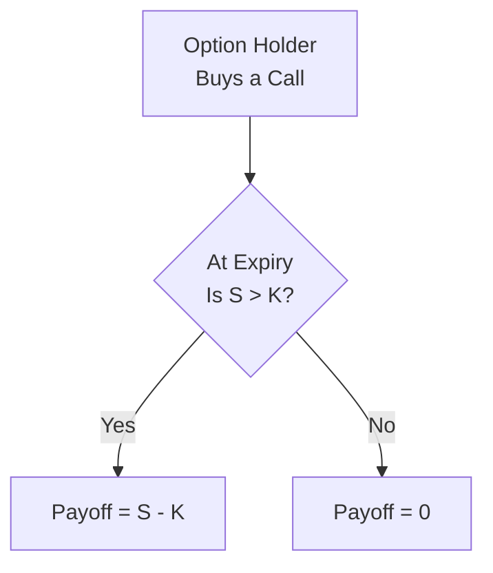
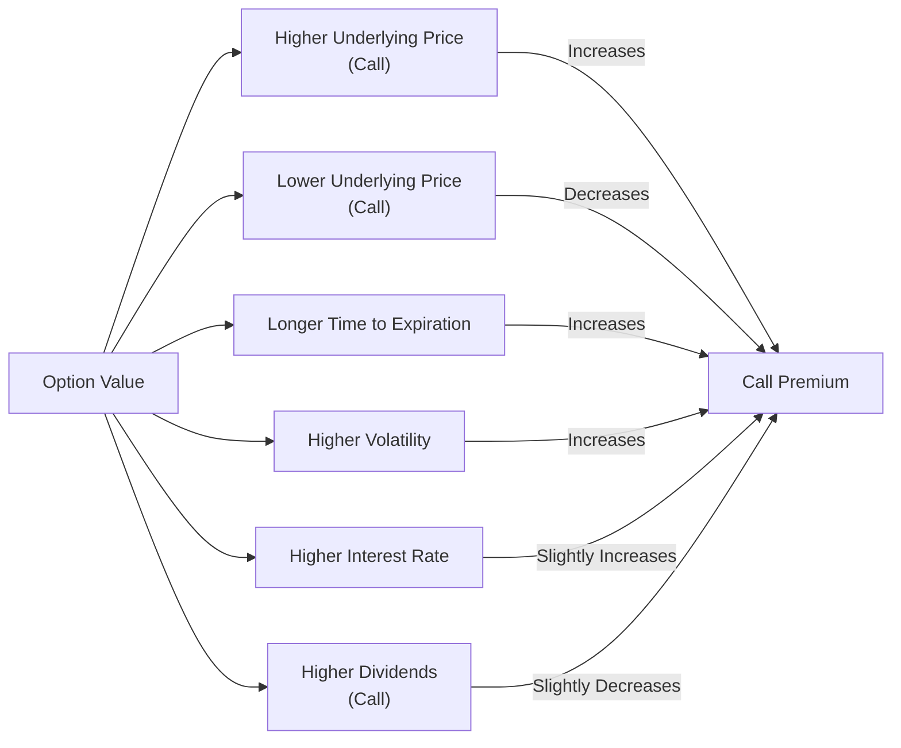

## Introduction

Sometimes I think back to my early days analyzing options—those evenings spent huddled over a spreadsheet, trying to figure out which variables made a call thrive or a put shine. I remember how puzzling it was to see the option’s value bounce around even when the stock wasn’t moving much. Well, it turns out an option’s value dances with more than one partner: underlying price, strike price, time to expiration, volatility, interest rates, dividends, and a few other subtle factors. All these elements meld together to reveal an option’s total worth.

This section focuses on these key determinants of option value. We’ll break down the concept of intrinsic value and time value, peer into how volatility stirs up opportunity, see why time is both an ally and an enemy, and get a glimpse of how interest rates and dividends slip into the mix. Along the way, we’ll check out a simple flowchart to visualize the payoff logic for a vanilla option. By the end, you should have a solid grasp on what influences calls and puts in the real world—an essential foundation for options pricing and risk management.

## The Payoff Asymmetry

First, let’s remind ourselves what an option is. A call option grants the holder the right—but not the obligation—to buy an underlying asset at a specified strike price on or before (in the case of American options) the expiration date. Meanwhile, a put option grants the right to sell the underlying at the strike price. This optionality creates an asymmetric payoff: you get all the upside if the underlying moves favorably, but your downside is limited to the premium you paid to acquire the option.

Here’s a quick illustration of how it works with a plain-vanilla call at expiry:

Where:  
• S is the underlying asset price at expiration.  
• K is the strike price.

If the underlying ends up above the strike, you exercise for a payoff of S – K. If it stays below the strike, your payoff is zero (you let the option expire).

## Intrinsic Value and Time Value

The option’s price at any point in time can be deconstructed into two parts:

• Intrinsic Value (IV): The immediate exercise value. For a call, it’s max(S – K, 0), meaning if the underlying is trading above the strike, there’s a nonzero “in the money” portion. For a put, it’s max(K – S, 0).  
• Time Value (TV): The portion of the option’s price that arises from the probability that the option will become more profitable (intrinsic value might expand) before expiration. This “extrinsic” value reflects market expectations of future volatility, time to expiration, and other factors.

It might help to think of it like this: Intrinsic value is what you’d get if you exercised the option right now (assuming American-style). Time value is all about possibility—what could happen if the underlying moves in your favor during the remaining life of the option.

### How Intrinsic and Time Value Evolve

Picture that new smartphone you’ve been eyeing—it’s got a guaranteed minimum worth just as a piece of hardware, but there’s also a certain intangible hype and potential around it that may wane as new models come out. The phone’s “tangible” worth is akin to intrinsic value. The hype and future possibilities that the phone might become a hot commodity reflect time value. When the option is deep in the money, most of its value is intrinsic. But if it’s way out of the money, intrinsic value sits at zero and time value dominates. 

## Underlying Price

Unsurprisingly, the spot price of the underlying asset looms large in determining a call or put’s value. For calls, as the underlying price (S) goes up, the call becomes more valuable—the chance of finishing in the money increases. For puts, a higher underlying price generally lowers the put’s value, because the likelihood of a payoff from selling an asset at a higher-than-market strike diminishes.

An important nuance: The relationship between the option price and the underlying isn’t always one-to-one. That’s precisely why options are so intriguing from a risk-management and speculation standpoint. You get convexity—when you’re on the right side of the market, your gains can amplify. When you’re on the wrong side, your maximum loss is capped (for a long option) at the premium paid.

## Strike Price

The strike price (K) determines the “threshold” for option payoff. For calls, a lower strike leads to a higher intrinsic value and thus typically a higher premium—as a call option holder, you’re delighted if your strike is well below the current market. Conversely, a higher strike reduces the call’s value because it becomes harder for the underlying to climb above it before expiration.

Naturally, the opposite effect applies to puts. For puts, a higher strike raises the put’s value, because there’s a better chance the underlying will end below that strike, thus giving the put some positive payoff.

## Time to Expiration

Time is a biggie. All else equal, a longer time to expiration usually increases an option’s value because it grants more opportunities for the underlying to move in a favorable direction. Even if the spot price isn’t where you want it to be right now, there’s that hope for a turnaround. 

A personal anecdote: Many years ago, I purchased a long-dated call on a stock that was meandering in a narrow range. For nearly six months, it stayed almost at breakeven. Then, in the last month before expiration, the underlying soared on a major earnings announcement. Had I chosen a shorter-dated option, I’d have missed that glorious rally. That’s time value at play.

However, time is also a double-edged sword: As time passes—especially if you’re an option buyer—time value decays toward zero, a phenomenon called “theta decay” or time decay. Think of it like an ice cube slowly melting away. If the intrinsic value hasn’t materialized yet, the portion of premium tied to hope for future movement keeps slipping away each day.

## Volatility

Volatility is the heartbeat of option markets. It measures the magnitude of price fluctuations of the underlying asset over time. The higher the expected volatility, the greater the chance the underlying might move significantly in your favor (particularly beneficial if you’re long an option). Even if an option is out of the money, high volatility extends the chance it could land in the money before expiration. As a result, option premiums rise with higher implied volatility.

On the flip side, if volatility is low, the asset is less likely to surprise you with a large move, so the extra “lottery ticket” premium in the time value shrinks. 

It’s also worth mentioning that changes in implied volatility can drive option prices up or down, even when the underlying’s spot price remains unchanged. That’s sometimes surprising to newer traders who assume the direction of the underlying is the only factor. But no—volatility alone can be a game-changer.

## Interest Rates

Interest rates typically find their way into option models—like Black–Scholes–Merton—in part because of the “cost of carry” or the opportunity cost of capital. Higher risk-free interest rates can slightly increase call option values (and reduce put values) when all else is held constant. The reasoning: Instead of paying the underlying’s full price now, a call buyer can invest that capital at the risk-free rate, paying effectively only the option premium today. Meanwhile, in a higher-rate environment, a put buyer pays the full premium without reaping the same benefit.

For stock options, if risk-free rates increase, you might see small upward bumps in call premiums. But, especially in times when interest rates are near zero or even negative, these effects can be subtle. In interest-rate-sensitive markets (e.g., interest rate futures, currency options), the effect can be more pronounced.

## Dividends and Other Yield

Dividends shift the option’s valuation dynamics. For a stock paying dividends, the share price often drops on the ex-dividend date by roughly the dividend amount. A call option holder misses out on that dividend because they don’t own the actual shares (unless they early exercise—possible with American-style options, but it might not always be optimal unless the dividend is large). Therefore, call values can be somewhat lower for dividend-paying stocks.

Puts, on the other hand, benefit from expected dividends. If the stock price is likely to drop due to dividend payouts, the put stands to gain from that downward drift. That means the put’s premium generally gets a slight boost.

A rough rule of thumb: The higher the anticipated dividend (and the sooner it’s paid before expiration), the more it might depress call prices and buoy put prices.  

## Cost of Carry

Broadly speaking, the “cost of carry” is any net cost or benefit to holding the underlying. For equity options, the cost of carry can be approximated by risk-free interest minus dividend yield. In commodity markets, cost of carry might incorporate storage, insurance, and transportation, or a convenience yield for physically holding the commodity. In currency markets, cost of carry arises from the interest rate differential between two currencies.

When cost of carry is high, it often encourages traders to use derivatives (like options) instead of holding the underlying physically, and that demand can influence option prices. Conversely, if there’s a convenience yield (i.e., you gain from physically holding the asset), it can shift the relationship between the forward price and the spot price, which, in turn, affects option valuations tied to those forward prices.

## Real-World Market Influences

Although theoretical valuation models (like Black–Scholes–Merton) highlight the variables above, in practice, supply-and-demand imbalances, liquidity constraints, and market sentiment can nudge option prices away from purely model-driven levels.  

• Supply & Demand: Option writers might be more willing to supply certain strikes if they hold offsetting positions or need to hedge other exposures. Temporary order imbalances can make option prices fluctuate beyond what a purely theoretical model suggests.  
• Liquidity: Illiquid option markets can come with wide bid–ask spreads. This spread is effectively an additional cost that can influence how actual trading prices are realized.  
• Skew and Smile Patterns: In equity index options, there’s often a “volatility skew” that bumps up put prices relative to calls due to hedging demand and negative sentiment risk.  

During major economic announcements—earnings calls, central bank meetings, or global political events—implied volatility can spike, raising premiums even if the spot price is unchanged, precisely because the market braces for big moves.

## Putting It All Together

Let’s pull these threads together with a practical example. Imagine you’re evaluating a three-month call option on XYZ Corp., with a strike of $50. The underlying currently trades at $49, expected annual dividends are $1.00, implied volatility is moderate, and the risk-free rate is 2%. How do you piece together all the key determinants?

• Underlying Price (S = $49): Slightly below strike, so the option’s intrinsic value is $0.  
• Strike Price (K = $50): That’s the threshold for payoff at expiration.  
• Time to Expiration (3 months): Not a lot of time, but not trivial either. Gives the stock some chance to climb above $50.  
• Volatility (moderate): There’s room for the underlying to swing. Even if the probability of hitting above $50 is not massive, there’s still decent upside if implied volatility is healthy.  
• Interest Rates (2% annual): Probably a small positive effect for calls.  
• Dividends ($1.00 annually, which might approximate $0.25 over 3 months): That dividend expectation may reduce the call’s value slightly because the stock is likely to drop by the ex-dividend amount.  

An options pricing model would quantify these influences. The resulting premium might land around a small amount, with the lion’s share of that price being time value (since the call is currently out-of-the-money). If implied volatility suddenly jumps—say, a rumored merger—then you’d see that premium expand from the volatility effect, even if the stock stays at $49.

## Best Practices and Common Pitfalls

• Always remember time decay: Holding a long option for a long time can be costly if the underlying behaves calmly.  
• Watch dividends: If you’re trading options on dividend-paying stocks, plan around ex-dividend dates. Large dividends can sometimes incentivize early exercise for American calls, which might catch you off guard.  
• Don’t ignore implied volatility shifts: Sometimes you’ll see the underlying barely move, but your option’s value changes drastically because implied volatility soared or sank.  
• Steer clear of liquidity traps: Options with very poor liquidity can have wide bid–ask spreads, leading to suboptimal fills and hidden transaction costs.  
• Use scenario analysis: Evaluate how changes in each determinant (spot, time, volatility, interest rates, dividends) might impact the option’s price. This can guide your hedging strategies or help you set profit targets more realistically.

## Diagram: Key Determinants at a Glance

Below is a simple flowchart that summarizes how each factor influences the option premium—whether it pushes it up or down, all else being equal.

(For puts, the signs mostly invert related to the underlying price and dividends, though volatility, time, and interest rates still matter in parallel ways.)

## Final Exam Tips

• Master the relationship between intrinsic value and time value. In exam scenarios, they often test your ability to decompose these components.  
• Understand how small changes in assumptions—like a slight increase in volatility—can move an option’s price.  
• Practice short-answer questions that test your grasp of the drivers of option pricing. You might see item sets requiring you to compare two options’ premiums under different volatility or dividend conditions.  
• Stay keen on the interplay of cost of carry, especially for commodities and foreign exchange options.  
• Watch out for conceptual traps regarding higher dividends benefiting puts rather than calls, and interest rates often marginally helping calls more than puts.

Remember: Determinants of option value underlie everything from the simplest call to the most complex exotic instrument. Mastering these fundamentals sets you up for deeper analysis of option pricing models, the Greeks, and advanced strategies.

## References

• Hull, John C. “Options, Futures, and Other Derivatives.” 9th Edition, Pearson.  
• CFA Institute Level I Curriculum, Derivatives Readings.  
• Chance, Don M. “Essentials of Derivatives.” Dryden Press.  
• McDonald, Robert L. “Derivatives Markets.” Pearson.  

## Test Your Knowledge of Option Valuation Drivers



### Which of the following best illustrates the concept of intrinsic value for a call option?

- [x] The amount by which the underlying price exceeds the strike if exercised immediately.
- [ ] The portion of an option’s price related to volatility.
- [ ] The difference between the strike price and current option premium.
- [ ] The potential for the option to become profitable before expiration.

> **Explanation:** For a call, intrinsic value is max(S – K, 0). It’s the immediate exercise value, independent of time value.

### Which factor generally increases the value of a long call option, all else constant?

- [x] An increase in the underlying’s expected volatility.
- [ ] A shorter time to expiration.
- [ ] A decrease in the risk-free interest rate.
- [ ] A large dividend on the underlying stock.

> **Explanation:** Higher volatility increases the probability of hitting profitable payoffs. Dividends and shorter times to expiration typically work against call values.

### How does a rise in risk-free interest rates typically affect call option prices?

- [x] Increases call prices slightly.
- [ ] Has no effect on option prices.
- [ ] Decreases call prices significantly.
- [ ] Increases put prices significantly.

> **Explanation:** Higher interest rates can increase the cost of buying and holding the underlying, making a call relatively more appealing. The net effect on call premiums is typically mildly positive.

### Why might a significant upcoming dividend lower the value of a call option?

- [x] The underlying’s price will drop on the ex-dividend date, reducing the payoff potential for the call.
- [ ] Call holders receive the dividend only if they exercise.
- [ ] Put premiums are offset by dividends.
- [ ] Dividends cause volatility to spike.

> **Explanation:** When a dividend is paid, the stock’s price often drops by the dividend amount on the ex-dividend date, reducing the call’s potential in-the-money value.

### Which of the following statements best describes time value?

- [x] The premium portion that reflects the possibility of future favorable price movements.
- [ ] The max(S – K, 0) portion of an option’s total worth.
- [x] The part of the option price that decays to zero at expiration if not exercised.
- [ ] The guaranteed minimum value upon immediate exercise.

> **Explanation:** Time value is the extrinsic portion arising from the chance the underlying’s price could move in a favorable direction before expiration. By maturity, any remaining time value decays to zero.

### A put option on a stock with a higher expected dividend is likely to be:

- [x] More expensive than a put on the same stock with no dividend.
- [ ] Priceless, as dividends eliminate put payoffs.
- [ ] Less expensive than a comparable non-dividend-paying stock’s put.
- [ ] Unaffected by dividend changes.

> **Explanation:** Higher dividends typically lower the stock’s forward price, increasing the likelihood that the stock price ends below the strike and enhancing put value.

### If you hold a call option that is out of the money, what portion of its value is zero?

- [x] Intrinsic value.
- [ ] Time value.
- [ ] Premium.
- [x] All of the above.

> **Explanation:** If a call is out of the money (S < K), its intrinsic value is zero. However, it may still have positive time value.

### Which situation could cause an option’s price to rise even if the underlying’s price remains unchanged?

- [x] An increase in implied volatility.
- [ ] A decrease in time to expiration.
- [ ] A reduction in liquidity.
- [ ] Large dividends just paid.

> **Explanation:** If implied volatility increases, the market is anticipating larger potential moves, raising the time value component of the option price.

### For calls, the distance between the underlying price and strike price is referred to as:

- [x] Moneyness.
- [ ] Delta.
- [ ] Time decay.
- [ ] Intrinsic proportion.

> **Explanation:** “Moneyness” describes how far in- or out-of-the-money an option is. For a call, if S is above K, it’s in the money; if below, out of the money.

### A rise in interest rates typically:

- [x] Benefits call option holders more than put option holders.
- [ ] Has zero effect on both calls and puts.
- [ ] Benefits put option holders more than call option holders.
- [ ] Lowers implied volatility for options.

> **Explanation:** Higher rates favor calls slightly because investors can invest the saved capital at a higher risk-free rate rather than purchasing the underlying immediately.


