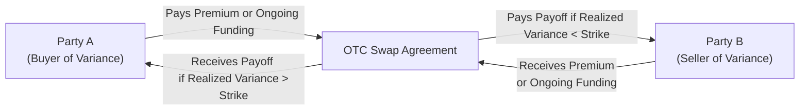

## Introduction

I remember having a chat with a colleague back in the day—let’s call him Jay—who was fascinated by the idea of “trading volatility directly,” not through a set of options but through a single, more streamlined contract. He was talking about variance and volatility swaps, and I admit, at first, I thought, “Well, that sounds a bit fancy.” But as we dug deeper, it became clear how these instruments allow investors to take direct positions on realized volatility, effectively sidestepping the messy path-dependence of dynamically rebalancing a standard options position. 

This section explores the subtle but crucial differences between variance and volatility swaps, how they’re structured, their valuation methods, and the reasons investors use them. We’ll also highlight common pitfalls, real-world examples, and best practices you can apply in a portfolio context—especially relevant if you’re studying advanced derivative strategies for the CFA® exam.

## Distinguishing Variance and Volatility Swaps

A variance swap is an over-the-counter (OTC) derivative that provides a payoff based on the difference between the realized variance of an underlying asset (such as an equity index) and a predetermined strike variance set at initiation. A volatility swap is similar, but its payoff is linked to realized volatility rather than realized variance.

• Variance Swap → Payoff ∝ (Realized Variance – Strike Variance)  
• Volatility Swap → Payoff ∝ (Realized Volatility – Strike Volatility)

While these instruments might sound practically identical, the payoff profiles differ because variance is the square of volatility. This means the variance swap payoff has a convex exposure to large moves in the underlying’s price—extreme movements have a proportionally greater effect on variance than on volatility alone. By contrast, a volatility swap’s payoff is linear in volatility. If the underlying experiences a massive jump, the variance swap holder might benefit more due to that convexity.

## Motivations for Using Variance and Volatility Swaps

Why enter into these swaps at all? Let’s take a look at some common motivations:

• Hedging: A portfolio manager concerned about a market crash might want to profit if volatility soars. A volatility swap can offset losses from a portfolio that tends to suffer in high-volatility regimes.  

• Speculating: Maybe you believe the market is underpricing upcoming turbulence. If realized volatility turns out higher than the market expects, you could gain on a buying position in a variance or volatility swap.

• Diversification: Volatility often has low correlation with traditional assets like equities or fixed income. Adding exposure to volatility can help smooth a portfolio’s overall returns.  

• Cost-Effective Exposure: Replicating volatility exposure using options can involve continuous delta-hedging or constructing complex “strips” of options across multiple strikes. Variance or volatility swaps are single instruments that deliver a direct exposure.

## How These Swaps Work

Below is a conceptual diagram (using Mermaid.js) to visualize the structure and cash flows of a typical variance swap contract.



• Party A believes variance will exceed the swap’s strike. Party A is “long variance.”  
• Party B believes variance will be below the strike and is effectively short variance.  
• At final settlement, the difference between realized variance and strike variance is multiplied by a notional factor.

## Payoff Structures and Simple Examples

### Variance Swap Payoff

Let:
- K² be the swap’s strike variance.  
- σ²(R) be the realized variance.  
- N be the notional amount (sometimes described as “variance notional”).

The payoff to the holder of a long variance swap position at maturity is often expressed as:


\text{Payoff} = N \times (\sigma^{2}(R) - K^2).


If you’re the buyer, you benefit when realized variance exceeds the strike. If the realized variance is less than the strike, you end up with a negative payoff—that is, you pay the seller.

### Volatility Swap Payoff

Similarly, for a volatility swap:


\text{Payoff} = \text{Notional} \times (\sigma(R) - K_\sigma),


where \\( \sigma(R) \\) is realized volatility and \\( K_\sigma \\) is the volatility strike set at initiation.

Often, the notional for a volatility swap is expressed in terms of “vega notional,” signifying that each percentage point of realized volatility above the strike is multiplied by a fixed dollar amount.

### Quick Numerical Example

Imagine an equity index currently showing an implied volatility environment around 20% annualized. You enter a 3-month volatility swap with a strike at 20% (annualized). Suppose your notional is \$1,000 per volatility point. Three months later, the realized volatility over that period is 25% (annualized). Then your payoff is:


\$1,000 \times (25\% - 20\%) = \$1,000 \times 5\% = \$50. 


If the underlying had been calmer than expected—say 18%—you’d lose:


\$1,000 \times (18\% - 20\%) = -\$20.


## Pricing and Valuation

### Replication of Variance

Remember from earlier derivatives chapters (e.g., the material in 4.8, “Volatility Trading with Options”) that volatility or variance exposure can be replicated by continuously rebalancing a portfolio of options of all strikes. In practice, you hold a strip of out-of-the-money calls and puts across the entire strike range, adjusting as the underlying price moves. This approach tries to replicate the payoff of realized variance.

One of the hallmark results in derivatives pricing is that the fair value of a variance swap can, in theory, be derived from the implied volatilities of standard options. The formula basically integrates the implied vol surface across strikes, applying certain weights. But we rarely compute it directly that way in day-to-day practice. Instead, banks quote variance swaps using an implied volatility level that’s consistent with the local volatility or implied volatility surface models.

### Volatility Risk Premium and Term Structure

If you expect realized volatility to be higher than the market’s implied forecast, you might want to go long a volatility or variance swap. However, keep in mind there’s typically a “volatility risk premium,” meaning implied volatility is often set above the average realized volatility. That premium compensates option sellers for the risk of extreme movements.

Term structure also plays a big role: Market participants might anticipate that near-term volatility is high but will revert over the long term. This can create an upward-sloping or downward-sloping implied vol curve, depending on current market sentiment.

### Convexity of Variance Versus Volatility

A big difference in pricing arises from how variance (σ²) grows compared to volatility (σ). Variance is convex, meaning that large price moves have an outsized impact. Thus, the fair strike for a variance swap often trades higher than the fair strike for a volatility swap, even if both are referencing the same “average implied volatility” level. This spread is sometimes referred to as the “convexity adjustment.”

### A Simple (Hypothetical) Pricing Approach in Python

Below is a toy code snippet for computing realized variance from historical data—imagine you’ve got daily data and want to see how your existing variance swap might settle. This is obviously simplified, but it gives a flavor of how practitioners handle realized volatility or variance calculations.

```python
import numpy as np

prices = [3000, 3020, 3010, 3030, 3100, 3080]

log_returns = [np.log(prices[i]/prices[i-1]) for i in range(1, len(prices))]
daily_var = [r**2 for r in log_returns]
realized_variance = np.mean(daily_var) * 252  # Annualize, assuming 252 trading days
realized_volatility = np.sqrt(realized_variance)

print("Realized Variance:", realized_variance)
print("Realized Volatility:", realized_volatility)
```

In an actual variance or volatility swap context, the payoff would reference this realized measure (up to certain definitions in the contract) minus the agreed-upon strike—multiplied by your notional.

## Implementation Aspects and Practical Considerations

### OTC Nature

Variance and volatility swaps are typically over-the-counter instruments, which means you’ll negotiate contract terms with a dealer. Elements like notional size, maturity, and settlement terms are customized. This flexibility is great, but it introduces counterparty risk. For that reason, many large financial institutions rely on credit support annexes (CSAs) and collateralization to reduce exposure.

### Discrete Observation and Settlement

Realized volatility or variance is calculated from periodic price observations. You’ll need to check carefully how your contract defines the sampling frequency (daily, weekly, or some other interval). Also, see whether dividends or corporate actions are accounted for in the underlying. A mismatch between your intended volatility measure and the contract’s actual definition can lead to unexpected payoffs.

### Common Pitfalls

• Underestimating tail risk: Variance swaps in particular can blow up (in a good way if you’re long, in a really painful way if you’re short) when the underlying has abrupt, large moves.  

• Overpaying for the volatility risk premium: If you repeatedly go long volatility or variance swaps, you might find that you’re paying implied volatility at a premium to what eventually realizes, especially in calmer markets.  

• Liquidity risk: In times of crisis, OTC markets can freeze or spreads can widen drastically. Exiting or rolling your swap might be expensive or difficult.

• Model mismatch: The replication-based pricing approach depends on the implied volatility surface. If your model doesn’t capture real-world dynamics (jumps, skew, term structure changes), your fair strike estimate could be off.

## Real-World Anecdotes and Best Practices

I once saw a portfolio manager who mainly traded equity index options pivot to variance swaps when she realized she was basically trying to replicate volatility exposure with a complicated patchwork of calls and puts. She found it more cost-effective to use a single variance swap that covered her full horizon. However, she also cautioned me that timing matters: if you jump in at a moment of market panic, the strike might be prohibitively high.

Best practice suggests:  
• Carefully weigh the implied volatility or variance level at inception.  
• Understand the shape of the implied volatility surface.  
• Use partial hedging strategies—sometimes you may want to offset a portion of your swap exposure with standard options.  
• Monitor your credit exposure to the dealer.

## Conclusion and Exam Tips

From a CFA exam perspective, especially at advanced levels, you should be prepared to:  
• Identify the difference between variance swaps and volatility swaps and explain how each is used in portfolio contexts.  
• Calculate a simple payoff for both instruments.  
• Explain the role of the volatility risk premium.  
• Discuss the practical replication of these swaps using options.  
• Understand how the convexity effect influences strike levels, especially for variance swaps.  

Remember, exam questions often test conceptual understanding. You could see scenario-based problems where you’re asked to choose between a variance swap and a volatility swap to hedge an anticipated spike in market turmoil. They might also push you to dissect the differences in payoff profiles or highlight common pitfalls.  

If you want to integrate these instruments into a broader risk-management framework, revisit your knowledge from other derivative sections in this text (including 4.8 on “Volatility Trading” and 6.1–6.4 on risk management basics). 

## Additional References

• Demeterfi, K., Derman, E., Kamal, M., and Zou, J. “A Guide to Volatility and Variance Swaps.” Journal of Derivatives, 1999.  
• Sinclair, Euan. “Volatility Trading.” Wiley.  
• CFA Institute. Official Curriculum: Advanced Derivative Strategies.  

## Test Your Knowledge on Variance and Volatility Swaps



### Which statement best characterizes the payoff of a variance swap?

- [ ] It is simply the difference between realized volatility and the strike volatility.  
- [ ] It is the sum of the underlying’s price changes over the contract period.  
- [x] It is proportional to the difference between realized variance and the strike variance.  
- [ ] It is proportional to the difference between implied variance and realized variance.  

> **Explanation:** Variance swaps settle on realized variance, which is the square of realized volatility. Their payoff is proportional to (Realized Variance – Strike Variance).

### Why does a variance swap often trade at a higher implied level than a volatility swap on the same underlying?

- [ ] Because the notional is larger on variance swaps.  
- [x] Because variance is convex and larger moves in the underlying have a disproportionately large effect on variance.  
- [ ] Because volatility is a linear measure of spread.  
- [ ] Because the term structure of interest rates is steeper for variance.  

> **Explanation:** Variance (σ²) grows faster than volatility (σ) in large moves, creating a convex effect. This often leads to a higher fair strike for the variance swap.

### When using a volatility swap to speculate on an increase in market turbulence, the payoff is generally highest if:

- [ ] The implied volatility is greater than the strike volatility.  
- [x] Realized volatility significantly exceeds the strike volatility.  
- [ ] The underlying asset’s price moves up substantially.  
- [ ] The realized variance is slightly less than the strike variance.  

> **Explanation:** The payoff on a long volatility swap is (Realized Volatility – Strike Volatility). If realized volatility ends up significantly higher than the swap’s strike, the payoff is maximized.

### In practice, the fair strike of a variance swap is often derived from:

- [x] Integrating implied volatilities across a wide range of strike prices.  
- [ ] The sum of all open interest in out-of-the-money puts and calls.  
- [ ] Historical volatility alone.  
- [ ] The correlation coefficient between the underlying’s returns and implied volatility.  

> **Explanation:** A common approach replicates the payoff of variance using a continuum of options, which requires integrating implied vol across strikes.

### Which of the following best describes the volatility risk premium?

- [ ] The difference between realized volatility and risk-free interest rates.  
- [x] The tendency for implied volatility to exceed subsequent realized volatility over time.  
- [ ] The premium paid on short-term put options during market crises.  
- [ ] The difference between forward volatility and spot volatility.  

> **Explanation:** The volatility risk premium represents the systematic reason implied volatility tends to quote above average realized volatility, compensating sellers of volatility for tail risk.

### In a volatility swap, the notional is often quoted in terms of:

- [ ] Delta.  
- [ ] Gamma.  
- [x] Vega.  
- [ ] Theta.  

> **Explanation:** Volatility swaps often specify a "vega notional” that indicates how much is gained or lost per percentage point change in volatility relative to the strike.

### Which of the following is true regarding the payoff for a variance swap?

- [x] Large deviations in the underlying’s price movements have a magnified effect compared to a volatility swap.  
- [ ] It is path-dependent and reacts only to negative price movements.  
- [x] It can exceed the payoff of a volatility swap if the underlying experiences extreme moves.  
- [ ] It always moves one-to-one with changes in implied volatility.  

> **Explanation:** Variance is σ², giving a convex payoff. In periods of extreme market moves, realized variance can spike significantly, yielding a larger payoff than a comparable volatility swap.

### A key risk when trading variance swaps is:

- [ ] Rebalancing risk due to delta drift.  
- [x] Counterparty risk from an OTC instrument.  
- [ ] Early exercise risk, as with American options.  
- [ ] Regulatory changes to margin requirements for listed futures.  

> **Explanation:** Variance and volatility swaps are OTC products, so they involve potential counterparty risk unless mitigated by collateral agreements.

### The difference between realized volatility and strike volatility in a volatility swap payoff is multiplied by:

- [ ] The underlying price.  
- [ ] The risk-free rate.  
- [x] The swap’s vega notional.  
- [ ] The implied volatility surface slope.  

> **Explanation:** The payoff is typically the difference between realized and strike volatility times the contract’s vega notional.

### True or False: A variance swap’s final settlement is based purely on realized variance, with no path dependence required in practice.

- [x] True  
- [ ] False  

> **Explanation:** Once the contract is set, the payoff depends strictly on the realized variance over the swap’s life. While replication of variance in theory can involve continuous trading of options, the contract’s actual payoff at settlement is based on the realized variance calculation as defined in the contract.


