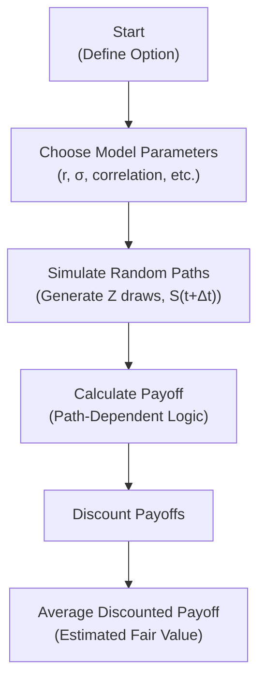

## Introduction
Sometimes, you encounter those tricky options—barrier options, Asian options, or lookback options—where the payoff depends on the path your underlying asset takes rather than just its value at maturity. When I first learned how to price these instruments, I remember thinking, “Um, how on Earth am I supposed to handle every twist and turn of the price path?” That’s where Monte Carlo simulations swoop in to save the day.

Monte Carlo simulation is a powerful technique that estimates an expected payoff by simulating the path of the underlying price thousands (or even millions) of times, then averaging and discounting the resulting payoffs. This approach is especially popular for complex, path-dependent derivatives for which simpler closed-form valuation models might be cumbersome or entirely unavailable under classical frameworks such as Black–Scholes or binomial trees.

In the context of the CFA curriculum (and, more broadly, advanced financial engineering), Monte Carlo methods are an indispensable tool. They allow us to incorporate real-world constraints like transaction costs, correlation among multiple risk factors, or even exotic payoff structures. So, let’s hop right in and explore how it works, some of the nitty-gritty details, and even how you might see it tested on the CFA exam.

## Why Monte Carlo for Complex Option Pricing?
You might ask: “Why not just keep using the binomial model or the Black–Scholes–Merton formula?” Indeed, both are valid approaches for certain classes of options. However:
• Path-Dependent Payoffs: Traditional models often rely on final asset price alone, but Asian, barrier, or lookback options depend on the entire price path.  
• Many Underlyings & Correlation: If the payoff depends on multiple, possibly correlated asset prices (e.g., in a basket option), modeling becomes tricky with simple closed-form solutions.  
• Custom Payoff Structures: Corporate or structured finance deals can have complicated payoffs that deviate from standard calls and puts.  

Monte Carlo methods can handle these situations by directly simulating the underlying asset’s price path over time (potentially across several different correlated assets) and then computing the payoff at each path’s end (or at key points along the path). While Monte Carlo can be computationally intensive, it is more flexible and can be more intuitive once you get the hang of it.

## Key Steps in Monte Carlo Simulation
Below is a conceptual roadmap of how you might set up a Monte Carlo simulation for a complex, path-dependent option.

### Step 1: Model the Underlying Price Dynamics
The first step is defining how your underlying asset price evolves. A popular choice is geometric Brownian motion (GBM) under a risk-neutral measure. If we denote S(t) as the asset price at time t, a standard (discretized) GBM model might look like:

S(t + Δt) = S(t) × exp[(r - 0.5σ²)Δt + σ√(Δt) × Z],

where  
• r is the risk-free interest rate,  
• σ is the volatility,  
• Δt is the discrete time step, and  
• Z is a random draw from a standard normal distribution.

In real financial practice, you may incorporate more sophisticated models—like stochastic volatility or jump-diffusion—depending on the complexity of your situation.

### Step 2: Generate Random Paths
Monte Carlo works by sampling many possible price paths. You do this by generating random shocks Z₁, Z₂, …, Zₙ over the option’s lifetime. Each path is a sequence of future asset prices from t = 0 to t = T (option maturity). Sometimes, I joke it’s like simulating thousands of “what-if” scenarios. The more simulations you run, typically, the better your estimate—though you also might double your computing bill!

### Step 3: Calculate Payoffs on Each Path
For each simulated path, calculate the option payoff. With a standard European call, that might just be max(S(T) - K, 0). But for a barrier option, you might do something like check if the path exceeded or fell below a certain boundary, altering the payoff accordingly. For Asian options, you might compute the average price across the path and see how that average compares to the strike.

### Step 4: Discount and Average
Once you have a payoff for each path, discount it to present value (at the risk-free rate, or an appropriate discount rate per IFRS or US GAAP conventions if you’re analyzing a more real-world scenario). Then, average these discounted payoffs across all paths. That’s your Monte Carlo estimate for the option’s fair value.

Here’s a short example in pseudocode/Python-like structure:

```python
import numpy as np

def monte_carlo_option_pricer(S0, K, r, sigma, T, steps, sims):
    dt = T / steps
    payoffs = []
    
    for _ in range(sims):
        S = S0
        for _ in range(steps):
            Z = np.random.normal()
            S = S * np.exp((r - 0.5*sigma**2)*dt + sigma*np.sqrt(dt)*Z)
        payoffs.append(max(S - K, 0))  # European Call Payoff
    
    discounted_average = np.exp(-r*T) * np.mean(payoffs)
    return discounted_average

fair_value = monte_carlo_option_pricer(S0=100, K=105, r=0.02, sigma=0.25, T=1, steps=252, sims=10000)
print("Estimated Fair Value: ", fair_value)
```

In this snippet, we simulate daily steps (≈ 252 trading days per year) over 10,000 random paths. Then we discount and average. Simple enough, right?

## Common Path-Dependent Options
Path-dependence is where Monte Carlo truly shines. Some big ones:

• Asian Options: The payoff depends on some average of the underlying asset’s price over the life of the option.  
• Lookback Options: The payoff may depend on the maximum or minimum price of the underlying observed during the option’s life.  
• Barrier Options: A payoff might become activated (knock-in) or destroyed (knock-out) if the underlying crosses a certain barrier level.  

All these derivatives rely on the entire price path rather than just the final price. Other pricing approaches (like closed-form formulas) can exist, but they’re often complicated or not well-defined for every payoff structure. Monte Carlo can handle these with minimal modifications.

## Variance Reduction Techniques
One challenge with Monte Carlo is that the accuracy of your result improves slowly—proportional to 1/√N, where N is the number of simulations. If you want more precision, you might need tens or hundreds of thousands of paths, which can be computationally heavy.

Fortunately, there are variance reduction methods to speed up convergence:

• Antithetic Variates: You generate a path with random draws Z, and another with -Z (the negative of the original draws). By pairing these, you often reduce the variance of the payoff estimate.  
• Control Variates: You compare your simulation to a known solution. For example, if you’re pricing a complex option with an embedded vanilla call structure, you can treat the vanilla call as a control variate.  
• Importance Sampling: Focus sampling on the most relevant regions of the underlying distribution to reduce the number of “wasted” paths.  

These approaches all share one neat goal: reduce the number of paths you need to run in order to gain an accurate estimate. If you’re an exam taker, you may see theoretical questions about how these techniques reduce variance or how they’re implemented in practice.

## Multi-Asset Correlated Simulations
Many real-world investments involve more than one risk factor. For instance, you might have a cross-currency barrier option where the payoff depends on both an equity index and an exchange rate, or on multiple correlated equity indices. In such cases, you need to model correlations among assets. The typical approach involves generating correlated random draws using a Cholesky decomposition of the covariance matrix.

Let’s say you have two correlated assets, S₁ and S₂. If their correlation is ρ, you can transform standard normals Z₁ and Z₂ so that:

Z′₂ = ρZ₁ + √(1 - ρ²) × Z₂,

then feed these Z′₂ and Z₁ into the asset price equations to impose correlation. 

This ability to incorporate correlation is a real plus of Monte Carlo. In the real world, especially under IFRS or US GAAP risk-disclosure guidelines, investors and compliance professionals often must demonstrate they understand how correlated risk factors might affect derivative valuations and capital requirements.

## Real-World Example (Barrier Option)
Imagine a scenario: your firm sells a down-and-out barrier call option on a tech stock that knocks out (expires worthless) if the stock price dips below 80. If you’re trying to price it with a standard Black–Scholes call formula, you’re ignoring the possibility of hitting that barrier. That’d be a big mistake.

Using Monte Carlo, you can simulate thousands of possible paths. If a path remains above 80 for the entire duration, it essentially behaves like a vanilla call. If it drops below 80 at any point, the option payoff is zero for that path. Then, as always, you discount and average. That’s your barrier option value.

## Customizing a Monte Carlo Approach
Monte Carlo frameworks aren’t limited to standard risk-neutral pricing. You could do real-world simulations for scenario analysis, or incorporate time-varying volatility (stochastic volatility models) or interest rates. For advanced practitioners, you might even run simulations under one measure for risk analysis (e.g., Value at Risk, or VaR) and another measure for pricing. The flexibility is nearly limitless—which is fantastic, but also can lead to complexity and computational overhead.

Here is a simple flowchart illustrating the basic structure of a Monte Carlo simulation for option pricing:



## Regulatory and Professional Standards
Although the CFA Program focuses mostly on the theory and practice of financial instruments, it also emphasizes ethics, professional conduct, and the importance of robust modeling. Under IFRS 9 or ASC 815 (US GAAP for derivatives), firms are required to disclose their derivative exposures and valuation methodologies. Monte Carlo is an accepted, transparent approach for complex derivatives, provided the modeling assumptions and results are clearly documented. Of course, the CFA Institute Code of Ethics and Standards of Professional Conduct would encourage you to communicate any limitations of the model clearly to clients or stakeholders, preventing misinterpretation.

## Limitations and Best Practices
No method is perfect. Monte Carlo can be time-consuming for extremely large simulations or quickly become a “black box” if the internal modeling structure is not communicated properly. Remote possibility tail events might still require specialized enhancements (like importance sampling or jump diffusion modeling). 

• **Computational Cost:** Running large numbers of paths can be expensive.  
• **Model Risk:** If your assumptions about volatility or correlation are off, your results may be misleading.  
• **Convergence Speed:** Even with variance reduction, you may need a lot of simulations.  

That said, best practices—such as using robust random number generators, validating your model against known closed-form solutions, and employing adequate variance reduction—go a long way in making Monte Carlo simulations accurate and credible.

## Conclusion and Further Reading
Monte Carlo simulations provide a powerful, flexible approach to pricing derivatives and other complex financial instruments. They allow you to handle path dependence, correlation across assets, unusual payoff features, and scenario-based analyses in a straightforward, if computationally intensive, manner. As a result, Monte Carlo is a mainstay in both academic research and real-world risk management.

For more depth on the subject, consider these references:

• Glasserman, Paul. “Monte Carlo Methods in Financial Engineering.” Springer.  
• Boyle, Phelim. “Options: A Monte Carlo Approach.” Journal of Financial Economics, 1977.  
• Jäckel, Peter. “Monte Carlo Methods in Finance.” Wiley.  

## Final Exam Tips
• Understand the Conceptual Steps: The CFA exam might not expect you to churn out full-blown code, but you should know how the process works—generate paths, compute payoffs, discount, average.  
• Know When (and Why) Monte Carlo Is Used: Especially for path-dependent or multi-asset problems.  
• Be Ready for Variance Reduction: You should know how antithetic variates or control variates reduce sampling error.  
• Correlation Matters: If you see a multi-asset derivative, be prepared to factor in correlations using a correlation matrix or Cholesky decomposition.  
• Address Model Risk: The Code and Standards require you to understand and communicate assumptions and limitations.  
• Practice: Work through examples of barrier and Asian options. Many sample exam questions revolve around these.  

-----

## Test Your Knowledge: Monte Carlo Option Pricing



### Which of the following is a key advantage of using Monte Carlo methods for complex option pricing?

- [x] They can price path-dependent options even when closed-form solutions are unavailable.
- [ ] They eliminate all uncertainties in the pricing model.
- [ ] They guarantee real-world accuracy without model validation.
- [ ] They require fewer computational resources than binomial models.

> **Explanation:** Monte Carlo simulations handle various path-dependent and multi-asset derivatives for which closed-form solutions are unavailable, though they do require significant computational resources and thorough model validation.

### Which step typically happens last in a Monte Carlo simulation for option pricing?

- [ ] Generating random draws from a distribution.
- [ ] Simulating asset price paths.
- [x] Discounting and averaging the simulated payoffs.
- [ ] Determining the correlation structure among variables.

> **Explanation:** After simulating numerous paths and computing their payoffs, you discount them to present value and take the average of those discounted payoffs to arrive at the estimated option value.

### What is a primary reason to apply variance reduction techniques such as antithetic variates?

- [x] To lower the variance of Monte Carlo estimates and achieve faster convergence.
- [ ] To eliminate all randomness from the simulation.
- [ ] To ensure perfect correlation among assets.
- [ ] To expand the number of simulations needed.

> **Explanation:** Variance reduction techniques improve the precision of Monte Carlo simulation results, helping you get accurate estimates with fewer simulations.

### In pricing a barrier option using Monte Carlo, how is the barrier condition typically accounted for?

- [ ] By ignoring any path behavior that crosses a threshold.
- [x] By checking at each time step if the underlying has hit or missed the barrier.
- [ ] By setting the barrier level only at final maturity.
- [ ] By applying immediate payoff once the barrier is breached.

> **Explanation:** Barrier options knock in or out when the price crosses a specified barrier. In a Monte Carlo simulation, you must track the price path at each time step to see if the barrier triggers.

### Which of the following best describes the role of a correlation matrix in multi-asset Monte Carlo simulations?

- [ ] It ensures each asset’s path remains uncorrelated.
- [x] It allows assets to be simulated with realistic dependencies among random draws.
- [ ] It prevents changes to risk-free rates during simulation.
- [ ] It restricts the simulation to a single time step.

> **Explanation:** A correlation matrix is essential for capturing the realistic relationships among asset returns. You typically use matrix decomposition (like Cholesky) to generate correlated random draws.

### Which statement best represents the relationship between the number of Monte Carlo simulations (N) and the standard error of the estimated option value?

- [ ] The standard error grows in proportion to N.
- [ ] The standard error decreases in proportion to N.
- [x] The standard error decreases in proportion to 1/√N.
- [ ] The standard error is unaffected by N.

> **Explanation:** The accuracy of a Monte Carlo simulation improves with the square root of the number of simulations. Doubling N roughly reduces the standard error by a factor of 1/√2.

### Why might a practitioner use a control variate approach in Monte Carlo pricing?

- [x] To compare a complex payoff with a simpler, well-known payoff to reduce variance.
- [ ] To eliminate correlation among multiple assets.
- [ ] To randomly discard paths that have undesirable outcomes.
- [ ] To remove the discounting step altogether.

> **Explanation:** The idea is to use a correlated, simpler instrument (whose value is known analytically) as a “control” to reduce the variance of the simulated price of the more complex instrument.

### In the context of IFRS or US GAAP, what is a key best practice when using Monte Carlo for fair value disclosures?

- [ ] Presenting the simulation as unnecessary due to internal modeling improvements.
- [x] Clearly documenting assumptions, correlations, and limitations of the model.
- [ ] Using only one path if that path seems most likely.
- [ ] Avoiding mention of computational complexity to keep reports concise.

> **Explanation:** Under accounting standards, transparency in disclosures—including assumptions, risk factors, and model limitations—is crucial to maintaining ethical and professional conduct.

### When simulating a stochastic process for an exotic option, which of the following is most crucial for capturing tail events accurately?

- [ ] Using fewer paths but longer time intervals.
- [ ] Relying exclusively on geometric Brownian motion with no modifications.
- [x] Ensuring the model and distribution assumptions realistically capture fat tails or jumps.
- [ ] Discounting payoffs at a subjective rate.

> **Explanation:** If an option’s risk is sensitive to rare but high-impact events, the model (and distribution assumptions) must reflect that. Sometimes jump diffusion or alternative distributions may be necessary.

### True or False: Monte Carlo simulation can be used to price an option whose payoff is based on the average exchange rate observed over the life of the contract.

- [x] True
- [ ] False

> **Explanation:** Yes, that’s essentially an Asian-style approach applied to exchange rates. The ability to simulate the path of the exchange rate at discrete intervals and average it is precisely what Monte Carlo does well.


