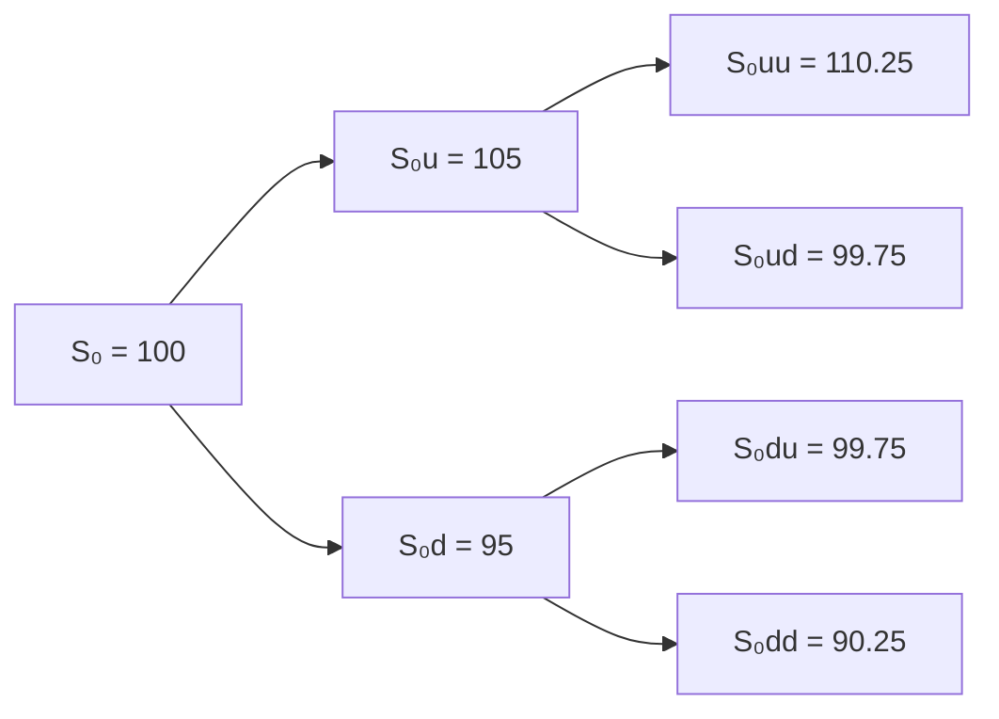
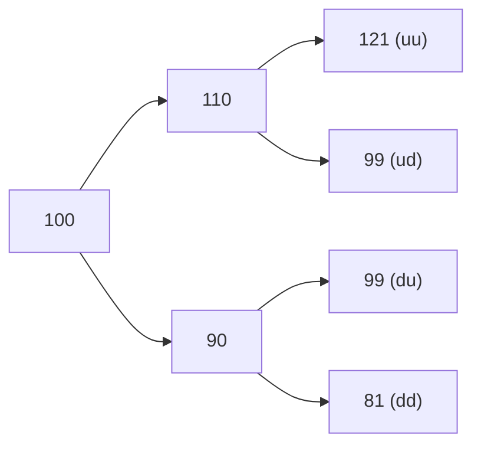

## Introduction

Have you ever wondered how to handle an option that you can exercise at any point up until expiration? That’s precisely the challenge with American-style options. While European-style options permit exercise only at expiration, American-style options add a little twist (and a bit of complexity) because early exercise might be optimal under certain circumstances. If you’ve ever thought, “Well, how do we account for that added flexibility?” you’re in the right place.

Let’s start by recalling that earlier in this chapter, you learned how to price options using a simple one-period binomial model (refer back to Section 10.3 for a refresher). The multi-period binomial approach just extends that idea over multiple steps. But with American-style options, we have to incorporate the possibility of early exercise at each node in that tree. In other words, at each step, we check whether the intrinsic value of immediately exercising actually beats the “hold and continue” value. That’s the gist of it, but let’s dig in deeper.

## Core Concepts and Recap

### American-Style Versus European-Style

• European-Style: Exercise allowed only at maturity.  
• American-Style: Exercise allowed any time up to (and including) the expiration date.

For American options, you can exercise when it’s profitable to do so, perhaps if there’s a large dividend that’s about to be paid on the underlying security and you hold a call, or if you have a put and the underlying’s price takes a steep nosedive earlier than your expiration date. The presence of that early exercise right creates an “early exercise premium,” which is extra value beyond what a purely European option might have under the same parameters.

### Multi-Period Binomial Trees

You can think of a multi-period binomial tree as an iterative extension of the single up/down step approach from the one-period binomial model. Over multiple steps:

1. The underlying asset price can go up or down at each discrete interval.  
2. These movements typically “recombine” so that an up-move followed by a down-move ends up at the same price node as a down-move followed by an up-move.  
3. At each node (date), the option value is the discounted expected value under the risk-neutral measure—or the intrinsic value if early exercise is more advantageous.  

By the final step, we arrive at a tree of possible asset prices as well as a corresponding tree of option payoffs. Then, we use backward induction to discount these payoffs and check for early exercise possibilities.

## Building the Multi-Period Binomial Tree

Let’s get a little more practical. Suppose you want to model a three-period binomial tree, each period being, say, one month long (so total life is three months). You’ll specify:

• The current price of the underlying (S₀).  
• The up factor (u) and down factor (d).  
• The risk-free rate (r) for each period.  
• Possibly a dividend yield (q) if the underlying is a dividend-paying stock.

### Example Setup

Imagine the stock is at $100 today. For each one-month step:

- We let u = 1.05 (meaning a 5% up-move),  
- and we let d = 0.95 (meaning a 5% down-move),  
- The monthly risk-free rate might be 1%.

So, if the stock goes up during the first period, at the next node it’s at $105. If it goes down, it’s at $95. Then from $105, it can go up to $110.25 or down to $99.75, and so on.

Let’s illustrate a two-period version of this tree for simplicity. A three-period tree is similar—just one more step.

Below is a sample Mermaid diagram showing a two-period binomial price tree for the underlying:



Notice how the middle nodes E and F both end up at the same price 99.75. That’s the “recombining” part.

## Discounting and Risk-Neutral Valuation

Within each step, we typically assume risk-neutral probabilities because that approach (developed by Cox, Ross, and Rubinstein in their 1979 paper) simplifies pricing. The idea is that, under the risk-neutral measure, the expected growth rate of the asset is the risk-free rate.

If we let Δt be the length of each period, the risk-neutral probability p is usually:


p = \frac{e^{(r - q)\Delta t} - d}{u - d}


where:  
- \\( r \\) is the risk-free rate,  
- \\( q \\) is the continuous dividend yield (if any),  
- \\( u \\) is the up-factor,  
- \\( d \\) is the down-factor,  
- \\( \Delta t \\) is the length of each period in years.

If you’re ignoring dividends, you’d just set \\( q = 0 \\). Then, the expected (risk-neutral) value of the option at each node is:


\text{Option Value} = e^{-r\Delta t} \bigl( p \cdot V_\text{up} + (1-p) \cdot V_\text{down} \bigr)


where \\( V_\text{up} \\) is the option payoff in the up state at the next step, and \\( V_\text{down} \\) is the payoff in the down state.

## American Option Payoff with Early Exercise Check

Here’s the fundamental difference for an American-style option: After you compute that “hold” value from the risk-neutral approach, you must compare it to the immediate exercise payoff (a.k.a. intrinsic value). The node’s final value is:


\text{Node Value} = \max(\text{Intrinsic Value}, \text{Hold Value})


For a call, the intrinsic value at any point is \\(\max(S - K, 0)\\), where S is the underlying price at that node, and K is the strike price. For a put, it’s \\(\max(K - S, 0)\\).

### Step-by-Step

1. **Construct the Tree for the Underlying**  
   Start with the current price \\( S_0 \\). Multiply by \\( u \\) or \\( d \\) to get the next-step prices. Continue outward until you reach the final step (expiration).  

2. **Compute Payoffs at Expiration**  
   For a call, payoff at final nodes = \\(\max(S_T - K, 0)\\). For a put, payoff at final nodes = \\(\max(K - S_T, 0)\\).  

3. **Work Backwards**  
   For each node in the penultimate step (and all prior steps), compute the “hold” value by discounting the next-step’s up/down payoffs with the risk-neutral probabilities.  

4. **Compare With Intrinsic Value**  
   At each node, set node value = \\(\max(\text{Hold}, \text{Intrinsic})\\).  

5. **Arrive at the Present**  
   The value at \\( S_0 \\) (the root node) is the price of the American-style option.  

## Practical Illustrations

### Example: American Put on a Dividend-Paying Stock

Imagine you hold an American put on a stock that pays a significant dividend in the middle of the option’s life. The presence of that dividend can cause the stock price to drop ex-dividend, which might trigger an earlier optimal exercise for the put. Let’s do a quick numeric illustration—just at a high level.

• Current stock price: $50  
• Strike: $52  
• Dividend: $1 (expected halfway to expiration)  
• Up-factor: u = 1.05, down-factor: d = 0.95, risk-free rate is 2% per period.  

In the node just before the dividend is paid, if you anticipate the stock’s price will drop by $1 on the ex-dividend date, you might find that the immediate exercise (i.e., collect $52 - stock price right now) is more profitable than waiting. This is especially true if the probability-weighted payoff after the price drop is smaller. The multi-period binomial tree helps you see precisely at which node early exercise becomes optimal.

### Case Study: Calls on High Dividend-Paying Stocks

If you have a call on a high dividend-paying stock, typically you might consider early exercise just before a big dividend if the call’s time value is less than the dividend you would gain by owning the stock. Using the binomial tree, at the node immediately preceding the ex-dividend date, you compare the “hold” value to the value if you exercise right away (which means you’d own the stock and capture the dividend). If that dividend is large enough, the early exercise might be worthwhile.

## Diagram: Two-Period American Put Valuation

Let’s illustrate a simple two-period American put tree with some actual numbers. Assume:

- \\( S_0 = 100 \\)  
- \\( K = 100 \\)  
- \\( u = 1.10 \\), \\( d = 0.90 \\)  
- \\( r = 5\% \\) per period (assume discrete compounding for simplicity)  

We’ll ignore dividends here, but the process is the same if a dividend is present (just adjust your risk-neutral probability and be extra vigilant about the ex-dividend node).

1. Compute risk-neutral probability:  
   
   p = \frac{(1+r) - d}{u - d} = \frac{1.05 - 0.90}{1.10 - 0.90} = \frac{0.15}{0.20} = 0.75
     

2. Stock price evolution over two periods:



3. At expiration (the second period), your put payoff is \\(\max(K - S_2, 0)\\):  
   - Node D (S=121): \\(\max(100 - 121,0) = 0\\)  
   - Node E (S=99): \\(\max(100 - 99,0) = 1\\)  
   - Node F (S=99): \\(\max(100 - 99,0) = 1\\)  
   - Node G (S=81): \\(\max(100 - 81,0) = 19\\)  

4. Now step back to the first period:  
   - At B (S=110), the “hold” value is the discounted expected payoff:  
     
     V_B = \frac{1}{1+r} \Bigl[p \cdot V_D + (1-p) \cdot V_E \Bigr] 
          = \frac{1}{1.05} \Bigl[0.75 \times 0 + 0.25 \times 1 \Bigr] 
          = \frac{0.25}{1.05} 
          \approx 0.238
       
     The intrinsic value at B is \\(\max(K - S, 0) = \max(100 - 110,0) = 0\\).  
     So, \\(\max(0.238, 0) = 0.238\\). So no early exercise (it’s worthless to exercise the put at 110).  
   - At C (S=90), the “hold” value is:  
     
     V_C = \frac{1}{1.05} \Bigl[0.75 \times V_F + 0.25 \times V_G \Bigr] 
          = \frac{1}{1.05} \Bigl[0.75 \times 1 + 0.25 \times 19 \Bigr] 
          = \frac{1}{1.05} \Bigl[0.75 + 4.75 \Bigr] 
          = \frac{5.50}{1.05}
          \approx 5.238
       
     The intrinsic value at C is \\(\max(100 - 90, 0) = 10\\).  
     Compare 10 with 5.238 → The maximum is 10. That means it’s better to exercise at node C immediately rather than hold.  

5. Finally, compute at node A (the root, S=100).  
   - The “hold” value if you do not exercise:  
     
     V_A = \frac{1}{1.05} \Bigl[0.75 \times 0.238 + 0.25 \times 5.238 \Bigr]
          = \frac{1}{1.05} \Bigl[0.1785 + 1.3095 \Bigr]
          = \frac{1.488}{1.05}
          \approx 1.417
       
     The intrinsic value at A is \\(\max(100 - 100, 0) = 0\\).  
     So the option is worth \\(\max(1.417,0)=1.417\\) at the root.  

Hence, the two-period American put is valued at around $1.417. Notice how we had an early exercise at node C, because the intrinsic value (10) was greater than the hold value (5.238). That’s the key difference from a European option.

## Implementation Note (Optional)

If you’re comfortable with Python, here’s a small snippet that outlines how you might compute a multi-period binomial tree for an American put:

```python
import math

def american_put_binomial(S0, K, r, u, d, periods):
    # Risk-neutral probability
    p = (1 + r - d) / (u - d)
    discount = 1 / (1 + r)

    # Initialize asset prices at maturity
    stock_prices = [S0 * (u**(periods - i)) * (d**i) for i in range(periods + 1)]
    
    # Option payoffs at maturity
    option_values = [max(K - price, 0) for price in stock_prices]

    # Step backward
    for step in range(periods - 1, -1, -1):
        for i in range(step + 1):
            hold = discount * (p * option_values[i] + (1 - p) * option_values[i + 1])
            current_price = S0 * (u**(step - i)) * (d**i)
            exercise = max(K - current_price, 0)
            option_values[i] = max(hold, exercise)
    
    return option_values[0]

value = american_put_binomial(S0=100, K=100, r=0.05, u=1.10, d=0.90, periods=2)
print("Two-period American put value:", value)
```

This snippet is just a demonstration; you can adapt it for continuous compounding, incorporate dividends, or refine the numeric approach.

## Common Pitfalls and Best Practices

- Overlooking Dividends: If your underlying pays dividends, be sure to reflect them either by adjusting the risk-neutral probability or by explicitly adjusting the stock price after ex-dividend.  
- Ignoring Early Exercise Potential: Some folks forget to compare intrinsic value vs. hold value at each node. That might significantly misprice an American put or call.  
- Mis-Specifying u and d: Make sure your up and down factors align with the volatility you expect for the underlying and the time step length.  
- Too Few Steps: A binomial approach gets more accurate as the number of steps grows, but more steps also increase computational complexity. There’s a trade-off.  

## Relationship to Other Topics

Recall back in Section 10.1, we discussed the main determinants of option value (underlying price, strike, volatility, etc.). In multi-period binomial models, those same factors come into play but in a more granular way. Also, connecting to “4.5 Option Strategies and Payoff Diagrams,” you could use the binomial approach to track the payoff paths of advanced strategies (like straddles or collars) if you break them down into calls and puts.

## Exam Tips for CFA Candidates

1. Show Your Work: In a constructed-response question, lay out the binomial tree, each node’s payoff, discounting, and your final comparison (intrinsic vs. hold).  
2. Understand Early Exercise Logic: This is a high-yield exam point—particularly for puts on dividend-paying stocks. They love to ask: “Why might an early exercise be optimal here?”  
3. Time Management: Binomial trees can be time-consuming in an exam setting. Practice sketching tree steps quickly and systematically.  
4. Be Comfortable with Simplifications: The exam might give you easy up/down factors (like ±10%) and a nice round risk-free rate. That’s to ensure your arithmetic is straightforward—focus on concept mastery.  
5. Tie to Risk Management: If you recall from Chapter 6’s discussion on derivatives usage, being able to precisely price American options helps in hedging strategies.  

## References

- Cox, J., Ross, S., & Rubinstein, M. (1979). “Option Pricing: A Simplified Approach.” Journal of Financial Economics.  
- Hull, J. C. (various editions). “Options, Futures, and Other Derivatives.”  
- CFA Institute Level I Curriculum, “Binomial Trees and American-Style Options” sections.  

---

## Test Your Knowledge: Multi-Period Binomial Trees for American Options



### In a multi-period binomial model, which statement best describes the process of valuing an American-style option at each intermediate node?

- [x] Compare the intrinsic value to the discounted expected value and choose the higher.
- [ ] Use only the discounted expected value from the next step.
- [ ] Take the weighted average of intrinsic value and the expected value.
- [ ] Early exercise is never optimal, so ignore intrinsic value at intermediate nodes.

> **Explanation:** American-style options can be exercised early. Thus, at each node, you must compare the intrinsic value with the “continuation” (or hold) value and choose the higher.


### Which factor primarily distinguishes American-style option pricing from European-style option pricing in the binomial model?

- [x] The possibility of early exercise at each node.
- [ ] The underlying stock’s volatility changes with time.
- [ ] The requirement to incorporate continuous compounding.
- [ ] The discount factor being different for each step.

> **Explanation:** European options can only be exercised at maturity, while American options allow the holder to exercise at any node throughout the life of the option.


### Suppose you have an American put on a dividend-paying stock. When might early exercise be most beneficial?

- [x] Just before an ex-dividend date if the stock price will drop significantly due to the dividend.
- [ ] Right after the dividend is paid, when the price is already adjusted downward.
- [ ] Only at maturity, since early exercise never has any advantage for puts.
- [ ] Immediately after buying the option.

> **Explanation:** For a dividend-paying stock, the stock price tends to drop by the dividend amount on the ex-dividend date. For a put option, an early exercise might be beneficial if the price is sufficiently high before that drop.


### In a two-period binomial model with up-factor u=1.10 and down-factor d=0.90, if the intrinsic value is greater than the risk-neutral estimated continuation value at a mid-node, what should the option holder do?

- [x] Exercise early at that mid-node.
- [ ] Keep holding the option to the next node.
- [ ] Sell the option in the market.
- [ ] Switch the option to European style.

> **Explanation:** American option holders should exercise early if the immediate exercise (intrinsic) value is higher than the expected continuation value.


### Which of the following best describes a recombining binomial tree?

- [x] An up-then-down path leads to the same price node as a down-then-up path.
- [ ] Each upward movement has no relationship with the subsequent downward movement.
- [ ] The node values always decrease one step at a time.
- [ ] The node values never repeat across multiple steps.

> **Explanation:** In a recombining tree, an up-move followed by a down-move results in the same price as a down-move followed by an up-move, which keeps the tree more manageable.


### If we denote the risk-neutral probability by p, which is the correct formula under continuous dividend yield q?

- [x] p = (e^( (r - q)Δt ) - d) / (u - d)
- [ ] p = ( (u - d) - (r - q)) / Δt
- [ ] p = (1+r - q) / (u + d)
- [ ] p = e^(r - q) × (d - u)

> **Explanation:** For a dividend yield q, the risk-neutral probability is adjusted by using e^((r - q)Δt) in place of e^(rΔt).


### When computing the value of an American put option in a multi-period binomial tree, which step is unique (compared to a European put)?

- [x] Each intermediate node requires comparing the hold value to the intrinsic value.
- [ ] Setting terminal payoffs based on (K - S_T).
- [ ] Calculating risk-neutral probabilities over multiple periods.
- [ ] Discounting at the risk-free rate.

> **Explanation:** European and American options share the same terminal payoff and discounting method. The unique feature of the American option is checking for early exercise at each node.


### A key advantage of using a multi-period binomial tree, rather than a single-period model, is:

- [x] It allows for more realistic modeling of price evolution and multiple early exercise points.
- [ ] It avoids the need for risk-neutral probabilities.
- [ ] It guarantees a higher option value than a single-period model.
- [ ] It removes all volatility assumptions from the model.

> **Explanation:** A multi-period framework captures multiple steps in price evolution and multiple opportunities for early exercise, yielding a more accurate reflection of the option’s value.


### In practice, how can one increase the accuracy of a binomial model for American options?

- [x] Use more time steps in the tree.
- [ ] Use fewer time steps for clarity.
- [ ] Eliminate dividends to reduce complexity.
- [ ] Adopt a fixed, single-step approach.

> **Explanation:** More time steps provide a finer approximation of the continuous price path, improving accuracy. However, it also increases computational effort.


### True or False: For an American call on a non-dividend-paying stock, early exercise is never optimal.

- [x] True
- [ ] False

> **Explanation:** For a non-dividend-paying stock, the call option’s time value typically exceeds any immediate exercise value. Hence, early exercise is generally not optimal for American calls if there are no dividends.


