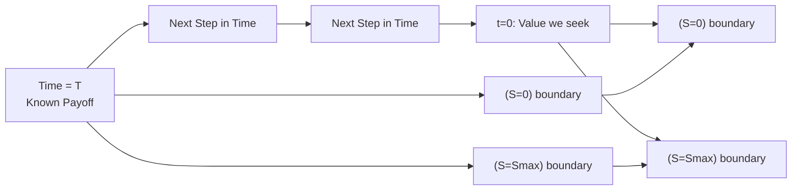

## Introduction and Motivation

Well, let’s start with a tiny personal anecdote. The first time I tried coding a finite difference method (FDM) for option pricing, I spent a solid hour wondering why my results were bouncing all over the place—turns out I’d reversed the sign on a boundary condition, and the entire grid solution went haywire. Not my proudest moment, but it taught me how crucial setup can be when we discretize partial differential equations (PDEs). In the context of option pricing, FDMs are among the most systematic numerical methods we can use to solve PDEs (particularly the Black–Scholes PDE) to find how an option’s price evolves over time.

Where does this all fit into the grand scheme of derivatives pricing? In earlier sections (see 10.3 Binomial Option Pricing Model and 10.4 Risk-Neutral Valuation), we introduced discrete-time approximations and continuous-time frameworks. Finite difference techniques serve as a bridge between a purely continuous PDE approach (like the Black–Scholes–Merton model) and the more discrete lattice-based binomial or trinomial trees. FDMs let us handle various complexities like dividends, early exercise, or time-dependent volatility.

Below, we’ll explore the key elements of FDMs for option pricing: from why we take the PDE approach, to boundary conditions, to the three main solution methods. Our aim is to help you gain both intuitive and technical mastery.

## Overview of the Black–Scholes PDE

The starting point for FDM pricing is the continuous-time Black–Scholes PDE. For a non-dividend-paying underlying stock, the PDE for a European call option V(S, t) can be written as:


\frac{\partial V}{\partial t} + \frac{1}{2}\sigma^2 S^2 \frac{\partial^2 V}{\partial S^2} + rS \frac{\partial V}{\partial S} - rV = 0,


where:  
• S is the underlying asset price.  
• t is time.  
• σ is the volatility of the underlying.  
• r is the risk-free interest rate.  
• V(S, t) is the option’s value at price S and time t.

For an American-style option, the PDE is the same in the region where the option is alive (i.e., it’s not yet optimal to exercise). However, we incorporate an early exercise condition that states:


V(S, t) \geq \text{Intrinsic Value}(S, t).


In other words, if you can do better by exercising than holding onto the option, you’d typically choose to exercise for an American option. The tricky part is weaving that condition into our numerical method.

## Discretizing the Domain

Finite difference methods start by chopping up both the price axis (S) and the time axis (t) into small increments. Then, we approximate the derivatives appearing in the PDE by using finite difference expressions. Eventually, we solve a grid of equations to get the option price at each (S, t) node.

### The Grid Layout

We define a grid for S from 0 to some maximum price Smax. Time runs backward from T (the option’s maturity) to 0. Our grid might look something like:

• ΔS: the step size (increments) in the asset price dimension.  
• Δt: the step size in the time dimension.

When t = T (the final time in backward sense), we know the “terminal condition” (the payoff). For a call option:


V(S, T) = \max(S - K, 0).


For a put option:


V(S, T) = \max(K - S, 0).


At S = 0 or S = S_\mathrm{max}, we define boundary conditions that reflect how an option’s value should behave at those extremes.

## Mermaid Diagram of a Finite Difference Grid

Below is a simplified illustration of a finite difference grid in time (vertical axis) and stock price (horizontal axis). Each node represents the approximate option value at that node’s (S, t). We solve from top (terminal conditions at T) down to bottom (option value at t=0).



At each discrete time slice, we move backward in time from the known payoff at T toward 0. For American options, we might do an extra step at each node to enforce the early-exercise condition.

## The Three Main Approaches: Explicit, Implicit, and Crank–Nicolson

Now that our domain is chunked into a grid, how do we handle the PDE? Finite difference approximations replace derivatives with differences between adjacent grid points. Let’s loosely define them:

1. Δx = xᵢ₊₁ - xᵢ for the first derivative (x being a general variable like S or t).  
2. Higher derivatives can be approximated similarly, e.g. (∂²V / ∂S²).

### Explicit Method

The explicit method basically says:  
“Take your PDE, rearrange it so that the next step in time is a function of the current step’s known values.”  

This yields a direct formula for Vᵏ₊₁ (the value at the next time step) in terms of Vᵏ at the current time. The advantage? It’s super easy to implement: no complicated matrix inversions needed. One might code it in just a few lines in Python. The disadvantage? It can suffer from numerical instability if Δt and ΔS are not chosen carefully. Often, you get a condition like Δt ≤ C(ΔS)² for some constant C if you want to keep your solution from blowing up.

### Implicit Method

The implicit method rearranges the PDE so that:  
“Current step in time is a function of the unknown next step values.”  

Yes, that means we have a system of linear equations to solve each time step. That’s more computationally expensive—but the upside is better numerical stability. You can typically take larger time steps without everything going bananas. Implicit schemes often come in handy in multi-factor PDEs or when you want to handle large S ranges effectively.

### Crank–Nicolson

The Crank–Nicolson method is a classic blend—well, a 50% explicit, 50% implicit compromise:


V^{k+1/2} = \frac{1}{2}(\text{Explicit Step}) + \frac{1}{2}(\text{Implicit Step}).


It’s more stable than the explicit approach and often yields better accuracy than the fully implicit method for many problems in finance. However, you still have to solve a linear system at each time step (the implicit portion demands it). It’s quite popular for pricing, especially if your main worry is second-order accuracy in both time and S.

## Incorporating Boundary Conditions

Boundary conditions can make or break your solution. You usually define them at:

• S = 0: For a call, the value is about 0 if it’s worthless to buy the underlying at 0. For a put, you might want to reflect that V(0, t) = K·e⁻ʳᵗ (the approximate PV of the strike if you can exercise before maturity, though more precisely for American puts, it’s often near K).  
• S = S_\mathrm{max}: If S_\mathrm{max} is large enough, the call behaves like S - (present value of K), but we often just fix a large boundary that ensures the option payoff is trivially in-the-money.  

And at t = T, you know the terminal payoff from the option’s definition. For American options, each time step you do:


V(S, t) = \max \bigl( V_\text{continuation}(S, t), \text{Intrinsic Value}(S, t) \bigr).


If the intrinsic value is higher, you override your solution with that immediate exercise payoff.

## Advantages of Finite Difference Methods

• Natural handling of early exercise. Whether it’s an American put or a Bermuda-style call, you can slip in the “take the max of hold or exercise” condition at each node.  
• Flexible with dividends. You can incorporate discrete or continuous dividend yields by adjusting the PDE or the payoff at ex-dividend times.  
• Varying volatility structures or local volatility models can be inserted by changing σ = σ(S, t).  
• Well-established convergence theory: as ΔS, Δt → 0, your solution typically converges to the exact PDE solution.  

## Disadvantages and Potential Pitfalls

• Numerical stability can be a headache—especially for the explicit method.  
• Complex boundary conditions or multiple underlying factors can lead to large memory requirements.  
• It can be slower than closed-form solutions (where those exist) or some advanced approximation methods.  
• A poor choice of Smax can cause errors, particularly if the underlying can jump or if it’s quite volatile.  
• If you implement an early exercise condition incorrectly, you can get big, systematic mispricings.

I recall messing up early exercise logic once in a project: I forgot to apply the “max” condition at each node for an American put, so the solution was basically the European put’s price—way off for deep in-the-money scenarios.

## Practical Implementation Example in Python

Below is a concise example of building an explicit finite difference approach for a simple American put option. This skeleton is by no means production-ready, but it’ll give you a sense of typical steps.

```python
import numpy as np

S_max = 200.0
K = 100.0
r = 0.05
sigma = 0.20
T = 1.0
num_S_steps = 200
num_t_steps = 200

dS = S_max / num_S_steps
dt = T / num_t_steps

S_vals = np.linspace(0, S_max, num_S_steps + 1)
V = np.zeros((num_t_steps + 1, num_S_steps + 1))

V[-1, :] = np.maximum(K - S_vals, 0)

for i in range(num_t_steps + 1):
    # At S=0, put is worth K (un-discounted in naive approach)
    V[i, 0] = K
    # At S=S_max, put is almost worthless
    V[i, -1] = 0

for n in reversed(range(num_t_steps)):
    for i in range(1, num_S_steps):
        a = 0.5 * dt * (sigma**2 * i**2 - r * i)
        b = 1 - dt * (sigma**2 * i**2 + r)
        c = 0.5 * dt * (sigma**2 * i**2 + r * i)
        
        V[n, i] = a * V[n+1, i-1] + b * V[n+1, i] + c * V[n+1, i+1]
        
        # Early exercise condition
        exercise_val = max(0, K - (i * dS))
        V[n, i] = max(V[n, i], exercise_val)
```

Points to note:  
• This is a purely explicit scheme with potential numerical stability constraints.  
• For real production or exam contexts, you might prefer Crank–Nicolson to reduce error.  
• The boundary condition at S=0 is set directly to K, ignoring discounting—some folks discount it, some prefer a more advanced approach.  

## Real-World Considerations

When you bring dividends, time-varying rates, or local volatility surfaces into the picture, the PDE changes shape. You’ll have extra or modified terms in the PDE, but the same finite difference discretization steps apply:

1. Carefully define your PDE.  
2. Set boundary and terminal conditions.  
3. Discretize in time and space.  
4. Solve iteratively, applying an “early exercise or hold” condition if needed.  

For American options on dividend-paying stocks, you might adjust the PDE to account for a continuous dividend yield \\( q \\):


\frac{\partial V}{\partial t} + \frac{1}{2}\sigma^2 S^2 \frac{\partial^2 V}{\partial S^2} + (r - q)S \frac{\partial V}{\partial S} - rV = 0.


Everything else remains conceptually the same.

## Common Mistakes to Avoid

• Not making Smax large enough. If an option is deep in-the-money for calls, the boundary “fakes out” the PDE solution, leading to a mispricing.  
• Overly large Δt. The explicit scheme can blow up if you’re not satisfying the stability condition.  
• Forgetting to apply the American early-exercise condition at each time step. This leads to European-like values.  
• Inconsistent boundary conditions: mixing up the boundary formula for calls vs. puts.  
• Not refining the grid enough. If the grid is too coarse, you get big discretization errors.

## Exam Tips and Pitfalls

• On constructed-response questions, you might be asked to demonstrate the FDM approach on a mini-grid. Make sure you remember how to approximate ∂V/∂t, ∂²V/∂S².  
• If a question references stability, recall that an explicit scheme is conditionally stable; implicit and Crank–Nicolson are generally more robust.  
• They could present a scenario with an American call on a dividend-paying stock and require an explanation of how the PDE changes or how early exercise might be triggered around ex-dividend dates.  
• Time management: these questions can get heavy with calculations, but you can usually outline the method rather than compute dozens of grid nodes by hand.  
• Make sure to remember boundary conditions. Some test-takers forget them entirely, overshadowed by PDE details.

## Conclusion

Finite difference methods add an incredibly flexible tool to your derivatives pricing toolkit. Yes, you have to roll up your sleeves and handle a grid approach, but the trade-off is a powerful method that works for a broad array of exotic features, including local volatility, early exercise, and path-dependent payoffs (with some modifications).

At first, you might find PDE-based approaches intimidating. But once you get the hang of it, it can feel like filling out a big spreadsheet: each cell (node) depends on a few neighbors, and you iterate through. If you’ve struggled even a bit reading through all this: that’s normal. Practice a small-coded example, or even a hand-drawn grid, and watch how the method unfolds step by step. It’s a fun puzzle—well, maybe not always “fun” per se, but definitely rewarding when your final solution converges nicely to a known benchmark.

## References and Further Reading

- Wilmott, Paul. “Paul Wilmott on Quantitative Finance.” Chapters on finite difference methods.  
- Tavella, Domingo. “Quantitative Methods in Derivatives Pricing: An Introduction to C++.”  
- Duffy, Dean. “Finite Difference Methods in Financial Engineering.” Wiley.  
- CFA Institute. 2025 Level I Curriculum, Volume 7: Derivatives. Related sections on PDE-based option pricing.

## Test Your Knowledge: Finite Difference Methods in Option Pricing



### Which statement best describes a key limitation of the explicit finite difference method?

- [ ] It is computationally expensive because it requires solving a large system of linear equations at each time step.
- [x] It can become numerically unstable if the time step is not sufficiently small.
- [ ] It fails to accommodate American-style features.
- [ ] It cannot handle cases with zero or near-zero underlying prices.

> **Explanation:** The explicit scheme does not solve large systems at each step (that’s the implicit scheme), but it indeed can blow up if the time step exceeds stability criteria.

### In a finite difference approach for an American put, how is early exercise typically handled at each time step?

- [x] By taking the maximum of the computed continuation value and the immediate exercise payoff.
- [ ] By enforcing a strictly lower payoff than the continuation value.
- [ ] By setting the value to zero once the time step is updated.
- [ ] By using no boundary conditions.

> **Explanation:** For American-style options, you overwrite your computed value with the immediate exercise payoff if it’s higher, ensuring the no-arbitrage “early exercise” feature.

### In the Crank–Nicolson scheme, which of the following is most accurate?

- [ ] It is 100% explicit in time for maximum simplicity.
- [ ] It is 100% implicit, requiring no matrix inversion.
- [x] It is a combination of explicit and implicit methods, improving stability and accuracy.
- [ ] It applies only to multi-factor PDEs.

> **Explanation:** Crank–Nicolson is a midpoint method mixing features of both explicit and implicit, delivering second-order accuracy in time and often better stability than a fully explicit scheme.

### What is the primary purpose of defining Smax when constructing a finite difference grid for an option?

- [ ] To force the underlying price into a negative domain.
- [ ] To avoid having to model time dependency.
- [x] To provide an upper boundary for the price domain so that boundary conditions can be applied.
- [ ] To reduce the volatility parameter to zero outside that boundary.

> **Explanation:** We define an upper boundary Smax to create a finite computational domain. The PDE needs boundary conditions; Smax helps us do that.

### What is one disadvantage of the fully implicit finite difference method compared to the explicit one?

- [x] It requires solving a system of linear equations at each time step.
- [ ] It is less stable and typically diverges.
- [ ] It cannot handle large asset price domains.
- [ ] It cannot be applied to American options.

> **Explanation:** The implicit scheme is stable but more computationally expensive, as you must invert (or solve) a tridiagonal system at each time step.

### Which of the following best characterizes a typical boundary condition at S=0 for a European call option?

- [ ] The option value is equal to K (the strike).
- [ ] The option value is the present value of S.
- [ ] The option value is always positive.
- [x] The option value is approximately 0, because if the underlying is worthless, the call can’t be in the money.

> **Explanation:** For a call at S=0, the payoff is worthless. Hence, at that boundary, we typically set the call value to 0.

### When modeling a dividend-paying underlying in the Black–Scholes PDE, which term typically changes?

- [ ] The volatility term σ² is replaced by r.
- [ ] The discounted payoff boundary at time T is replaced by a new payoff.
- [ ] The PDE remains unchanged.
- [x] The drift term rS ∂V/∂S is replaced by (r - q)S ∂V/∂S.

> **Explanation:** When a continuous dividend yield q is present, we adjust the PDE by subtracting qS ∂V/∂S from the risk-free drift term.

### Why might a large Δt in an explicit finite difference method cause problems?

- [x] Because the method can become numerically unstable, causing the solution to blow up.
- [ ] Because it enforces the early exercise condition incorrectly.
- [ ] Because it turns the method into an implicit approach.
- [ ] Because it leads to boundary conditions being updated out of sequence.

> **Explanation:** The explicit approach is conditionally stable, meaning a large time step can break the Courant–Friedrichs–Lewy condition.

### In the context of American options priced via finite differences, the condition V ≥ Intrinsic Value is commonly referred to as:

- [ ] The payoff transformation condition.
- [ ] The PDE drift condition.
- [x] The early exercise constraint.
- [ ] The backward induction principle.

> **Explanation:** This condition is exactly how we embed early exercise rights into a PDE-based approach.  

### True or False: One of the advantages of finite difference methods is that they can naturally handle the possibility of early exercise in American-style options.

- [x] True
- [ ] False

> **Explanation:** FDMs nicely incorporate early exercise simply by comparing with the immediate payoff at each time step.  


