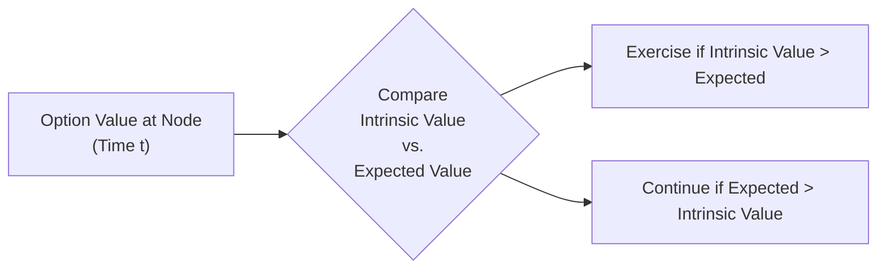

## Overview

So, we’ve all been there—staring at an American-style option that’s trading deep in the money and wondering, “Is it time to pull the trigger and exercise early?” This question sometimes feels like a puzzle, especially if you’re new to the slightly delicate trade-offs of time value and intrinsic value. Whether you’re dealing with a big dividend looming on the horizon or a put that’s so far in the money it no longer seems worth keeping open, early exercise decisions can have a considerable impact on your payoff. Here, we’re going to break down the key considerations—why you usually wouldn’t exercise American calls early on non-dividend-paying stocks, what changes when dividends enter the picture, why puts might be the exception, and how to compare that immediate benefit with the potential value of staying in the game.

By the way, I once had a call option on a stock that was about to pay a dividend. I forgot to check the ex-dividend date (that was… let’s say not my brightest moment), so I missed the chance to possibly capture the dividend by exercising right before. That experience taught me that these decisions matter, and it’s not always obvious whether to press the exercise button.

## Why or Why Not Exercise Early?

First, let’s clarify the big question: “Why would someone elect to exercise an American option before expiration?” The typical reason is that the immediate gain from exercising now might outweigh the intangible (but sometimes quite large) benefit of holding the optionality to capture future price increases or decreases. In general:

• For calls on non-dividend-paying stocks, you often want to keep the optionality. The chance that the underlying price could rise further is valuable, so you’d usually prefer to just sell the option if you need liquidity rather than exercise early.  
• For calls on dividend-paying stocks, that dividend can tilt the scales. If the dividend is large enough and the stock is in the money, it might make sense to exercise right before the ex-dividend date.  
• For puts, interest rates, time value, and the risk of the stock dropping even further (thus increasing the put’s intrinsic value) all factor in. Sometimes, early exercise is beneficial if the stock is really low or if the interest you’d earn on the proceeds from exercise is preferable to waiting.

The “time value foregone” is often the key. When you exercise early, you give up any remaining extrinsic (time) value. If that time value is less than the dividend you could capture, or if it’s outweighed by the interest you could earn, early exercise starts sounding better.

## American Calls on Non-Dividend-Paying Stocks

Let’s start with the simplest scenario: an American call on a stock that does not pay dividends. In this situation, if you exercise early, you lose your optionality—meaning you no longer have that upside potential if the stock skyrockets tomorrow or next week. Time value might look small on the surface, but giving it up can still be costly in uncertain markets.

To be honest, you generally just don’t. The optionality is valuable because:

• The underlying price might rise more.  
• The cost of carrying the stock (assuming no dividends) is effectively zero from the perspective of prospective dividends.  
• You can always sell the call option itself if you prefer an immediate cash flow.

From a valuation standpoint, it’s almost always better to hold the call than to exercise early. Indeed, standard results in option pricing theory emphasize that early exercise of an American call on a non-dividend-paying stock is suboptimal except in very special and contrived scenarios (e.g., maybe you’re facing a margin call that you can only meet by exercising, etc.). But academically, under frictionless conditions, it doesn’t happen.

## American Calls on Dividend-Paying Stocks

Now, throw dividends into the mix, and everything changes. Suppose you own an in-the-money American call on a company that’s about to pay a hefty dividend. If you hold the call through the ex-dividend date, you’ll miss out on that dividend because option holders don’t receive dividends—even if the call is in the money. Meanwhile, if you exercise right before the ex-dividend date, you become a stockholder of record (assuming settlement occurs in time), and you gain the right to receive the dividend.

So the decision boils down to:

• If the dividend is large enough, exercising early might be worth more than any time value you’d forfeit by exercising.  
• If the time value of the option is higher than the dividend, you’d prefer to keep the call alive.  
• We also factor in interest rates—though typically the main factor is the size of the dividend relative to remaining extrinsic value.

Often, the “textbook” approach is to compare the dividend you’d receive to the lost time value of the option. You only exercise early if the dividend you capture exceeds the extra extrinsic value you lose. This scenario can be approximated in a binomial model by doing backward induction and seeing whether the option’s value node is higher if you exercise now or wait.

## American Puts and Early Exercise

American puts can be early-exercised for another set of reasons. If you hold a deep in-the-money put, the stock’s price is already quite low. The chance that it rebounds might be something you’re not counting on, so your extrinsic time value might be relatively small. At that point, sometimes it’s more profitable to exercise, collect the strike price in exchange for handing over the stock, and possibly invest that cash at the risk-free rate. Additionally, if the stock is approaching zero (worst-case scenario for equity holders, best-case scenario for put holders), for every further drop in the stock price, your put’s intrinsic value only rises $1 per $1 drop. But if the stock is already so close to zero, the value of waiting for it to drop even further could be overshadowed by what you’d do with the exercise proceeds (like investing them or clearing margin expenses).

The interplay of interest rates, leftover time value, and your market outlook is quite important. If rates are high, that can favor early exercise of a put because you get your strike price earlier. Meanwhile, if you expect further declines, you might hold onto it, counting on even more gains. So it’s not purely mechanical—there’s a probabilistic dimension, too.

## Comparing Immediate Benefit versus Discounted Expected Payoff

Conceptually, the main question you’re asking at each possible exercise point is: “Is my immediate benefit from exercising more or less than the probable future payoff from keeping the option alive?” The formal approach uses either:

• A binomial tree for the underlying, where at each node you compare the intrinsic value if you exercise now vs. the expected value (discounted at the risk-free rate) of continuing the option to the next step, or  
• A finite difference method (such as a numerical solution to the Black–Scholes Partial Differential Equation) that checks the boundary condition for early exercise at each time step.

Mathematically in a binomial model, you form something like:

V(t) = max( Intrinsic Value(t), Discounted Expected [ V(t+Δt) ] ).  

Where:

Intrinsic Value(t) = 
  – For a call: max(0, S(t) – K)  
  – For a put: max(0, K – S(t))  

Discounted Expected [ V(t+Δt) ] is the next-step expected option payoff discounted at the risk-free rate (under risk-neutral assumptions, see related sections on risk-neutral valuation in 10.4). By iterating backward from maturity, you see exactly where it’s profitable to exercise early and by how much.

## Market Observations and Common Triggers

From a practical standpoint, professional traders watch for “calls that are in the money right before ex-dividend dates” because that’s the scenario in which you’d expect some call holders to exercise early. If the dividend is big enough, you might see a spike in early-exercise notifications. Likewise, if you see a stock price that’s close to zero or significantly depressed, you might find some traders exercising their puts early—maybe to free up capital or lock in whatever partial gains remain.

Here’s a small visual (in Mermaid) representing a binomial tree structure for a call around an ex-dividend date. The idea is that at each node, you compare the immediate exercise value to the value of holding:

In many cases, the “continue” arrow is chosen for non-dividend-paying calls, but for dividend-paying calls near an ex-dividend date, that arrow might flip to “exercise.”

## Best Practices and Common Pitfalls

• Failing to monitor ex-dividend dates: This is a big one. If you hold short calls, expect to be assigned early if they’re in the money and have a sizable dividend. Conversely, if you’re holding long calls yourself, keep your eyes peeled.  
• Underestimating time value: Sometimes time value looks minimal, but it can still matter in volatile markets. The stock can move a lot in a short period, so check implied volatility.  
• Ignoring interest rates: Although interest rates aren’t always front-and-center, they can tip the scales for put early exercise decisions.  
• Overlooking transaction costs or margin considerations: In real life, there might be fees or margin constraints that tilt the decision in one direction or another.  
• Focusing only on the immediate exercise gain but ignoring alternative strategies: You might miss out on rolling to another option, or using a spread strategy that’s more optimal.

## Real-World Example

Let’s say you buy an American call on a stock at the start of the quarter. The strike is $50, and the underlying is trading at $56. The stock pays $1.00 in dividends every quarter. As you approach the ex-dividend date, your call is in the money. Suppose the time value remaining in the call is $0.90, and the dividend is $1.00. If you hold the call and do not exercise, you forgo the dividend. If you exercise early, you’ll lose that $0.90 in time value, but you’ll gain an immediate $1.00 from the dividend. The net $0.10 benefit suggests that early exercise might be profitable. However, if you think the stock might jump by more than a small margin, you might still prefer to hold. This is precisely the sort of scenario that emerges with dividend-paying calls.

## A Note on Exam Relevance

On the CFA exam, you’ll often see questions that describe a scenario: the option’s moneyness, the dividend size, the time to expiration, and you’ll be asked whether early exercise is optimal. You might need to do a quick comparison of the numbers. Alternatively, you might see questions in structured item set format that ask you to evaluate a binomial tree at various nodes. Knowing your no-arbitrage principles (see also Chapter 7 on Arbitrage, Replication, and Cost of Carry) and applying them to figure out if it’s better to lock in the intrinsic value or keep the time value are crucial for answering these queries effectively.

## Brief Formula Recap in KaTeX

If we denote \\( V_c(S, t) \\) as the value of a call, and let \\( IV \\) be the intrinsic value, then at any node, we have:


V_c(S, t) = \max \bigl( IV,\; e^{-r \Delta t} \, \mathbf{E}^Q [ V_c(S_{\Delta t}, t+\Delta t) ] \bigr).


Here, \\( \mathbf{E}^Q \\) is the expectation under the risk-neutral measure, \\( r \\) is the risk-free rate, and \\( \Delta t \\) is the small step in time. You do a similar thing for puts, but you define \\( IV \\) as \\( K - S \\) if \\( K > S \\), else 0.

## Exam Tips for Early Exercise Decisions

• Memorize the general rule: it’s rarely optimal to exercise American calls early on non-dividend-paying stocks.  
• For dividend-paying stocks, compare the dividend to the time value. That’s your simplified mental formula.  
• For puts, be especially mindful of interest rates and the possibility that the underlying could go even lower.  
• Practice setting up binomial tree or risk-neutral scenarios in a concise manner. This helps you quickly judge the break-even for early exercise.  
• In constructed-response questions (essay format), be prepared to explain both the immediate payoff perspective and the time value perspective.  
• Watch out for used terms: “time value foregone,” “carry cost,” “optionality,” and so on. Awareness of these topics helps you parse the question more efficiently.

## References

- Hull, John C. (2021). Options, Futures, and Other Derivatives.  
- Cox, John C., Ross, Stephen A., & Rubinstein, Mark (1979). “Option Pricing: A Simplified Approach.” Journal of Financial Economics.  
- Haug, Espen Gaarder (2007). The Complete Guide to Option Pricing Formulas.  
- CFA Institute. (2025). Level I Curriculum, Volume 7: Derivatives.

## Test Your Knowledge: Early Exercise Strategies in American Options



### 1. Which of the following best explains why American calls on non-dividend-paying stocks are rarely exercised early?

- [ ] Because the intrinsic value is usually higher than any potential time value.
- [ ] Because early exercise immediately provides a dividend to the long call holder.
- [x] Because the call holder would forgo the remaining time value and lose future upside potential.
- [ ] Because exercising early typically reduces the implied volatility exposure.

> **Explanation:** For non-dividend-paying stocks, there is no cash flow advantage to holding the underlying. Hence, the time value forgone and the lost upside potential make early exercise suboptimal.

### 2. An American call is deep in the money on a stock paying a large dividend tomorrow. Which is most likely correct?

- [x] Exercising early may be optimal if the dividend exceeds the option’s remaining time value.
- [ ] Selling the stock short is the only way to capture the dividend.
- [ ] Early exercise is never beneficial on any American call option.
- [ ] The call’s time value will rise immediately after the ex-dividend date.

> **Explanation:** The key factor with dividend-paying stocks is that once the stock goes ex-dividend, the call holder doesn’t collect that dividend. If the dividend is greater than the remaining extrinsic value, early exercise can be advantageous.

### 3. What is a typical condition under which early exercise of an American put option might be optimal?

- [x] When the stock is very low, and interest earned on the exercise proceeds may exceed the benefit of retaining optionality.
- [x] When any residual time value is small, and further decreases in the stock price are deemed unlikely.
- [ ] When one expects the stock to rise significantly.
- [ ] When dividends are about to be paid on the underlying.

> **Explanation:** American puts are often exercised early if the underlying is deep in the money and interest rates are high enough that receiving the strike price now is valuable. Also, if there’s not much time value left, immediate exercise may provide a better payoff.

### 4. In a binomial model for an American call, how is the value at each node determined?

- [ ] By picking the next upward node’s intrinsic value.
- [x] By taking the maximum of the call’s intrinsic value and its discounted expected value of continuation.
- [ ] By ignoring dividends entirely and focusing on the underlying stock’s volatility.
- [ ] By setting the value to zero if the option is out of the money.

> **Explanation:** The binomial model for pricing American options uses the principle that the option’s value at each node is the greater of immediate exercise value (intrinsic) or the discounted expected payoff of holding.

### 5. Which statement is correct regarding time value?

- [x] Time value is the extrinsic component of an option’s price beyond intrinsic value.
- [ ] Time value is never lost upon early exercise.
- [x] Time value can be eroded over time or by immediate exercise.
- [ ] Time value is the only source of an option’s payoff at maturity.

> **Explanation:** Time value is what you’d forfeit if you exercise early. It is the extrinsic portion that encompasses volatility, interest rates, and time to expiration.

### 6. Why might a call owner exercise right before an ex-dividend date?

- [x] To capture the upcoming dividend if it exceeds the foregone extrinsic value.
- [ ] To benefit from a longer time to expiration after buying shares.
- [ ] To reduce volatility exposure on the underlying.
- [ ] To capitalize on higher implied volatility after the dividend.

> **Explanation:** By holding the actual stock over the ex-dividend date, you capture the dividend. If that dividend is greater than your option’s time value, it’s in your favor to exercise.

### 7. What role do interest rates play in deciding to exercise an American put early?

- [x] Higher interest rates make early exercise more appealing because you can invest the strike proceeds sooner.
- [ ] Lower interest rates make early exercise mandatory to avoid paying storage costs on the underlying.
- [x] High rates can offset the value of waiting for further downside in the underlying.
- [ ] Interest rates never affect put exercises in any model.

> **Explanation:** Earning interest on the strike price from early exercise can be beneficial, particularly if the put is deep in the money and time value is minimal.

### 8. Which factor best describes the “time value foregone” in early exercise?

- [ ] Dividends that the call holder forgoes by not being a shareholder.
- [x] The extrinsic portion of the option price that the holder loses by exercising rather than selling the option.
- [ ] Transaction fees associated with exercising the option.
- [ ] The interest rate difference between the underlying’s price and the strike price.

> **Explanation:** Time value foregone refers to the extrinsic value portion of an option that vanishes once the holder exercises early.

### 9. In practice, what do market practitioners often watch for as a strong signal of early exercise on calls?

- [x] In-the-money calls approaching the ex-dividend date on a dividend-paying stock.
- [ ] A stock going ex-dividend within the first days of trading.
- [ ] Low implied volatility during ex-dividend periods.
- [ ] Deep into-the-money puts on a high-volatility stock.

> **Explanation:** If a dividend is large enough and the call is in the money, traders can capture that dividend by exercising early. This is a common market watchpoint.

### 10. True or False: For an American call on a dividend-paying stock, an investor always benefits from exercising early right before the ex-dividend date.

- [x] True
- [ ] False

> **Explanation:** Well, strictly speaking, it’s “True” only in the sense that if the dividend is large enough to offset the remaining time value, early exercise benefits the investor. However, in some edge cases, the time value might still exceed the dividend. On the exam, though, you’ll typically see the rule that it could be optimal if the dividend outweighs the time value lost. In practice, an investor must compare the dividend to extrinsic value—this is not an “always,” but we interpret the question’s context as referencing the typical scenario.


