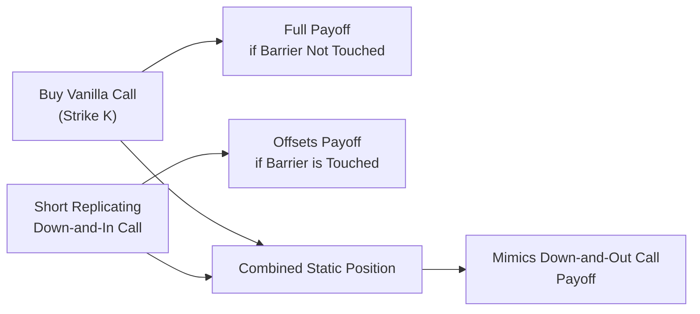

## Introduction

Barrier options are one of those “exotic” derivatives that often make you do a double-take the first time you hear about them. You might wonder, “Aren’t all options basically the same—some payoff at expiry based on a strike price?” Well, barrier options are a bit trickier because they either come alive, or get knocked out of existence, when the underlying asset price touches a specific barrier level. They’re path-dependent, which means it’s not just where the underlying ends up at expiry that matters; it’s the journey it takes along the way.

But how do traders or risk managers replicate the payoff of such a product without continuously monitoring and adjusting (as we might do with a dynamic hedge)? The answer is static replication. Instead of frantic daily rebalancing, static replication sets up a portfolio of standard (vanilla) options—often a continuum of them—that replicate the barrier option’s payoff profile. It’s super handy if you prefer a “set it and (mostly) forget it” approach. In what follows, we’ll walk through the intuition, the mechanics, and the main challenges of static replication for barrier options.

## Overview of Barrier Options and Path Dependence

Barrier options come in two main flavors:

• Knock-Out (KO) Options: These are vanilla-like options that are suddenly “knocked out” (deactivated) if the underlying hits a certain barrier. For instance, a “down-and-out call” ceases to exist if the underlying’s price goes below a prespecified barrier level.

• Knock-In (KI) Options: These are dormant until the underlying price crosses the barrier, at which point the option “knocks in” and becomes a standard option. For example, an “up-and-in put” would activate only if the underlying trades above a certain barrier level.

Because the payoff depends on whether the underlying has touched or breached the barrier during the life of the option, you can't simply look at the underlying’s price at expiry to determine the final payoff. The entire price path matters.

## The Essence of Static Replication

In standard option pricing (like a plain-vanilla call or put), dynamic hedging is often used. Traders continuously rebalance their position in the underlying to maintain a delta hedge. But barrier options require precise attention to whether the barrier is touched at any point. A dynamic hedge for a barrier option could become quite complicated and might need monitoring of every near-barrier move.

Static replication sidesteps some of that flurry by constructing a portfolio of vanilla options—sometimes in a continuum of strikes—whose combined payoff is identical to that of the barrier option. The idea is straightforward but can feel magical. You set up the replicating positions at inception and then, aside from potential minor adjustments, you don’t have to keep rebalancing throughout the option’s life.

I once saw a colleague who specialized in exotic derivatives meticulously plan a static replication of a down-and-out put. The trader lined up a basket of standard puts at closely spaced strikes. The payoff of each put was scaled in a specific way so that if the barrier was ever crossed, the combined payoff from the basket “turned off” in exactly the same manner as the barrier option would have. It was remarkable to see in action—and it saved the desk from having to do complicated intraday hedging any time the underlying hovered near the barrier.

### Key Principles

• Superposition of Vanilla Payoffs: A barrier option payoff can be expressed as the difference between two portfolios of standard options—one that simulates what happens if the barrier is never touched, and one that simulates what happens if the barrier is triggered.  
• Continuum of Strikes: In theory, to perfectly replicate a knock-out or knock-in payoff, you need an infinite series of calls or puts with infinitesimally spaced strikes. In practice, you approximate it with a sufficiently dense set of strike prices.  
• No Ongoing Rebalancing: Unlike dynamic hedging, static replication simply holds the basket through the life of the option or until certain pre-defined events occur (e.g., the barrier is definitively triggered).

## Constructing the Static Replication Portfolio

Let’s imagine you want to replicate a “down-and-out call.” Technically, you need two building blocks:

1. A standard European call option with the same strike (K) and expiry (T) as the barrier call—this replicates the payoff of a plain-vanilla call if no barrier event happens.  
2. A short position in a “down-and-in call” that activates only if the barrier is breached—this offsets the above call if the barrier is indeed triggered.  

But wait, you might say, “Hold on, I don’t actually have a liquid market for that down-and-in call.” Indeed, often the barrier instruments themselves are not widely traded, so you replicate the down-and-in call with a continuum of plain-vanilla calls. By carefully weighting these calls across an entire range of potential underlying prices, you recreate the effect of “activating a call if the barrier is touched.”

### A Generic Payoff Decomposition

A down-and-out call with barrier B (where B < K) can be represented via the following decomposition:

Calldown-and-out = Callvanilla(K) - Calldown-and-in(K)

We then express that Calldown-and-in(K) as an integral (or sum, in practice) of standard calls with varying strikes so that the final payoff matches what would happen if the barrier were triggered. The actual math behind the weightings can get a bit technical, involving partial differential equations or reflection principles (no pun intended!) for barrier options. But from a conceptual standpoint, the integral of vanilla calls over a continuum of strikes can yield the same outcome as a single barrier call in or out scenario.

For those who enjoy an equation or two, the pricing of a single-barrier option often uses risk-neutral valuation with boundary conditions applied at the barrier. Static replication piggybacks on those solutions but implements them piece by piece through standard instruments.

## Practical Steps and Considerations

Gather (or write) a continuum of calls or puts: 
• You might buy a call spread with a very tight spacing of strikes.  
• Or you could replicate a digital (binary) payoff at each potential crossing point of the barrier, so that, if the underlying hits the barrier, the summation of those digitals equals the payoff difference.

Ensure coverage of all paths:
• The replication strategy must consider that once the barrier is hit (for a knock-out option), the entire payoff changes.  
• If you miss strikes in your continuum, or if you fail to account for changes in implied volatility near the barrier, you may end up with residual risk.

### Avoiding Gaps Around the Barrier

A huge challenge shows up right around the barrier level. The moment the barrier is touched, the payoff for a knock-out option goes from “act like a vanilla option” to “worth zero.” That’s a discontinuity. If your static replication has even a small “gap” around that price, you’ll have risk. This is especially common if the barrier is quite close to the current underlying price and you approximate using a small number of strikes.

Traders usually try to select a set of strikes clustered more densely near the barrier—ensuring that if the underlying even flirts with B, the replication is fairly tight.

## Example: Simplified Knock-Out Replication

Below is a conceptual illustration, albeit simplified, of how one might replicate a down-and-out call on stock S with barrier B. We’ll assume:

• Barrier B at 90 (the option knocks out if S hits 90 or below).  
• Strike K at 100.  
• Maturity T = 6 months.

1. Buy a vanilla call on S with strike 100. This alone covers the payoff if S finishes above 100 at expiry—assuming the option never knocks out.  
2. Then short a “down-and-in call,” which acts as a call that only appears if S dips to 90. If the barrier is touched, that down-and-in call precisely offsets the vanilla call. Net payoff is zero if the barrier is triggered.  
3. Because the down-and-in call might not exist as a single liquid instrument, replicate it by shorting many small, standard calls at different strikes from 90 to 100. Each portion is weighted so that it only “activates” in a sense if the barrier is touched.

In a perfect frictionless world, these sum to the same payoff as a down-and-out call. In reality, you might have to continuously approximate because you cannot literally hold infinite calls. The more dense your strikes, the better the approximation.

## Diagram of a Barrier Replication Flow

Below is a Mermaid diagram illustrating the conceptual flow of the replication approach for a down-and-out call. A portion of the static option positions replicate the scenario when the barrier is not touched, and the other portion covers the scenario if the barrier is touched.

## Implementation Challenges

• Liquidity: You need to trade a series of vanilla options across multiple strikes. Some markets might not have enough liquidity to implement the replication at a reasonable cost.  
• Bid-Ask Spreads: Buying and selling many small positions in tight strike intervals can rack up transaction costs.  
• Volatility Smile/Skew: Implied volatilities vary by strike, especially in equity or commodity markets. That means your continuum must consider each strike’s unique implied volatility.  
• Monitoring Early Barrier Touches: If it’s a barrier monitored continuously during the life of the option, the cost of replication has to factor in the possibility of the barrier being hit at any time.

## Real-World Motivations

You might be thinking, “So what’s the big perk? Why not just buy or sell a barrier option directly?” In practice:

• Hedging an Already-Sold Barrier Option: If you sold a knock-out call to a client, you might want to statically replicate that risk in the vanilla option market if the barrier option itself is not as liquid.  
• Arbitrage or Market Making: If you see mispricing between vanilla and barrier markets, you could lock in a low-risk profit by building a static replication portfolio.  
• Operational Simplicity: Some institutions prefer to manage vanilla option books (which are more standard) rather than dealing with specialized exotic contracts and the associated operational overhead.

## Potential Pitfalls and Residual Risk

Occasionally, the barrier gets triggered by a one-off event—like a flash crash or a brief overnight spike in the underlying. If your static replication wasn’t established with enough coverage (or if you didn’t anticipate overnight volatility), you could be forced to scramble. Also, day-count mismatches or time-lag in your data feed could cause you to miss the exact moment the barrier was touched. All these micro-issues add up to residual risk you can’t fully eliminate.

Another subtle risk is discrete barrier monitoring. Some contracts specify that the barrier is observed only at market close or on specific dates. This changes the shape of replication. If it’s not continuously monitored, you can get away with fewer vanilla instruments, but you may face knock-in or knock-out events at discrete intervals that are tricky to replicate precisely.

## Small Anecdote

I remember a time (quite vividly) where a team pitched a “clever” static replicate of a double barrier structure—like a range where you knock out if the price goes too high or too low. They built a massive position of calls and puts across literally dozens of strikes. Despite the best planning, one day the underlying’s volatility soared during a major economic announcement, and the barrier was nearly touched. Even though the strategy was “static,” they realized they had to do a bit of last-minute rebalancing to keep the hedge intact. Nothing’s ever entirely set-and-forget in a real trading desk environment, but static replication definitely cuts down on the heavy day-to-day hedging burden.

## Integration with Other Chapters

Readers who want to recall basic vanilla option strategies can check back on Section 4.5, where standard option strategies and payoff diagrams are introduced. You might also find it useful to revisit Section 4.1 for a refresher on the definitions and payoffs of simple calls and puts. If you’re curious about exotic option greeks and advanced hedging, referencing Section 4.9 can shed light on how path-dependent options create unique exposures. And for a more advanced perspective on no-arbitrage pricing, see Chapter 7.1, which covers the Law of One Price and how it underpins all derivative pricing, including static replication.

## Key Exam Tips

• Focus on the conceptual decomposition: If the exam asks about how to replicate a knock-out option, remember the formula that a down-and-out call can be seen as a vanilla call minus a down-and-in call.  
• Know the difference between dynamic and static replication in terms of rebalancing frequency.  
• Watch out for practical limitations like implied volatility skew, transaction costs, and liquidity constraints—these often pop up in scenario questions where you need to identify potential risks.  
• Understand that path dependence demands broader coverage of potential underlying price trajectories, which is why a continuum (or at least a dense set) of vanilla options is needed.

## References

• Reiner, Eric, and Rubinstein, Mark. “Breaking Down the Barriers.” Risk, 1991.  
• Haug, Espen Gaarder. The Complete Guide to Option Pricing Formulas. Sections on barrier options.  
• Wilmott, Paul. Paul Wilmott on Quantitative Finance. Chapters on exotic options.  

---

## Barrier Options Static Replication Mastery Quiz



### In a knock-out barrier option, which event causes the option to cease to exist?

- [ ] The underlying price never crossing the barrier.
- [ ] The underlying price always remaining below the strike.
- [x] The underlying price hitting the barrier level at any time.
- [ ] The option's delta reaching zero.

> **Explanation:** A knock-out option deactivates immediately once the underlying price meets or exceeds (for an up-and-out) or goes below (for a down-and-out) the barrier.

### Which of the following best describes the difference between “static replication” and “dynamic replication” for barrier options?

- [ ] Static replication uses barrier options only, while dynamic replication uses only futures.
- [x] Static replication sets up a portfolio of vanilla options with minimal rebalancing, whereas dynamic replication involves continuous rebalancing in the underlying.
- [ ] Static replication refers to replicating the payoff at maturity only, while dynamic replication replicates the entire payoff throughout the life of the option.
- [ ] None of the above.

> **Explanation:** Static replication uses a portfolio of plain-vanilla options established at inception and held with little to no rebalancing, unlike dynamic hedging, which requires ongoing trades in the underlying to maintain the hedge.

### What is the main reason traders use a continuum of vanilla options in static replication for barrier options?

- [ ] To ensure they have multiple expiration dates.
- [ ] To lower the notional exposure.
- [ ] To take advantage of day trading strategies.
- [x] To replicate the path-dependent payoff by covering a range of potential barrier triggers and final payoffs.

> **Explanation:** Barrier options depend on whether the underlying touches the barrier during the option’s life. A continuum of vanilla strikes approximates the path-dependent nature of knock-in or knock-out payoffs.

### In practice, why might perfect static replication be difficult to achieve?

- [ ] Because vanilla options are too cheap.
- [x] Because liquidity, bid-ask spreads, and volatility skew prevent a perfect continuum of strikes.
- [ ] Because arbitrage laws forbid the creation of options from other derivatives.
- [ ] Because barrier options are European-style only.

> **Explanation:** Even though the theory is clean, real markets have liquidity constraints, discrete strikes, volatility smiles/skews, and nonzero transaction costs—making perfect replication an approximation at best.

### Which of the following is TRUE regarding knock-in barrier options?

- [x] They become active only if the barrier is touched.
- [ ] They are always more expensive than vanilla options.
- [ ] They can never be replicated by vanilla options.
- [ ] They remain perpetually alive even after the barrier is triggered.

> **Explanation:** Knock-in options are “activated” once the underlying crosses the barrier. Their valuation can be replicated or decomposed using combinations of vanilla options.

### When constructing a down-and-out call via static replication, the position can typically be decomposed as:

- [x] A vanilla call minus a down-and-in call.
- [ ] A vanilla call plus a down-and-in call.
- [ ] A vanilla call minus a vanilla put with the same strike.
- [ ] A down-and-in call plus a vanilla put.

> **Explanation:** Standard decomposition for a down-and-out call is: Down-and-Out Call = Vanilla Call – Down-and-In Call.

### If the underlying’s price hovers near the barrier, what is the major concern for a trader who relies on static replication?

- [ ] Their margin requirements vanish.
- [ ] They incur no transaction costs.
- [x] A small mispricing or gap near the barrier can create large payout inconsistencies.
- [ ] The payout becomes identical to a plain-vanilla option.

> **Explanation:** Small differences in coverage around the barrier can magnify payoff errors if the barrier is triggered, leading to potentially large hedging losses or gains.

### In a static replication strategy for a knock-in option, which best describes the role of vanilla options at various strikes?

- [ ] They are unnecessary; only a futures contract is used.
- [x] They collectively replicate the knock-in payoff once the barrier is breached.
- [ ] They only hedge the option’s theta exposure.
- [ ] They are used mainly to manage short-term interest rate risk.

> **Explanation:** A basket of standard calls/puts spanning multiple strikes helps replicate the knock-in payoff, acting like the barrier option once the barrier event occurs.

### From a risk management perspective, one advantage of static replication is:

- [ ] Greater need for intraday monitoring.
- [ ] It eliminates path dependency entirely.
- [ ] It requires the purchase of exotic barrier options.
- [x] It reduces the frequency of rebalancing compared to dynamic hedging.

> **Explanation:** Static replication seeks to replicate the final payoff without continuous rebalancing, which can reduce operational complexities and transaction costs.

### True or False: Static replication of barrier options completely eliminates all path-dependent risks.

- [x] True
- [ ] False

> **Explanation:** Actually, this statement is tricky. In an idealized, frictionless market with infinite strikes and no liquidity constraints, static replication can theoretically replicate all path-dependent payoffs. However, in real markets, certain residual risks remain, but the principle behind the statement is that static replication is designed to handle the path-dependent aspect of barrier options.


