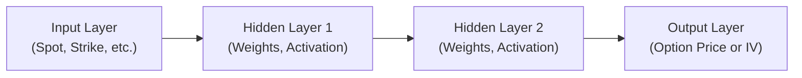

## Introduction and Motivation

Machine learning (ML) methods have become increasingly popular for tackling the complexities of option pricing in today’s fast-evolving markets. Traditional closed-form solutions, such as the Black–Scholes–Merton (discussed in Section 10.5), rely on a set of assumptions that may not hold in disruptive or rapidly changing environments. Macro shifts—like sudden volatility spikes, central bank interventions, or global political events—can invalidate static parametric models. The flexible nature of ML can help analysts regain their footing by allowing real-time, data-driven model updates.  

I remember, way back when I tried an extremely simple neural network to price exotic equity options in a high-volatility market, I was amazed at how it seemed to capture some relationships that we normally had to approximate through elaborate techniques in other models. But it also reminded me that machine learning is far from a silver bullet. Data quality and interpretability were immediate stumbling blocks—my model could make surprisingly accurate predictions, but I struggled to explain its reasoning to a risk manager.

In this section, we’ll examine supervised learning approaches like neural networks and gradient boosting machines, their strengths in handling structural shifts, and the challenges they present—particularly in calibration, overfitting, and interpretability. We will also discuss how constraints from risk-neutral valuation and no-arbitrage arguments (see Chapter 7 for more on no-arbitrage) can be incorporated, either by direct adjustments or by combining ML with more traditional frameworks.

## Rationale for Machine Learning in Option Pricing

Modern financial markets generate enormous streams of data. Option prices, implied volatility (IV) surfaces, interest rates, correlated asset data, and more can shift minute by minute. While parametric models (e.g., Black–Scholes, Heston) are elegant and well-studied, they may struggle with:

• Frequent structural changes (e.g., major macro announcements, sudden market illiquidity).  
• Non-stationary data—where statistical properties evolve over time.  
• Complex interactions—such as dynamic implied volatility skews that differ by strike and maturity.  

Machine learning methods, by design, adapt to new data without requiring strict assumptions about the underlying distribution or processes. Rather than specifying a functional form for the price, the ML algorithm “learns” from historical or current data relationships. 

Yet, if we rely on data-driven predictions without imposing theoretical constraints, we risk generating arbitrage opportunities in apparently “mispriced” predictions. This is why risk-neutral pricing assumptions often need to be layered into ML-based systems.

## Supervised Learning Framework

In supervised learning, models learn from labeled data. For option pricing, these “labels” might be actual market option prices or implied volatilities at different strikes and maturities. The model takes a set of features (spot price, strike, time to maturity, interest rate, historical volatility, etc.) and aims to predict the corresponding label (e.g., the option’s market price or its implied volatility).  

### Data Requirements and Strategies
1. Historical Market Data: Collecting a comprehensive dataset of option prices from various exchanges and counterparties is essential. Traders often augment this with:
   • Fundamentals (e.g., corporate earnings, macroeconomic indicators).  
   • High-frequency data on underlying price movements.  
   • Implied volatility surfaces.  

2. Data Cleaning and Normalization: Before feeding data to ML models, outliers and erroneous quotes need filtering. Scaling inputs (e.g., min-max normalization or standardization) often helps training.  

3. Train/Validation/Test Splits: Separating data into these sets prevents overfitting. We want the model to generalize and perform well on never-before-seen data (the test set).

4. Rolling Window Schemes: Because financial markets evolve, time-series-based splitting is vital. A predictive model might be trained on a rolling window of the previous months (or years) and tested on the next period.

### Neural Networks

Neural networks (NNs) are particularly good at capturing nonlinearities and interactions among input features. A simple feed-forward neural network can approximate complex functions like option payoffs, implied vol trade patterns, or advanced risk exposures.  

A typical architecture might include:  
• Input Layer: Receives spot price, strike, time to maturity, risk-free rate, among other features.  
• Hidden Layers: Several layers of interconnected nodes, each applying a weighted transformation and nonlinear activation function (e.g., ReLU, sigmoid).  
• Output Layer: Produces a forecast for the option price (or implied volatility).  

Below is a conceptual diagram of a simple feed-forward neural network for option pricing:



When I first dabbled with neural networks, I found that even a shallow two-layer NN can capture local curvature in implied vol surfaces better than a single-factor model. However, it required frequent recalibration—especially in times of market stress—because the relationships can change.

### Gradient Boosting Machines

Gradient boosting machines (GBMs), such as XGBoost or LightGBM, are ensemble methods that build many “weak learners” (often decision trees) in a stage-wise fashion. Each tree tries to correct the errors of the previous ones. GBMs handle tabular data efficiently and can incorporate tens or even hundreds of features.  

Where neural networks excel at capturing continuous, highly nonlinear interactions, gradient boosting is often more transparent and can highlight variable importance (e.g., which feature—like implied volatility skew or maturity—contributes most to mispricing). In practice, many quants use GBMs for fast and interpretable results on large datasets.  

## Overfitting and Interpretability Concerns

A major challenge in machine learning is overfitting. Overfitted models memorize noise in training data and perform poorly on out-of-sample data. In option pricing contexts, overfitting might manifest as a model that seems astoundingly accurate on historical quotes but fails to handle new market conditions.  

Common ways to mitigate overfitting:  

• Regularization: Penalize overly complex models (e.g., L2 regularization in neural networks, shrinkage in gradient boosting).  
• Early Stopping: Stop training once validation performance stops improving.  
• Cross-Validation: Use multiple rolling windows or other robust validation protocols.  
• Dropout (for Neural Nets): Randomly “drop” nodes during training to prevent reliance on specific neurons and to improve generalization.  

Interpretability becomes another hurdle. If the model is a “black box” to risk or compliance teams, it might raise red flags. Some solutions:  

• Use methods like SHAP (Shapley Additive Explanations) or LIME (Local Interpretable Model-Agnostic Explanations) to highlight feature importance.  
• Deploy hybrid models that incorporate no-arbitrage constraints to shape the learning process.  

## Risk-Neutral Valuation and No-Arbitrage Constraints

Remember from Chapter 7 that no-arbitrage principles are central to derivatives pricing. Traditional methods like Black–Scholes–Merton rely on a risk-neutral measure, under which the expected return on all securities is the risk-free rate.  

Machine learning, on the other hand, typically does not enforce risk neutrality out of the box. Quants often incorporate constraints that align with no-arbitrage conditions:  

• Consistency with Put–Call Parity (see Section 10.2: Put–Call Parity and Put–Call Forward Parity).  
• Smoothness or monotonicity constraints in the implied volatility surface to avoid static arbitrage.  
• Additional penalty terms in the loss function that penalize the model if it violates certain derivative pricing boundaries.  

Technically, one might pre-process the data to ensure all training samples are consistent with no-arbitrage conditions. Another approach is to embed these constraints into the neural network itself—for instance, as explicit layers or specialized activation functions.  

## Real-Time Market Data and Model Updates

Option markets move extremely quickly, and a big advantage of ML-based approaches is their capacity for rapid recalibration. For instance, a model could be updated intraday with partial re-training on the most recent data, allowing it to capture short-term fluctuations in implied vol.  

However, frequent updating requires robust computing resources, well-designed data pipelines, and vigilant monitoring. If each correction to a model inadvertently “chases noise,” the model may degrade further.  

One practical approach: maintain both a baseline (traditional) pricing model and an ML-based overlay. Whenever the ML approach suggests a deviation from the baseline that’s beyond a certain threshold, analysts can investigate. Over time, one or both models may be adjusted to reflect new market realities.

## Practical Implementation Considerations

### Calibration to Market Data

Calibration is especially relevant. In parametric models, calibration means adjusting parameters (e.g., volatility, correlation) so that the model’s theoretical prices match observed market prices. Similarly, with ML models, the training process “calibrates” the network or gradient boosting model. The difference is that parametric calibration typically involves solving a well-defined minimization problem, whereas ML training might involve large-scale optimization for potentially thousands of parameters.  

### Data Quality and Scarcity

Machine learning models thrive on data—lots of it. But for some option classes (illiquid strikes, exotic underlyings), data can be sparse. Data augmentation or synthetic data generation can help but also runs the risk of incorporating artificial patterns.  

### Regulatory and Compliance

Financial institutions face stringent oversight, especially regarding model risk management. Model documentation, explainability, and stress testing are standard. ML accentuates these concerns. Many regulators are wary of “black box” models that can’t be intuitively explained.  

Best practice: keep a clear lineage of model development, maintain thorough documentation of hyperparameters, test results, and limitations. Perform out-of-sample tests regularly under different market regimes.

## Case Study: Training a Feed-Forward Neural Network

Below is a simplified snippet in Python that illustrates training a neural network to predict option prices. This example is for demonstration purposes only:

```python
import numpy as np
import pandas as pd
from sklearn.model_selection import train_test_split
from tensorflow.keras.models import Sequential
from tensorflow.keras.layers import Dense, Dropout
from tensorflow.keras.optimizers import Adam

# ['spot', 'strike', 'maturity', 'rate', 'historical_vol', 'option_price']

features = ['spot', 'strike', 'maturity', 'rate', 'historical_vol']
target = 'option_price'

X = data[features].values
y = data[target].values

X_train, X_test, y_train, y_test = train_test_split(X, y, test_size=0.2, random_state=42)

model = Sequential()
model.add(Dense(64, activation='relu', input_dim=len(features)))
model.add(Dropout(0.2))
model.add(Dense(64, activation='relu'))
model.add(Dense(1))  # Single output for option price

model.compile(optimizer=Adam(learning_rate=0.001), loss='mse')

model.fit(X_train, y_train, epochs=50, batch_size=32, validation_split=0.2)

test_loss = model.evaluate(X_test, y_test)
print(f"Test MSE: {test_loss:.4f}")
```

Despite its simplicity, such a network can capture complex relationships. Notice we used dropout layers and a validation split to combat overfitting. Nonetheless, one must incorporate no-arbitrage checks and further interpret these predictions before using them in live trading.  

## Future Outlook and Emerging Trends

1. Hybrid Models: Combining neural networks or tree-based methods with parametric models allows a best-of-both-worlds approach. The parametric model imposes theoretical constraints (risk neutrality, for instance), while ML picks up residual patterns.  

2. Reinforcement Learning: Although not purely “option pricing,” reinforcement learning can adaptively hedge an option or manage a dynamic trading strategy in real market conditions.  

3. Explainable ML: As regulation demands interpretability, we’ll see more attempts to clarify the inner workings of complex architectures. Tools like shap (SHAP) can help managers understand whether the model is weighting time to maturity more heavily than implied vol or vice versa.  

4. Alternative Data: Satellite images, social media sentiment, and other alternative data sources—if found to correlate with underlying price movements—could further refine ML-based option pricing.  

## Conclusion

Machine learning offers powerful tools to price options in complex market environments, often outperforming static parametric models that assume stable volatility regimes. Neural networks and gradient boosting machines can uncover subtle relationships in large datasets, updating quickly when conditions shift.  

But let’s be honest: advanced data-driven algorithms are no magic wand. They require robust data pipelines, active monitoring for overfitting, and a thoughtful integration of risk-neutral or no-arbitrage constraints. Effective communication of model internals to stakeholders—risk managers, compliance officers, clients—remains crucial.  

As the industry integrates machine learning, it’s likely we’ll see more hybrid approaches that embody the core theoretical foundations of derivative pricing (like the no-arbitrage framework) while leveraging ML’s strengths in flexibility and pattern detection. Whether you decide to incorporate a deep neural network or a gradient boosted tree, remember that ongoing vigilance, stress testing, and a healthy dose of skepticism are always prudent companions in the quest for accurate option pricing.

## References and Further Reading

• Ruf, Johannes, and Wang, Weiguan. “Neural Networks for Option Pricing and Hedging.” SSRN Electronic Journal.  
• Hutchinson, J. M., Lo, A. W., and Poggio, T. “A Nonparametric Approach to Pricing and Hedging Derivative Securities via Learning Networks.” The Journal of Finance, 1994.  
• CFA Institute articles on “Artificial Intelligence and Big Data in Trading.”  
• Section 7 (Arbitrage, Replication, and Cost of Carry) for no-arbitrage principles.  
• Section 10.2 (Put–Call Parity and Put–Call Forward Parity) for essential option pricing fundamentals.  

---------

## Test Your Knowledge: Machine Learning in Option Pricing



### Which of the following is a major advantage of machine learning models over traditional parametric models in option pricing?

- [ ] They guarantee no-arbitrage pricing.
- [ ] They require no data maintenance or cleaning. 
- [x] They can adapt to new market regimes without a rigid assumption set.
- [ ] They rely on fewer data points to achieve results.

> **Explanation:** Machine learning models typically don’t assume a fixed functional form and thus can flexibly adapt to evolving market conditions. However, they often need more data, not less, and they do not inherently enforce no-arbitrage conditions.

### In supervised learning for option pricing, what is the “label” in the training dataset typically?

- [ ] The underlying stock price. 
- [ ] Time to maturity. 
- [ ] The implied volatility surface. 
- [x] The option’s observed market price or implied volatility.

> **Explanation:** Supervised learning requires known outputs (labels), which are usually the observed option price or implied volatility for each set of input features.

### Which approach best describes combining a standard closed-form pricing model with machine learning techniques to reduce mispricing?

- [ ] Reinforcement learning for each time step in the option’s life.
- [x] Hybrid modeling, where theoretical constraints guide the ML algorithm’s predictions.
- [ ] Completely ignoring all no-arbitrage constraints.
- [ ] Synthetic data creation to generate new trades.

> **Explanation:** Hybrid modeling retains the theoretical benefits of a closed-form model while enabling the ML component to capture additional complexities or market nuances.

### A neural network for option pricing that memorizes training data patterns but performs poorly on new data is said to exhibit:

- [ ] Underfitting. 
- [x] Overfitting. 
- [ ] Convergence. 
- [ ] Random initialization failure.

> **Explanation:** Overfitting occurs when the model captures noise specific to the training set rather than the underlying data-generating process, leading to poor generalization.

### What is a key characteristic of gradient boosting machines (GBMs) compared to feed-forward neural networks?

- [x] They build ensemble trees that correct the errors of previous iterations.
- [ ] They rely primarily on a single hidden layer for feature extraction.
- [ ] They do not require hyperparameter tuning.
- [ ] They are not suitable for tabular data.

> **Explanation:** GBMs combine multiple weak learners (often trees) in a sequential manner, refining errors at each step. They require careful hyperparameter tuning for best results.

### Which method can be used to interpret or explain “black box” ML models for option pricing?

- [x] SHAP or LIME explanations.
- [ ] New Newton-based closed-form solutions.
- [ ] A purely random guess approach.
- [ ] Eliminating all hidden layers in neural networks.

> **Explanation:** Tools such as SHAP and LIME highlight how different inputs affect the ML model’s output, increasing interpretability.

### How does frequent intraday retraining of an ML-based option pricing model potentially exacerbate risk?

- [ ] It improves data accuracy excessively.
- [x] It may lead to “chasing noise” and unhelpful re-adjustments.
- [ ] It violates standard market microstructure theories.
- [ ] It is prohibited by global regulations.

> **Explanation:** Rapid retraining can cause the model to fit short-term randomness (noise) rather than meaningful signals, thereby weakening predictive power in real trading scenarios.

### What is the primary reason for imposing put–call parity within ML-based option pricing?

- [ ] To reduce the computational burden. 
- [ ] To maximize variance in model performance.
- [ ] To simplify the input layer dimensions. 
- [x] To ensure consistency with fundamental no-arbitrage conditions.

> **Explanation:** Put–call parity is a foundational no-arbitrage relationship. Imposing it in ML helps maintain theoretical correctness in the model’s predictions.

### Which of the following best describes “overfitting” in the context of machine learning?

- [x] The model explains training data noise rather than the underlying signal.
- [ ] The model fails to capture the complexities of training data.
- [ ] The model is forced to run on too little data.
- [ ] The model uses too few parameters to reach an adequate solution.

> **Explanation:** Overfitting refers to an overly complex model that fits training data noise, harming out-of-sample predictive performance.

### True or False: Adding risk-neutral valuation constraints automatically transforms any ML-based model into a no-arbitrage framework.

- [x] True
- [ ] False

> **Explanation:** Imposing risk-neutral valuation constraints is a suitable approach to incorporate no-arbitrage concepts into ML-based option pricing. However, it requires proper integration into the model’s training or inference process to be fully effective.


