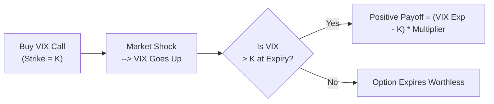

### Introduction

When we talk about options, we often think of them as instruments written on a stock, an index, or a commodity. But what about options whose value depends on implied volatility itself? These “volatility options” seek exposure to changes in volatility rather than changes in the price of an asset like the S&P 500. One of the most common examples is the option on the CBOE Volatility Index (VIX), sometimes affectionately called the “fear gauge.” Now, to be a bit honest, the first time I heard of VIX options, I thought it all sounded magical: an option that pays off when the market gets nervous? But as we’ll see, there’s a perfectly logical structure behind these instruments—and yes, a ton of complexity as well.

In this section, we’ll explore what options on implied volatility are, why they matter for both hedgers and speculators, and how they’re typically priced in practice. We’ll also highlight some pitfalls and real-world considerations, so you can see how theoretical knowledge translates into something you might actually use, or at least keep an eye on, in a professional portfolio setting.

### Defining Options on Implied Volatility

Options on implied volatility are derivative contracts whose payoff is linked directly to a volatility measure—commonly a volatility index. Examples include:

• VIX options based on the CBOE Volatility Index (VIX).  
• Other volatility index options such as VSTOXX (Euro STOXX 50 implied volatility index) or VDAX (DAX implied volatility).  

For instance, a standard call option on the VIX might payout if VIX levels are above a certain strike at expiration. Essentially, you’re speculating (or hedging) that implied volatility (IV) will be higher (or lower) than some level in the future. That’s quite different from plain vanilla equity options, which tie their payoffs mostly to the underlying stock price.

### Why Focus on Implied Volatility?

Before we dive deeper, let’s do a quick refresher on implied volatility. Implied volatility is the market’s consensus estimate of the underlying asset’s future volatility over the life of an option. When there’s uncertainty, fear, or any event that might cause large price swings, implied volatility tends to rise, sometimes significantly.

In equity markets, implied volatility generally spikes when stocks dive. This is partly due to investor fear—when something negative happens, many traders rush to buy puts for protection, driving up option prices and, therefore, implied vol. Meanwhile, in calm market conditions, option demand is often more subdued, leading to lower implied vol. Thus, implied volatility and equity index levels are typically negatively correlated.

So, if you hold equity positions or standard equity options and want to hedge against sudden volatility surges, you might consider volatility options. Alternatively, if you’re a speculator who believes volatility is mispriced, an options-on-implied-volatility instrument can let you try to capitalize on that mismatch.

### A Closer Look at VIX and VIX Options

The VIX index, published by the Chicago Board Options Exchange (CBOE), is designed to measure the market’s expectation of 30-day volatility on the S&P 500. It’s built from near-the-money S&P 500 index option prices for the next 30 days. When the market anticipates big swings, the VIX goes up; when the market expects tranquility, the VIX hovers at low levels.

A VIX option behaves differently from an S&P 500 option because the underlying is not a stock index level but the implied volatility you’d get from that index’s option quotes. If you buy a call option on VIX (with a strike of, say, 25), you’re effectively hoping the VIX will exceed 25 at expiration. A large market drawdown that spooks investors would likely send the VIX soaring above that threshold, and you (as the call holder) might see a handsome payoff. On the flipside, if markets remain calm and the VIX never exceeds 25, your call expires worthless.

### Payoff Structure and Settlement

One subtlety about volatility index options is the settlement process and timing. The VIX futures market, which is closely tied to VIX options, often behaves differently than the “spot” VIX reading we see on financial news tickers. In fact, official settlement for VIX options is often based on a special opening quote on expiration day. It’s entirely possible to see VIX spot at, say, 24, but the settlement for your expiring option contract might close at 25, or 23—leading to considerable confusion if you’re not used to it. So, it’s important to understand the specifications of your volatility derivative.

### Pricing and Valuation Considerations

Now, I remember the first time I tried to parse an academic paper on volatility option pricing. Let’s just say there were Greek letters everywhere, from alpha to omega, and my head started spinning. But at its core, pricing these instruments follows many of the same principles as standard option pricing models, with one major twist: you need to forecast volatility-of-volatility (sometimes charmingly abbreviated as “vol of vol”). Why? Because the underlying itself (the implied volatility index) can be more erratic than the underlying equity index.

Here are a few standout points:

• Volatility-of-Volatility (Vol of Vol): You can think of “vol of vol” as the standard deviation of changes in implied volatility. VIX itself can swing wildly in response to unexpectedly big events, often more so than an equity index might on a day-to-day basis. When pricing a standard S&P 500 option, you might worry about future volatility. But for VIX options, you worry about how volatile that implied volatility might be!  

• Mean Reversion: Implied volatility indices often exhibit mean-reverting tendencies. After a large spike due to a market sell-off, implied vol eventually deflates if markets calm down. This feature means pricing models can incorporate mean-reversion parameters such as in the Ornstein-Uhlenbeck process used for volatility modeling.  

• Correlation with Market Moves: In many advanced models, VIX is negatively correlated with the S&P 500. This correlation is not just a random statistic; it plays an important role in capturing co-movements between equity returns and volatility.  

• Term Structure: Just like interest rates, volatility has a term structure. You might see near-term volatility priced higher (in times of immediate market fear) or lower relative to longer maturities. For VIX options, you’d pay attention to the shape of the VIX futures curve. Often, the short end of the futures curve might be quite high if the market is fearful, while the long end remains subdued.

### Hedging With Volatility Options

If you run an options book that’s heavy on short volatility exposure (e.g., you’ve sold a bunch of options to generate premium income), your biggest scare is a sudden spike in implied volatility, which could cause large losses. One way to offset that risk is by buying calls on volatility indices:

• Protecting against volatility spikes: Let’s say you’re short a large volume of out-of-the-money puts on the S&P 500. If the market tumbles, not only does the underlying price fall, but implied volatility tends to rise, compounding your losses. Buying a VIX call can mitigate that risk since it will likely gain value if the equity market enters a tailspin.  

• Diversifying volatility exposures: Sometimes, you might be net long volatility in one part of your portfolio but short volatility in another. Because implied vol moves can drag everything up or down at once, options on implied volatility can help you more precisely target your overall “vol exposure.”  

### Speculative Opportunities

Speculators may use options on implied volatility to express a directional view on fear or complacency. For instance:

• Bullish on volatility: You think the market is underpricing risk and that a wave of negative headlines is poised to arrive next month. You buy short-term VIX call options with a strike at or slightly above current levels.  

• Bearish on volatility: You think the market is overreacting to a minor piece of bad news and that calm days are ahead. You might sell VIX calls or buy puts on the VIX if you expect the index to revert lower.  

Speculating on volatility can be tempting because it can produce large payoffs quickly. However, timing is critical: if the expected market event doesn’t occur before the option’s expiration, implied vol can sink rapidly, and your option could end up worthless. That’s not a great feeling, as I can personally attest.

### Correlation with Market Direction

For the major equity markets, implied volatility tends to have an inverse relationship with the underlying equity indices. When the S&P 500 plunges, the VIX usually jumps. This negative correlation makes VIX calls (and other volatility index calls) a potential hedge for equity portfolios. Conversely, in stable or rising markets, implied volatility often drifts lower, so short positions on VIX calls might show gains if you effectively timed the fade in volatility.

### Pitfalls and Key Risks

Even though volatility index options can seem exciting, they carry a few distinct pitfalls:

• Complex Settlement: Remember how VIX options settle based on a special opening calculation? This process might differ from your intuition about the “spot VIX.” Surprise settlement values can lead to unexpected outcomes if you’re not paying attention.  

• Rapid Time Decay: Options on implied volatility are subject to time decay like any other option. If you purchase a VIX call, you must be right not just about the direction but also about the timing.  

• High Vol of Vol: The underlying (implied volatility itself) can be extremely choppy during major market events. Spikes can be short-lived, leading to quick volatility expansions followed by fast collapses.  

• Term Structure Inversions: With a steep term structure, nearby VIX futures contracts can price in extremely high volatility expectations for the near term. But if the bad news doesn’t materialize, you can see a rapid collapse in the front-month VIX future.  

• Mean Reversion Risk: Because implied volatility is strongly mean-reverting, big upward moves often revert quickly. Gamely trying to chase momentum in volatility can backfire if you’re late to the trade.  

### Real-World Example (Hypothetical)

Imagine a portfolio manager who has a substantial stake in a broad market ETF, mirroring the S&P 500. She’s worried about a possible sell-off due to upcoming macroeconomic data. She doesn’t want to sell her positions outright (maybe there’s a taxable event or a fear of missing continued upside if the data is better than expected), but she wants some protection in case the market tanks and volatility spikes. She could:

1. Buy protective puts on the S&P 500, or  
2. Buy VIX calls or call spreads to get “pure” volatility protection.

If a negative surprise triggers a sell-off, the VIX calls would likely increase substantially. This helps offset losses in her equity holdings. Meanwhile, if the market shrugs off the data and keeps marching upward, her equity exposure continues to appreciate, and the VIX calls may expire worthless. That’s the straightforward logic behind using volatility options as a hedge. Sure, the hedge might cost a premium, but it buys some much-needed peace of mind.

### Diagram: Basic Mechanics of a Volatility Option

Below is a simple Mermaid diagram illustrating the conceptual flow of a VIX call option payoff. It shows how a spike in implied volatility drives the payoff above the strike.

### Best Practices for Using Volatility Options

• Understand the Settlement Procedure: Especially for any kind of VIX-based product, read the contract specs and watch out for the special opening settlement.  

• Combine with Other Hedging Tools: Volatility options can be used alongside equity options, futures, and other derivatives to create more balanced risk exposures.  

• Monitor Skews and Smiles: If you’re dealing with more exotic volatility options or customizing them OTC, pay attention to how implied volatility skews or smiles unfold.  

• Be Prepared for Complexity: Implementing a robust pricing model that captures stochastic volatility and negative correlation with equity is crucial if you’re running a large or complex book.  

• Watch the Term Structure: VIX futures often trade at a premium or discount to the spot index. Evaluate which contract month best suits your time horizon and risk appetite.

### Practical Exam Tips

For CFA exam candidates, you may see scenario-based questions that test your understanding of how volatility index options behave under sudden market moves. You might be asked to demonstrate:

• How the payoff of a VIX call compares to a standard S&P 500 put in a market drawdown.  
• Mean-reverting aspects of volatility and why that matters for valuation.  
• Optimal strike selections if you suspect high volatility in a certain time window.  

A common trap is to assume that the payoff from a volatility option is identical to that of a plain vanilla equity index option. They are different because you’re targeting implied volatility rather than purely price. Also, you must remember that the cost of carry or standard put–call parity arguments do not apply directly in the same form for volatility underlying—those relationships are more nuanced.

### Ethical and Regulatory Considerations

Volatility instruments can appear extremely speculative, attracting both institutional and retail participants who might not fully appreciate the inherent complexity. From a CFA Institute Standards perspective:

• Suitability: Ensure that volatility derivatives align with the client’s risk profile and that they truly understand the potential for abrupt market moves in implied volatility.  
• Communication with Clients: Provide clear explanations of the unique settlement features and the possibility of rapid time decay.  
• Risk Management:Implement robust controls around margin requirements and ensure compliance with any local or international regulations on over-the-counter (OTC) volatility products.

### Additional References and Further Reading

• Whaley, Robert E. “Understanding the VIX.” Journal of Portfolio Management, 2009.  
• CBOE (Chicago Board Options Exchange) Educational Materials on VIX Options.  
• Sinclair, Euan. “Volatility Trading,” especially the chapters that cover volatility derivatives in-depth.

––––––––––––––––––––––––––––––––––––––––––––––––––––––––––––––––

## Test Your Knowledge: Options on Implied Volatility Quiz



### Which statement best describes a key driver of VIX option value?

- [ ] The underlying’s dividend yield
- [ ] The spot price of the S&P 500
- [x] The expected volatility of implied volatility (vol of vol)
- [ ] The daily trading volume of the underlying index

> **Explanation:** For options on the VIX, a major input is the volatility of implied volatility itself, often referred to as “vol of vol.”  

### Why might investors buy VIX call options instead of protective puts on the S&P 500?

- [x] They want a “pure” play on volatility spikes
- [ ] Protective puts typically have unlimited payoff potential
- [ ] VIX call options are always cheaper
- [ ] VIX call options expire worthless automatically if the market rallies

> **Explanation:** VIX call options offer a more direct hedge against a rise in implied volatility, whereas protective puts hedge the underlying price moves and also have exposure to implied volatility changes.  

### Which of the following represents a common mistake when using VIX options?

- [ ] Checking the contract specifications before trading
- [x] Assuming the payoff is based on the spot VIX reading at expiration
- [ ] Understanding the correlation between market direction and VIX
- [ ] Buying calls to hedge a short volatility position

> **Explanation:** One frequent error is to assume that VIX options settle off the normal “spot” VIX index. In reality, there is a special settlement calculation that can differ from that final quoted VIX level.  

### Why is the negative correlation between equity markets and implied volatility important?

- [x] It makes volatility options an effective hedge in market downturns
- [ ] It ensures that VIX settlements always coincide with S&P 500 highs
- [ ] It guarantees constant option premiums
- [ ] It explains why volatility is never mean-reverting

> **Explanation:** The well-documented negative correlation means volatility tends to spike when equity prices fall, making VIX calls or volatility options potentially useful as crash protection.  

### Which factor is most critical when pricing an option on an implied volatility index?

- [ ] The borrowing rate used for discounting
- [x] The degree of mean reversion in volatility
- [ ] The current dividend yield of the S&P 500
- [x] The correlation between implied volatility and the underlying asset

> **Explanation:** Both the mean reversion of volatility and its correlation with the underlying market direction play pivotal roles in modeling the evolution of implied volatility for pricing.  

### If you believe the market has overestimated future volatility, which action might you take?

- [x] Sell VIX call options
- [ ] Buy VIX call options
- [ ] Buy a straddle on VIX
- [ ] Short the S&P 500 index directly

> **Explanation:** Selling VIX calls is a bearish strategy on volatility. If you think volatility will revert or stay below current implied levels, shorting calls could be profitable.  

### A big challenge in pricing VIX options is:

- [x] Estimating how implied volatility itself will fluctuate
- [ ] Determining the underlying asset’s dividend yield
- [x] Incorporating the negative correlation with equity prices
- [ ] Predicting short sale restrictions

> **Explanation:** VIX options’ pricing demands an understanding of “vol of vol” and correlation with the underlying equity index.  

### What is one possible drawback of using VIX options for hedging?

- [x] The difference between spot VIX and settlement VIX can affect the payoff
- [ ] They increase the amount of margin financing needed for equity positions
- [ ] They are required by most regulators
- [ ] They are only available on foreign exchanges with low liquidity

> **Explanation:** The special settlement process can create a mismatch between the payoff expectation (based on the spot VIX) and the actual settlement value.  

### Which statement about mean reversion in volatility is correct?

- [x] Volatility often spikes sharply but gradually returns to a more typical range
- [ ] Volatility rarely moves once it spiked
- [ ] Volatility indices move in lockstep with interest rates
- [ ] Mean reversion doesn’t apply to VIX

> **Explanation:** Volatility is generally mean-reverting, tending to revert to a long-term average after significant spikes or troughs.  

### Options on implied volatility are especially relevant for which type of market participant?

- [x] True
- [ ] False

> **Explanation:** Traders and portfolio managers with a specific volatility exposure—such as those short equity options—can use VIX or other volatility index options to hedge or speculate on changes in implied volatility.


