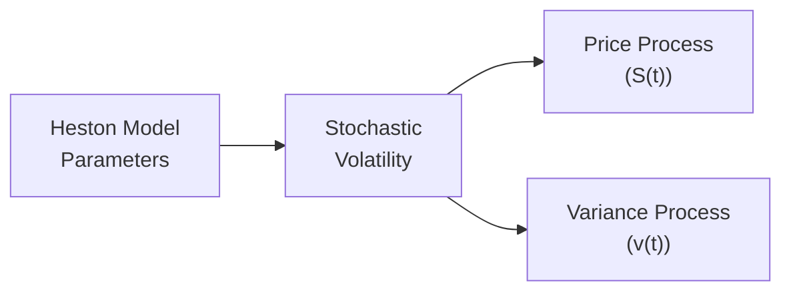

## Introduction to Stochastic Volatility

So you’ve probably heard about the Black–Scholes–Merton (BSM) model about a thousand times by now—trust me, we’ve all been there. One thing that BSM (in its basic form) keeps repeating is that volatility is constant through time. But out in the real world, volatility dances around like it’s had one too many espressos. That’s why professionals often rely on more sophisticated frameworks called “stochastic volatility models.” These place volatility itself on center stage as a random process that evolves over time. In short: they try to capture the reality that volatility can cluster, mean-revert, and occasionally jump or spike.

If you find yourself wondering why we can’t just tweak the BSM model with some sort of average volatility, well, you can—but ignoring time-varying volatility often leaves out the fun stuff, like volatility clustering (when big price moves tend to be followed by more big price moves). Stochastic volatility frameworks solve this by putting volatility on its own SDE (Stochastic Differential Equation). That might sound fancy, but at its core, it just means volatility does its own random walk, often pulled toward some long-term average.

## Key Distinctions from the Constant Volatility World

• Behavior in Stressful Markets: Traditional implementations of BSM can misprice options—especially out-of-the-money put options—under extreme stress. Real markets see “volatility smiles” and “skews.” Stochastic volatility models pick up these humps and tilts better.  
• Volatility Clustering: The real market phenomenon of “when it rains, it pours” is better reflected by letting volatility evolve dynamically.  
• Pricing of Exotic Options: If your instruments have complex payoffs with strong sensitivity to volatility conditions (e.g., barrier options, cliquet options, or anything with path-dependence), ignoring the time dynamics of volatility can produce serious pricing errors.

## The Heston Model in Depth

Among the various methods to model stochastic volatility, the Heston model from 1993 remains one of the most celebrated. Conceptually, the Heston model states:

1. The underlying asset price S(t) follows:  
   dS(t) = μ S(t) dt + √v(t) S(t) dW₁(t),  

2. The variance (or instantaneous volatility squared) v(t) follows a mean-reverting square-root process:  
   dv(t) = κ(θ - v(t)) dt + σᵥ √v(t) dW₂(t),  

   with Corr(dW₁(t), dW₂(t)) = ρ.

Here’s what each parameter means—if you picture them as personalities in a drama:  
• v(t): The current variance level (volatility squared). Think of this as *how intense the drama is right now*.  
• θ (theta): Long-term average of variance. The drama typically wants to come back to a certain baseline.  
• κ (kappa): Mean reversion speed. Measures how quickly the drama tries to get back in line if it strays from average.  
• σᵥ: Vol of vol (volatility of volatility). This captures how fast or violently the drama changes.  
• ρ (rho): Correlation between the two Brownian motions driving asset price and variance. If ρ < 0, it means that when S(t) goes down, volatility tends to go up, which is precisely the negative correlation we often see in equity markets.

Just to visualize, here’s a mermaid diagram of how the parameters feed into the Heston model:

## Mean Reversion in Volatility

Mean reversion is one of those concepts that might sound fancy but is really quite intuitive: if volatility is high, we might expect it to come down over time; if volatility is low, we might expect it to rise again toward a “normal” level. Being aware of this phenomenon is crucial for:

• More accurate hedging: In times of high volatility, you might anticipate that it won’t stay at elevated levels indefinitely (although, ahem, short volatility strategies can still be dangerous if the market keeps misbehaving!).  
• Credible scenario analysis: Stress tests that assume persistently high volatility or shock transitions must factor in how quickly the market can revert.  

In the Heston model, κ(θ - v(t)) is the driver:  
• If v(t) < θ, then dv(t)/dt is positive on average, pulling the variance up.  
• If v(t) > θ, then dv(t)/dt is negative on average, pulling the variance down.

This dynamic can create volatility clustering: a large spike in v(t) tends to persist but eventually heads down to normal territory, capturing how volatility in real markets escalates quickly and then gradually tapers off.

## Price–Volatility Correlation

Markets aren’t symmetrical around good news or bad news. Often, big price drops cause fear, which leads to higher implied volatility. We see this in the data: correlation between changes in asset prices and changes in volatility is typically negative. If ρ < 0, then:  
• When the price of the asset S(t) goes down, the second Brownian motion in the variance equation might get a nudge that raises v(t).  
• Conversely, if S(t) goes up, v(t) might go down.

This negative correlation can produce the “skew” shape in the implied volatility surface. In practice, ρ is often estimated to be between -0.3 and -0.9 for many equity markets, but it can vary by sector or over time.

## Detailed Steps in Heston Model Pricing

If you’re used to pricing with a simple closed-form BSM formula, you might be disappointed to learn that the Heston model’s solution for standard European calls is more involved. However, one of the major wins of the Heston approach is that it does yield a reasonably neat semi-closed form solution (involving characteristic functions and Fourier transforms). You do not typically get to just plug in “σ” and get a price. The steps typically are:

• Identify the characteristic function of log(S(T)) under risk-neutral dynamics. Steven Heston famously provided a closed-form expression for that.  
• Use a Fourier transform approach to compute the call (or put) payoff under the risk-neutral measure.  
• For exotics (like barrier or lookback options), you might rely on numerical methods (like Finite Differences, Monte Carlo, or specialized integral transforms).

For those who crave a formula snippet, the Heston model’s risk-neutral price of a European call option C₀ can often be represented as:

C₀ = S₀ e⁻(qT) P₁ - K e⁻(rT) P₂,

where  
Pᵢ = ½ + (1/π) ∫₀^∞ Re [ e^(-iφ ln(K)) fᵢ(φ) / (iφ) ] dφ,  

and fᵢ(φ) are characteristic functions that encapsulate the dynamics of the Heston process. (Yes, it can get intense, but that’s the gist.)

## Calibration to Market Data

You might be thinking: “Anyway, how do we even get these parameters—κ, θ, σᵥ, ρ, etc.?” Typically, practitioners:

1. Grab a set of market option prices across strikes and maturities.  
2. Use an optimization routine—like least squares or maximum likelihood—to find the set of Heston parameters that minimize the error between the model’s implied volatility surface and the market’s implied volatility surface.  
3. Possibly impose constraints like non-negativity, or ensure Feller’s condition (2κθ > σᵥ² ensures the variance stays strictly positive).  
4. Confirm the final parameter set is stable and reproduces the market quotes adequately.

Calibration pitfalls often include local minima in the objective function, high computational cost, and “overfitting,” where your model matches the current implied vol surface but fails out-of-sample. Using regularization or prior knowledge can help. Some also keep an eye on how the model calibrates across time (term structure) to ensure coherence.

## Practical Implementation Example

Let’s say you’re dealing with a large portfolio of equity options designed to hedge a complex equity-linked liability. A colleague—let’s call him Dave—once tried to replicate the portfolio’s risk exposures with a basic BSM approach. The portfolio had deep-out-of-the-money puts and some path-dependent features. Dave noticed that the hedges performed poorly whenever the market took a sudden nosedive. His vega (volatility exposure) was off the charts when the real implied volatility spiked. Sure enough, the negative correlation between price and volatility was not accounted for in the constant-vol BSM. Dave turned to the Heston model, recalibrated daily to see how the volatility was moving, and found a hedging strategy that handled big downward moves more gracefully. It still wasn’t perfect (no model is), but the meltdown risk was noticeably decreased.

## Comparison with Other Models

Stochastic volatility is not the only way to refine BSM. You might see:

• Local Volatility Models (like Dupire’s approach): They assume volatility is a deterministic function of S and t, typically derived from the implied volatility surface. They fit the local spot-vol relationship but might miss certain path-dependent features.  
• Jump-Diffusion Models (à la Merton/Jump models): Allows for discontinuities in price paths to capture large overnight moves. You can also combine jump processes with stochastic volatility for an even more robust model.  
• SABR (Stochastic Alpha, Beta, Rho): Popular in interest rate markets.  
• SVJ (Stochastic Volatility with Jumps): A combination of jumps plus Heston-style random volatility.

Ultimately, you pick the model based on (1) the complexity you can handle, (2) how well it fits your instruments and markets, and (3) the computational resources and time you have for calibration.

## Real-World Applications

• Risk Management and Stress Testing: In practice, risk managers often find that ignoring volatility clustering can systematically understate Value at Risk (VaR).  
• Exotic Option Pricing: Any derivative with path dependency stands to benefit from proper stochastic volatility modeling.  
• Structured Products: If you’re packaging equity-linked notes, averaging options, or autocallables, the Heston framework can handle the dynamics more realistically.  
• Accounting Disclosures (IFRS or US GAAP): Many regulators demand fair value reporting for derivative positions. Using an advanced model can help comply with IFRS 13 “Fair Value Measurement,” or similar standards, especially when showing robust risk measurements.

## Common Pitfalls

• Overfitting the Surface: You may find a parameter set that nails down every quote but fails over the next day’s data. Always test out-of-sample.  
• Implementation Complexity: The model’s semi-closed form is still not as trivial as BSM. Even if you have a “closed-form formula,” you might wrestle with numeric integration issues or convergence problems.  
• Non-Stationary Parameters: Over time, your κ, θ, and other parameters might shift drastically. Markets are living creatures—what works in a calm period might vanish in high-stress times.  
• Model Misspecification: The Heston model is still an idealization. Real-world volatility might jump, for instance, which could require an additional jump component.

## Conclusion

In a nutshell, the Heston model introduces a realistic representation of volatility as an evolving, random process that frequently correlates negatively with asset price movements. This allows more accurate pricing of options (particularly those sensitive to volatility risk), offers a better handle on risk management, and helps address those pesky implied volatility skews and smiles we see in real markets. Of course, with greater realism comes a heavier computational load and trickier calibrations. But if you’re dealing with complex portfolios or you want to stress test your positions in a more realistic environment, the Heston model provides a well-established entry into the world of stochastic volatility.

Ultimately, your choice of model will depend on the trade-off between complexity and model accuracy—always a hallmark of real-world financial engineering. If you find yourself pricing or hedging exotic options with strong volatility dependence, or if your portfolio experiences big hits when the market turns sour, it might be time to give Heston a look. 

## References

• Heston, Steven L. “A Closed-Form Solution for Options with Stochastic Volatility with Applications to Bond and Currency Options.” The Review of Financial Studies, 1993.  
• Gatheral, Jim. “The Volatility Surface.” Wiley, 2006.  
• Lord, Roger, et al. “A Quick Start Guide to the Heston Model.” SSRN, 2008.  
• CFA Institute. 2025 CFA® Program Curriculum Level I, Volume 7: Derivatives.  
• IFRS 13 “Fair Value Measurement.”  
• Merton, Robert C. “Theory of Rational Option Pricing.” The Bell Journal of Economics and Management Science, 1973.

## Test Your Knowledge: Stochastic Volatility and Heston Model



### Which of the following best describes a key reason for using a stochastic volatility model instead of a constant volatility model like Black–Scholes–Merton?
- [ ] It assumes zero correlation between stock prices and volatility.
- [x] It allows volatility to evolve dynamically and capture phenomena like volatility clustering.
- [ ] It ensures option prices remain constant over time.
- [ ] It reduces computational complexity compared to Black–Scholes–Merton.

> **Explanation:** Stochastic volatility models address real-world phenomena such as volatility clustering, which is not captured by the constant volatility assumption in traditional BSM.

### In the Heston model, which parameter is primarily responsible for the average level to which volatility mean reverts?
- [ ] κ (kappa)
- [ ] ρ (rho)
- [x] θ (theta)
- [ ] σᵥ (vol of vol)

> **Explanation:** θ sets the long-run average level of instantaneous variance in the Heston model.

### In the Heston framework, the correlation parameter (ρ) between the Brownian motions driving the asset price and volatility often:
- [ ] Is assumed to be zero across all asset classes.
- [ ] Is strictly positive for equity markets.
- [x] Tends to be negative, reflecting the leverage effect in equity markets.
- [ ] Is completely irrelevant for pricing exotic options.

> **Explanation:** Empirical research suggests a negative correlation in equity markets, often explained by the leverage effect (price drops associated with volatility spikes).

### Which of the following steps is typically involved in calibrating Heston model parameters to market data?
- [x] Minimizing the difference between model prices and observed option market prices across strikes and maturities.
- [ ] Choosing a random set of parameter guesses and keeping them fixed throughout.
- [ ] Only matching at-the-money options, ignoring skew or smile conditions.
- [ ] Deriving parameters from fundamental accounting reports.

> **Explanation:** Practitioners calibrate the Heston model by fitting observed option prices (or implied volatilities) to minimize some error metric, ensuring the model is consistent with market data across multiple strikes/maturities.

### The parameter σᵥ (often referred to as “vol of vol”) in the Heston model represents:
- [x] The volatility of the variance process itself.
- [ ] The correlation between stock price and variance.
- [x] A strong driver of “smile” or “skew” shapes in implied volatilities.
- [ ] Risk-free interest rate of the underlying asset.

> **Explanation:** σᵥ is how fast or wildly the variance v(t) jumps around. A higher σᵥ typically introduces a more pronounced skew or smile in the implied volatility surface.

### A significant drawback of the Heston model, compared with the standard BSM, is:
- [x] Higher complexity and more challenging numerical integration.
- [ ] The assumption of a constant risk-free rate.
- [ ] The inability to capture skew or smile effects.
- [ ] The assumption of zero correlation between price and volatility.

> **Explanation:** While the Heston model captures more market realism, it involves more advanced and sometimes more computationally intensive mathematics than the simpler BSM approach.

### According to the Heston model, how does mean reversion in volatility typically affect long-run pricing levels?
- [x] Volatility reverts to a long-term mean, influencing option prices over extended horizons.
- [ ] Volatility remains permanently high once it spikes.
- [x] Large spikes in volatility diminish over time under normal conditions.
- [ ] Volatility becomes completely deterministic.

> **Explanation:** A key insight is that volatility reverts to θ, which impacts how options are priced, particularly for longer maturities.

### If ρ < 0 in the Heston model, which of the following is most likely to occur when the asset price decreases substantially?
- [x] The variance tends to increase, reinforcing the negative correlation effect.
- [ ] The variance remains unaffected by price movements.
- [ ] The mean reversion halts completely until prices rise.
- [ ] The correlation flips sign to positive.

> **Explanation:** Negative correlation implies that a price decline is often associated with an upward drift in volatility, a hallmark of equity markets.

### Relative to a simple local volatility model, the Heston model offers which key advantage?
- [x] It directly models the variance process as stochastic, capturing volatility clustering.
- [ ] It always outperforms local vol models in calibration speed.
- [ ] It completely eliminates the need for numerical methods.
- [ ] It guarantees no model misspecification ever occurs.

> **Explanation:** Unlike local volatility, the Heston model allows variance to follow its own SDE, thereby better capturing clustering and other dynamic volatility features.

### Stochastic volatility models, including Heston, generally assume that volatility:
- [x] Is random and follows its own stochastic process under the risk-neutral measure.
- [ ] Remains completely static throughout the life of the option.
- [ ] Is inversely proportional to interest rates only.
- [ ] Has no bearing on option prices.

> **Explanation:** By design, stochastic volatility models let volatility evolve randomly, which is central to their improved realism in option pricing.


