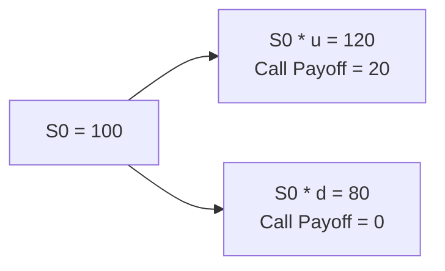

Introduction  
I remember the first time I encountered the binomial option pricing model. I was at my university library, flipping through an old derivatives textbook, and I stumbled upon this neat, step-by-step approach that broke down the seemingly complex world of option pricing into a simple “if this happens, do that” logic tree. It felt like a light bulb switched on: Wow, so that’s how we price an option in a simple discrete framework?

Anyway, I quickly realized that the binomial model offers a fundamentally important insight: We separate possible outcomes into “up” and “down” states, compute payoffs, and then discount those payoffs at a risk-free rate—under a special, almost magical probability known as the risk-neutral probability. This article will walk you through a comprehensive journey of the one-period binomial model, showing how it works, why it’s relevant, and how you might tackle exam questions on the topic. Let’s roll.

Foundations of the One-Period Binomial Model  
At its core, the one-period binomial model splits time into a single step. Right now, the underlying asset (e.g., a stock) is at its current price S₀. At the end of that step—let’s call it time T—the asset will take one of two possible values:  
• Sᵤ = S₀ × u in the up state.  
• S𝒹 = S₀ × d in the down state.  

Here, u (the “up factor”) and d (the “down factor”) are multiplicative changes in the price. For example, if u = 1.2, the stock goes up by 20%; if d = 0.8, the stock drops by 20%. By focusing on these two possible outcomes, we reduce the messy world of continuous changes to a simpler scenario that’s easier to handle.

Why do we do this? Because from a valuation perspective, if we can handle the logic for one discrete step, we can—by extension—use repeated steps (multi-period binomial models) to approximate more complex real-world price paths. You’ll often see advanced models like the Cox-Ross-Rubinstein binomial tree that extend this logic over many steps.

Risk-Neutral Valuation  
One of the star players in binomial option pricing is the concept of the “risk-neutral probability,” often denoted p*. Under the risk-neutral measure, all assets are assumed to grow at the risk-free rate, r. Yes, that sounds a bit unrealistic—after all, we know markets and individual stocks can deviate wildly from the risk-free rate. But for pricing derivatives, the risk-neutral approach is a brilliant theoretical device. It lets you price the option as if investors were indifferent to risk (hence the “risk-neutral” name). Under that measure, the expected return on any risky asset is effectively the risk-free rate.  

So how do we calculate p*? Let’s denote:  
• rᵧ as the risk-free rate over the single time step (which might be a year or fraction thereof).  
• S₀ as the current asset price.  
• Sᵤ as the up price (S₀×u).  
• S𝒹 as the down price (S₀×d).  

A common approximation for the risk-free growth factor over one step is (1 + rᵧ) if compounding is discrete, or e^(rᵧ·Δt) if compounding is continuous. To keep things straightforward, let’s assume discrete compounding for a single period. The risk-neutral probability p* formula is:  

p* = ( (1 + rᵧ) − d ) / (u − d).  

Sometimes you see e^(rᵧ·Δt) in the numerator instead of (1 + rᵧ), but the essence remains the same: the numerator is the “risk-free growth factor minus the down factor,” and the denominator is the difference between up and down factors.

Notice that p* can be above or below 0.5. In real-world probability terms, the chance of an “up move” might not be p*, but for pricing, we only care about how the stock appreciates on average at the risk-free rate. p* is purely a mathematical device that allows us to discount expected cash flows consistently.

Constructing a Hedge Portfolio  
An alternative lens—one that’s super helpful on exam day—is to see the binomial model in terms of hedging. You imagine forming a portfolio with ∆ shares of the underlying asset plus a short position in one call option (for instance). By choosing ∆ cleverly, you can make that portfolio risk-free. In other words, no matter whether the stock goes up or down, the portfolio’s value at expiry remains the same. Since a risk-free portfolio should earn rᵧ, you can solve for the current option price by ensuring no arbitrage exists.

Specifically, you:  
1. Define the call’s payoff in the up state and down state.  
2. Suppose you hold ∆ shares of the underlying. The value of that stock position goes up by ∆×(Sᵤ − S₀) in the up state, and it goes down by ∆×(S𝒹 − S₀) in the down state.  
3. By shorting (or longing) one call, your net payoff includes an offset from the call’s payoff.  
4. Solve for ∆ so that your combined portfolio payoff is identical in both the up and down states.  
5. Since this combined payoff is risk-free, discount it back to present value at the risk-free rate.  
6. That result is the fair option premium.  

To many, this portrayal is more intuitive than risk-neutral probabilities. But guess what? Both methods produce the very same result.

Practical Example: One-Period European Call  
Let’s walk through a numeric example. Suppose:  
• Current stock price (S₀) = 100.  
• Up factor (u) = 1.20 → Up state stock price = 120.  
• Down factor (d) = 0.80 → Down state stock price = 80.  
• Strike price (K) on a European call = 100.  
• Risk-free rate for the period (rᵧ) = 5% (assume discrete compounding, i.e., the growth factor is 1.05).  

Step 1: Compute the call payoff in each state.  
• Up state call payoff = max(Sᵤ − K, 0) = max(120 − 100, 0) = 20.  
• Down state call payoff = max(S𝒹 − K, 0) = max(80 − 100, 0) = 0.  

Step 2: Calculate the risk-neutral probability p*:  
p* = ( (1 + rᵧ) − d ) / (u − d ) = (1.05 − 0.80) / (1.20 − 0.80 ) = 0.25 / 0.40 = 0.625.  

So in a risk-neutral world, there’s a 62.5% “probability” of the up move and a 37.5% “probability” of the down move.  

Step 3: Find the expected payoff under p* and discount it.  
Expected payoff = p*×Payoff_up + (1 − p*)×Payoff_down  
= 0.625×20 + 0.375×0 = 12.50  

Present value = 12.50 / (1 + 0.05) = 11.90 approximately.  

Hence, the call is worth about 11.90 today under these assumptions.  

A Quick Mermaid Diagram  
Below is a simplified overview of the single-step binomial tree for our example. The current price S₀ = 100 splits into Sᵤ or S𝒹. Then the call payoff is derived in the up or down node:



You set the risk-neutral probability to 0.625 for the up branch and 0.375 for the down branch. Finally, you discount the expected payoff at 5%.

Hedged Portfolio Interpretation  
Alternatively, we could replicate the option payoff by holding ∆ shares of the underlying and borrowing the remainder. Let’s see how that works:

1) Let the value of ∆ shares in the up state be 120∆ and in the down state be 80∆.  
2) If we short one call, the net payoff in the up state is 120∆ − 20; in the down state, it’s 80∆ − 0.  
3) We want to set these payoffs equal to each other, so the position is risk-free:  
   120∆ − 20 = 80∆ → 40∆ = 20 → ∆ = 0.5.  

   That means we should hold half a share of stock for each call we short to hedge.  

4) The risk-free payoff for this portfolio is 80×0.5 = 40 if the stock goes down (minus nothing, because the call payoff is zero in the down state). So the portfolio is worth 40 in both states.  

5) Today’s cost to create that position: Buy 0.5 shares = 0.5 × 100 = 50, minus the price you receive from shorting a call (which is unknown, call it C). If you also borrow (or lend) the difference to ensure your initial net investment is zero, you can solve for C by equating that cost to the discounted value of the risk-free payoff.  

   The risk-free payoff future value is 40 in T=1 year. Its present value is 40 / 1.05 = 38.10 (approx.).  

   The cost to set up the portfolio is 50 − C plus any borrowing or lending. If we want no net investment, we want 50 − C = 38.10 → C = 11.90.  

As we see, the call value is 11.90, matching the risk-neutral approach. This equivalence is at the heart of no-arbitrage arguments: if the hedged portfolio is risk-free, it must earn the risk-free rate.

Considerations for Dividends and American Exercise  
The one-period binomial framework can easily incorporate dividends by adjusting the stock price downward when dividends are paid before expiration, or by factoring them into the up and down parameters. For American-style options, you’d usually need to check if early exercise can add value. In a basic one-period model, though, if a dividend is large, it might be optimal to exercise early for calls—though that’s more relevant in multi-period or continuous models.

Limitations of the One-Period Model  
Despite how neat and tidy it sounds, the single-step binomial model has obvious constraints. Real stock prices move in a continuum, not just two discrete states. Also, volatility is not necessarily captured by a single up/down ratio. For more accurate pricing, you’d typically see multi-period or continuous-time models (like Black–Scholes–Merton).

But the one-period approach remains a wonderful teaching tool and a stepping stone to more advanced methods. It distills the concept of replicating portfolios, risk-neutral valuation, and discounting future cash flows in an accessible manner.

Small Python Example  
If you’re into coding (and maybe you want to quickly run your calculations for the exam’s sake or to check your practice questions), here’s a tiny Python snippet to illustrate the same concept:

```python
import math

def binomial_one_period_call(S0, K, u, d, r, T=1.0):
    # S0: current stock price
    # K: strike price
    # u, d: up and down factors
    # r: risk-free rate (decimal, for discrete compounding)
    # T: time period length (default 1 year)
    
    # Up and down prices
    Su = S0 * u
    Sd = S0 * d
    
    # Call payoffs
    payoff_up = max(Su - K, 0)
    payoff_down = max(Sd - K, 0)
    
    # Risk-neutral probability
    p_star = ( (1 + r) - d ) / (u - d)
    
    # Discount factor
    discount_factor = 1 / (1 + r)
    
    # Expected payoff under risk-neutral measure
    expected_payoff = p_star * payoff_up + (1 - p_star) * payoff_down
    
    # Present value
    return expected_payoff * discount_factor

option_price = binomial_one_period_call(S0=100, K=100, u=1.2, d=0.8, r=0.05)
print("Calculated call option price:", round(option_price, 2))
```

In a real exam scenario, you obviously won’t rely on Python, but rewriting or conceptualizing these steps helps reinforce the logic behind each calculation.

Real-World Extensions  
While the single-step model is primarily for academic illustration, versions of binomial trees are used in practice for exotic options or situations where closed-form solutions (like Black–Scholes) either don’t exist or are too complex to handle. Exotic structures (barrier options, lookbacks, Asians, etc.) sometimes require flexible binomial or trinomial trees.

Traders also appreciate that binomial trees can handle variable volatility and underline discrete events (like an earnings announcement or a product launch) that can create jumps. You might fine-tune your up and down factors around these big events.

Common Pitfalls to Avoid  
• Mixing real-world and risk-neutral probabilities. The exam might throw you off by referencing historical probabilities—be sure to separate them from the risk-neutral measure you need for pricing.  
• Incorrect discount rate. Make sure you’re discounting at the risk-free rate (or close approximation).  
• Using the wrong up/down factors. In practice, you might estimate u and d from implied volatility or standard deviation. If you misapply them, your final option value can be wildly off.  
• Forgetting to handle dividends appropriately. If the underlying is expected to pay a dividend, that reduces the up factor or modifies the payoff.  
• Overcomplicating the hedge ratio. Keep it straightforward: ∆ (delta) is found by equating the option payoffs in the up and down states when combined with ∆ shares.

Exam Relevance and Final Insights  
In a CFA® exam context, you may see scenario-based questions that require quick calculation of the one-period binomial price. You might be handed S₀, u, d, r, K, and asked to:  
1) Calculate the call or put payoff in each node.  
2) Derive the risk-neutral probabilities.  
3) Discount the expected payoff.  

You’ll also likely see short-answer queries about how the hedged portfolio is constructed or how p* differs from the probability of an up move in the real world. Given that the one-period model is the backbone of more advanced multi-period binomial trees, you should cultivate a deep comfort with these steps. Time management is vital: you typically don’t need more than a couple of minutes of calculation once you’ve memorized or internalized the formulas.

Best practice: Always re-check your payoff logic, especially with puts vs. calls and signs (e.g., if you short the option or the underlying). A sign error can cost precious points.

References (Further Reading)  
• Cox, John C., Ross, Stephen A., and Rubinstein, Mark. “Option Pricing: A Simplified Approach.” Journal of Financial Economics (1979).  
• Hull, John C. Options, Futures, and Other Derivatives. (See the binomial models chapter for a deeper dive.)  
• CFA Institute Level I Curriculum, “Binomial Trees” segments.  
• IFRS 9 and FASB ASC 815 for guidance on derivative instrument accounting and valuation considerations—though they don’t revolve specifically around binomial trees, they highlight fair-value measurement contexts.

## Test Your Knowledge: One-Period Binomial Option Pricing



### A call option's payoff in an up state is determined by which formula?

- [ ] max(S0 × d − K, 0)
- [x] max(S0 × u − K, 0)
- [ ] max(K − S0 × d, 0)
- [ ] max(S0 − K, 0)

> **Explanation:** For a call, the payoff in the up state is max(Su − K, 0), where Su = S0 × u.  

### Which of the following best describes why the risk-neutral probability is used in binomial pricing?

- [x] It ensures all assets grow at the risk-free rate, simplifying option valuation.
- [ ] It matches historical frequency of up and down moves in real markets.
- [ ] It reflects investor sentiment for each potential price movement.
- [ ] It allows arbitrage opportunities to exist.

> **Explanation:** Under the risk-neutral measure, all risky assets earn the risk-free rate, which makes calculating expected present values straightforward and prevents arbitrage.  

### In a one-period binomial model, how do you compute the risk-neutral probability p*?

- [ ] (u − d) / (1 + r)
- [ ] (d − (1 + r)) / (u − d)
- [x] ((1 + r) − d) / (u − d)
- [ ] (u + d) / (1 + r)

> **Explanation:** The standard formula for p* under discrete compounding is p* = ((1 + r) − d) / (u − d).  

### If you hold ∆ shares of the underlying and short one call option, how do you ensure no risk remains in the portfolio?

- [x] Make the portfolio payoff identical in both up and down states.
- [ ] Choose ∆ to be equal to 1 / r.
- [ ] Match the portfolio’s expected payoff to the underlying’s expected payoff.
- [ ] Use only real-world probabilities to calculate ∆.

> **Explanation:** The no-arbitrage approach requires that the portfolio payoff be the same in all future states. That’s why we set the up and down payoffs equal.  

### Which is a limitation of the simple one-period binomial model?

- [ ] It cannot handle non-dividend-paying stocks.
- [ ] It always produces arbitrage opportunities.
- [x] It only considers two possible price outcomes and can be less accurate for real markets.
- [ ] It cannot be extended to multi-period or continuous models.

> **Explanation:** Real stock prices can move in a continuum, and the one-period model oversimplifies price dynamics. However, it can be extended to multi-period frameworks.  

### Suppose S0=100, u=1.1, d=0.9, r=10%, and the option's up state payoff=10, down state payoff=2. What is the expected payoff under risk-neutral pricing?

- [x] 6.0
- [ ] 3.2
- [ ] 10.0
- [ ] 8.8

> **Explanation:** p* = [(1.1) − 0.9] / [1.1 − 0.9] = 0.2 / 0.2 = 1.0, so it’s a 100% probability of up in the risk-neutral world if we interpret (1+r) = 1.1 as the up factor. The expected payoff = 1.0 × 10 + 0 × 2 = 10. If we interpret r=10% as meaning (1+r)=1.1, $u=1.1? Actually, one must be cautious. Typically, p* = ((1+r) − d)/(u−d). So p* = (1.1 − 0.9)/(1.1−0.9)=0.2/0.2=1. Then the expected payoff is 10. But the question might be incomplete if we then discount. However, the question specifically asks for the “expected payoff under risk-neutral pricing,” which is indeed 10. Then discounting might reduce it further, but the question doesn’t ask for the present value—just the expected payoff. If it asked for the present value, we’d do 10/1.1=9.09.  

### Why is the discount factor typically the risk-free rate in binomial option pricing?

- [x] Because the hedged portfolio is deemed riskless, so it must earn the risk-free rate.
- [ ] It’s the only rate easily observable in the marketplace.
- [ ] It matches the average return of the underlying asset.
- [ ] Regulatory guidance requires using it for all derivatives.

> **Explanation:** In a binomial world, once you construct a riskless hedge, you discount any guaranteed future payoff at the risk-free rate to avoid arbitrage opportunities.  

### You’re solving for a call price using a one-period binomial model. You notice p* > 1. Which scenario might cause that?

- [x] (1 + r) < d
- [ ] u < d
- [ ] (1 + r) > u
- [ ] The call’s strike is less than zero

> **Explanation:** If (1 + r) < d, then the numerator of p* becomes negative or smaller than the denominator portion in the formula, leading to an extreme or invalid probability.  

### For an at-the-money European put in a one-period model with no dividends, how would early exercise compare to holding to maturity?

- [x] Early exercise typically does not increase the put’s value in a one-period setup without dividends.
- [ ] Early exercise always maximizes the put’s value if interest rates are high.
- [ ] Holding to maturity is always worse than exercising early.
- [ ] Early exercise yields higher time value.

> **Explanation:** In a one-period binomial framework without dividends, there’s usually no immediate benefit to exercising a European option early. Time value is generally preserved.  

### The one-period binomial approach is foundational for which of the following?

- [x] Multi-period binomial trees (e.g., Cox-Ross-Rubinstein)
- [ ] Value-at-Risk (VaR) computations
- [ ] Momentum-based technical trading signals
- [ ] Bretton Woods exchange rate policies

> **Explanation:** The one-period model is the building block for multi-period binomial trees and more advanced discrete approaches like the Cox-Ross-Rubinstein model.  


