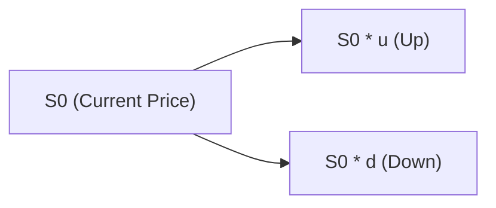
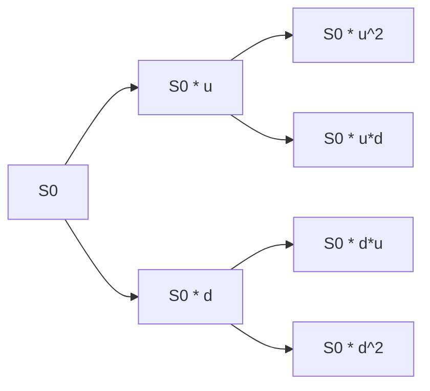

## Introduction

Risk-neutral valuation is one of those concepts that can feel almost magical the first time you see it. I remember back in my early days of learning option pricing, I couldn’t believe how the entire messy idea of real-world risk preferences could simply vanish in the right framework. Yet it all boils down to a powerful observation: if markets are arbitrage-free, we can pretend investors are indifferent to risk—in other words, “risk neutral”—for the sake of pricing derivatives. 

This approach says, “Let’s just price everything as though all securities offer the same expected return, the risk-free rate.” Of course, we know actual markets are full of risk-averse investors—people (like you and me) who will pay more or less for certain risk exposures. But the risk-neutral method is perfect for derivative pricing because it relies on replicating payoffs and eliminating any systematic mispricing through arbitrage.

Below, we’ll walk through the conceptual logic. We’ll also do a quick single-period binomial example (and talk about how that extends to multi-period binomial trees). Finally, we’ll show how these ideas feed into the famous Black–Scholes–Merton model. Don’t worry—I’ll keep the math straightforward and throw in a few stories and tips along the way.

## The Core Idea of a Risk-Neutral World

In a classic “risk-neutral” world, investors require no extra compensation for bearing risk. That’s a neat theoretical sleight of hand. You might be thinking, “But that’s not real—people are definitely risk-averse!” And yes, that’s true. However, in an arbitrage-free market, risk-neutral valuation is an equivalent way to represent fair pricing. 

You can think of it like superimposing an imaginary lens over the market: this lens changes real-world probabilities into risk-neutral probabilities. You then discount future cash flows at the risk-free rate. If a derivative were priced incorrectly under this lens, you could construct a hedged portfolio to earn a risk-free profit—which is precisely what arbitrageurs do. So, the market snaps back into alignment; no free lunch can last.

### Real-World Probability vs. Risk-Neutral Probability

• Real-world probability: Reflects all the messy details—investor sentiment, risk aversion, liquidity preferences, etc. It’s the distribution you’d observe if you fired up a statistical model on historical data and tried to guess future stock returns.

• Risk-neutral probability: The simplified measure used in fair-value calculations. It’s the probability measure that sets the expected return of every asset at the risk-free rate. Here, the discount rate for future payoffs is the risk-free rate, and the drift of the underlying asset is effectively “moved” so that no extra premium exists for bearing risk.

From a practitioner’s standpoint, risk-neutral probabilities are like a pricing convenience. They’re not literal forecasts of what will happen, but they ensure we stay consistent with the absence of arbitrage.

## Arbitrage-Free Pricing and Replication

The risk-neutral plan is intimately tied to arbitrage-free pricing. In derivatives markets, if an option is underpriced, someone will buy it and set up an offsetting position in the underlying asset (and perhaps borrow or lend at the risk-free rate) to lock in a profit. Alternatively, if an option is overpriced, they’ll short it and hedge it out. These trades push option prices back toward the theoretically correct, fair level.

One intuitive way to see this (especially for equity options) is through **replication** strategies. 

1. Buy or short Δ shares of stock (the “delta-hedge”).  
2. Borrow or lend money at the risk-free rate.  
3. Earn the same payoff as the option (or the opposite payoff, if you’re short).  

When you can replicate a derivative exactly, you must price it to cost the same as its replicating portfolio. Otherwise, there’s a trivial arbitrage: you’d buy whichever is cheaper, short-sell whichever is more expensive, and lock in guaranteed profit. Market participants hate to leave free money on the table for long, so forces of supply and demand quickly remove the mispricing.

## Simple One-Period Binomial Model

Let’s walk through a straightforward single-period binomial model to highlight risk-neutral probabilities in action. Suppose a stock is priced at S₀ now (time 0). In one period (time 1), it can go up to S₀u or down to S₀d, where u and d are growth multipliers (>1 for “up” and between 0 and 1 for “down”). Let the risk-free rate be r for the period.

### Constructing the Binomial Tree

Below is a small binomial tree diagram:

Think of S₀ as your starting point. After one period, it either goes up to S₀u or down to S₀d.

### Risk-Neutral Probability

In a single-period binomial world, the risk-neutral probability q is commonly derived using an arbitrage argument. The formula often looks like this:


q = \frac{(1 + r) - d}{u - d}.


This q is not your personal belief about how often the stock goes up or down in reality. It’s just the probability that ensures the expected stock price growth rate matches 1 + r (the risk-free growth) over one period. If you use anything else, there would be a riskless arbitrage opportunity.

### Pricing an Option in the Binomial World

Let’s consider a call option with strike price K expiring at time 1. The up-state payoff is Cᵤ = max(S₀u − K, 0), and the down-state payoff is C_d = max(S₀d − K, 0). Under the risk-neutral measure:

1. Expected payoff: E°[C₁] = qCᵤ + (1 − q)C_d.  
2. Present value: C₀ = E°[C₁] / (1 + r).  

The “°” on E° denotes that this is the risk-neutral expectation. So your fair price for the call option today is just the discounted expected payoff under those risk-neutral probabilities. If the market price deviates, someone can set up a hedged trade to capture the difference.

## Extending to Multi-Period Binomial Trees

When you expand to two or more periods, the binomial tree branches out further: each endpoint is assigned a probability through a repeated application of q for “up” moves and (1 − q) for “down” moves. 

Conceptually, you can price an option step by step by rolling backward from the final payoffs:

• At the final nodes (the terminal states), the option payoff is straightforward (e.g., max(S − K, 0) for a call).  
• Move one step backward, compute the expected payoff under risk-neutral probabilities, and discount at the risk-free rate. That value becomes your option value at that node.  
• Keep rolling backward until you get to the start.

This is the binomial foundation for a variety of derivatives: calls, puts, exotics with barriers, and so on. For American options, you add an early exercise check at each node (compare immediate exercise payoff with the hold value).

## Relation to the Black–Scholes–Merton Model

In continuous time, the same logic applies, but the math is more advanced. Black, Scholes, and Merton used a dynamic replication argument: you continuously adjust your holding in the underlying asset and bond to replicate the option’s payoff. By showing that such a hedge yields a riskless portfolio, you must earn the risk-free rate. That requirement pins down the formula for the option price.

Sure, in real life, continuous rebalancing is tricky (we can’t literally adjust our positions every millisecond without incurring costs). But the principle stands. The entire continuous-time model is essentially a limit of the binomial approach as each period shrinks to an infinitesimal time step.

## Why Bother with Risk-Neutral Valuation?

Many learners say, “Alright, I get the binomial logic, but why do we impose risk neutrality at all if people are risk-averse?” The short answer: it’s the easiest, most direct way to ensure no-arbitrage pricing. By limiting the discount rate to the risk-free rate, we incorporate the idea that any replicable payoff must yield a return that matches a purely riskless investment. 

Implementation-wise, once you have the risk-neutral measure, you can price a ton of derivatives. Not just plain vanilla stock options, but also interest rate derivatives, commodity futures, credit derivatives, and more. You just need to adapt the discount rate appropriately to reflect the risk-free curve for the corresponding timeframe.

## Practical Examples and Case Studies

1. **Equity Call Option**: A large multinational bank might use the single-period or multi-period binomial approach to figure out fair values for short-dated call options on a thinly traded stock. Even though they believe the real probability of an up move is only 40%, the risk-neutral probability might come out near 55%. Real-world probabilities and risk-neutral probabilities differ because in the risk-neutral setting, the expected return of the stock is the risk-free rate, not its typically higher required rate of return.

2. **Currency Options**: If you have a currency-based binomial, the normal drift for an exchange rate in the real world might reflect interest rate differentials and risk premia. But in your risk-neutral model, you’ll shift the drift so that the expected growth is effectively tied to the relative risk-free rates of each currency. That ensures no arbitrage from interest rate differentials.

## Best Practices, Pitfalls, and Workarounds

• **Best Practices**:  
  - Always check that your model parameters u, d, and r make sense in the binomial approach. For example, if r > u, you may get nonsensical negative values for q.  
  - Use real-world data to calibrate your volatility estimates, then convert that into u and d or incorporate it into the continuous-time model.  

• **Common Pitfalls**:  
  - Forgetting the difference between real-world probability and risk-neutral probability. If you try to insert your personal guess for up/down probabilities into a risk-neutral binomial formula, you might get the wrong option price.  
  - Mishandling discrete compounding vs. continuous compounding. If your risk-free rate is expressed as an annual continuously compounded rate, but you treat it like a simple one-period interest rate, your discounting will be off.  

• **Potential Challenges**:  
  - Jumps or discontinuities can complicate the risk-neutral measure. You might need a jump-diffusion model or some extension of Black–Scholes–Merton if large price gaps are likely.  
  - For American-style options on dividend-paying stocks, you have to carefully factor in ex-dividend date. Under a risk-neutral approach, future dividend payments must be included because they lower the underlying stock price at ex-div.  

• **Strategies to Overcome**:  
  - Double-check your assumptions and keep them consistent (e.g., do you have discrete or continuous compounding, actual or annualized volatility?).  
  - When in doubt, break down the problem into smaller steps. For instance, do a one-step binomial version to get comfortable, then scale it up.  

## Exam Tips and Time Management

On the exam, you might face a short binomial question, or even a question asking you to compare risk-neutral vs. real-world probabilities. In item set (multiple-choice) or constructed-response format, you may need to:

• Demonstrate the no-arbitrage argument and compute a simple binomial price.  
• Discuss why we use risk-neutral probabilities rather than real-world probabilities.  
• Show how to discount at the risk-free rate and interpret the meaning of that approach in the context of an arbitrage-free framework.

Pay attention to detail: keep your definitions of u, d, and r consistent, and watch for wording that indicates whether something is an annual rate, effective per period, or continuously compounded.

## Additional Diagrams and Summary

Below is a slightly expanded binomial tree diagram, showing a multi-step perspective. You can see that once you have the terminal payoffs, you move backward and apply risk-neutral probabilities to value the preceding nodes.

At each node, you compute the expected value of the next step’s payoffs (using q) and discount it back at the risk-free rate. That’s your option price at that node. Repeat until you arrive at the present node, S0.

## References and Further Reading

- CFA Institute Level I Curriculum, especially the segments on “Risk-Neutral Pricing” for option valuation.  
- Bjork, Tomas. “Arbitrage Theory in Continuous Time.” Oxford University Press.  
- Danthine, Jean-Pierre. “Intermediate Financial Theory,” particularly sections on risk-neutral valuation.  

For deeper dives, you can explore how risk-neutral approaches show up in fixed income, credit derivatives, commodity pricing, and more. Each domain has its own nuances, but the underlying principle—build a hedge and use no-arbitrage logic—remains the same.

----------

## Test Your Knowledge: Risk-Neutral Valuation Quiz



### Which of the following best describes the key assumption of a risk-neutral world in derivative pricing?

- [x] All assets are assumed to earn the risk-free rate in expectation.
- [ ] Real-world probabilities accurately reflect all investor preferences.
- [ ] Arbitrage does not exist in any real market.
- [ ] Investor risk aversion increases the discount rate for derivatives.

> **Explanation:** In a risk-neutral world, investors require no risk premium. All assets earn the risk-free rate in expectation, which allows for straightforward pricing under an arbitrage-free framework.

### In the single-period binomial model, how is the risk-neutral probability “q” typically computed?

- [x] ( (1 + r) – d ) / (u – d )
- [ ] ( S₀d – S₀u ) / (1 + r)
- [ ] (1 + r )(u – d )
- [ ] ( S₀ / u ) * ( S₀ / d )

> **Explanation:** The standard formula for the risk-neutral probability is q = [(1 + r) – d] / (u – d), ensuring the expected growth rate of the stock under q is the risk-free rate.

### Which statement about real-world probabilities and risk-neutral probabilities is correct?

- [x] Real-world probabilities reflect investor sentiment, while risk-neutral probabilities are used primarily for pricing.
- [ ] Real-world probabilities equal risk-neutral probabilities under market equilibrium.
- [ ] Risk-neutral probabilities always match empirical frequency counts of up and down moves.
- [ ] Real-world probabilities cannot be estimated from historical data.

> **Explanation:** Risk-neutral probabilities are a mathematical construction to enforce no-arbitrage pricing. Real-world probabilities incorporate all the behavioral and risk preferences of actual investors.

### What happens if a derivative’s market price deviates substantially from its risk-neutral fair value?

- [x] Arbitrageurs will trade against the mispricing and force the price back in line.
- [ ] The derivative’s payoff or strike price is adjusted by the exchange.
- [ ] Regulators force the derivative to be re-priced.
- [ ] The risk-free rate changes to accommodate the new market price.

> **Explanation:** Arbitrageurs exploit mispricing by forming hedged positions that guarantee risk-free profit, pushing the market price back to the theoretical fair level.

### In a one-period binomial model for a call option, which steps correctly summarize the pricing process?

- [x] Determine up/down payoffs → Compute risk-neutral expected payoff → Discount at risk-free rate
- [x] Verify arbitrage-free probabilities → Calculate expected value → Compare with replicating portfolio
- [ ] Estimate real-world probability of stock movement → Use that probability to find expected payoff → Discount at the required rate of return
- [ ] Assume unlimited rebalancing → Hedge only at maturity

> **Explanation:** You first identify the up/down payoffs and the risk-neutral probability, then discount the expected payoff at the risk-free rate. You might also compare it to a replicating portfolio to confirm no arbitrage.

### Which of the following is a common pitfall for beginners in risk-neutral valuation?

- [x] Mixing up real-world probabilities with risk-neutral probabilities in calculations.
- [ ] Applying the risk-free rate as a multiplier instead of a discount factor.
- [ ] Relying on market prices to calculate interest rates.
- [ ] Using the same volatility value for all models.

> **Explanation:** A frequent mistake is using real-world probabilities (like historical frequency of up/down moves) instead of the derived risk-neutral probability that ensures no-arbitrage.

### When using the binomial approach to price American options, what additional check is required at each node?

- [x] Compare the immediate payoff from exercising to the value of continuing the option.
- [ ] Check whether the stock pays a dividend next period.
- [x] Re-calculate the risk-free rate to account for interest rate changes.
- [ ] Divide the option payoff by the strike price.

> **Explanation:** American options can be exercised early. So at each node, you must compare the value if you exercise right away to the value from holding onto the option.

### How does continuous rebalancing in the Black–Scholes–Merton model conceptually replicate an option’s payoff?

- [x] By constantly adjusting your holding of the underlying stock and bond so the combined position is riskless at each instant.
- [ ] By forecasting real-world probabilities of price jumps.
- [ ] By adding a large risk premium to the discount rate.
- [ ] By trading only at the final point before expiration.

> **Explanation:** Black–Scholes–Merton constructs a riskless hedge by continuously rebalancing the underlying and a bond, ensuring the portfolio mimics the option’s payoff.

### Which of the following best explains why risk-neutral valuation is still valid even though real investors are risk-averse?

- [x] Arbitrage-free pricing ensures that risk-neutral valuation matches market prices for derivatives.
- [ ] Risk-averse investors always trade away mispriced options.
- [ ] The government guarantees the derivative value at the risk-free rate.
- [ ] Risk neutrality is a perfect description of all actual investors.

> **Explanation:** Risk-neutral valuation is a convenient modeling tool based on no-arbitrage arguments. Even though real investors are risk-averse, the market enforces a fair derivative price consistent with risk-neutral assumptions.

### True or False: In a risk-neutral world, the expected return on all assets after adjusting for risk equals the risk-free rate.

- [x] True
- [ ] False

> **Explanation:** By definition, under risk-neutral valuation, every asset is assumed to earn the risk-free rate in expectation after eliminating risks through hedging or replication.


